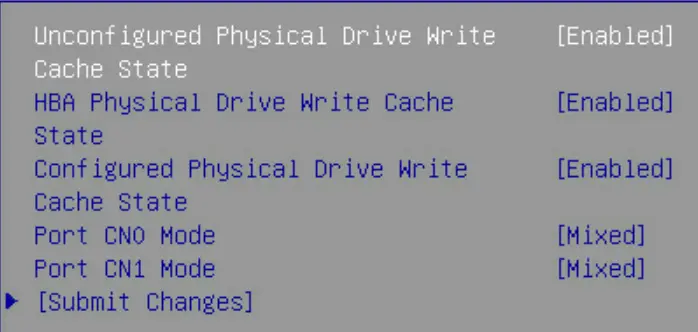
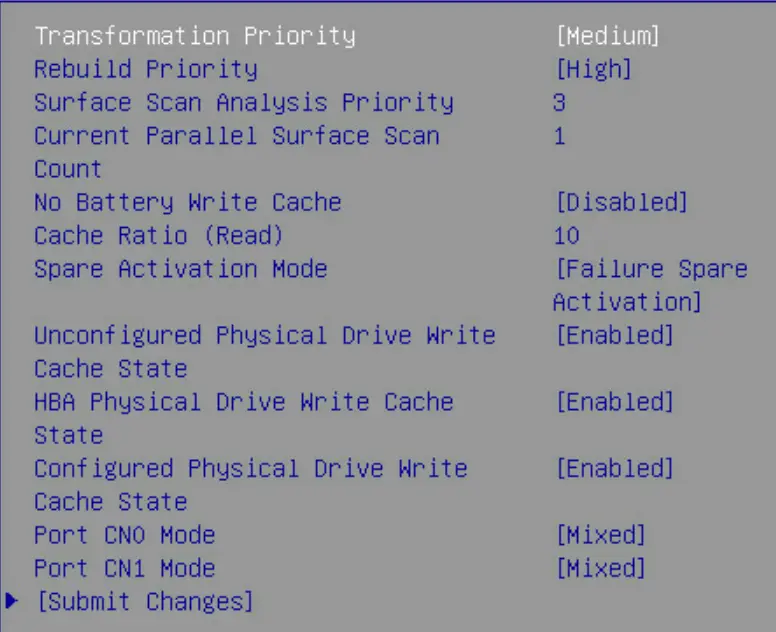
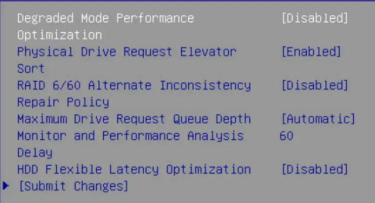
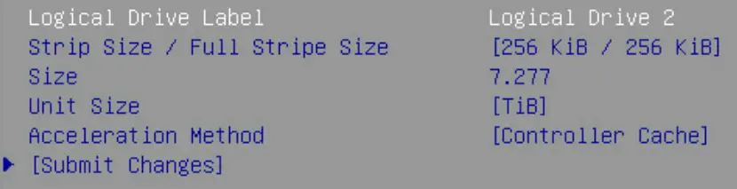
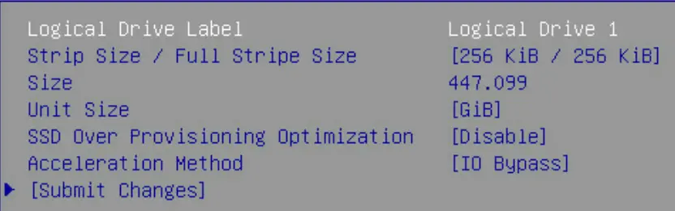
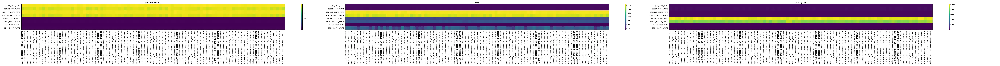
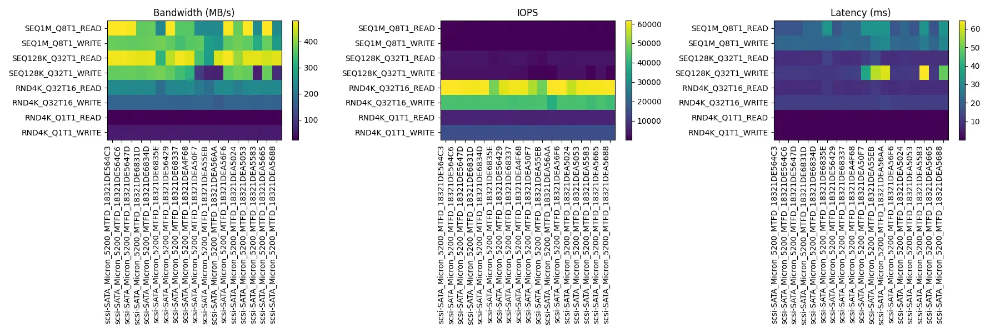
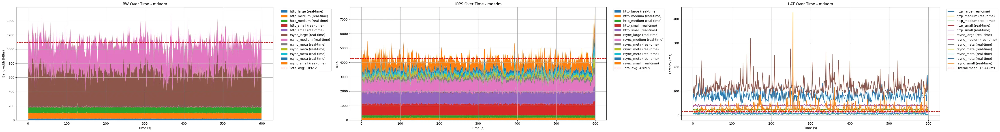
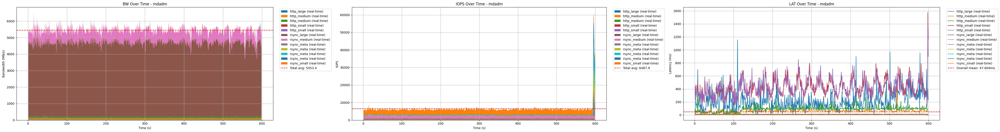
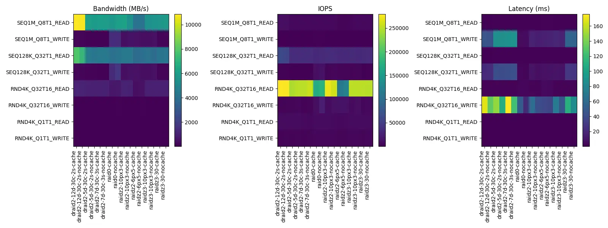

> 发布：2025-06-01  
> 作者：朱宝林  
> 标签：运维

镜像站存储系统涉及硬件（磁盘、阵列卡等）和软件（文件系统等）多方面的设计与调优。本文将介绍我们在存储系统设计与测试中的一些经验。


## 综述

### 阵列卡 [H3C P460](https://www.h3c.com/en/Support/Resource_Center/EN/Home/Severs/00-Public/Software_Configure/User_Manual/H3C_Servers_Storage_Controller_UG/202207/1655190_294551_0.htm)

关于硬 RAID 优劣的探讨，请阅读 [金枪鱼之夜：实验物理垃圾佬之乐——PB 级磁盘阵列演进 | 清华大学 TUNA 协会](https://tuna.moe/event/2023/disk-array/)。**虽然我们不打算用 RAID 卡来做 RAID，但我们对 RAID 卡的缓存性能感兴趣，希望它可以提升 HDD 的 IO 性能。**

P460 阵列卡可以通过 UEFI BIOS 进行配置。H3C 提供的手册并未对各个选项做详细解释，而 [Configure Controller Settings - RAID Controller Card User Guide (x86) 12 - Huawei](https://support.huawei.com/enterprise/en/doc/EDOC1000163569/724456d2/common-tasks-efi-uefi-mode) 这份文档提供了详尽的解释。尽管型号不同，但配置选项都是一致的。

阵列卡视角下的设备分为 Raw Disk（直通，可获取磁盘的厂商、序列号等所有信息）和 Logical Volume（阵列卡分配序列号）。

- Mixed 模式：Raw Disk 和 Logical Volume 均对宿主机可见
- RAID 模式：Raw Disk 对宿主机不可见。

下面展示了阵列卡不同模式下可调的配置选项：

<div class="grid cards" markdown>

- 无逻辑卷时

    ---
    Configure Controller Settings -> Modify Controller Settings

    不论什么模式，如果未配置逻辑卷，阵列卡的可调选项仅有 Write Cache State。

    

- 有逻辑卷时

    ---
    

    此外还会多出一个 Advanced Controller Settings 选项卡。

    

- HDD 逻辑卷配置项

    ---
    加速模式可选：Controller Cache、None。
    

- SSD 逻辑卷配置项

    ---
    与 HDD 相比，加速模式增加 IO Bypass 且为默认。增加 SSD Over Provisioning Optimization 选项。

    

</div>

值得关注的整体可调配置如下：

| 参数名 | 默认值 | 解释 |
|---|---|---|
| Cache Ratio (Read) | 10% | 调整内存用于预读缓存与写缓存的比例的能力 |
| Unconfigured Physical Drive Write Cache State | Default | 未配置物理驱动器的写缓存状态 |
| HBA Physical Drive Write Cache State | Default | HBA（直通模式）物理驱动器的写缓存状态 |
| Configured Physical Drive Write Cache State | Default | 已配置（加入阵列）物理驱动器的写缓存状态 |
| Physical Drive Request Elevator Sort | Enabled | 启用或禁用物理驱动器缓存写入的电梯排序算法 |
| HDD Flexible Latency Optimization | Disabled | 启用或禁用灵活延迟调度器，以限制来自 HDD 的高延迟请求 |

每个逻辑卷的可调配置：

| 参数名 | 值 | 解释 |
|---|---|---|
| Acceleration Method | Controller Cache（HDD）, IO Bypass（仅 SSD） | 加速方法 |
| （仅 SSD）SSD Over Provisioning Optimization | Disabled | |

综合考量后我们的测试配置：

- Cache Ratio：70%，因镜像站的 IO 负载主要是读操作。
- Write Cache State：Enabled，对所有驱动器启用写缓存。
- Elevator Sort：保持默认开启。
- Flexible Latency Optimization：Middle（100ms），对低频高峰负载进行优化。
- Acceleration Method：保持默认，即 HDD 使用 Controller Cache，SSD 使用 IO Bypass。
- SSD Over Provisioning Optimization：Enabled。

### fio

根据业务需求和数据特征，设计了如下所示的 IO 测试方案。测试基于 fio 工具，分为基础性能测试和业务场景测试两部分：

- **基础性能测试**：参考 CrystalDiskMark，独立测试不同工作负载下的顺序、随机读写性能。

    ```text title="crystal.fio"
    [global]
    ioengine=libaio
    direct=1
    runtime=30
    ramp_time=5
    time_based
    group_reporting

    [SEQ1M_Q8T1_READ]
    stonewall;rw=read;bs=1M;iodepth=8;numjobs=1
    [SEQ1M_Q8T1_WRITE]
    stonewall;rw=write;bs=1M;iodepth=8;numjobs=1
    [SEQ128K_Q32T1_READ]
    stonewall;rw=read;bs=128k;iodepth=32;numjobs=1
    [SEQ128K_Q32T1_WRITE]
    stonewall;rw=write;bs=128k;iodepth=32;numjobs=1
    [RND4K_Q32T16_READ]
    stonewall;rw=randread;bs=4k;iodepth=32;numjobs=16
    [RND4K_Q32T16_WRITE]
    stonewall;rw=randwrite;bs=4k;iodepth=32;numjobs=16
    [RND4K_Q1T1_READ]
    stonewall;rw=randread;bs=4k;iodepth=1;numjobs=1
    [RND4K_Q1T1_WRITE]
    stonewall;rw=randwrite;bs=4k;iodepth=1;numjobs=1
    ```

- **业务场景测试**：参考实际业务负载设计：
    - **HTTP 服务流量负载**：对外持续提供 200 MiB/s 的读取，文件大小分布参考 USTC 的统计数据。测试负载被加权拆分为三组作业，使用随机/顺序读取混合以更贴近真实的 HTTP 请求模式。
    - **Rsync 同步写入负载**：作为 Rsync Receiver，主要测试顺序写入各类大小文件，同时并发一定数量的元数据操作（4 KiB 写），以模拟大量小文件和中大型文件的落盘场景。

    ```text title="mix.fio"
    [global]
    ioengine=libaio
    direct=1
    time_based
    runtime=600
    ramp_time=10
    write_bw_log
    write_iops_log
    write_lat_log
    disable_clat=1
    disable_slat=1
    log_avg_msec=1000

    [job_http_small]
    rw=randread;bs=5k;rate=100M;iodepth=32;numjobs=2
    [job_http_medium]
    rw=read;bs=512k;rate=80M;iodepth=16;numjobs=2
    [job_http_large]
    rw=read;bs=2m;rate=20M;iodepth=8;numjobs=1
    [job_rsync_meta]
    rw=randwrite;bs=4k;iodepth=1;numjobs=4;rate_iops=3000
    [job_rsync_small]
    rw=write;bs=5k;size=5G;iodepth=16;numjobs=1
    [job_rsync_medium]
    rw=write;bs=512k;size=20G;iodepth=8;numjobs=1
    [job_rsync_large]
    rw=write;bs=14m;size=10G;iodepth=4;numjobs=1
    ```

## 基准性能

我们先将阵列卡配置为 HBA 模式，将所有 Write Cache State 设为 Disabled，测试了所有磁盘的基准性能，详表见 [HBA-nocache/diskbench.html](05-10-mirror-2-storage.assets/HBA-nocache/diskbench.html)，HDD 和 SSD 分别可视化如下：




这为后续测试提供了基准性能数据。

- **HDD**：顺序读写性能均在 210 MiB/s 左右，随机读写性能在 2.0 MiB/s 左右。
- **SSD**：顺序读写性能 470/370 MiB/s 左右，随机读写性能 230/170 MiB/s 左右。

阵列性能：

- 业务场景：读/写均为 200MiB/s 左右。

## 阵列卡测试

测试单盘性能的脚本如下：

```bash title="diskbench.sh"
--8<-- "05-10-mirror-2-storage.assets/scripts/diskbench.sh"
```

为了测试、阵列性能，我们使用 mdadm 创建 RAID 0 软阵列。

```bash title="mdadm.sh"
--8<-- "05-10-mirror-2-storage.assets/scripts/mdadm.sh"
```

### HBA 模式 + Write Cache

单盘基础性能测试详表见 [HBA-WC/diskbench.html](05-10-mirror-2-storage.assets/HBA-WC/diskbench.html)。与裸盘相比，HDD 的顺序读写性能没有变化，随机读写性能反倒折半了。

阵列业务性能测试可视化结果如下。与裸盘相比性能写性能有较好提升。



结论：HBA 模式下开启 Write Cache 对磁盘性能几乎没有影响。

### 逻辑卷 + Write Cache + 10% Cache Ratio

RAID 卡配置：

| 参数名 | 值 |
|---|---|
| Cache Ratio (Read) | 10% |
| Write Cache State | Enabled |
| Physical Drive Request Elevator Sort | Enabled |
| HDD Flexible Latency Optimization | Disabled |

HDD 配置：（均为默认）

| 参数名 | 值 |
|---|---|
| RAID Level | RAID 0 |
| Acceleration Method | Controller Cache |
| Stripe Size | 256 KiB |

SSD 配置：（均为默认）

| 参数名 | 值 |
|---|---|
| RAID Level | RAID 0 |
| Acceleration Method | IO Bypass |
| Stripe Size | 256 KiB |
| SSD Over Provisioning Optimization | Disabled |

单盘基础性能测试详表见 [LV-WC-10/diskbench.html](05-10-mirror-2-storage.assets/LV-WC-10/diskbench.html)。与裸盘相比，HDD 的顺序读写性能没有变化，随机读性能下降至少一倍，随机写性能提升至少一倍。

阵列业务性能测试可视化结果如下。与裸盘相比，写带宽提升 2500%，达到了 5000 MiB/s；读带宽无明显提升。



### 逻辑卷 + Write Cache + 70% Cache Ratio

## ZFS 测试

!!! quote

    - [Exploring Declustered RAID in ZFS for improved Storage Reliability and Availability](https://sc18.supercomputing.org/proceedings/tech_poster/poster_files/post185s2-file2.pdf)
    - [dRAID — OpenZFS documentation](https://openzfs.github.io/openzfs-docs/Basic%20Concepts/dRAID%20Howto.html)

我们规划了下列存储池配置进行测试。

| 配置 | 容量 | 容灾 | 热备 |
| --- | --- | --- | --- |
| raid0 | 8TB \* 30 = 240TB | 无 | 无 |
| raidz3-30 | 8TB \* 27 = 216TB | 30 盘故障 3 盘 | 无 |
| raidz2-10px3 | 8TB \* 8 \* 3 = 192TB | 10 盘组内故障 2 盘 | 无 |
| draid2:12d:30c:2s | 8TB \* 12 \* 2 = 192TB | 14 盘组内故障 2 盘 | 2 盘 |
| raidz3-10px3 | 8TB \* 7 \* 3 = 168TB | 10 盘组内故障 2 盘 | 无 |
| draid2:7d:30c:3s | 8TB \* 7 \* 3 = 168TB | 9 盘组内故障 2 盘 | 3 盘 |
| raidz2-6px5 | 8TB \* 4 \* 5 = 160TB | 6 盘组内故障 2 盘 | 无 |
| draid2:5d:30c:2s | 8TB \* 5 \* 4 = 160TB | 7 盘组内故障 2 盘 | 2 盘 |

测试流程如下：

```bash title="zfs.sh"
--8<-- "05-10-mirror-2-storage.assets/scripts/zfs.sh"
```

### 裸盘性能

下面的测试中，带 `-cache` 的表示配置了缓存。所有缓存配置均为：两块 SSD 镜像做 Slog，四块 SSD 做 L2ARC。

- **基础性能**测试详表见 [HBA-nocache/zfs.html](05-10-mirror-2-storage.assets/HBA-nocache/zfs.html)，可视化如下：

    

- **业务场景**测试结果见 [HBA-nocache/zfs.pdf](05-10-mirror-2-storage.assets/HBA-nocache/zfs.pdf)

可以得到以下结论：

- Slog 和 L2ARC 对性能几乎没有影响，不建议使用。这一点和 USTC 及众多博客的结论一致。
- 将上面的配置分为三类：RAID0、RAID-Z 和 dRAID。dRAID 的读取性能极好，但写入性能垫底；RAID0 读写性能均优秀；RAID-Z 性能中规中矩。

### 参数调优

!!! quote

    - [ZFS 分層架構設計 - Farseerfc 的小窩](https://farseerfc.me/zhs/zfs-layered-architecture-design.html)：关于 ZFS 原理的全面的索引，给出了非常多的参考资料和视频链接。
    - [镜像站 ZFS 实践 - LUG @ USTC](https://lug.ustc.edu.cn/planet/2024/12/ustc-mirrors-zfs-rebuild/)
    - [Chris's Wiki :: blog/__TopicZFS](https://utcc.utoronto.ca/~cks/space/blog/__TopicZFS)

感谢 USTC 的 ZFS 实践总结提供参考。

## Ceph 测试

## JuiceFS 测试

## 硬 RAID 测试
