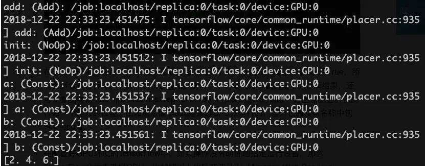
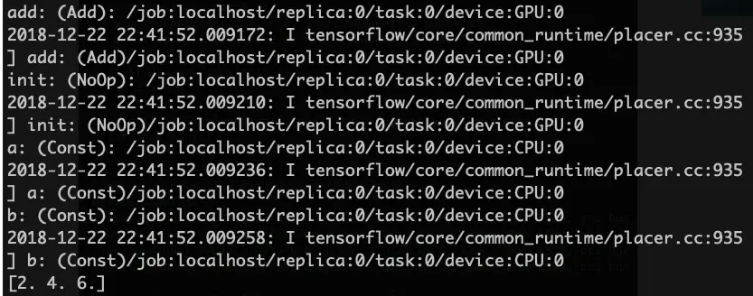
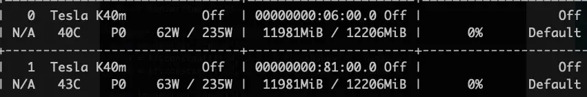
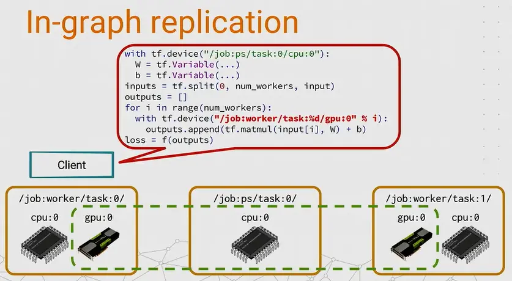

!!! abstract "AI Generated Abstract"

    本文介绍了 TensorFlow 的分布式计算方法，包括单机和多机场景下的配置与优化。在单机模式中，讲解了如何通过 log_device_placement 参数查看设备分配、使用 tf.device 指定设备，以及通过设置 CUDA_VISIBLE_DEVICES 环境变量优化显存使用。在多机模式中，分析了 In-graph 和 Between-graph 两种分布式训练模式的特点及应用场景。

<!-- more -->

## 单机

### log_device_placement

单机情况比较简单，不需要特殊配置，TensorFlow 会自动将计算任务分配到可用的 GPU 上，在定义 session 时，可以通过*log_device_placement*参数来打印具体的计算任务分配：

```python
import tensorflow as tf

a = tf.constant([1.0, 2.0, 3.0], shape=[3], name='a')
b = tf.constant([1.0, 2.0, 3.0], shape=[3], name='b')
c = a + b

with tf.Session(config = tf.ConfigProto(log_device_placement = True)) as sess:
    sess.run(tf.global_variables_initializer())
    print(sess.run(c))
```



### 指定设备

如果需要让一些运算在特定的设备上执行，可以使用 tf.device:

```python
import tensorflow as tf

with tf.device('/cpu:0'):
 a = tf.constant([1.0, 2.0, 3.0], shape=[3], name='a')
 b = tf.constant([1.0, 2.0, 3.0], shape=[3], name='b')
with tf.device('/gpu:0'):
 c = a + b

with tf.Session(config = tf.ConfigProto(log_device_placement = True)) as sess:
    sess.run(tf.global_variables_initializer())
    print(sess.run(c))
```



### 环境变量

尽管上面一个例子中我们只给 CPU 和 GPU0 指定了计算任务，但是两块显卡的显存都被占满了：



因为 TensorFlow 会默认占满所有可见 GPU 的显存，对于简单的计算任务，这样显然非常浪费，我们可以通过修改环境变量*CUDA_VISIBLE_DEVICES*解决这个问题：

```shell
# 运行时指定环境变量
CUDA_VISIBLE_DEVICES=0 python demo.py
```

```python
# Python 代码中修改环境变量
import os
os.environ['CUDA_VISIBLE_DEVICES']='0'
...
```

## 多机

### In-graph & Between-graph

TensorFlow 的分布式训练有两种模式：In-graph 和 Between-graph

In-graph: 不同的机器执行计算图的不同部分，和单机多 GPU 模式类似，一个节点负责模型数据分发，其他节点等待接受任务，通过*tf.device("/job:worker/task:n")*来指定计算运行的节点



Between-graph:每台机器执行相同的计算图
