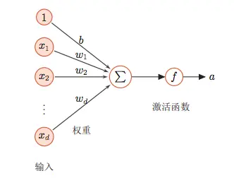
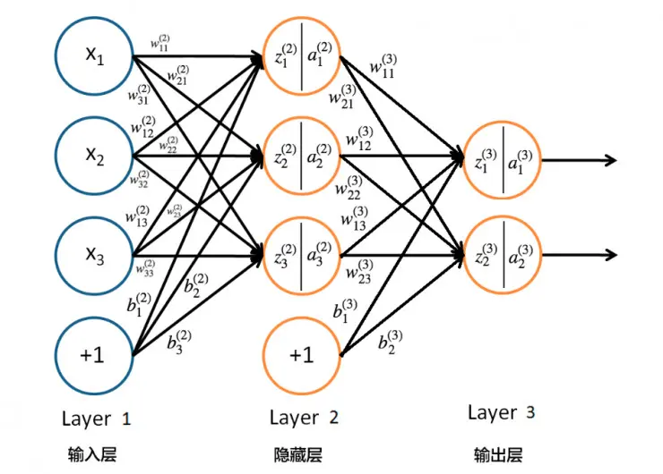

!!! abstract "AI Generated Abstract"

    本文介绍了 BP 算法（反向传播算法）的基本原理及其在神经网络中的应用。内容包括神经元结构、网络结构、损失函数的定义与计算，以及 BP 算法的数学推导和实现过程。最后，通过一个简单的 3 隐层神经网络实现，展示了 BP 算法在手写数字分类任务中的实际应用。

<!-- more -->

## Neuron structure



上图是一种典型的神经元结构，$x_n$是神经元的输入，将输入加权求和后再通过激活函数即可得到此神经元的输出：

$$t = \sum_{i=1}^{n}{w_ix_i} + b$$

$$a = f(t)$$

为计算方便，可将偏置$b$提到求和符号里面，相当于加入一个恒为 1 的输入值，对应的权重为$b$：

$$t = \sum_{i=0}^{n}{w_ix_i},(x_0 = 1, w_0 = b)$$

$$a = f(t)$$

此即为上图神经元结构对应的表达式

常用的激活函数有 sigmoid, ReLU, tanh 等。

## Network structure



这是一个简单的 3 层网络，输入层有 3 个输入值，隐藏层包含 3 个隐藏神经元，最后是两个输出值

隐藏层神经元的前向计算过程：

$$z_i^{l} = \sum_{i=0}^{n}w_{ij}^{l}x_j, (x_0 = 1, w_0 = b)$$

$$a_i^l = f(z_i^l)$$

$l$表示第几层。

这个网络的抽象数学表达式为：

$$F(x) = f_3(f_2(x * W_2 + b_2) * W_3 + b_3)$$

事实上，深度神经网络一般都能够抽象为一个复合的非线性多元函数，有多少隐藏层就有多少层复合函数：

$$F(x) = f_n\left(\dots f_3(f_2(f_1(x) * w_1 + b_1) * w_2 + b_2)\dots\right)$$

## Loss

Loss，即损失，用来衡量神经网络的输出值与实际值的误差，对于不同的问题，通常会定义不同的 loss 函数

回归问题常用的均方误差：

$$MSE = \frac{1}{n}\sum_{i=1}^{n}(Y - f(x))^2$$

$Y$为实际值，$f(x)$为网络预测值

分类问题常用的交叉熵 (m 类)：

$$L = \sum_{k=1}^{n}\sum_{i=1}^{m}l_{ki}log(p_{ki})$$

$l_{ki}$表示第 k 个样本实际是否属于第 i 类（0，1 编码），$p_{ki}$表示第 k 个样本属于第 i 类的概率值

特别地，二分类问题的交叉熵损失函数形式为：

$$L = \sum_{i=1}^{n}[y_ilog(p_i) + (1 - y_i)log(1 - p_i)]$$

$y_i$为第 i 个样本所属类别，$p_i$为第 i 个样本属于$y_i$类的概率

## Back propagation

BP 是用来将 loss 反向传播的算法，用来调整网络中神经元间连接的权重和偏置，整个训练的过程就是：前向计算网络输出
->;根据当前网络输出计算 loss->BP 算法反向传播 loss 调整网络参数，不断循环这样的三步直到 loss 达到最小或达到指定停止条件

BP 算法的本质是求导的链式法则，对于上面的三层网络，假设其损失函数为$C$，激活函数为$\sigma$，第$l$第$i$个神经元的输入为$z_i^{(l)}$，输出为$a_i^{(l)}$

则通过梯度下降来更新权值和偏置的公式如下：

$$W_{ij}^{(l)} = W_{ij}^{(l)} - \eta\frac{\partial}{\partial W_{ij}^{(l)}}C\tag1$$

$$b_{i}^{(l)} = b_{i}^{(l)} - \eta\frac{\partial}{\partial b_{i}^{(l)}}C\tag2$$

$W_{ij}^{(l)}$表示第$l$层第$i$个神经元与第$l - 1$层第$j$个神经元连接的权值，$b_i^{(l)}$表示第$l$层第$i$个神经元的偏置

$\eta$表示学习率

由更新公式可见主要问题在于求解损失函数关于权值和偏置的偏导数

第$l$层第$i$个神经元的输入$z_i^{(l)}$为：

$$z_i^{(l)} = \sum_{j=1}^{n^{(l-1)}}{W_{ij}^{(l)}a_j^{(l-1)}} + b_i^{l}\tag3$$

则更新公式中偏导项可化为：

$$\frac{\partial}{\partial W_{ij}^{(l)}}C = \frac{\partial C}{\partial z_i^{(l)}} \bullet \frac{\partial z_i^{(l)}}{\partial W_{ij}^{(l)}} = \frac{\partial C}{\partial z_i^{(l)}} \bullet a_i^{(l-1)}\tag4$$

$$\frac{\partial}{\partial b_{i}^{(l)}}C = \frac{\partial C}{\partial z_i^{(l)}} \bullet \frac{\partial z_i^{(l)}}{\partial b_{i}^{(l)}} = \frac{\partial C}{\partial z_i^{(l)}}\tag5$$

定义

$$\delta_i^{(l)} = \frac{\partial}{\partial z_i^{(l)}}C\tag6$$

现在问题转化为求解$\delta_i^{(l)}$，对第$l$层第$j$个神经元有：

$$
\delta_j^{(l)} = \frac{\partial C}{\partial z_j^{(l)}} = \sum_{i=1}^{n^{(l+1)}}\frac{\partial C}{\partial z_i^{(l+1)}} \bullet \frac{\partial z_i^{(l+1)}}{\partial a_j^{(l)}} \bullet \frac{\partial a_j^{(l)}}{\partial z_j^{(l)}} \\
=\sum_{i=1}^{n^{(l+1)}}\delta_i^{(l+1)} \bullet \frac{\partial(W_{ij}^{l+1} + b_i^{(l+1)})}{\partial a_j^{(l)}} \bullet \sigma^\prime(z_j^{(l)})\\
=\sum_{i=1}^{n^{(l+1)}}\delta_i^{(l+1)} \bullet W_{ij}^{(l+1)} \bullet \sigma^\prime(z_j^{(l)})\tag7
$$

则：

$$\delta^{(l)} = ((W^{(l+1)})^T\delta^{(l+1)})\odot\sigma^\prime(z^{(l)})\tag8$$

损失函数关于权重和偏置的偏导分别为：

$$\frac{\partial C}{\partial W_{ij}^{(l)}} = a_i^{(l-1)}\delta_i^{(l)}\tag9$$

$$\frac{\partial C}{\partial b_{i}^{(l)}} =\delta_i^{(l)}\tag{10}$$

误差根据 8 式由输出层向后传播，再结合 1，2，9，10 四式对权重和偏置进行更新

## 实现

下面是一个简单 3 隐层神经网络的实现

```python
import numpy as np

def loss(pred, y):
    return np.sum((pred - y) ** 2)

def loss_prime(pred, y):
    return pred - y

class network:

    def __init__(self, input_size, hidden_size, num_layers, output_size, loss = loss, loss_prime = loss_prime):
        self.input_size = input_size
        self.hidden_size = hidden_size
        self.num_layers = num_layers
        self.output_size = output_size

        # activation function
        self.activation = self.sigmoid
        # derivative of activation function
        self.activation_prime = self.sigmoid_prime
        # loss funciton
        self.loss = loss
        # derivative of loss function
        self.loss_prime = loss_prime

        # input->hidden
        self.w_ih = np.random.randn(input_size, hidden_size)
        self.b_ih = np.random.randn(1, hidden_size)

        # hidden layers
        self.W_hh = [np.random.randn(hidden_size, hidden_size) for _ in range(num_layers - 1)]
        self.B_hh = [np.random.randn(1, hidden_size) for _ in range(num_layers - 1)]

        # hidden->output
        self.w_ho = np.random.randn(hidden_size, output_size)
        self.b_ho = np.random.randn(1, output_size)

        # assemble w and b
        self.W = [self.w_ih]
        self.W.extend(self.W_hh)
        self.W.append(self.w_ho)

        self.B = [self.b_ih]
        self.B.extend(self.B_hh)
        self.B.append(self.b_ho)

    # activation
    def sigmoid(self, x):
        return 1.0 / (1 + np.exp(-x))

    def sigmoid_prime(self, x):
        return self.sigmoid(x) * (1 - self.sigmoid(x))

    # forward pass, calculate the output of the network
    def forward(self, a):
        for w, b in zip(self.W, self.B):
            a = self.activation(np.dot(a, w) + b)
        return a

    # backpropagate error
    def backward(self, x, y):
        delta_w = [np.zeros(w.shape) for w in self.W]
        delta_b = [np.zeros(b.shape) for b in self.B]

        # get output of each layer in forward pass
        out = x
        outs = []
        zs = []
        for w, b in zip(self.W, self.B):
            z = np.dot(out, w) + b
            zs.append(z)
            out = self.activation(z)
            outs.append(out)

        # δ of last layer
        delta = self.loss_prime(outs[-1], y) * self.activation_prime(zs[-1])

        delta_b[-1] = delta
        delta_w[-1] = np.dot(outs[-2].transpose(), delta)

        for i in range(2, len(delta_w)):
            delta = np.dot(delta, self.W[-i+1].transpose()) * self.activation_prime(zs[-i])
            delta_b[-i] = delta
            delta_w[-i] = np.dot(outs[-i-1].transpose(), delta)

        return delta_w, delta_b

    # update w and b
    def update(self, batch, lr):
        delta_w = [np.zeros(w.shape) for w in self.W]
        delta_b = [np.zeros(b.shape) for b in self.B]

        for x, y in batch:
            d_w, d_b = self.backward(x, y)
            delta_w = [a + b for a, b in zip(delta_w, d_w)]
            delta_b = [a + b for a, b in zip(delta_b, d_b)]

        self.W = [w - lr * t for w, t in zip(self.W, delta_w)]
        self.B = [b - lr * t for b, t in zip(self.B, delta_b)]

    # SGD training
    def train(self, train_data, epochs, batch_size, lr):
        for i in range(epochs):
            np.random.shuffle(train_data)
            batches = [train_data[t : t + batch_size] for t in range(0, len(train_data), batch_size)]

            for batch in batches:
                self.update(batch, lr)

            loss = 0
            for x, y in train_data:
                loss += self.loss(self.forward(x), y)
            loss /= len(train_data)

            print("Epoch %d done, loss: %f" % (i + 1, loss))

    # predict
    def predict(self, x):
        return self.forward(x)


# use it for handwriting digits classification
import tensorflow as tf
mnist = tf.keras.datasets.mnist

def onehot(y):
    arr = np.zeros([y.shape[0], 10])
    for i in range(y.shape[0]):
        arr[i][y[i]] = 1
    return arr

(x_train, y_train),(x_test, y_test) = mnist.load_data()
x_train, x_test = x_train / 255.0, x_test / 255.0
x_train = x_train.reshape([-1, 28 * 28])
x_test = x_test.reshape([-1, 28 * 28])
y_train = onehot(y_train)
y_test = onehot(y_test)

train_data = [t for t in zip(x_train, y_train)]
test_data = [t for t in zip(x_test, y_test)]

input_size = 28 * 28
hidden_size = 100
num_layers = 3
output_size = 10

net = network(input_size, hidden_size, num_layers, output_size)

lr = 0.005
epochs = 100
batch_size = 100

net.train(train_data, epochs, batch_size, lr)

def softmax(x):
    exp = np.exp(x)
    return exp / np.sum(exp)

correct = 0
for x, y in test_data:
    ret = net.forward(x)
    pred = softmax(ret)
    if np.argmax(pred) == np.argmax(y):
        correct += 1

acc = float(correct) / len(test_data)
print('test accuracy: ', acc)
```
