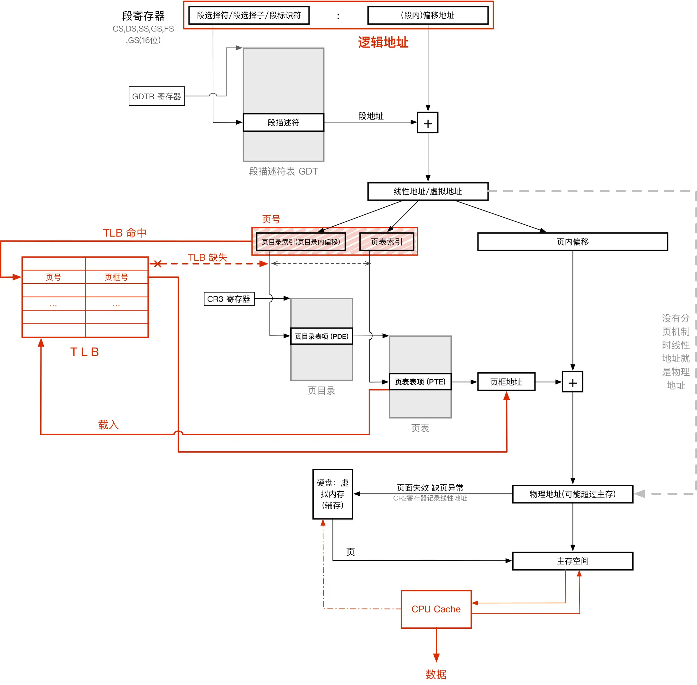

!!! abstract "AI Generated Abstract"

    本篇博客详细介绍了虚拟内存和地址转换的相关概念，包括虚拟地址空间的划分、保护模式下的进程运行机制、地址转化的具体步骤（逻辑地址到线性地址、线性地址到物理地址）、TLB 的作用及其工作原理，并简要说明了 Linux 系统对段式管理的处理方式。通过图文结合的方式，帮助读者更好地理解虚拟内存和 TLB 的核心原理。

<!-- more -->

## 虚拟地址空间

x86 CPU 的地址总选宽度为 32 位，理论寻址上限为 4GB。而虚拟地址空间的大小就是 4GB，占满总线，且空间中的每一个字节分配一个虚拟地址

* 其中高 2G`0x80000000 ~ 0xFFFFFFFF`为内和空间，由操作系统调用；
* 低 2G`0x00000000 ~ 0x7FFFFFFF`为用户空间，由用户使用。

在系统中运行的每一个进程都独自拥有一个虚拟空间，进城之间的虚拟空间不共用。

虚拟地址空间是一种通过机制映射出来的空间，与实际物理空间大小无必然联系，在 x86 保护模式下，无论计算及实际主存是 512MB 还是 8GB，虚拟地址空间总是 4GB，**这是由 CPU 和操作系统的宽度决定的**，即：

> CPU 地址总线宽度 → 物理地址范围
> CPU 的 ALU 宽度 → 操作系统位数 → 虚拟地址范围

### 虚拟内存

虚拟地址空间 = 主存 + 虚拟内存 (交换空间 Swap Space)

虚拟内存：将硬盘的一部分作为存储器使用，来扩充物理内存。

利用了自动覆盖、交换技术。内存中存不下、暂时不用的内容会存在硬盘中。

> Assume: 32 位操作系统，32 位寻址总线宽度 → 4G 线性空间

## 保护模式下的进程运行

虚拟地址空间是硬件行为，CPU 自动完成 (同时与操作系统协作) 虚拟地址到物理地址 (可能差熬过实际内存，这样会产生一个异常中断，揭晓来有操作系统处理 (如从虚拟内存中调出对应的页框内容))。

所以，一个程序若运行在保护模式下，其汇编级、机器语言级的寻址都是用的虚拟地址，即在一般的编程中不会接触到物理一层。

在进程被加载时，系统为进程建立唯一的数据结构`进程控制块(PCB = Process Control Block)`，直至进程结束。

PCB 中描述了该进程的现状以及控制运行的全部信息，有了 PCB，一个进程才可以在保护模式下和其他进程一起被并发地运行起来，操作系统通过 PCB 对进程进行控制。

PCB 中的程序 ID(PID(unix、linux)、句柄 (windows)) 是进程的唯一标识；PCB 中的一个指针指向 **页表** ，这些都与地址转化有关。

## 地址转化

地址转化的全过程可以用以下这张图来概括：

以下是具体步骤介绍。

### 逻辑地址 → 线性地址 (段式内存管理，Intel 早期策略的保留)

* 段内偏移地址 (32 位)

* 段选择符：16 位长的序列，是索引值，定位段描述符；结构：
  
    * 高 13 位为表内索引号 —— 但注意由于 GDT 第一项留空，所以索引要先加 1；
    * 而 2 位为 TI 表指示器，0 是指 GDT，1 是指 LDT；
    * 0、1 位是 RPL 请求者特权级，00 最高，11 最低 —— 在 x86 保护模式下修改寄存器是系统之灵，必须有对应的权限才能修改 (当前执行权限和段寄存器中 (被修改的) 的 RPL 均不低于目标段的 RPL)

* 段描述符：8x8=64 位长的结构，用来描述一个段的各种属性。结构：
   
    * 0、1 字节 +6 字节低 4 位 (20 位) 段边界/段长度：最大 1MB 或者 4G(看粒度位的单位)
    * 2、3、4、7 字节 (32 位) 段基址：4G 线性地址的任意位置 (不一定非要被 16 整除)
    * 6、7 字节的奇怪设计是为了兼容 80286(24 位地址总线)
    * 剩下的那些是段属性，详见`20180819143434`

* 段描述表：多任务操作系统中，含有多个任务，而每个人物都有多个段，其段描述符存于段描述表中。
  IA-32 处理器有 3 个段描述表：GDT、LDT 和 IDT。
    * GDT(Global Descripter Table) 全局段描述符表：一个系统一般只有一个 GDT，含有每一个任务都可以访问的段；通常包含操作系统所使用的代码段、数据段和堆栈段，GDT 同时包含各进程 LDT 数据段项，以及进程间通讯所需要的段。
    GDTR 是 CPU 提供的寄存器，存储 GDT 的位置和边界；在 32 位模式下 RGDT 有 48 位长 (高 32 位基地址 + 低 16 位边界)，在 32e 模式下有 80 位长 (高 64 位基地址 + 低 16 位边界)。
    GDT 的第一个表项留空不用，是空描述符，所以索引号要加 1。
    GDT 最多 128 项。
    * LDT(Local Descripter Table) 局部段描述符表：16 位长，属于某个进程。一个进程一个 LDT，对应有 RLDT 寄存器，进程切换时 RLDT 改变。
    RLDT 和 RGDT 不一样，RLDT 是一个索引值而不是实际指向，指向 GDT 中某一个 LDT 描述项。所以如果要获取 LDT 中的某一项，先要访问 GDT 找到对应 LDT，再找到 LDT 中的一项。
    编译程序时，程序内赋予了虚拟页号。在程序运行时，通过对应 LDT 转译成物理地址。故虚拟页号是局部性的、不同进程的页号会有冲突。
    LDT 没有空选择子。
    * IDT(Interrupt Descripter Table) 中断段描述符表；一个系统一般也只有一个。
    * 以下这个图能做一点解释：
    

### 线性地址 → 物理地址 (页式内存管理)

这一步由 CPU 的页式管理单元来负责转换。——MMU(内存管理单元)。

* 线性地址可以拆分为三部分 (或者两部分)：
  

* 页 (Page)：线性地址被划分为大小一致的若干内存区域，其对应映射到大小相同的与物理空间区域页框 (Frame) 上。这个映射不一定是连贯而有序的。

* CR3：页目录基址寄存器。对于每一个进程，CR3 的内容不同 (有点像 RLDT)，页目录基址也不同，线性地址 - 物理地址的映射也不同。

* 页目录：占用一个 4kb 的内存页，最多存储 1024 个页目录表项 (PDE)，一个 PDE 有 4 字节。在没启用 PAE 时，有两种 PDE，规格不同。

* 页目录表项 (PDE)：每个程序有多个页表，即拥有多个 PDE。PDE 的结构如下：
  
  12~31 位 (20 位) 表示页表起始物理地址的高 20 位 (页表基址低 12 位为 0，即一定以 4kb 对齐)。

* 页表：一个页表占 4kb 的内存页，最多存储 1024 个页表项 (PTE)，一个 PTE 是 4 字节。页表的基址是 4kb 对齐的，低 12 位是 0。

采用对页表项的二级管理模式 (也目录→页表→页) 能够节约空间。因为不存在的页表就可以不分配空间，并且对于 Windows 来说只有一级页表才会存在主存中，二级可以存在辅存中——不过 Linux 中它们都常驻主存。

一些 CPU 会提供更多级的架构，如三级、四级。Linux 中，有对应的高层次抽象，提供了一个四层页管理架构：

把中间的某几个定为长度为 0，就可以调整架构级数。如“四化二”：某地址 0x08147258，对应的 PUD、PMD 里只有一个表项为 PUD→PMD，PMD→PT；划分的时候，PGD=0000100000，PUD=PMD=0，PT=0101000111.

### TLB (转换检测缓冲区、快表、转译后被缓冲区)

处理器中，一个具有并行朝赵能力的特殊高速缓存器，存储最近访问过的一些页表项 (时空局部性原理，减少页映射的内存访问次数)。

TLB 较贵，通常能够存放 16~512 个页表项。

* TLB 命中：直接取出对应的页表项
* TLB 缺失：先淘汰 TLB 中的某一项 (TLB 替换策略，一些算法，可以由硬件或软件来实现)
    * 硬件处理 TLB Miss：CPU 会遍历页表，找到正确的 PTE；如果没有找到，CPU 就会发起一个页错误并将控制权交给操作系统。
    * 软件处理 TLB Miss：CPU 直接发出未命中错误，让操作系统来处理。

* 脏记录：当 TLB 中某个 PTE 项失效 (如切换进程、进程退出、虚拟页换出到磁盘)，PTE 标记为不存在，此时映射已经不成立了。
  操作系统要保证即时刷新掉这些脏记录，不同的 CPU 有不同的刷新 TLB 方法，但每次都完全刷新 TLB 会很慢，所以现在有一些策略，扩展对一个 PTE 的描述 (如针对某个进程、空间的标识，如果目前进程与 PTE 相关，就会忽略掉)，这样可以让多个进程同时共存 TLB

## Linux 段式管理

Linux 似乎没有理会 Intel 的那一套段的机制，而是做了一个高级的抽象。
Linux 对所有的进程使用了相同的段来对指令和数据寻址，让每个段寄存器都指向同一个段描述符，让这个段描述符的基址为 0，长度为 4G。即用这种方式略去了段式内存管理。
对应多有用户代码段、用户数据段、内核代码段和内核数据段。可以在`segment.h`中看到，四种段对应的段基址都是 0，这就是“平坦内存模型”，这样就有`段内偏移地址=逻辑地址`

且，四种段对应的都为 GDT。即 Linux 大多数情况都不使用 LDT，除非使用 wine 等 Windows 防真程序。

Linux 0.11 中每个进程划分 64MB 的虚拟内存空间。故逻辑地址范围为 0~0x4000000
