!!! abstract "AI Generated Abstract"

    本文介绍了一种基于 0-1 乘性噪声的图片降噪方法。通过利用图像像素的局部相似性特征，采用高斯核函数和线性回归模型对受损图像进行修复。文中详细描述了核心思想、训练过程以及迭代降噪策略，并展示了实验结果和潜在优化方向。该方法在视觉效果上取得了显著的降噪效果，同时提出了并行优化和更复杂模型的改进建议。

<!-- more -->

## 项目内容

给定 3 张受损图像，尝试恢复他们的原始图像。

1. 原始图像包含 1 张黑白图像（A.webp）和 2 张彩色图像（B.webp, C.webp）。
2. 受损图像$X$是由原始图像$I \in R ^ { H * W * C }$添加了不同噪声遮罩$M \in R ^ { H * W * C }$得到的$x=I \odot m$，其中$ \odot $是逐元素相乘。
3. 噪声遮罩仅包含{0,1}值。对应原图（A/B/C）的噪声遮罩的每行分别用 0.8/0.4/0.6 的噪声比率产生的，即噪声遮罩每个通道每行 80%/40%/60% 的像素值为 0，其他为 1。

**评估误差为恢复图像与原始图像向量化后的差向量的 2-范数，此误差越小越好。**

## 实现介绍

### 核心思想

由于图片的像素点在空间上满足局部相似的特征，相邻的像素点通道值变化往往是平滑且有一定规则的。因此，我们可以用一个模型来拟合像素点通道值在空间上的关系。具体实现中，我们将图片切割成若干个小矩形块，然后使用一个二维线性回归模型来回归每个小矩形块中位置和像素通道值的函数关系。为了使结果更加平滑和可靠，我们采用了高斯函数作为基函数。

### 高斯函数

当我们对一个 ss * ss 的像素矩阵块做回归的时候，我们要把所有没有被噪音损坏的点都提取出来。点位置用一个高斯核函数处理，这样原来的点坐标 (x,y) 就被转换成了$(e^{-\frac{(x-mid)^2}{2}},e^{-\frac{(y-mid)^2}{2}})$，在特征空间中用来刻画这个点与矩阵块中心的距离。这样，我们实际要回归的就是点心距与像素通道值的关系。

这样做，主要是因为我们的局部性原理本身就是不带方向性的，所谓的局部性就是指临近的点存在某种平滑的变化关系。使用这样一个衡量距离的核函数，可以使得我们的回归结果更加平滑：

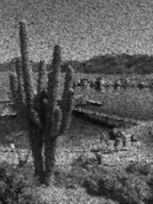

上图左边是用坐标直接回归，右图是坐标经过高斯核处理后回归的结果。可以看到左边有大量的不平滑的交错的黑白点，看起来很“脏”。右边由于采用了高斯函数处理过的表征距离关系的核函数，结果更加平滑，清晰。

CODE :

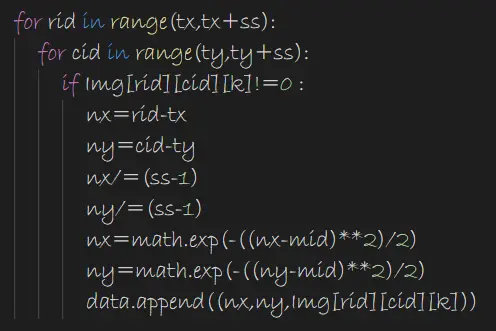

### 训练

提取完特征后的数据点拟合，就是一个简单的线性回归任务而已，我们采用最小二乘法回归。
$$
Loss = \frac {\Sigma_{i=0}^n(y_i-\phi(x_i) * w^T)^2}{n}=\frac{\Sigma_{i=1}^{n}Loss_i}{n}
$$
使用随机梯度下降来最优化损失函数：
$$
w\leftarrow w-\eta * \triangledown Loss_i=w+2\eta(y_i-\phi(x_i) * w^T) * \phi(x_i)
$$
具体实现中，我们取步长=0.005，进行 100 轮随机梯度下降。

CODE :

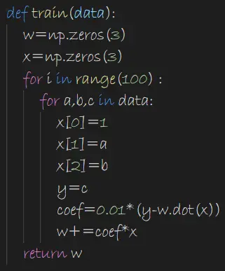

### 迭代降噪

我们前面提到了，我们要把图片切成若干个小矩形块，对每个小矩形块分别进行回归，那么这个小矩形块的尺寸取多少比较合适呢？

我们先取 ss=2 尝试一下：

噪音为 0.8 的时候，我们可以看到，如果取一个 2*2 的块，期望其中没损坏的通道只有 0.8 个，所以势必有大量的矩阵块里面都是全损坏的，这会使得一些全损坏的块得不到修复，产生大量的黑点。

直接取 ss=5：

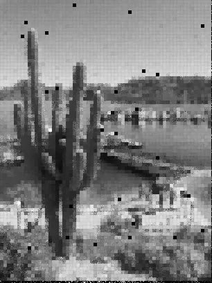

显然，黑块的数量变少了，但是实际上图片给人的颗粒赶很明显，更像是一堆模糊的马赛克拼图拼凑而成的。

我们的解决办法是先取 ss=2，对图片做恢复，然后将恢复的图像再用更大的 ss 来恢复。

下面是用 ss={2，3，4，5}迭代恢复四次的过程：

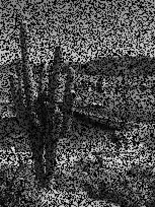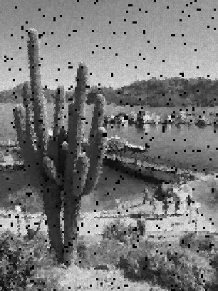

可以看到黑点逐渐被消除，并且最后经过 ss=5 的回归后得到的结果在视觉效果上明显优于直接用 ss=5 进行回归。这种想法本质上是一种贪心算法。先将损失密度小的局部块恢复好，再充分利用之前修复出来的信息将损失密度更大的块修复。

## 实验结果

A (noise rate = 0.8)

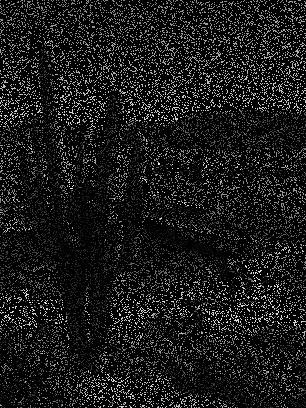

B (noise rate = 0.4)

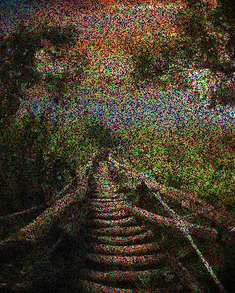

C (noise rate = 0.6)

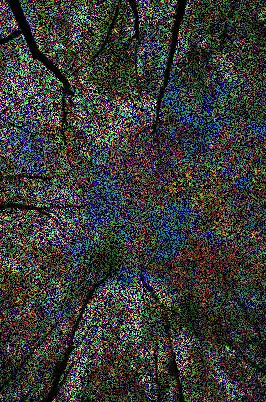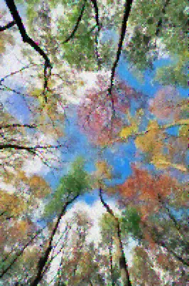

D（根据原图自己生成，测试迭代过程中损失的减少）

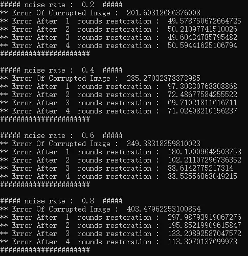

## 潜在的优化展望

1. 由于每个块的修复是独立的，可以考虑使用 CPU 多线程计算或者在 GPU 上用 CUDA 进行并行优化，加速整个修复过程。
2. 使用更复杂的网络来拟合。
3. 使用马尔科夫随机场的方法来做图像降噪。
