Reference: [Machine Learning and having it deep and structured (2018,Spring)](http://speech.ee.ntu.edu.tw/~tlkagk/courses_MLDS18.html) （李宏毅）

生成式对抗网络（Generative Adversarial Network，GAN），是 2014 年被提出来的一种生成式深度学习网络技术。

由于在众多应用场合中的出色表现，近年来 GAN 的应用和研究已经成为一个非常热门的方向。

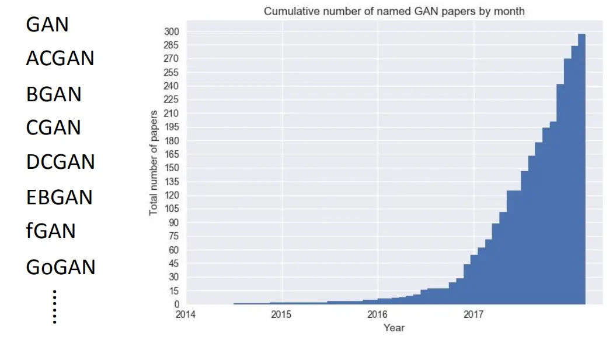{ width=60% }

这篇文章将会对 GAN 做一个直观的介绍，帮助读者理解 GAN 的 Basic Idea。

<!-- more -->

第一节中，我们将简单对机器学习的 Basic Ideas 做一个回顾。第二节和第三节会简单介绍一下什么是生成（Generation）。第四节和第五节会介绍两种生成模型。第六节我们将会看到 GAN 是如何结合这两种模型从而达到优秀的表现。

## Review for ML

在之前的文章（ [机器学习](http://zjuqxy.xyz/?p=1081) / [卷积神经网络](http://122.152.198.128/?p=1532>)）中，我们介绍了一些机器学习（Machine Learning）的思想和例子。

简单回顾一下在这些文章中的讨论，我们知道，机器学习本质上就是一个映射拟合 :

在这个过程中，模型（Model）是一个函数，我们希望对它输入一个自变量 x，能从它那里得到一个我们想要的输出 y。以房价预测为例，我们希望告诉这个模型一些当前的经济，政治等社会环境，它能反馈一个房价数值。以图像分类为例，我们希望告诉这个模型一张图片，它能反馈给我们这张图片属于什么类别。

在最简单的形式中，我们用一个简单的线性模型（Linear Model） $w*x=y$ 来建模这个函数。高级一点，选择一个更复杂的核函数（另一种说法也可以称特征函数）的话，这个线性模型可以表达更加复杂的关系。再高级一点，把这些线性模型多层复合起来，形成神经网络（Neural Network），表达力就更强，而这个用深度神经网络来建模的方法自成一派，也就是所谓的深度学习（Deep Learning）。

而常常所说的训练数据（Training Data）无非就是从真实的世界中采样的一组（x，y）样本。训练（Training）则是让我们的模型从训练数据中学习 x 和 y 之间存在的某种规律的模式（Pattern），模型的参数在学习过程中不断调整，最后模型代表的函数尽可能的去模拟了真实世界中的映射关系。

这个学习过程又是怎样的呢？通常就是定义了一个损失函数（Loss Function），这个损失函数的值是基于模型预测出来的结果和我们采样出来的真实结果的差别。所谓学习其实就是最小化这个差别。因此，所谓的学习，本质上就是这个函数最优化问题的一种拟人化表达而已。

因此机器学习实际上就是给定一个训练数据集，产生一个预测函数。这个预测函数能对输入的 x 给出期望的 y，简单的可以表示为这样：

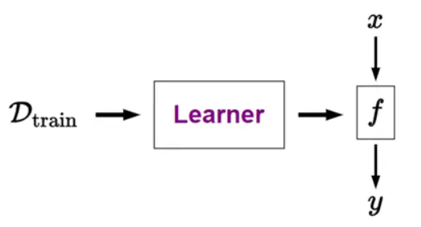

## What Is Generation

机器学习中，有很多种类型的任务，比如最简单的回归（Regression），分类（Classification）等。

它们是机器学习入门时肯定会接触的例子，常见的回归/分类任务比如：给定一张图片，输出一个标量或者向量描述这个图片的性质。

而生成（Generation）实际上就可以简单的理解为上述任务的一种逆向过程。给机器一张图片，它给你一个向量描述它的类别或者特征，似乎很无聊？那么如果给机器一个向量后，它给你生成一张图片 (~~老婆~~) 呢？

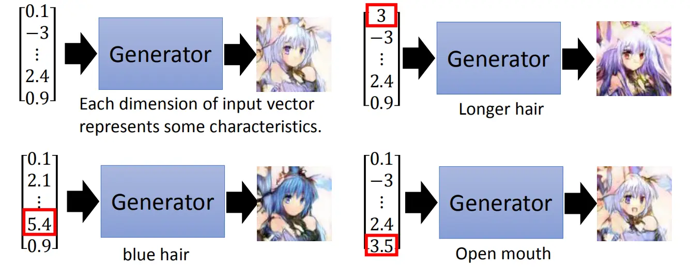

这就是生成任务最直观最简单的例子。（除了生成图片以外，当然它也可以用来生成句子/音频等其它任何你能想到的东西，只要能保证可训练。）

如上图所示，只需要调整对生成器的输入向量，它就会相应的生成不同的图片。P2 中增大了第一维的输入，生成的人物头发变长了；P3 中改变向量倒数第二维的输入，人物头发变成了蓝色；P4 中增大了向量的最后一维，生成的人像就变得笑口常开了。

## Why Generation

一个很自然的问题是：为什么我们需要生成？给我一个向量，我生成一张图片有什么用？

如果只是给一个很枯燥的向量，让机器生成一张图片确实没啥用。但是如果再组合上其它的功能模块，这个技术可能会非常有用。

比如说，我们可以不从向量开始，而从一个句子开始。训练这样一个模型，自然语言先被转成向量编码，向量编码再被转成这个自然语言句子描述的画面。

又比如说，我们可以从图片中修改一部分区域，画出一个简单的草图，它就自动帮我们生成更加真实的修改内容。

你甚至还可以根据马云的脸的表情信息的编码生成一张小罗伯特·唐尼同样表情的脸，然后替换上去，产生真实的换脸效果。

生成，在某种意义上来说，是人工智能最有意义的任务。回归和分类这样的任务仅仅是去理解和识别我们熟知的对象，比如识别一句话是不是脏话，识别一张图片是不是猫。但是生成却是化腐朽为神奇，仅仅根据一些非常空洞的描述就自动生成了我们人所熟知的对象，这才是我们真正最想让人工智能为我们做的。仅仅是理解和识别，人工智能终究只是作为一种辅助工具。但是当它能创造的时候，它就翻身做了主人。

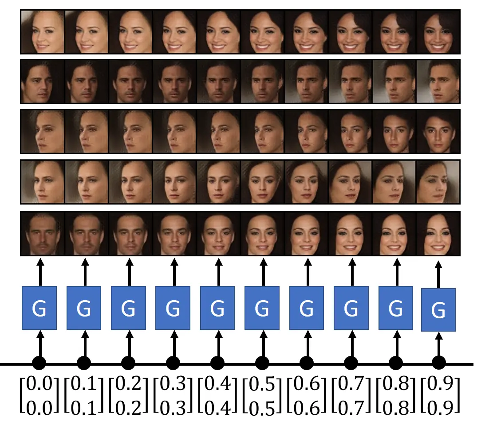

上图是一个向量生成图片的例子。向量按照一种顺序在逐渐变化，我们而可以看到第四行生成的人脸也在变化。惊人的是，它的生成竟然是一个连续的将脸变换一个朝向的过程。这说明，这个模型确实学到了这个人的脸的深刻特征，能根据向量的微调，对产生的结果也生成连贯一致的微调。

不只是绘画，当它还能生成语言，生成电影，生成代码，生成电路设计，生成科学理论时，它体现出来的智能性是非常让人震撼的。学习到对象/概念的深层次内涵，并且能够使用这些学到的知识去创造未知的东西，这是人工智能的究极目标之一。

## Auto-encoder

### Basic Idea

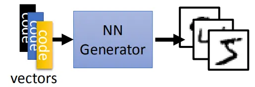

上图是生成模型的一种基本模式，我们希望输入一个向量得到一个目标输出作为图形。

一个简单问题是，我们如何训练它？容易想到的是事先准备一堆向量和图片之间的映射对，让这个生成器学得某种映射模式，如下图所示：

但面临的一个现实问题是，用于训练的图片很容易得到，但是这个向量 code 如何得到？需要我们手工设置吗？对于一些大型的项目，这个向量一般维度很高，样例也很多，手工设置这些向量标签可操作性并不强。并且，如果设计的向量不好，也很难保证模型收敛。

自编码器在一定程度上解决了这个问题：

如图，自编码器接收一张图片作为输入，先丢入一个神经网络中产生一个编码作为输出（一个高维向量），这个产生的编码再被丢入另外一个神经网络，恢复成图片。我们希望恢复出来的图片尽可能和输入的图片相近，于是可以定义一个 loss 来衡量图片在这一次编码和解码过程中的损失，根据这个 loss，再使用像梯度下降之类的方法，就可以调整 encoder 和 decoder 的参数，使得其尽可能减少损失。

在这样一个自编码，自解码的过程中，我们就既有了编码器和解码器。我们可以只对解码器输入向量，就能得到一个生成图。需要注意到的是，在这样一个自编码器模型中，code 和 image 的映射完全是由模型生成的。模型会自动帮我们调优这个映射的划分。

PS : 这个 code 的长度是一个超参数，我们需要设定一个适合的编码长度。一方面，它的长度小于原图才能达到我们希望的提取特征的效果。另一方面，如果它的长度太小，可能无法容纳图片中必须的一些关键信息，导致无法还原。

### Pros and Cons

自动编码器的优点很显然，只需要给模型展示一些正例，它就能学到编码与图片之间的映射，非常易于训练和生成。

上面我们说了，我们在训练一个自编码器的时候，希望的是输出图片和输入图片尽可能的相近，减少损失。这个相似如何去衡量呢？一般采用的方法都是把图片当作高维向量处理，求两个向量之间距离的 L1 或者 L2 范数。这个范数就表征了两张图片之间的差别，而这样的衡量方式局限性很明显：

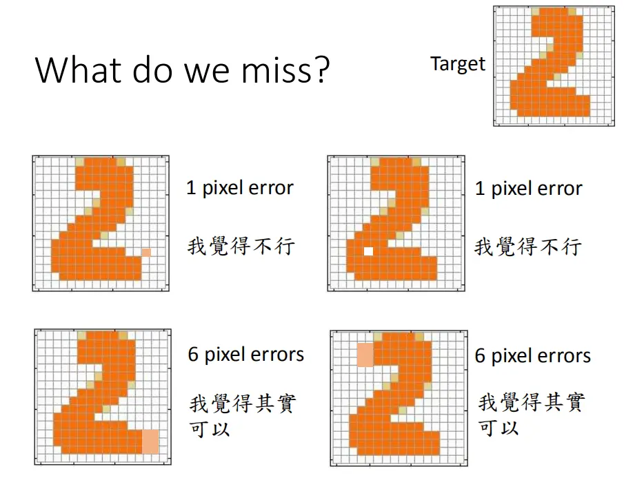

如上图所示，如果我们让机器生成了四个版本的“2”的图片。其中 v1 和 v2 与原图只差了一个像素点，v3 和 v4 查了足足 6 个像素点。但是 v1 和 v2 破绽很明显，v1 在尾巴上出现了一个孤立的橘色块，而 v2 在中间留了一块白出来，这都是不自然的。而 v3 和 v4 虽然像素点差距更大，但是其实只是尾巴和头分别拉长了一点罢了，这都是很正常的情况。所以，用这种标准训练出来的模型，它显然缺少一个大局观。只是机械的分别关注全局对象的每一个小组成部分，很难学到组成部分之间的关联。

## Discriminator

### Basic Idea

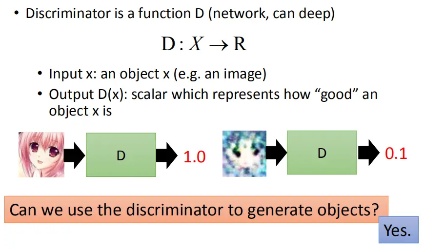

评估器接收一个对象输入，产生一个标量输出。（其实就是一个回归问题）如上图所示，以生成图片的任务为例，一个评估器会评估机器生成的图片是否和人类作出来的图有一样的效果，根据生成质量，评估器会给出一个 0~1 的评分。

假设我们已经有了一个很好的评估器，我们也可以用拿它来生成图片。给定一个向量，我们通过一些事先构造的假设，将其可能对应的图片锁定在一个集合（可能会很大）中。图片生成就成为了在这个集合中枚举，筛选出一个得分最高的图片：

### Train

一个实际的问题是，如何训练一个好的评估器？它怎么能分辨出哪些是画得好的，哪些是画得糟糕的？

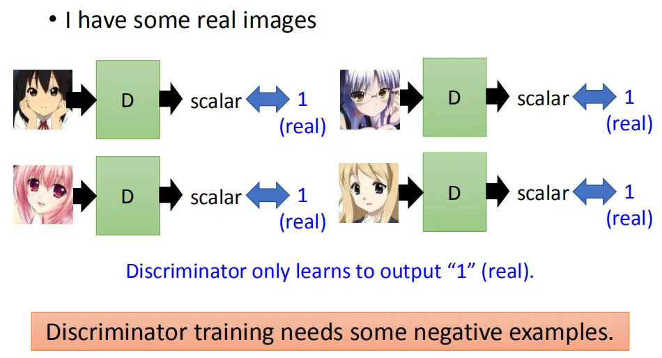

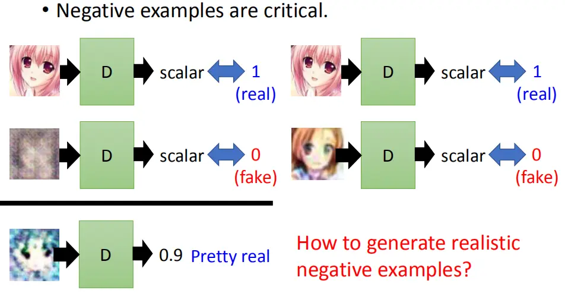

在网上，我们可以下载一大堆艺术家绘制的图片，他们都可以拿来作为正例，用来让模型学习什么是“好”图片。但是如果全都是正例，那么评估器将会收敛为一个恒输出 1 的常函数。所以，要训练一个评估器，面临的一个实际问题是：如何获得好的反例？

如果反例的采样分布没有选好，那么模型对反例的识别能力也会很差。就会像上图那样，一个画得很一般的图片却获得了 0.9 的高分。

我们可以通过一个迭代算法来不断强化这个评估器：

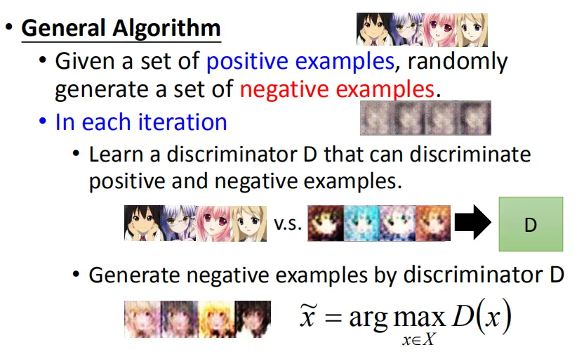

如上图所示。一开始，我们可以随机生成一批反例，然后我们用当前的正例和反例训练出来一个评估器。评估器是个什么东西呢？它本质上也是一个定义在图片域上的函数。我们现在就从这个定义域上采集一批评分很高的图片来作为反例，用新的反例结合之前的正例重新训练，得到下一个版本的评估器。最后不断迭代。

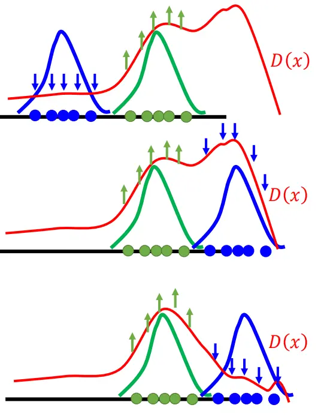

上图是一个迭代过程的示意图，绿色为真实图片的分布域，蓝色为生成的效果糟糕的图片的分布域，红色曲线是我们的评估函数。在第一轮的训练中，真实域的函数估值会被拉高，我们随机生成那些噪音图片所在的域的股指会被压低。但是这个估值函数可能还不够，它可能没有发现其它很糟糕的图片的分布域，给了它们很高的估值，我们称为“虚高”。所以我们会进行第二轮训练，第二轮中用到的反例是从第一轮训练出来的估值函数中采样的估值高的点，那些“虚高”的点因为被作为反例被压低，而那些本来就该得分高的点即使被采样为反例，但是因为有同区域的正例在支撑，所以这一区域的估值不会被压低。最后，多轮迭代后，那些虚高的点就会逐渐被压平，只有正例分布的区域还依旧坚挺。此时我们就认为得到的评估函数是优秀的。

这就像是制定一部法律。我们希望人们的行为被约束在一个我们预先定义的可接受的范围内。但是法律有漏洞，总有人钻空子，在制定者期望之外的区域获得很高的收益。法律制定者就会锁定这些突出的领域专门指定新的条令来打击。经过不断的实践和修订，这部法律也就完善起来。

### Pros and Cons

估值器的优点正好弥补了自动编码器的缺点。自动编码器是一个 Button Up 的模型，它根据编码对每一个像素点单独生成，组成一个完整的更高层的结果，这样的 Button Up 模型很难学到不同组成部分之间的关联。而估值器是一个 Top Down 模型，它直接获得正常图片作为输入，用全连接网络或者卷积网络很容易学习图片中的一些局部以及全局特征。

但是缺点也很明显。从上面看到，我们发现评估器很依赖于一个 argmax 的计算。如果要用它来生成模型，我们需要在一个域上找到得分最高的候选图。如果要用迭代法来训练一个评估器，我们也需要在当前的评估函数域采样估值高的点来作为新的反例。然而这个 argmax 怎么算呢？很多用 discriminator 来做生成的，都要事先做一些不准确的假设，根据这些假设对不同的输入向量在图片域中划分一个候选域，在这个可行域上做 argmax。并且有的时候需要大量的枚举，非常耗时。并且要训练评估器也不容易，光有正例还不行，还得自己去合理的生成反例。

所以，显而易见，评估器虽然有了自编码器难以学得的全局观，但是却没了自编码器那种易于生成结果的特性。

## GAN

讨论了这么多，终于轮到主人公 GAN 登场了。

前面我们先讨论了 Auto-encoder 和 Discriminator，分别介绍了用它们来做生成的基本想法。在讨论中，我们已经意识到了：Auto-encoder 很容易产生生成图像，但是由于是 button-up 的模型，根据编码分别对每一个像素点预测，很难学得像素点之间的关系；Discriminator 很容易学得图像中一些局部和全局的特征细节，可以很好的处理像素点之间的 correlation，但是其主要能力还是在做评估上，在生成方面它还是缺乏一个有效的生成手段。

GAN 集成了这两个方法：一方面，GAN 使用一个类似 Auto-encoder 结构的 Generator 来生成图像，另一方面它用一个 Discriminator 来评估生成图片的质量。

### Basic Idea

考虑这样的一个过程：

一开始我们已经有了一个 generator 和 discriminator，它们的参数都是随机设置的。generator 生成的图片很糟糕，discriminator 也无法判别什么图片是好的。

然后我们可以以一个适当的概率分布随机向这个 generator 中输入一组向量，然后得到一堆生成的图片，用这些图片作为反例，用艺术家绘制的图片作为正例训练 discriminator。这轮训练后，得到的 discriminator 的能力得到了提升，能够学会给一些好的图片打高分，给一些差的图片打低分。

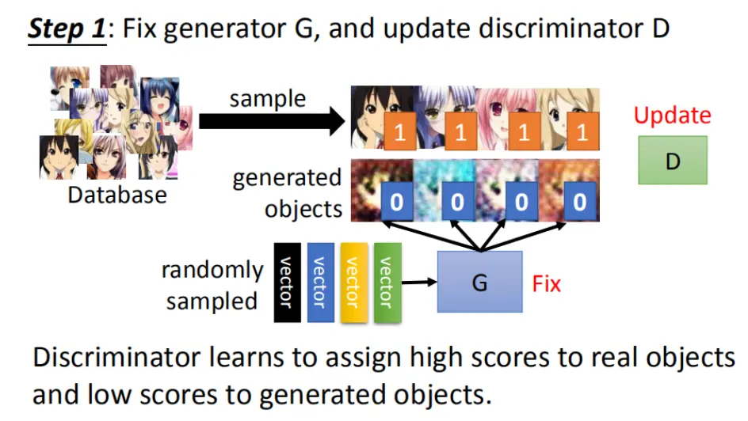

这之后，我们再固定这个 discriminator 的参数。此时如果我们给 generator 输入一个向量，再把它产生的图片送入 discriminator 中，我们会得到一个反馈的分数。这个反馈分数就可以作为 LOSS，我们根据 LOSS FUNCTION 的梯度调整 generator 的参数，使得它尽可能产生可以骗过这个版本的 discriminator，从它手下得到一个高分。这轮训练后，得到的 generator 的能力也得到了提升，能够产生一些像样的图片了。

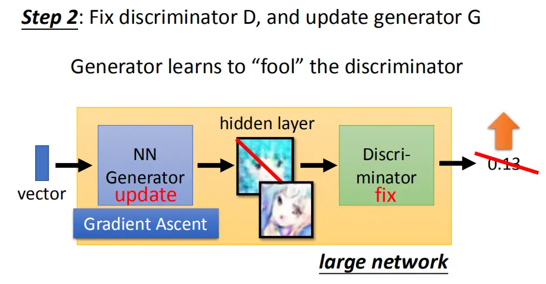

然后我们又重复上面的过程，强化 discriminator，discriminator 强化后再强化 generator。。。可以期望的是，多轮迭代后，我们的 generator 和 discriminator 都可以变得很强。

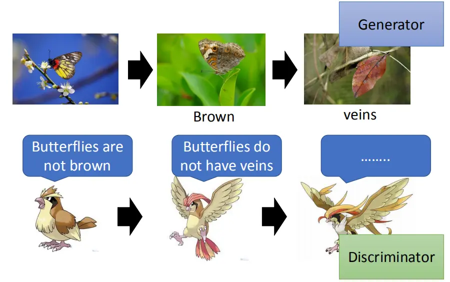

上图很好的从生物进化的角度很好的揭示了 GAN 的哲学。一开始蝴蝶颜色五颜六色的，停在树上的时候，捕食它的鸟根据颜色是否是棕色来区分它和叶子。在这个过程中，那些五颜六色的蝴蝶被淘汰了，棕色的蝴蝶脱颖而出，成功骗过了初代鸟。但是那些被骗过的初代鸟也会被淘汰，于是鸟也在这个过程中进化，学会了通过判别是否有叶脉来寻找猎物。而蝴蝶在这一过程中再次进化，成为了枯叶蝶。。。这是自然界中经典的良性竞争，互相强化的例子。而 Generative Adversarial Network 中的“Adversarial”也就是这样来的。在 GAN 中，我们让一个 generator 和一个 discriminator 互相对抗，generator 努力的生成逼真的图片试图骗过 discriminator，discriminator 努力强化自己的辨别能力对抗 generator 的欺骗。模型的学习就是在两者的对抗之中互相强化而完成的。

### Algorithm

上图是 GAN 的基本训练模式。$\theta_d$ 和 $\theta_g$ 分别是 Discriminator 和 Generator 的参数，一开始是随意初始化的。

每一轮中：

首先从数据库中采样 m 个真实样本$\{x_i\}$，再让 Generator 随机生成 m 个虚假样本$\{\hat{x_i}\}$。

定义 $V=\frac{1}{m}[\;\Sigma_{i=1}^{m}logD(x_i)+\Sigma_{i=1}^{m}log(1-D(\hat{x}_i))\;]$

真实样本得分越高，虚假样本得分越低，这个 V 的值越大。于是我们只需要通过梯度上升法，最大化这个 V，我们的 Discriminator 就能尽可能的对真实样本给出高分，尽可能的给虚假样本给出低分。这实际上就是完成了一个对 Discriminator 的强化。

在这之后，我们再取样 m 个随机向量${z_i}$，丢入 Generator，再把生成的结果给 Discriminator 评估。

定义$V=\frac{1}{m}\Sigma_{i=1}^mlog(D(G(z_i)))$

同样的，我们希望最大化这个 V 值，使得产生的结果尽可能骗过 Discriminator。将 V 值对 $\theta_g$ 求偏导，使用梯度上升来最大化这个 V，从而实现对 Generator 的调优。

### Comparision

在 GAN 的设计中，我们可以看到其明显优于 Auto-encoder 和 Discriminator 的地方。Auto-encoder 生成之后，缺乏一个强大评估反馈，简单的采用原图和恢复生成图的差向量范数来评估，无法考虑到各个 component 之间的 correlation，缺乏一个大局观。Discriminator 虽然能对图片产生很深的特征理解，但是缺少一个高效准确的 proposal 手段，训练时它非常依赖于反例的生成，生成时又需要选择一个候选区域来执行 argmax，这都不是容易解决的问题。

GAN 将这两者的特性做了一个结合。虽然还是采用 button-up 的生成方式，根据向量对每一个像素点单独生成，但是多了一个 up-down 评估模式的 discriminator 来对生成内容进行更加细致的评估反馈，从而 generator 能得到更好的训练指引。另一方面，由于有了一个更加强大的 generator，训练 discriminator 时，能获得质量更高的反例，从而 discriminator 也能得到更好的训练。
