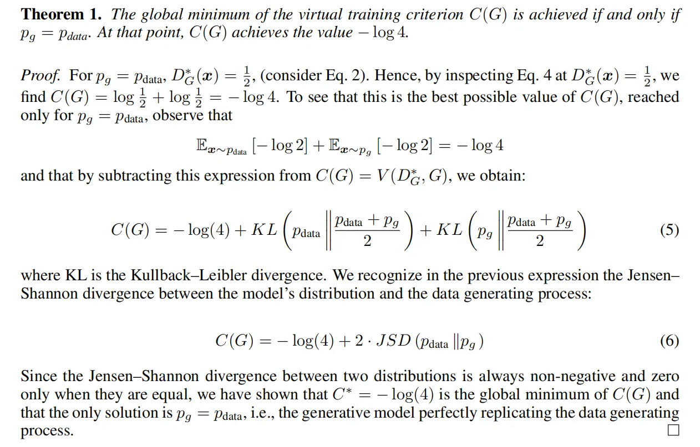
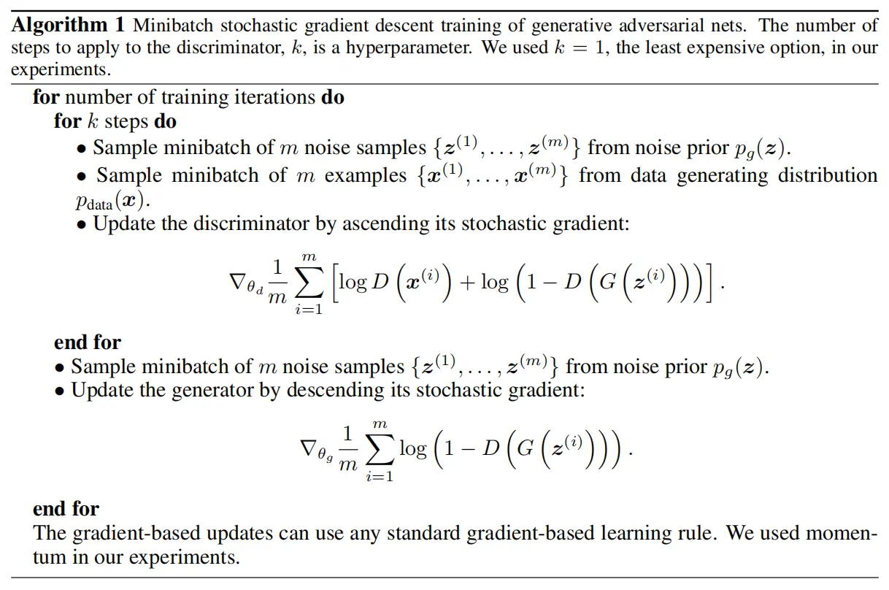
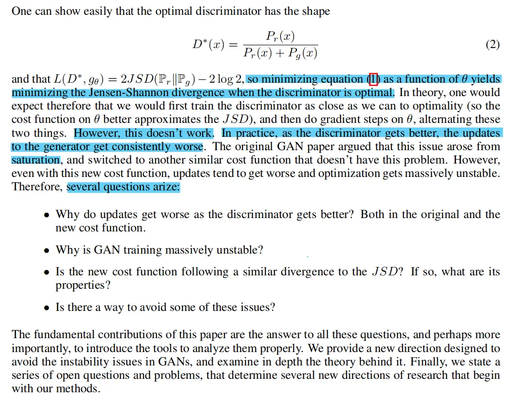
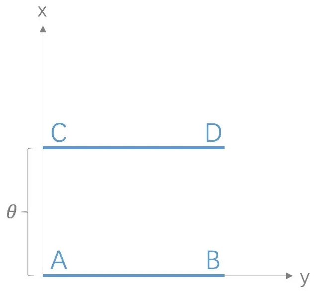
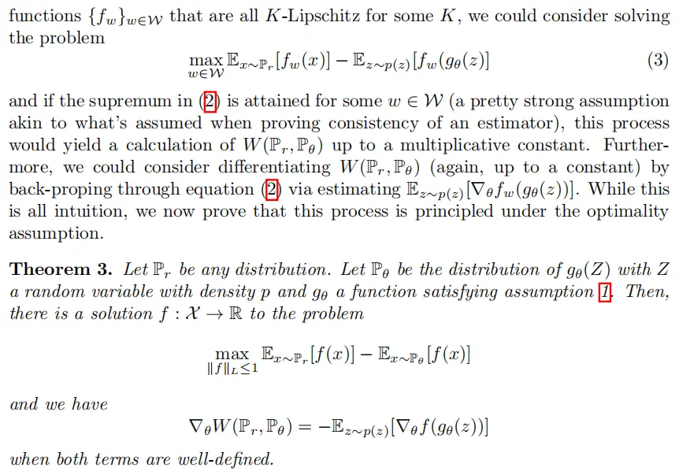

在 [对抗式生成网络 - 基础](./05-31-GAN-Introduction.md) 这篇文章中，我们介绍了对抗式生成网络（Generative Adversarial Networks, GAN）的基本思想。我们已经知道，与最经典的 Reflection Model 不一样，GAN 是通过一组用于生成的 generator 和用于判别的 discriminator 互相对抗来实现生成能力的自强化。上一篇文章中，我们只是很简单的介绍了它的 intuition，但 GAN 本质上还是一个数学模型，为什么能实现自强化，为什么模型最后会向我们希望的方向收敛，它还需要一些更加严谨的理论推导。

这篇文章中，我们将根据[《TOWARDS PRINCIPLED METHODS FOR TRAINING GENERATIVE ADVERSARIAL NETWORKS》(Arjovsky et al. 2017)](https://arxiv.org/pdf/1701.04862.pdf) 和 [《Wasserstein GAN》(Arjovsky et al. 2017)](https://arxiv.org/pdf/1701.07875.pdf) 这两篇论文的推导和论述，简单的讨论一下 GAN 的数学理论。

<!-- more -->

在展开 GAN 的讨论之前，我们将会先简单的介绍几个需要用到的前置概念和知识。在这之后我们会介绍原始 GAN 的 loss function 的实际数学意义，并简单讨论其存在的问题，最后讨论解决的方法。

## 理论准备

### Jensen 不等式

众所周知，在一个凸函数，其定义域上的任意两点 $x_1,x_2$，在 $0\leq t \leq1$ 时，满足：

$$
tf(x_1)+(1-t)f(x_2) \geq f[tx_1+(1-t)x_2]
$$

这就是 Jensen 不等式最著名的两点形式。Jensen 的两点不等式可以被推广到任意多数量的点集$\{x_i\}$上：当$\lambda_i \geq0$且$\Sigma \lambda_i=1$时，凸函数$f(x)$满足 $f(\Sigma\lambda_ix_i)\leq \Sigma\lambda_if(x_i)$。用数学归纳法可以证明这一推广式。

很容易想到，当上式取极限时，我们则会得到连续域上的 Jensen 不等式：

$$
\int p(x)dx=1\;=>f[\int p(x)xdx]\leq \int p(x)f(x)dx
$$

把上式放到概率论中，如果 p(x) 看作概率密度函数，那么上式显然等价于：

$$
f[E(x)]\leq E[f(x)]
$$

### KL 散度

考虑一个真实的概率分布 p(x) 和一个对这个概率分布进行拟合的另一个近似分布 q(x)，我们如何评估这个近似分布好不好？换句话说，我们如何去量化这个近似评估和真实评估的差异？

KL 散度（Kullback-Leibler divergence）是一个选择。KL 散度又常常被称为相对熵（relative entropy）或者信息散度（information divergence），是两个概率分布间差异的非对称性度量。

对于上面的两个概率分布 p 和 q，KL 散度定义如下：

$$
KL(p||q)
=\int p(x)ln[\frac {p(x)}{q(x)}]dx
$$

直观的来看，对于点 x 处，KL 散度将两个分布的差异损失定义为$p(x)ln[\frac{p(x)}{q(x)}]$，显然只有两个分布都在此处取相同的概率密度，这个损失才为 0，并且在真实分布 p 中出现频率更高的 x 处的损失所享有的权重也会更大。因此，从直观的角度来看，它确实在某种程度上反映了两个分布之间的拟合程度。

除了直观意义，它在数学上也有两个很好的性质。

#### 性质 1

**KL(p||q) >= 0, 当且仅当 p=q 时，等号成立。**

$$
KL(p||q)=\int p(x)ln[\frac{p(x)}{q(x)}]dx\\
令 g(x)=\frac{q(x)}{p(x)}\\
KL(p||q)=\int -p(x)ln[g(x)]dx
\\-ln(x) 为凸函数，由 Jensen 不等式=>\\
KL(p||q)=E[-ln(g(x))]\geq -ln[E(g(x))]\\
=-ln\{\int p(x)\frac{q(x)}{p(x)}dx\}=-ln(1)=0\\
得证
$$

#### 性质 2

**最小化 KL 散度等价于最大化似然函数**

$$
q(x) 是 p(x) 的近似\\
=>q(x)=P(x;\theta)，\theta 是这个近似器的参数\\
argmin\;KL(p||q)=argmax\;\int p(x)ln[q(x)]-\int p(x)ln[p(x)]\\
=argmax\;\int p(x)ln[q(x)]\\
\approx argmax\;\frac{1}{N}\Sigma\;ln[q(x_i)]\\
=argmax\; \frac{1}{N}\;\Pi\;q(x_i) \\
=argmax\;\frac{1}{N} \;\Pi\;P(x_i;\theta)
$$

如上所示，对于 p(x) 做参数估计，我们可以写出似然函数：$\frac{1}{N}\;\Pi\;P(x;\theta)$，最大化这个似然函数的直观意义就是使得这个近似分布中，尽量让实验中出现次数多的样本 x 取更大的概率值，这是极大似然的基本想法。

推导发现，最小化 KL 散度，实际上就等价于最大化这个似然函数。（这可以看作 KL 散度之所以是一个“良好”测度量的原因。）

### JS 散度

JS 散度（Jensen-Shannon divergence），和 KL 散度一样，也是用来衡量两条曲线的相合性的。

在 KL 散度中 p 和 q 的地位不等价，交换 p 和 q 得到的结果是不一样的。如果把散度当作某种“距离”的衡量，那么在 KL 散度定义的距离空间中，两个对象之间的距离就是不对称的。但是在一些问题背景下，我们可能更希望使用具有对称性的“距离”。

JS 散度的定义就是为了解决了 KL 散度的不对称问题：

$$
JS(P1||P2)=\frac{1}{2}KL(P1||\frac{P1+P2}{2})+\frac{1}{2}KL(P2||\frac{P1+P2}{2})
$$

如上所示，它直接从 KL 散度的定义中做了一个简单的变换，直观意义可以理解为 P1 和 P2 与这两者的中线"距离"的均值。关于其严格的数学性质，这里就不再赘述，有兴趣可以取查阅相关的资料。

## 初代 GAN 的收敛性

2014 年时，Goodfellow 在[《Generative Adversarial Nets》](https://arxiv.org/pdf/1406.2661.pdf)中首次提出 GAN 的时候，使用了上面这个非常优雅的目标损失函数，这是一个非常简练的 minimax 博弈式，使用这套 Loss，训练过程中，Discriminator 会尽量的最大化真实样例的评分期望，并最小化生成的样例的评分期望，以筛选出假图片；Generator 则尽量最大化自己生成的样例的期望评分，试图骗过 Discriminator。其基本的思想我们在上一篇文章中已经介绍过了。

对于一个 generator 来说，我们一般是采样一个噪音向量 z 作为其输入，generator 根据这个随机输入生成一个随机特征的图片。当我们使用满足$z\sim p_z$的随机噪音的时候，也隐含的定义了生成的图片的分布$p_g$，理想的情况下，我们希望生成的图片分布尽量收敛于训练集中图像的概率分布$p_{data}$。

Goodfellow 在 GAN 的开山之作中证明了上面式子中定义的 minimax 博弈在$p_g=p_{data}$时取得纳什均衡，并且使用其提出的算法（其实就是用梯度下降最优化上述目标函数）可以使得博弈达到这个纳什均衡，因此也就能达到$p_g = p_{data}$这个美好期望。

### 纳什均衡点

对于任意一个样本 x，它既有可能来自训练集，又有可能来自生成器，只不过是概率分布存在差异罢了。这个样本对于上面定义的判别器 D 损失的贡献为：$-P_{data}(x)logD(x)-P_g(x)log[1-D(x)]$。

固定 generator 的参数，上式对 D 求偏导 :

$$
Dif=\frac{-P_{data}(x)}{D(x)}+\frac{P_g(x)}{1-D(x)}
$$

导数为 0 时，判别器的损失取最优值，不难导出最优判别器：

这个最优判别器的直观意义很显然，一个数据 x 在训练集中出现的可能性是 a，被生成器生成的概率是 b，那么当一个最优的判别器要判断其到底是真图片还是假图片的时候，输出概率$\frac{a}{a+b}$是非常自然的事情。

因此，对于任何一个固定的 G，D 能取得的最优如上。那么说白了，要求纳什均衡，也就是只需要再调整生成器的生成分布 $p_g(x)$ 的，使得上式取最小。

原论文中给出了下面的证明过程，证明了$p_g=p_{data}$时，取得纳什均衡：

前面我们已经介绍过了 KL 散度：$KL(p||q)=\int p(x)ln[\frac {p(x)}{q(x)}]dx$.

原论文中给出的证明其实就是对上面的$C(G)$做了一个变换，将其变换成散度形式：

$$
\int p_{data}(x)*log\frac{p_{data}(x)}{p_{data}(x)+p_g(x)}*dx+\int p_g(x)*log\frac{p_g(x)}{p_{data}(x)+p_g(x)}*dx\\
=KL（p_{data}||p_{data}+p_g）+KL(p_g||p_{data}(x)+p_g(x))
$$

log 里面分母再除个 2，提出来就是它证明中的式子了：

$$
=KL（p_{data}||\frac{p_{data}+p_g}{2}）+KL(p_g||\frac{p_{data}+p_g}{2})-log(4)
$$

然后我们就是要最小化它对吧？

我们在上面介绍 KL 散度的时候，已经证明了，KL>=0，当且仅当 p，q 相等时取 0，所以上式取最小的条件就是：$p_{data}=\frac{p_{data}+p_g}{2}=p_g<=>p_{data}=p_g$。

由此得证纳什均衡的取得条件为$p_{data}=p_g$。

### 优化算法的收敛性

在上一篇文章中，我们就已经介绍了这个训练算法，分别让 D 和 G 轮流针对 Loss 做梯度下降而已，直观上很好理解。Goodfellow 在原论文中也对其收敛性做了证明：

其实感觉证了跟没证差不多吧。。大致就和我们在之前讨论的一样，最后要优化的本质上就是一个关于$p_g$的函数，然后证明了凸性，所以可以用梯度下降保证收敛到最优点。但是实际操作中，我们不能表示为一个$p_g$的函数，而是用多层网络来拟合，虽然缺乏理论保障，但是非常成功，2333。。。

总的来说，原论文中，这一部分，主要还是证明纳什均衡点的部分最精彩。上一篇文章中，我们用类比的方法解释了 GAN 的哲学，但是这里我们直接从数学上证明了定义的 Loss 的合理性：在这个 Loss 定义下，我们实际上是在让生成器的生成结果的概率分布和数据集分布拟合。

## 初代 GAN 存在的问题

从 14 年 GAN 被提出以来，GAN 在实践过程中，就一直存在训练困难等问题。

"However, they still remain remarkably difficult to train, with most current papers dedicated to heuristically finding stable architectures......Dispite their success, there is little to no theory explaining the unstable behaviour of GAN training."

为了解决这个问题，大部分尝试都是通过改进 GAN 的生成器和判别器的架构，毕竟是 CNN，优化优化架构总能让性能提升的。比较成功的如 DCGAN，通过不断实验，找到一个比较好的网络架构设置。它们取得了一些成功，但是没有彻底解决 GAN 存在的问题，并且也一直缺乏对于 GAN 的表现的理论解释。

人们发现，在使用上面 Goodfellow 提出的那套 minimax 损失函数训练时，判别器训练得越好，生成器梯度消失越严重。也就是说当 discriminator 太强的时候，generator 的能力就训练不上去了。

Goodfellow 当年在写这篇论文的时候也发现了这个问题，于是在介绍完自己最开始提出的那套 Loss 后，又补充了几句："In practive, equation 1 may not provide sufficient gradient for G to learn will......Rather than training G to minimize log(1-D(G(z))) we can train G to maxmize log D(G(z)). This objective function results in the same fixed point of the dynamics of G and D but provides much stronger gradients early in learning."

其实就是把 generator 的目标函数简单的从 log(1-D) 换成了-log(D)，直观来看，意义是一样的，都是在引导 generator 骗过 discriminator，只不过数学形式发生了变化，在训练的时候梯度/收敛等方面发生了变化。但是后来人们发现，这种做法也很一般，首先梯度很不稳定，其次生成的样本多样性不足。

直到 2017 年，这位来自 Courant Institute of Mathematical Sciences 的 Martin Arjovsky 先生发表了文章开头提到的[《TOWARDS PRINCIPLED METHODS FOR TRAINING GENERATIVE ADVERSARIAL NETWORKS》(Arjovsky et al. 2017)](https://arxiv.org/pdf/1701.04862.pdf) ，其中存在的理论问题才得到了回答。

原文中对于这部分问题的归纳得非常精彩：

寥寥几句话，就把前人遇到的问题的要害给抓住了：既然 D 最优的时候，训练 G 就能逼近纳什均衡，为啥 D 越好，G 的训练却越糟糕？Goodfellow 说这是因为 saturation 导致的，可以换个 loss function，但是为啥换了过后发现更垃圾了。

于是提出了四个精髓的问题：为啥 D 越好，G 训练越差？为什么 GAN 的训练不稳定？Goodfellow 提出的替代选项也和 JSD 有关么，性质如何？有什么解决当下问题的办法吗？

问完后，夸下海口：The fundamental contributions of this paper are the answer to all these questions. 可谓是技惊四座。。。

这部分，我们主要整理了 Arjovsky 这篇论文中的关于初代 GAN 存在的问题的部分分析和推理。我们将分两个部分分别讨论 Goodfellow 原论文中提出的两种形式的 Generator 目标函数存在的问题。

但是我们只会给出一个简单的 intuition 层次上的讨论，严格的数学推导读者可以自行下载论文查看。因为，这位数学研究所的大哥，写的论文。。。嗯。。。

非常严谨：

要吃下这篇论文，最好得有一点测度论的基础。（反正我不会）

至于他在这篇论文中提出的解决方法，我们不再讨论，因为下一个部分，我们会介绍一个更加成熟的方法——WGAN。而提出者。。。还是这位 Arjovsky 先生。。。

### log(1-D) 存在的问题

在上面证明 GAN 的纳什均衡点的时候，我们已经知道当 Discriminator 最优时，最优化 Generator 目标函数的等价表达式：

$$
KL（p_{data}||\frac{p_{data}+p_g}{2}）+KL(p_g||\frac{p_{data}+p_g}{2})-log(4)\\
=2JSD(p_{data}||p_g)-log(4)
$$

最小化这个目标函数，也就是最小化$p_{data}$和$p_g$的散度，也就是尽量让两个分布贴合，两者相等时达到纳什均衡，这些我们都已经讨论过了。

但是问题就出在这个散度上。

如果在训练过程中$p_{data}$和$p_g$这两个分布完全不重叠，或者重叠部分可忽略，那么这个 JS 散度会是多少呢？

（这里的重叠指：两个分布在某个样本点上都有不为 0 的出现概率。）

还是先考虑单个 x 对这个 JSD 的贡献：

$$
[p_{data}(x)*log\frac{2p_{data}(x)}{p_{data}(x)+p_g(x)}+p_g(x)*log\frac{2p_g(x)}{p_{data}(x)+p_g(x)}]dx
$$

对于每个 x 来说，存在四种可能性：

$$
p_{data}(x)=0，p_g(x)=0\\
p_{data}(x)\neq0，p_g(x)=0\\
p_{data}(x)=0，p_g(x)\neq0\\
p_{data}(x)\neq0，p_g(x)\neq0\\
$$

第一种情况，对散度无贡献，第二种情况和第三种情况则会贡献 log2*dx。由于完全不重叠或者重叠忽略不计，第四种情况贡献也可算作 0。因此，实际上，在$p_{data}和 p_g$重叠量可以忽略不计的情况下，这个 JS 散度始终在 log2 附近轻微震动。使用这样的 loss function 来训练 generator，其实就意味着：梯度=0。

也就是说，当 discriminator 最优的时候，如果生成器产生结果的分布$p_g$与训练集分布$p_{data}$的重叠量可以忽略不计，generator 不能获得任何梯度信息（因为梯度=0），无法通过梯度来优化自己。

而$p_{data}$和$p_d$重叠量可忽略不计的概率是多大呢？几乎是 1..

原论文用测度论的方法证明了：当$p_{data}和 p_g$的支撑集是高维空间中的低维流行时，这两个分布重叠部分的测度为 0 的概率为 1。

这里简单解释一下概念：

* 支撑集：一个函数在其定义域上取值非 0 的定义点的点集。
* 流形：三维空间中我们有曲线，曲面。这些低维曲线/曲面都是这个三维空间中的一个低维流形。比如一三维空间中的曲面是这个空间中的一个二维流形，曲线是一个一维流形。本质上，我们知道，所谓维度就是指需要几个变量才能确定，流形就是高维空间中这些概念的推广。
* 测度：可以理解为长度/面积/体积这些经典空间中的概念在高维空间中的推广，可以理解为超体积。（如果对线性代数熟悉的话，我们知道行列式本质上也是在计算一个超体积。）

为什么要用支撑集这样的概念呢？因为像图片这样的高维向量，以 64*64 的图片为例（4096 维），并不是随便拿一个 4096 维的向量，它就是一个对人类来说有“意义”的图片。当我们看到一张猫的图片（本质上是一个满足一定特征的向量）我们会说这是猫，当我们看到一个随机生成的 4096 维向量，我们大多时候看到的就是一堆乱七八糟的像素点。所以对于图片的概率分布来说，这个 4096 维的向量空间中，大部分的概率值应该都是 0，是没有意义的。

那么，很容易就会想到，对于真实图片的概率分布，其支撑集可能只是这个高维空间中的一个低维流形（真实图片只有可能分布在一个这个空间中的一个低维度超几何面上，其它地方概率=0）。

更直观一点来说，就是：既然真实图片只是其所在的空间的一个非常小的集合中，那么可能我们根本就不需要这么高维度的向量来表达它，一个更低维度的编码就够了，用像素矩阵来表达一个图片对象是一个非常低效的手段。实际上已经有许多例子能够为此提供支持，其中最有代表性的应该是图像压缩。以 JPEG 压缩为例，在有些例子中，它可以将一个 bmp 格式的图片的大小压缩 20 倍，虽然它是有损压缩，但是解压后肉眼基本上看不出压缩前后的区别！

而原论文中想要表达的就是：既然图片分布是低位流形，那么两个低维流形的交叠相对于这个低维流形而言，期望测度是 0。比如说在二维平面上随便取两条曲线段，这两条曲线段可能会有有限的相交点，但是这些有限的相交点的“长度”相比于这个曲线段微不足道。原论文的证明其实就是把这个直观的感受推广到了高维空间中。

至此，我们终于知道为啥 D 训练得太好，G 就训练不动了。因为 D 训练得越好，训练 G 时的目标函数就越贴近上面我们推导出的 JS 散度。而这个散度虽然理论上看起来很好，只要不断降低，就能够让两个分布贴在一起，但是实际上由于两个分布的交叠几乎总是可以忽略不计，所以导致这个散度根本降不动。

因此，初代的 GAN 训练过程中需要非常小心的平衡 D 和 G 的训练，如果以来 D 就训练得太好，那么 G 根本训练不动，如果 D 质量很差，G 从 D 那里得到的梯度指引也会不够准确，导致 G 的训练效果一般。

### log(D) 存在的问题

那么 Goodfellow 提出的备选项 : logD 又如何呢？

还是按照上面的方法，做一个简单的变形，就可以导出，当 D 最优的时候，G 的目标函数等价于：

$$
KL(p_g||p_{data})-2JS(p_{data}||p_g)
$$

最小化这个目标函数会变得很滑稽。

一方面我们希望最小化 KL，另一方面又希望最大化 JS。直观上来看，我们又希望将两个分布贴紧，又希望将它们两个拉开。。。

所以显然当年 Goodfellow 提出的这个“改进”完全是凭感觉瞎扯的。它避免了原来的那个裸的 JS，所以解决了梯度消失的问题，但是这两个互相矛盾的目标也自然最后也会让我们得到不稳定的梯度波动。。

## Wasserstein GAN

Arjovsky 在[《TOWARDS PRINCIPLED METHODS FOR TRAINING GENERATIVE ADVERSARIAL NETWORKS》(Arjovsky et al. 2017)](https://arxiv.org/pdf/1701.04862.pdf) 还讨论了一些别的问题，并且也提出了一些解决这些问题的思路和方法。限于笔者实力和精力有限，这里不再赘述，有兴趣可以阅读原论文。

这一部分，我们将介绍 WGAN。WGAN 的提出者也是 Arjovsky 等人，在发了上面这篇 paper 后，他又立刻发表了 [《Wasserstein GAN》(Arjovsky et al. 2017)](https://arxiv.org/pdf/1701.07875.pdf)。

Wasserstein GAN，顾名思义，其实就是把概率分布间的距离度量改成使用“Wasserstein Distance”来衡量的 GAN。这一部分，我们会简单的介绍 Wasserstein Distance 及其相对于其它类型距离定义的优势。最后我们会介绍 WGAN 的基本思路和流程。

### Wasserstein Distance

原论文中，作者简单的贴出了 Wasserstein Distance 的定义，乍一看反正就是一个数学表达式，求的是一个向量间距离的期望下确界。。。

WD 也被称为推土机距离（Earth-Mover Distance），是信息论里面的一个定义。搜一下这个东西，你会发现还有很多应用中都用到了它，它本质上是从最优传输问题导出的。上面我们说了这个式子就是要求一个期望的下确界，对于这个期望来说，其所依赖的联合概率分布是一个参数，这里要求一个下确界，就是要求一个最优联合概率分布来使得整个传输时最优的。而这个最优概率传输代价可以作为两个概率分布之间的差异的某种形式的度量。有兴趣可以参考一下这篇文章：[《传说中的推土机距离基础，最优传输理论了解一下》](https://zhuanlan.zhihu.com/p/45980364)。

用最优传输代价为什么能衡量分布距离？

假设我们是一个电商平台，我们运营着自己的仓库，我们当然希望全国各地的仓库中商品的分布尽量和各地的需求贴合。比如说 A 城对商品需求量为 x，我们当然希望 A 城的仓库正好有 x 件商品来满足需求。

如果我们把 n 个城市的仓库库存表示为一个 n 维向量 X，商品需求也表示为一个 n 维向量 Y，那么最容易想到的简单评估库存分配的方法就是计算$||X-Y||$，这个向量距离范数在一定程度上衡量了库存分布和商品需求分布的贴合程度。

但是，这个范数可能评估得并不那么精确。

假设现在 n 个城市里，有 n-2 个城市库存和需求都是一样的，但是有两个城市，比如西藏和北京，其中西藏需求量比库存大 1，北京的库存比需求量大 1。那么我们可以从北京运送 1 个单位的商品到西藏，此时得到范数值$||X-Y||=1$。

再考虑另一个例子，如果这两个城市不是北京和西藏，而是北京和天津，那么我们需要把一个单位的商品从北京运送到天津。此时$||X-Y||$依然是 1。

我们很快就会发现一个问题。如果把货物从北京发送到天津所需要的代价肯定显著低于从北京发往西藏，从这个角度来看，后者的分布应该优于前者的分布，但是如果简单的用一个距离范数来表达，无法体现这种差别。

我们把本地发货的代价设为 0，把北京到西藏的代价设为 100，北京到天津的代价为 10。那么用最优传输代价来评估，前者的代价是 100，后者代价是 10，我们便能体现出后者由于前者这一特性。

这就是最优传输代价用来衡量分布距离的直观理解。

### WD 的优势

原论文在引出 WGAN 之前，先对比了四种距离定义的表现。考虑到其中一种 TVD 对于我们理解 WGAN 并没有什么特别必要，我们这里主要比较一下三种距离：KL Divergence，JS Divergence，Wasserstein Distance (Earth-Mover Distance)。

原作者举了上面这个简单的例子，这个例子中有两个不重叠的概率分布。（原论文没有给上面的示意图，这张示意图源自一篇知乎的文章[《令人拍案叫绝的 Wasserstein GAN》](https://zhuanlan.zhihu.com/p/25071913)）

我们将看到 JSD，KLD 和 WD 在这个例子中表现出来的差异：

对于 JS 我们前面已经分析过了，只要不相交，不管距离是多少，始终等于 log2，根本不能体现距离带来的差别，所以一旦分开了，就不能通过梯度拉回来，所以训练 G 的时候会出现梯度消失。

对于 KL，也很容易验证，当完全不相交时，梯度会趋于无穷，导致梯度爆炸。

而 WD 却体现出了非常优秀的性质，它完全是和距离呈正相关的，提供了连续平滑的梯度。

由此可见，如果我们使用 WD 来作为目标函数引导$p_g$和$p_{data}$的拟合，就能很好的避免梯度消失或者梯度爆炸。

### WGAN

前面我们说了，WGAN 就是把初代 GAN 的 loss 换掉，不再使用 JS 散度作为目标，取而代之，采用 Wasserstein Distance 来作为目标。

但是并没有这么简单。。。还记得 Wasserstein Distance 中要求一个下确界吗？这东西并不能直接求解。。

如上，虽然 WD 并不能直接算出来。但是作者在原文中使用了 Kantorovich-Rubinstein duality（这个东西有兴趣可以自己去看[这篇文章](https://vincentherrmann.github.io/blog/wasserstein/)，原 paper 这部分引用了这本书：《Optimal Transport - Old and New》，据说是写个数学系 phd 看的，998 页。"Have fun and good luck!!!"），于是 WD 距离的计算就归结为另一个等价对偶式的计算：

或者也可以用：

这里的$f$是一个满足 Lipschitz 连续的函数。

所谓的 Lipschitz 连续，就是对于一个常数 K，函数在定义域中任意两个元素$x_1,x_2$上都要满足：

$$
|f(x_1)-f(x_2)|\leq K|x_1-x_2|
$$

K 被称为 Lipschitz 常数，上面的表达式中，要求 $f$ 满足对于一个固定大小的 Lipschitz 常数满足 Lipschitz 连续。从 Lipschitz 连续的定义上，可以看到，它限制了函数梯度的上限，使得一个函数的函数值局部变动幅度只能在一个有限的范围内。

所以，计算 WD 就成了，在 $f$ 的 Lipschitz 常数不超过 K 的条件下，找出那个特殊的满足条件的 $f$ 取到$E_{x\sim p_r}[f(x)]-E_{x\sim p_\theta}[f(x)]$ 的上界。

似乎找到这个最优 $f$ 也不是一件容易的事情？神经网络最厉害的不就是拟合么。。我们拿一个神经网络来拟合。。但是神经网络在拟合过程中没办法限制 f 使得它满足 Lipschitz 条件呀？WGAN 原论文中暴力的将拟合 f 的网络的 w 参数全部限制在了[-c,c]之间（小于-c 就令为-c，大于 c 就令为 c），来强行的满足了 Lipschitz 条件（f 最终肯定是关于 w 的函数，w 的范围只要被限制了，那么 f 的导数极限也被限制住了）。

于是在 WGAN 的设计中，原本的 discriminator 网络其实被换成了拟合 $f$ 的网络。对于这个 $f$ 网络的训练，它做的事情就是要最大化：

$$
L=E_{x\sim p_{data}}[f_w(x)]-E_{x\sim p_g}[f_w(x)]
$$

在训练充足的情况下，这个 $f$ 被期望能逼近使得 WD 对偶式取上确界时的$f$。

而 generator 要干什么呢？它就是负责最小化这个 L，因为 $f$ 网络的训练主要是调整 $f$ 取上确界，使得 L 逼近 WD，g 网络则负责降低这个 WD，使得两个分布被贴合。

你说巧不巧？明明 discriminator 已经不再是那个负责判别的 discriminator，而是被用来拟合一个不明意义的$f$，两个网络之间竟然还是存在一个 minimax 博弈！

最后，附上 WGAN 的伪代码，其实变化不大：

### WGAN-GP

WGAN 论文中，作者也说了，采用 clip 来保证 Lipschitz 条件非常粗暴，简陋，鼓励大家提出一些新的想法。WGAN-GP 就是一个替代策略，它在 Loss 里面添加了一个 Gradient penalty 项，有点类似正则化项，但是这里的 GP 项主要是为了限制 f 网络中的参数，让它满足 Lipschitz 条件。相对而言，更灵活一点。

具体的介绍可以参考[这篇文章](https://zhuanlan.zhihu.com/p/52799555)，我们不再展开讨论。
