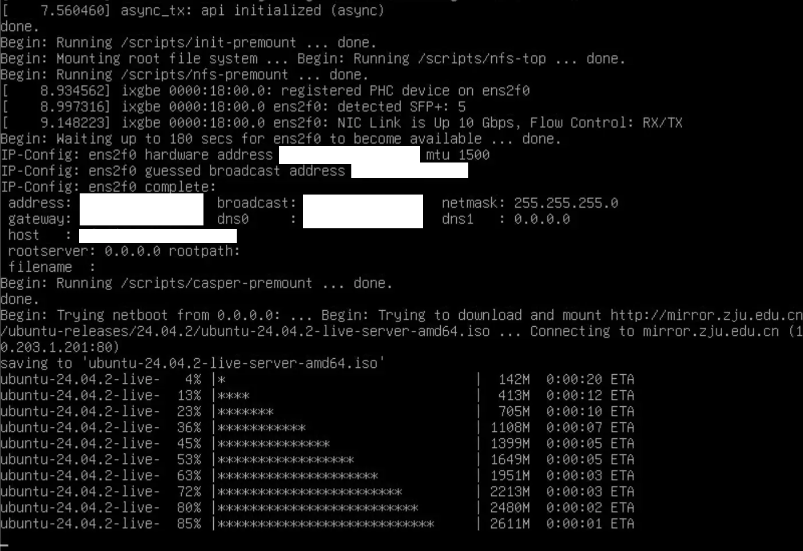

ZJU 第三代镜像站基础设施详见 [ZJU Mirror 镜像站](../../../falcon/mirror.md)。

在测试阶段，我们需要频繁地为多台服务器重装系统。本文将介绍一种基于 Ansible 的自动化服务器部署方案，涵盖带外管理（Redfish）、网络引导（PXE）以及发行版安装程序（支持 Debian 和 Ubuntu）的完整流程。

<!-- more -->

## 综述

要在一台服务器上远程安装操作系统，通常需要以下几个步骤：

- **带外管理**：使用服务器的管理接口（如 IPMI、Redfish 等）远程访问服务器，挂载安装介质，控制电源等。
- **引导程序**：用于引导至发行版安装程序，如 GRUB、iPXE 等。
- **发行版安装程序**：负责安装操作系统的程序，如 Debian Installer、Ubuntu Installer 等。

需要部署多台节点时，人工逐台操作是难以接受的。事实上，上述几个步骤都能够进行自动化配置。借助 Ansible 等工具，可以实现服务器的批量自动化部署。流程如下所示，源码见 [TODO]。

1. **配置文件生成**：`.j2` 后缀表示 Jinja2 模板文件，将由 Ansible 渲染生成最终的配置文件。

    - `ipxe.j2`：iPXE 引导脚本，负责引导进入 Debian 安装程序的过程：
        - 配置网络：检测可用的网络接口并配置 IP 地址。
        - 拉取启动文件：从 HTTP 服务器下载内核和 initrd 文件。
        - 启动安装：使用下载的内核和 initrd 文件启动安装过程。
    - `user-data.j2`：Ubuntu autoinstall 配置文件模版。负责：
        - 定义安装过程中的各种参数，如语言、时区、分区方案等。
        - 设置网络配置，包括主机名、IP 地址和 LACP 聚合。
        - 定义软件包选择和安装选项。
        - 设置用户、密码、SSH 密钥等信息。

2. **iPXE 引导镜像生成**：

    使用 Docker 编译 `bin-x86_64-efi/ipxe.iso` 引导镜像，嵌入自定义引导脚本。

3. **自动部署**：

    - 本地启动适当协议的服务器（HTTP、NFS、CIFS 等），供带外管理和引导程序获取文件。
    - 使用 hREST API 控制带外管理挂载引导镜像，并设置单次启动到引导程序。
    - iPXE 自动下载内核和 initrd 文件，启动 Ubuntu 安装程序。
    - Ubuntu 安装程序根据内核启动参数，自动下载 ISO 安装介质和 autoinstall 配置文件，完成安装。

## 带外管理

有关带外管理的基础知识，请参考 [硬件运维/带外管理](../../../operation/hardware/oobm.md)。

### API

新镜像站采用 H3C 服务器，其带外管理系统为 HDM。HDM 2.1 及以上版本支持 Redfish API，而更早版本仅支持 H3C 自定义的 hREST API。

- **H3C R4900**：升级 HDM 至最新版本（3.54）后支持 Redfish API。
- **H3C X10536**：最新 HDM 版本为 1.11，仅支持 hREST API。

尽管最新 HDM 提供了 Redfish API，但部分关键功能（如远程镜像挂载）仍使用厂商自定义接口。因此，我们最终统一采用 hREST API。

!!! info "H3C Redfish 自定义接口"

    Ansible 的 Redfish 模块仅支持标准接口：

    ```text
    /redfish/v1/Managers/1/VirtualMedia/{Slot}/Actions/VirtualMedia.InsertMedia
    ```

    而 H3C 的 OEM 自定义接口为：

    ```text
    /redfish/v1/Managers/1/VirtualMedia/CD/Oem/Public/Actions/VirtualMedia.VmmControl
    ```

    请求示例：

    ```json
    {
        "VmmControlType": "Connect",
        "Image": "nfs://.iso"
    }
    ```

[H3C 官网发布的 hREST 软件](https://www.h3c.com/en/d_202312/1978790_294551_0.htm)以 Python 源码形式提供，但仅支持到 CentOS 7，无法直接在 macOS 或 Debain12 等系统上运行。不过，由于源码开放，可以通过适配迁移到最新的 Python 版本。

从代码注释来看，hREST 软件本质上是通过逆向 HDM 网页请求实现的（吐槽：HDM 和 hREST 的开发团队为何不共享 API 文档？）。在使用过程中，如遇问题，可直接对比 HDM 网页行为并修复代码。

最终，我们提取并简化了 hREST API 的 Python 实现，能够在 Linux 和 macOS 上正常运行。代码详见 [TODO]。

### 镜像挂载

HDM 支持通过 NFS 和 CIFS 挂载镜像。然而，由于校网出于安全原因（如防范永恒之蓝漏洞）全局屏蔽了 CIFS 相关端口，因此只能使用 NFS。

NFS 的主要限制是需要内核级服务端支持，无法像 [dperson/samba](https://hub.docker.com/r/dperson/samba) 那样通过 Docker 简洁运行。不过，我们的 Ansible Playbook 已实现了自动化操作，包括修改 NFS 服务端配置、重启服务以及完成后清理等。

需要注意的是，带外管理的传输速度较慢，通常不超过 10MB/s。挂载较大的安装介质（如 Ubuntu ISO）时，耗时较长。因此，我们选择挂载一个小型引导程序作为跳板，由引导程序将安装介质下载到内存中并启动安装程序，从而显著提升速度。

## 引导程序：iPXE

iPXE 是一种轻量级网络引导程序，镜像通常只有几兆大小，无论通过 KVM 挂载还是远程镜像挂载，速度都非常快。它支持多种网络协议（如 HTTP、FTP、TFTP 等）下载内核和 initrd 文件，并启动安装程序，同时支持通过嵌入脚本实现自动化配置。

[netboot.xyz](https://netboot.xyz/) 是基于 iPXE 的工具，内置了多种操作系统的安装程序。如果服务器环境能够访问公网（安装程序存放于 netboot.xyz），推荐使用 netboot.xyz 进行安装或自定义，甚至可以搭建自己的 PXE 服务器（参考 [Self Hosting | netboot.xyz](https://netboot.xyz/docs/selfhosting)）。

### 嵌入脚本（Embedded Script）

以下 iPXE 脚本示例展示了如何自动检测可用网口并配置 IP 地址。iPXE 默认支持 LACP，因此多网口服务器也能正常工作。

```shell
iflinkwait -t 1000 && echo Detected link on ${ifname} || goto shell
# DHCP 无需下列配置
set ${ifname}/ip {{ hostvar.ansible_host }}
set ${ifname}/netmask *.*.*.*
set ${ifname}/gateway *.*.*.*
set dns *.*.*.*
```

对于 Debian，镜像源自带 netboot 支持，可通过以下命令引导进入安装程序：

```shell
initrd debian/dists/stable/main/installer-amd64/current/images/netboot/debian-installer/amd64/initrd.gz
kernel debian/dists/stable/main/installer-amd64/current/images/netboot/debian-installer/amd64/linux
boot
```

Ubuntu 镜像源也支持类似操作，但仅挂载 kernel 和 initrd 文件不够，安装程序会强制要求挂载安装介质，否则无法启动安装过程。通过传递内核参数 `url=`，可以让安装程序自动下载所需文件：

```shell
set base_url http://{{ mirror_site }}/ubuntu-releases/{{ release }}
set kernel_url ${base_url}/netboot/amd64/linux
set initrd_url ${base_url}/netboot/amd64/initrd
set iso_url ${base_url}/ubuntu-{{ release }}-live-server-amd64.iso

initrd ${initrd_url}
kernel ${kernel_url} initrd=initrd autoinstall url=${iso_url}
boot
```

iPXE 引导进入安装程序后，安装程序需要自己重新配置网络，然后才能下载 ISO 镜像。对于静态地址的情况，可以在 iPXE 中传递[内核参数 `ip`](https://www.kernel.org/doc/Documentation/filesystems/nfs/nfsroot.txt)以配置网络：

```text
kernel ... ip=<client-ip>:<server-ip>:<gw-ip>:<netmask>:<hostname>:<device>:<autoconf>:<dns0-ip>:<dns1-ip>:<ntp0-ip>
```

<figure markdown>

<figcaption>完成网络配置后下载镜像的 Ubuntu Installer</figcaption>
</figure>

!!! info "关于 `sanboot`"

    虽然有使用 `sanboot` 挂载 ISO 镜像的例子，但实测发现 Debian 和 Ubuntu 均无法正常工作。引导后会提示找不到安装介质（incorrect installation media detected）。[相关讨论](https://github.com/ipxe/ipxe/discussions/644)指出该命令适用于 iSCSI，而一般不适用于 HTTP。

    ```text
    sanboot --no-describe --drive 0x81 http://.iso
    ```

### 编译 iPXE

生成 iPXE 镜像需要从源码编译。为了支持在 x86-64 和 ARM64 架构、Linux 和 macOS 系统上运行，并避免污染本地环境，可以使用 Docker 容器完成编译任务。在 ARM64 上运行时，将使用交叉工具链编译 iPXE。

```dockerfile
RUN apt-get update && apt-get install -y --no-install-recommends \
    git build-essential isolinux mtools genisoimage ca-certificates \
    liblzma-dev gcc-x86-64-linux-gnu

RUN git clone --depth=1 --branch=master https://github.com/ipxe/ipxe.git /ipxe
# 防止 iPXE 使用 git 确定版本号
RUN rm -rf /ipxe/.git
WORKDIR /ipxe/src
RUN make -j$(nproc) bin-x86_64-efi/ipxe.efi CROSS=x86_64-linux-gnu- EMBED={{ your_script }}
```

!!! info "macOS 原生编译的限制"

    虽然 macOS 可以通过 Homebrew 安装 `x86_64-elf-gcc` 进行交叉编译，但以下任务无法在 macOS 上以原生方式完成：

    - 编译 iPXE 镜像：macOS 缺少 isolinux 和 syslinux 的相关工具。
    - 打包 initrd：macOS 的 cpio 命令不支持 `-A` 选项。

    这些问题可以通过手动下载 isolinux 或编译 cpio 解决，但操作较为繁琐，相比之下使用 Docker 容器更加高效。

## 发行版自动安装

不同发行版的安装程序各有特点，自动化配置方式也有所不同。相比 Debian 的 preseed，Ubuntu 的 autoinstall 具有以下优势：

- 使用清晰的 YAML 格式配置文件，取代了 Debian 的命令风格 preseed 文件，支持更复杂的配置（如 ZFS 根目录和 netplan 风格的网络配置，支持 LACP 聚合）。
- 流程更加自动化，未指定的配置项会使用默认值；而 Debian 的 preseed 未指定则会停止，且配置项繁多，可能涉及软件包的选项。
- iPXE 可通过内核参数直接引导并获取配置文件；而 Debian 的 `preseed/url` 参数在测试中未成功。

### Ubuntu [autoinstall](https://canonical-subiquity.readthedocs-hosted.com/en/latest/intro-to-autoinstall.html)

!!! quote

    - [Autoinstall configuration reference manual - Ubuntu installation documentation](https://canonical-subiquity.readthedocs-hosted.com/en/latest/reference/autoinstall-reference.html#ai)
    - [iPXE script for deploying Ubuntu 20.04 autoinstall nocloud-net method](https://gist.github.com/tlhakhan/03dbb4867f70d17d205c179a58fd5923)

Ubuntu 使用以下内核参数获取配置文件。安装程序会将 `meta-data` 和 `user-data` 路径附加到参数 `s` 后，因此路径末尾的 `/` 必须保留。

```text
ds=nocloud-net;s={{ seed_server }}/{{ item }}/
```

Autoinstall 配置文件的官方文档非常详细，按需配置即可。APT 部分容易配置失败，以下是经过测试的 APT 配置示例：

```yaml
apt:
  fallback: offline-install
  geoip: false
  primary:
  - arches: [amd64, i386, default]
    uri: http://{{ mirror_site }}/ubuntu/
  preserve_sources_list: false
  security:
  - arches: [amd64, i386, default]
    uri: http://{{ mirror_site }}/ubuntu/
```

### Debian [preseed](https://wiki.debian.org/DebianInstaller/Preseed)

根据官方文档，`preseed/url=` 内核参数可用于传递配置文件，但测试未成功，因此将配置文件嵌入 initrd 中。debian-installer 会自动检测 initrd 根目录下的 `preseed.cfg` 文件，并启动自动安装。

部署方式：

- 使用 ISO：通过带外管理挂载 ISO 文件并启动。
- 使用 initrd：通过 iPXE 引导，下载 initrd 文件并启动。

不足之处：文件体积较大，可能需要为每台服务器单独打包。

以下是打包 ISO 或 initrd 的流程：

1. 解压 ISO 文件（推荐使用 `netinst` 版本）。

    ```shell
    xorriso -osirrox on -indev $ISO_NAME -extract / /iso
    ```

2. （打包 ISO 时）修改 Bootloader 设置，使其自动启动安装程序。

    ```shell
    # BIOS
    sed -i 's/timeout 1/timeout 0/' /iso/isolinux/prompt.cfg
    # UEFI
    echo 'set timeout=0' >> /iso/boot/grub/grub.cfg
    echo 'set default=1' >> /iso/boot/grub/grub.cfg
    ```

3. 将 `preseed.cfg` 文件嵌入 initrd。该 initrd 可直接作为 iPXE 的 `initrd` 参数。

    ```shell
    gunzip "$ISO_DIR/install.amd/initrd.gz"
    cp "$PRESEED_FILE" "$ISO_DIR/install.amd/preseed.cfg"
    cd "$ISO_DIR/install.amd" && echo "preseed.cfg" | cpio -H newc -o -A -F "$ISO_DIR/install.amd/initrd"
    rm "$ISO_DIR/install.amd/preseed.cfg"
    gzip "$ISO_DIR/install.amd/initrd"
    ```

4. （打包 ISO 时）重新生成 ISO 文件。

    ```shell
    chmod +w "$ISO_DIR/md5sum.txt"
    cd "$ISO_DIR" && find . -follow -type f ! -name md5sum.txt -print0 | xargs -0 md5sum >md5sum.txt
    chmod -w "$ISO_DIR/md5sum.txt"

    xorriso -as mkisofs \
        -r \
        -o "$OUTPUT_ISO" \
        -J -joliet-long -cache-inodes \
        -isohybrid-mbr /usr/lib/ISOLINUX/isohdpfx.bin \
        -b isolinux/isolinux.bin \
        -c isolinux/boot.cat \
        -boot-load-size 4 -boot-info-table -no-emul-boot \
        -eltorito-alt-boot \
        -e boot/grub/efi.img \
        -no-emul-boot -isohybrid-gpt-basdat -isohybrid-apm-hfsplus \
        -quiet \
        "$ISO_DIR"
    ```

## 交换机与服务器链路聚合

参考 [H3C交换机与服务器对接操作指导-6W100-新华三集团-H3C](https://www.h3c.com/cn/Service/Document_Software/Document_Center/Home/Server/00-Public/Configure/Interoperability_Guides/H3C-9037/)。对于交换机，需要注意如下配置：

- 配置二层聚合接口为动态模式（LACP）。
- 配置聚合端口为边缘端口，跳过 30s 的 STP 等待时间。

如果不按照上述配置，会产生如下问题：

- 静态聚合模式下，iPXE 和安装程序可能无法联网。
- 未配置边缘端口时，接口需等待 30s 才会进入 Link Up 状态，导致 `bonding` 内核模块链路状态检测失败。

## 其他问题

1. **R4900 网络接口异常**

    在系统安装过程中，只有通过 `ens2f1np1` 端口才能正常联网；而安装完成后，必须切换到 `ens2f0np0` 端口才能正常工作，即使两个网口均已连接。初步怀疑是 Broadcom 驱动 `bnxt_en` 的问题，需进一步排查。此问题未在 X10000 上复现。

    iPXE 启动时，initrd 偶尔会下载到一半卡住，因此脚本中添加了失败重试的逻辑。X10000 未出现该问题，但 R4900 上经常出现。

2. **链路聚合问题**

    使用 `bonding` 内核模块时，调用 `bond_3ad_get_active_agg_info` 失败，导致接口无法 UP。以下环境均出现该问题：

    - 网卡驱动：`ixgbe` 和 `bnxt_en`
    - 内核版本：`6.1`（stable）和 `6.12.22`（unstable）

    此问题在 Debian 系统中复现，但在 Ubuntu 系统中未出现。

3. **H3C 交换机链路聚合模式测试**

    H3C 交换机支持静态和动态两种二层链路聚合模式。以下未设置 STP 边缘端口时的测试结果：

    | 服务器 | 聚合模式       | 测试结果                           |
    |--------|----------------|------------------------------------|
    | X10000 | 四口静态聚合   | iPXE 所有网口无法联网              |
    | X10000 | 四口动态聚合   | iPXE 任一网口可正常联网            |
    | X10000 | 无聚合         | iPXE 所有网口无法联网              |
    | R4900  | 无聚合         | iPXE 任一网口可正常联网            |
    | R4900  | 双口动态聚合   | iPXE 其中一个网口可正常联网        |
