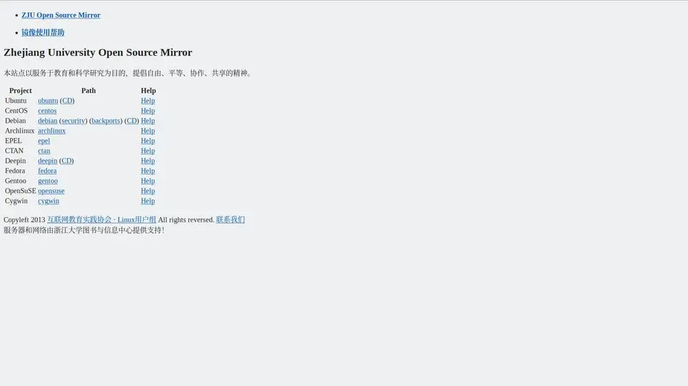
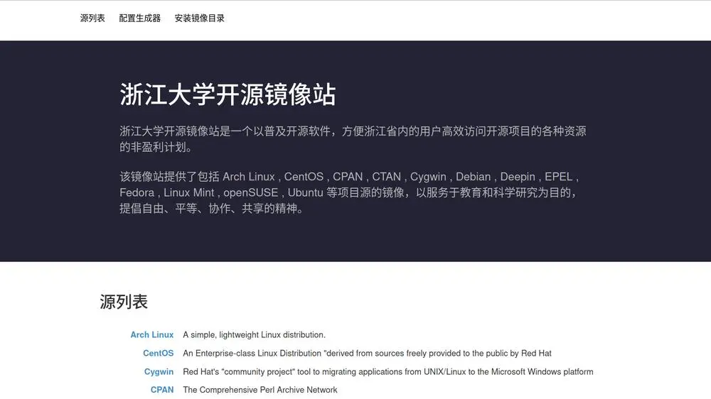
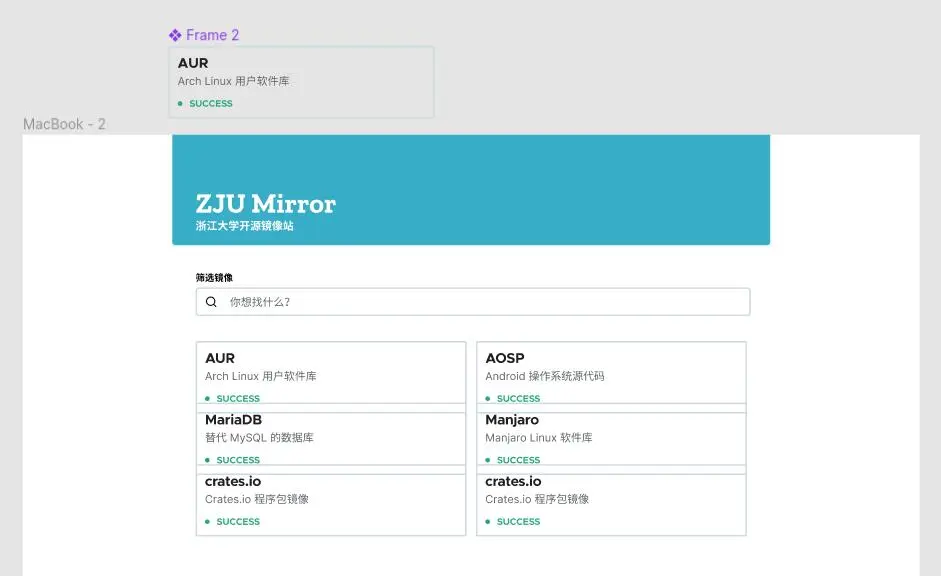
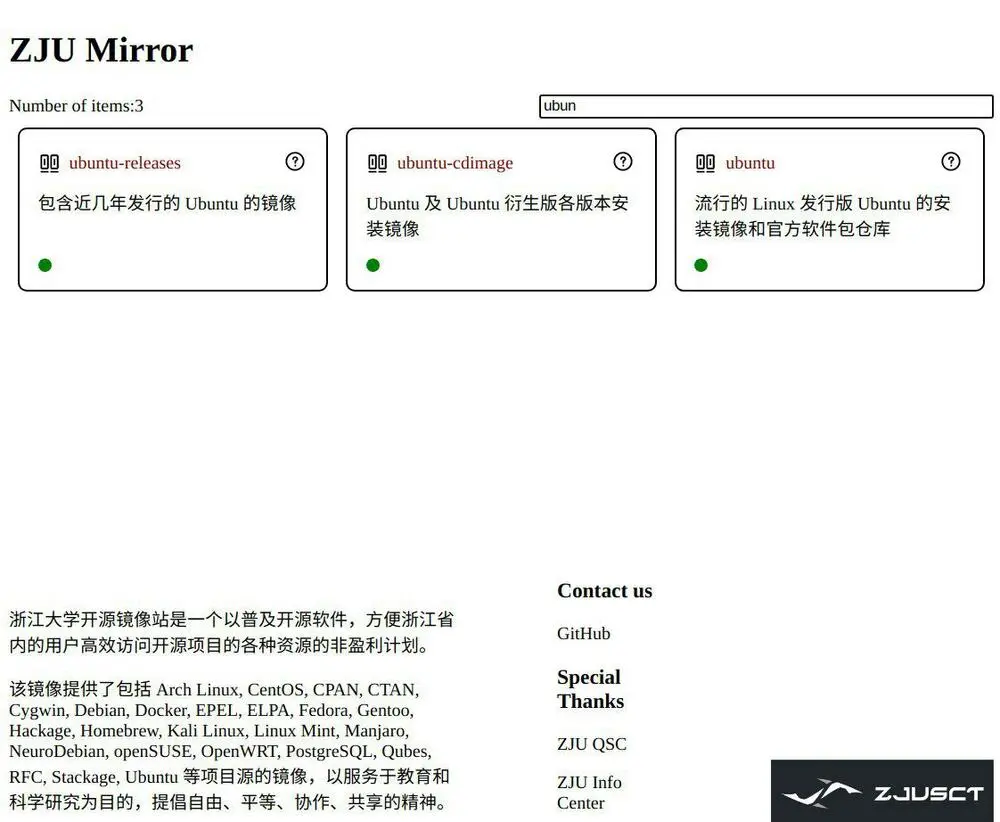
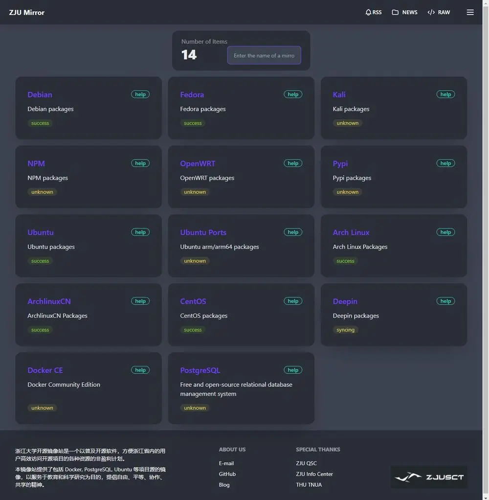
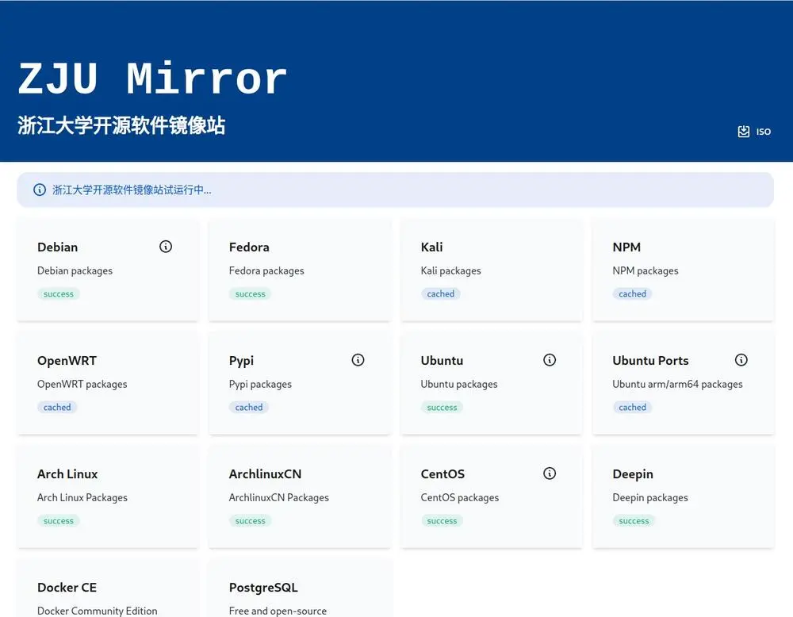
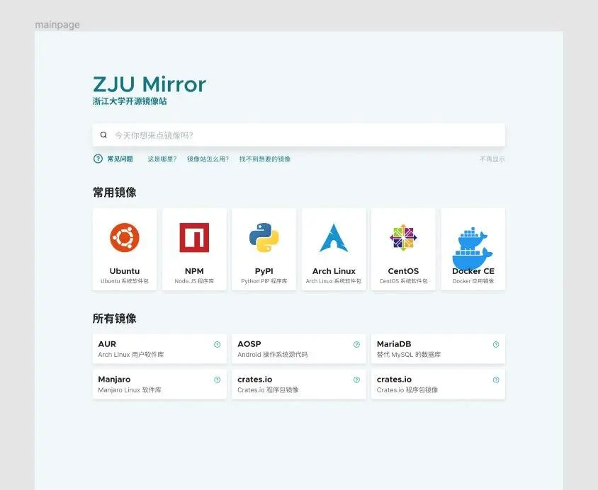
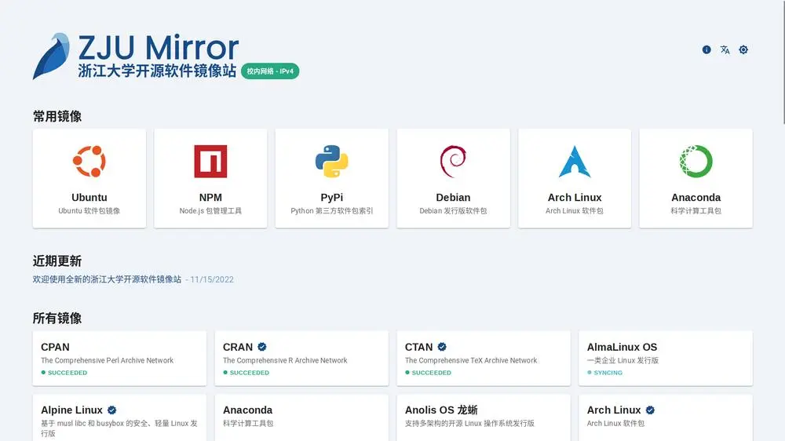

---
tags:
  - 不完善
---

# ZJU Mirror 历史

!!! abstract

    本文档是 ZJU Mirror 的历史记录，包含了 ZJU Mirror 的发展历程、版本更新和重要事件。

## 发展历程

!!! quote

    - [十年，浙大镜像站的变化，也聊聊我开发的过程 - CC98 论坛](https://www.cc98.org/topic/5586111)

### 2013-2020：ZJULUG 发起

老镜像站是由 ZJULUG 维护的，其成员全部毕业后，老镜像站无人维护。

### 2021-2024：ZJUSCT Falcon 接手

ZJUSCT Falcon 团队对镜像站的前、后端都进行了重写，新的架构包含了一个管控服务，使得我们感知、调度任务的能力更强了。

2022 年 1 月左右，镜像站迁移上云，使用学校信息中心提供的 vSphere 虚拟化平台。

#### @RanunculZ

21 年的时候，超算队正式接手了镜像站的开发，我接了前端的活。当时，卡片设计还是一个比较新的 UI 设计理念，我们也希望镜像站能看起来更年轻，更现代一些。这是镜像站最早期的 Figma 原型，尽管非常简单，但已经有了现在大家看到的镜像站网页的雏形：

按照当时的 Figma 原型，网页仅仅是把后端传过来的数组以卡片的形式铺开而已。9 月份开学的时候，我糊了一两天，大概糊出来了个样子：

2021 年 12 月 31 日，突然心血来潮，想着要不然把镜像站新网页先上线了，当做给大家的新年礼物：

新网页其实只是做到了“可使用”，开发过程非常敏捷，UI 还可以继续打磨。于是，我们邀请了校外比较懂设计的朋友，帮助镜像站出谋划策。这是经过改良后的 Figma 原型（啊这，怎么有两个 docker 鲸鱼）：

基于新的原型，在不断打磨后，镜像站终于变成了它今天的样子：

这期间，也进行了 logo 的设计。超算队不止有镜像站一个产品，还有 git 托管平台，未来还可能有其他产品，所以希望各个产品之间能看起来统一一些。总体的思路，还是希望镜像站能看起来比较年轻、现代。比如镜像站标题的英文字体，我看国内外头部互联网企业最近的 logo 都比较偏简约、几何风格，于是就专门挑了符合这一风格的开源字体。经过探讨以及朋友们的帮助，小 logo 最后的样子：

{ width="200px" }

### 2025-至今：LUG 复活和迁移下云

2025 年，借 AIRA 协会成立，我们复活了 LUG，开始招纳非超算队成员参与镜像站运维工作。同时，在信息技术中心的支持下，我们将镜像站从云平台迁移到物理机上。新的硬件设施将为镜像站提供更高的性能和稳定性。

## 历届镜像站维护者

| 届别（按本科计算） | 维护者 |
| :---: | :---: |
| 17 级 | 俞炯弛 |
| 18 级 | 张梁育、吴郁非、曾充 |
| 19 级 | 赵紫宸、陈易、杨子晗 |
| 22 级 | 朱宝林、李晨潇 |
| 23 级 | 郝星星 |
| 24 级 | |
