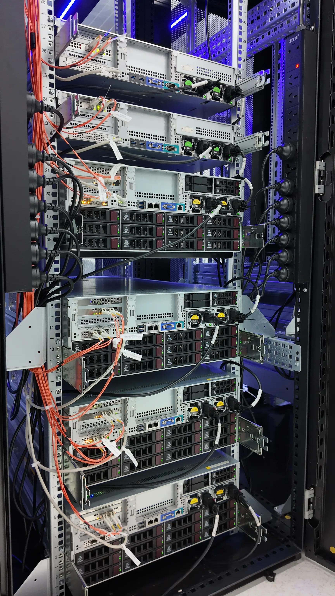
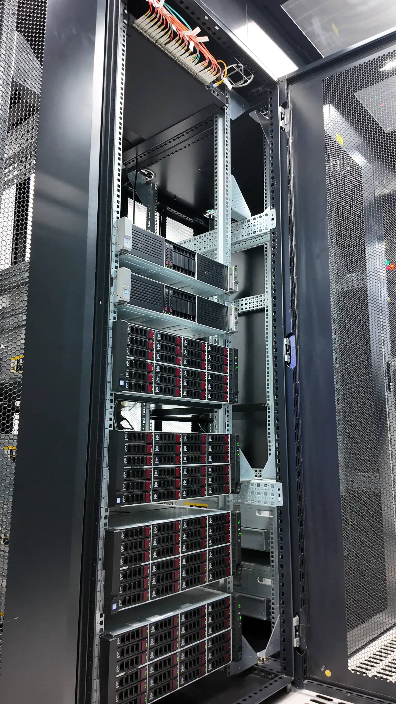

---
tags:
  - 不完善
---

# ZJU Mirror 镜像站

!!! abstract

    本文档是 ZJU Mirror 最新的信息记录和运维手册。关于 Mirror 的历史和已废弃的运维信息，见 [ZJU Mirror 历史](mirror-history.md)。

## 简介

浙江大学开源软件镜像站 (<https://mirrors.zju.edu.cn>) 是由 [浙江大学信息中心](https://zuits.zju.edu.cn/) 支持、[浙江大学超算队](https://www.zjusct.io/) 运营的，致力于普及开源软件、方便校内外用户高效访问开源项目的各种资源的非营利计划。本镜像站提供了包括 Docker、PostgreSQL、Ubuntu 等项目的镜像，以服务教育和科学研究为目的，提倡自由、平等、协作、共享的精神。

### 丰富的镜像

浙大镜像站拥有 50+ 个镜像，包括 Anaconda、Ubuntu、Pypi、ArchLinux、Debian、Homebrew 等常用镜像，满足了校内师生日常使用的需求。我们也为大部分镜像提供了帮助文档，帮助用户快速完成配置。

### 标准化

#### 镜像获得官方认证

我们积极与上游联系，申请成为官方镜像。目前，已有 17 个镜像被认证为官方镜像，其中包括 Ubuntu、CentOS、ArchLinux、CTAN、ROS 等。成为官方镜像，证明我们服务的稳定性、实时性、正确性获得了官方的认可。

#### 接入[校园网联合镜像站](https://mirrors.cernet.edu.cn/)

校园网联合镜像站是由中国教育和科研计算机网网络中心支持的项目，它提供对校园网镜像站的索引和跳转服务。我们对接了标准化的接口，向外界暴露我们实时的资源使用情况和镜像同步状态信息。

### 透明

如果用户对镜像同步的实时性有质疑，可以访问镜像站网页，查看同步状态信息。如果用户希望知道更多的细节，可以访问 [浙大镜像站在校园网联合镜像站上的页面](https://mirrors.cernet.edu.cn/site/ZJU)，那里有更详细的同步状态信息。

### FAQ

!!! question "浙大镜像站相比于 [清华 TUNA 镜像站](https://mirrors.tuna.tsinghua.com/) 有什么优势？"

    - 浙大内网环境

    我们的服务器位于校园内网。根据我们的了解，不少实验室的网络存在公网访问速度慢、甚至无法访问公网的问题。使用我们浙大自己的镜像服务，即使没有公网访问的权限，依然可以正常使用镜像。

    - 高优支持校内师生

    我们会始终把支持校内用户放在最高优先级。即使是一些小众的镜像，只要浙大校内存在对这一镜像的稳定需求，我们一定会跟进、支持。就在最近，一位校内同学提出了添加 ius 镜像的请求。这一镜像的用户量非常小，使用场景也局限在旧的发行版中。但了解到这位同学的实验室只能访问校园内网，而且在做科研的过程中确实对这一镜像有需求，我们就满足了这一请求。此外，镜像服务在校内的可用性也是我们最高优保障的。使用其他学校的镜像站，可能就不会享受这方面的优势。

## 基础知识

!!! quote "其他镜像站"

    这里提供其他镜像站的文档指引。即使具体架构不同，镜像站运维仍有很多经验可以相互参考，我们提倡开源共享的精神。

    - [金枪鱼之夜：2023 年秋季学期迎新会 & TUNA 镜像站服务架构演进 | 清华大学 TUNA 协会](https://tuna.moe/event/2023/welcome-and-mirrors-infra/)
    - [开源镜像站 - LUG @ USTC](https://docs.ustclug.org/services/mirrors/)
    - [Home · sjtug/mirror-docker-unified Wiki](https://github.com/sjtug/mirror-docker-unified/wiki)

文档的接下来的内容面向镜像站爱好者和运维人员，本节总体介绍镜像站的构成和运维方式。

### 构成

- **基础设施**：镜像站的硬件设施和网络环境，决定了镜像站上层采用的技术栈和运维方式。学校间的差异很大，从单机部署到云平台都有。
- **后端**：负责镜像站的核心任务——同步和存储，它主要是一个同步任务调度器。规模较大的镜像站几乎都会定制自己的后端，下面是国内镜像站后端简表：

    | 语言 | 后端实现 |
    | --- | --- |
    | Go | [tuna/tunasync](https://github.com/tuna/tunasync)、[sjutg/lug](https://github.com/sjtug/lug)、[ustclug/Yuki](https://github.com/ustclug/Yuki) |
    | Python | [PKUOSC](https://github.com/PKUOSC/SyncController) |
    | C# | [ZJUSCT/MirrorManager](https://github.com/ZJUSCT/MirrorManager) |

- **前端**：负责镜像站的访问和用户交互。它主要是 Web 服务，提供了镜像列表、同步状态、帮助文档等功能。

### 服务方式

绝大部分软件源使用 HTTP 提供服务，例如 Ubuntu、Debian、ArchLinux、CTAN、ROS 等。

下表是一些例外：

| 服务方式 | 举例 |
| --- | --- |
| Git | Homebrew、Linux 和 glibc 源码等 |
| FTP | 远古时期的服务方式，APT、AUR 等都曾经使用过 |
| S3 | 暂无 |

一些 HTTP 镜像并不是全量镜像，而是通过 HTTP 代理缓存提供服务，例如 PyPI、Anaconda 等。

### 同步方式

- 绝大部分软件源使用 rsync 同步。
- Git 源使用 `git remote update` 同步。

TUNA 收录了国内最多的软件源，可以在 [TUNA 状态页](https://mirrors.tuna.tsinghua.edu.cn/status/) 看到最为全面的镜像同步方式。

### 观测

部分软件源为镜像网络提供了一致的观测方式，能够帮助用户和管理员了解镜像的同步状态。以 Debian 为例，所有镜像站都具有 `debian/project/trace` 文件，在 [Debian Mirror Monitoring](https://mirror-master.debian.org/status/mirror-status.html) 中汇总了所有镜像站的状态。

[MirrorZ](https://mirrors.cernet.edu.cn/) 是中国教育和科研计算机网网络中心支持的国内校园网镜像站索引和跳转服务。各大镜像站通过 MirrorZ 定义的[标准化数据格式](https://github.com/mirrorz-org/mirrorz)，向外界暴露实时的资源使用情况和镜像同步状态信息。

## 基础设施

!!! quote

    - [Support - 02-PCIe network adapter specifications- H3C](https://www.h3c.com/en/Support/Resource_Center/EN/Severs/Catalog/Optional_Parts/Network_Adapter/Technical_Documents/Product_Literature/Card_Datasheets/Network_Adapter_Datasheet/202206/1616867_294551_0.htm)：新华三网卡数据表。
    - [Support - 08-Configuring an H460, P460, P240 or P4408 storage controller- H3C](https://www.h3c.com/en/Support/Resource_Center/EN/Home/Severs/00-Public/Software_Configure/User_Manual/H3C_Servers_Storage_Controller_UG/202207/1655190_294551_0.htm)：RAID 卡配置手册。

浙江大学镜像站所有的硬件资源都是由浙大信息中心赞助的。镜像站属于信息中心 [研在浙大·科研软件平台](https://soft.zju.edu.cn/) 的一个子项目。

2025 年 4 月 17 日，我们从信息技术中心收到了新一代镜像站的硬件设施。新一代镜像站由 3 台存储服务器、2 台业务服务器构成，通过万兆交换机互联。


<div class="grid cards" markdown>



</div>

### 存储服务器 [H3C X10536 G3](https://www.h3c.com/cn/Service/Document_Software/Document_Center/Storage/Catalog/Massive_Scale_Out/H3C_UniStor_X10000_G3/)

| 参数 | 值 |
| --- | --- |
| CPU | 2 x Intel Xeon Silver 4110 |
| 内存 | 8 x 32GB DDR4 2666MHz RDIMM |

- 存储规格：每台配备 2 张 H3C P460 RAID 卡，具有 4GB 缓存和掉电保护。

    其上连接的存储设备有：

    | 数量 | 容量 | 类型 | 具体型号 |
    | --- | --- | --- | --- |
    | 2 | 600G | 12 Gbps SAS HDD 系统盘 | SEAGATE ST600MM0009 |
    | 6 | 480GB | 12 Gbps SATA SSD 数据盘 | Micron 5200 MTFD |
    | 30 | 8TB | 12 Gbps SATA HDD 数据盘 | SEAGATE ST8000NM0055-1RM |

    系统盘已配置为 RAID1。

- 网络规格：每台配备 2 张双口 10G 以太网卡和 1 张双 1G 以太网卡。

    | 插槽 | 网卡型号 | 规格 | 控制器 |
    | --- | --- | --- | --- |
    | 板载 | NIC-GE-2P-360T-B2-1-X | 2 x 1GE RJ45 | Intel NHI350AM |
    | PCIe | CNA-10GE-2P-560F-B2-1 | 2 x 10GE SFP | Intel JL82599 |
    | FLOM | NIC-10GE-2P-560F-LOM | 2 x 10GE SFP | Intel JL82599 |

### 业务服务器 [H3C R4900 G3](https://www.h3c.com/cn/Service/Document_Software/Document_Center/Server/Catalog/Rack_server/H3C_UniServer_R4900_G3/)

| 参数 | 值 |
| --- | --- |
| CPU | 2 x Intel Xeon Gold 6130 |
| 内存 | 6 x 16GB DDR4 2666MHz RDIMM |

- 存储规格：每台配备 1 张 H3C P460 RAID 卡，具有 4GB 缓存 和掉电保护。

    其上连接的存储设备有：

    | 数量 | 容量 | 类型 | 具体型号 |
    | --- | --- | --- | --- |
    | 2 | 600G | 12 Gbps SAS HDD 系统盘 | SEAGATE ST600MM0009 |

    系统盘已配置为 RAID1。

- 网络规格：每台配备 1 张双口 10G 以太网卡。

    | 插槽 | 网卡型号 | 规格 | 控制器 |
    | --- | --- | --- | --- |
    | PCIe | NIC-BCM957302-F-B-10Gb-2P | 2 x 10GE SFP | Broadcom BCM57302 |

### 交换机 [H3C S6520X-24ST-SI](https://www.h3c.com/cn/Products_And_Solution/InterConnect/Products/Switches/Products/Park_Switches/Aggregation_Switch/S6500/S6520X-SI/)

| 参数 | 值 |
| --- | --- |
| 前面板业务端口描述 | 24 个 1/2.5/10GE SFP Plus 端口（2 个 Combo 1G/2.5G/5G/10G Base-T 自适应以太网端口） |
| 交换容量 | 2.56Tbps/25.6Tbps |
| 包转发率 | 360Mpps |
| 链路聚合 | 支持 10GE 端口聚合 |

## 后端

## 前端

## 软件源和同步工具

本节总结软件源的格式和布局、使用的同步工具、同步中的问题等内容，供镜像维护者参考。

### rsync

`rsync` 是镜像同步的核心工具。作为镜像站的维护者，了解 `rsync` 的**工作原理、性能瓶颈和常用选项**是非常重要的。建议阅读下面两篇文章：

- [How Rsync Works](https://rsync.samba.org/how-rsync-works.html)：Rsync 官方的介绍。
- [rsync, article 3: How does rsync work? (2022) - Michael Stapelberg](https://michael.stapelberg.ch/posts/2022-07-02-rsync-how-does-it-work/)：介绍了 Rsync Protocol v27 的工作原理，特别是探究了同步过程中源/目的数据发生变化的情况。

下面是从这些文章中总结出的要点：

- **两个角色**：Receiver 和 Sender。至于 Client 和 Server，只要 Rsync 双方连接建立，就不再区分。

    以 Rsync Pull 为例：

    ```shell
    rsync rsync://HOST/SRC... [DEST]
    ```

    远程主机是 Sender，本机是 Receiver。

    一旦建立连接，**Sender 遍历自己的文件系统，将文件列表发送给 Receiver**。

    **Receiver 接收完文件列表后，fork 出 Generator**，开始下面的流水线。

- **流水线**：Generator -> Sender -> Receiver

    - **Generator**：对比文件列表和本地文件树，执行删除、跳过、创建文件夹等操作。

        遇到不能跳过（需要同步）的文件时，将文件分块，生成校验和，和文件索引一起发送给 Sender。

        该本地文件将作为 Base file，Sender 接下来使用 Rsync 算法找到与之的差异。

    - **Sender**：滚动校验和（Rolling Checksum）

        Sender 采用类似**滑动窗口**的策略，逐字节扫描本地文件生成块校验和。如果某一块校验和匹配，说明该块不用同步，跳过该块并从该块的下一个字节开始继续扫描。

        最终 Sender 将告诉 Receiver 从 Basefile 拷贝哪些文件块、如何重建文件、重建后文件的校验和。

    - **Receiver**：

        创建临时文件，从 Basefile 拷贝文件块，并从 Sender 接收文件块，重组文件。重组后对比校验和。

        成功同步后，设置文件权限，重命名以替换原文件。

- **资源消耗**：

    - Sender 消耗 CPU 资源
    - Receiver 消耗 IO 资源

- **数据变化**：**文件列表**传输完成后，**文件**开始传输前
    - 新增文件：忽略。
    - 删除文件：退出，返回值 `24 Partial transfer due to vanished source files`。
    - 文件内容变化：不影响，**但会造成全局视角下的不一致，即此次 Rsync 后，部分文件为新版，部分文件为旧版**。

    同步过程中应当避免文件变化。

### APT

!!! quote

    - [DebianRepositoryFormat - Debian Wiki](https://wiki.debian.org/DebianRepository/Format)：Debian 软件仓库格式，详细地描述了其中的每种文件。
    - [Setting up a Debian archive mirror - Debian Wiki](https://www.debian.org/mirror/ftpmirror)：如何建立 Debian 镜像站。

`sources.list` 格式：

```text
type uri distribution component1 component2 component3 [..] componentX
```

APT 首先从 `$URI/dists/$DISTRIBUTION` 下载 `InRelease` 或 `Release` 文件。前者文件内签名，后者需要使用 `Release.gpg` 验证。**`Release` 文件列出了该 `$DISTRIBUTION` 的索引文件及其哈希值**：

```text title="Release（部分）"
Suite: unstable
Codename: sid
Date: Thu, 26 Sep 2024 08:17:58 UTC
Valid-Until: Thu, 03 Oct 2024 08:17:58 UTC
Architectures: all amd64 arm64 armel armhf i386 mips64el ppc64el riscv64 s390x
Components: main contrib non-free-firmware non-free
MD5Sum:
 7f8beaf99c34820e69778ea792c2d338  5312136 contrib/Contents-all
 e941316dc5a3e703335083e7b659b387    63339 contrib/Contents-all.diff/Index
```

接下来 APT 在 `$URI/dists/$DISTRIBUTION/$COMPONENT` 下载索引文件，比如 `binary-$ARCH/Packages.xz`、`source/Sources.xz`。**索引文件列出了软件包的路径及其哈希值。**例如，下面的 `Sources` 文件列出了 `0ad` 软件包的路径和哈希值：

```text title="Sources（部分）"
Package: 0ad
Binary: 0ad
Architecture: amd64 arm64 armhf i386 kfreebsd-amd64 kfreebsd-i386
Files:
 4d5f452a06bcdba6907f3350219a63db 2565 0ad_0.0.26-3.dsc
Checksums-Sha256:
 c2d4b91d9d20a27b4989495d3b370635e79e2f7a4ed1f9031abc89e9c1d50952 2565 0ad_0.0.26-3.dsc
Package-List:
 0ad deb games optional arch=amd64,arm64,armhf,i386,kfreebsd-amd64,kfreebsd-i386
Directory: pool/main/0/0ad
```

**软件包都保存在 `$URI/pool/$COMPONENT` 下**，按照首字母分目录存放。一些常见的文件：

- `.deb`：二进制包
- `.dsc`：源码包描述文件，指定哪些文件组成源码包。一般是 `.orig.tar`、`.debian.tar`。例如：

    ```text title="0ad_0.0.23.1-5.dsc（部分）"
    Checksums-Sha1:
    3c6bb8924d65d17200e6b9475101e7d04f5db13a 31922812 0ad_0.0.23.1.orig.tar.xz
    85ac24b7b826f4345dc5dd4015256ce1eb0cab70 73620 0ad_0.0.23.1-5.debian.tar.xz
    Checksums-Sha256:
    01bff7641ee08cac896c54d518d7e4b01752513105558f212e3199d747512a37 31922812 0ad_0.0.23.1.orig.tar.xz
    aff899c0b6a0c2ff746e051504a3e3ac7bb6070c21eb5a5ef5fb55d55391b0e0 73620 0ad_0.0.23.1-5.debian.tar.xz
    Files:
    4fa111410ea55de7a013406ac1013668 31922812 0ad_0.0.23.1.orig.tar.xz
    43a5bf77192a8eebdbe763cdd1d72fa3 73620 0ad_0.0.23.1-5.debian.tar.xz
    ```

??? info "`pool` 的历史"

    曾经，软件包按 DISTRIBUTION 存放在 `dists/` 下，造成了软件包的重复存储，每次发布新 DISTRIBUTION 需要传输大量文件。`pool` 目录的引入解决了这个问题，允许多个 DISTRIBUTION 共享软件包。

#### `ftpsync`

!!! quote

    - [Debian Mirror team / archvsync · GitLab](https://salsa.debian.org/mirror-team/archvsync/)

所有 Debian 镜像站都使用 `ftpsync` 进行同步，它执行两阶段同步：

- 第一阶段
    - 忽略索引文件：`Packages*`, `Sources*`, `Release*`，`InRelease`。
    - 不删除任何文件。
- 第二阶段
    - 同步索引文件。
    - 删除不在 mirror 中的文件。

也就是先同步再索引，防止索引到不存在的文件。

`ftpsync` 支持从多个 archive 同步。Debian 网络中通用的 archive 有：

- standard debian archive: default empty $ARCHIVE (ftpsync.conf)
- debian-ports archive:  ARCHIVE=ports (ftpsync-ports.conf)
- debian-security archive: ARCHIVE=security (ftpsync-security.conf)

有了上面的知识，我们就能理解 `ftpsync` 的命令行选项了：

| Option       | Behaviour |
|--------------|-----------|
| stage1       | Only do stage1 sync |
| stage2       | Only do stage2 sync |
| all          | Do a complete sync (default) |
| mhop         | Do a multi-hop sync |
| archive:foo  | Sync archive foo (if the file $HOME/etc/ftpsync-foo.conf exists and is configured) |
| callback     | Call back when done (needs proper ssh setup for this to work). It will always use the "command" callback:$HOSTNAME where $HOSTNAME is the one defined in config and will happen before slave mirrors are triggered. |

接下来阅读 `ftpsync` 源码。

- 解析命令行参数
- 读取配置文件

    ```shell
    read_config() {
    local name=$(echo "$1" | sed -e 's/[^A-Za-z0-9._-]/_/g')
    local config=$(search_config "$name")
    if [ "$config" ]; then
        . "$config"
        CURRENT_CONFIG="$config"
        return 0
    else
        echo "Can't read config file ${name}!" >&2
        exit 78 # EX_CONFIG
    fi
    }
    ```

    配置文件大概长这样：

    ```shell
    MIRRORNAME=`hostname -f`
    TO="/srv/mirrors/debian/"
    MAILTO="$LOGNAME"
    HUB=false
    ```

    因此可以直接使用 `.` 读取配置文件。

- 设置 `rsync` 选项

    ```shell
    RSYNC=${RSYNC:-rsync}
    RSYNC_PROTOCOL=$(rsync_protocol)
    RSYNC_EXTRA=${RSYNC_EXTRA:-""}
    RSYNC_BW=${RSYNC_BW:-0}
    if [[ $RSYNC_PROTOCOL -ge 31 ]]; then
        RSYNC_OPTIONS=${RSYNC_OPTIONS:-"-prltvHSB8192 --safe-links --chmod=D755,F644 --timeout 120 --stats --no-human-readable --no-inc-recursive"}
    else
        RSYNC_OPTIONS=${RSYNC_OPTIONS:-"-prltvHSB8192 --safe-links --timeout 120 --stats --no-human-readable --no-inc-recursive"}
    fi
    RSYNC_OPTIONS1=${RSYNC_OPTIONS1:-"--include=*.diff/ --include=by-hash/ --exclude=*.diff/Index --exclude=Contents*--exclude=Packages* --exclude=Sources*--exclude=Release* --exclude=InRelease --exclude=i18n/*--exclude=dep11/* --exclude=installer-*/current --exclude=ls-lR*"}
    RSYNC_OPTIONS2=${RSYNC_OPTIONS2:-"--max-delete=40000 --delay-updates --delete --delete-delay --delete-excluded"}
    ```

    `RSYNC_OPTIONS` 包含以下选项（参考 [rsync(1)](https://download.samba.org/pub/rsync/rsync.1)）：

    - `-p`：保留文件权限。
    - `-r`：递归复制目录。
    - `-l`：保留符号链接。
    - `-t`：保留文件修改时间。
    - `-v`：显示详细信息（verbose）。
    - `-H`：保留硬链接。
    - `-S`：高效地复制稀疏文件。

        > turn sequences of nulls into sparse blocks
        >
        > Try to handle sparse files efficiently so they take up less space on the destination.

        了解过文件系统的同学或许会知道稀疏块的概念。

    - `-B8192`：设置块大小为 8192 字节，用于增量传输。

        > This forces the block size used in rsync's delta-transfer algorithm to a fixed value.

        在 rsync 传输文件时，它使用了 delta algorithm（增量算法）来尽可能只传输源文件和目标文件之间的差异，而不是整个文件。这个算法将文件划分为多个小块，并根据这些块的内容生成校验和，然后通过比较这些校验和，识别哪些块需要传输。

    - `--safe-links`：忽略指向外部目录的符号链接，保证安全。
    - `--chmod=D755,F644`：设置目录权限为 755，文件权限为 644。
    - `--timeout=120`：超时时间为 120 秒。
    - `--stats`：在传输完成后显示统计信息。
    - `--no-human-readable`：在统计输出中不以人类可读的格式显示大小和速度。
    - `--no-inc-recursive`：不使用增量递归算法，适合大数据传输时的稳定性。

        > This makes rsync scan the full file list before it begins to transfer files. See `--inc-recursive` for more info.

    `RSYNC_OPTIONS2`：主要用于删除文件的相关选项：

    - `--max-delete=40000`：一次最多删除 40000 个文件，限制删除操作的数量。
    - `--delay-updates`：在所有文件传输完成后再更新目标文件，减少临时不一致的时间。
    - `--delete`：在目标目录中删除源目录中不存在的文件（与同步时保持一致）。
    - `--delete-delay`：延迟文件删除操作，直到传输完成。
    - `--delete-excluded`：删除那些被排除的文件。

- 锁文件和同步标记

    ```shell
    # Our trace and lock files
    LOCK_NAME="Archive-Update-in-Progress-${MIRRORNAME}"
    LOCK="${TO}/${LOCK_NAME}"
    UPDATEREQUIRED_NAME="Archive-Update-Required-${MIRRORNAME}"
    UPDATEREQUIRED="${TO}/${UPDATEREQUIRED_NAME}"
    # Used to make sure we will have the archive fully and completly synced before
    # we stop, even if we get multiple pushes while this script is running
    # Otherwise we can end up with a half-synced archive
    # - get a push
    # - sync, while locked
    # - get another push. Of course no extra sync run then happens, we are locked
    # - done. Archive not correctly synced, we don't have all the changes from the second push
    touch "${UPDATEREQUIRED}"
    ```

    同步标记主要是用于**记录**新的推送并在下面的循环中处理，否则 `ftpsync` 同步过程中收到的推送会因为锁而被忽略。

- 使用锁检查是否有其他 `rsync` 正在工作
- 运行 `rsync`，以这个大循环为主体：

    ```shell
    while [[ -e ${UPDATEREQUIRED} ]]; do
    ```

    - 第一阶段：

        ```shell
        run_rsync "stage1" ${RSYNC_OPTIONS1} || result=$?
        ```

    - 第二阶段：首先确保上游镜像站已经完成同步，然后再进行同步

        ```shell
        for aupfile in "${TO}/Archive-Update-in-Progress-"*; do
            case "$aupfile" in
            *)
                if [[ -f $aupfile ]]; then
                    # Remove the file, it will be synced again if
                    # upstream is still not done
                    rm -f "$aupfile"
                fi
                upstream_uip=true
                ;;
            esac
        done
        if [[ true = ${upstream_uip} ]]; then
            log "Upstream archive update in progress, skipping stage2"
            if [[ ${UPDATE_RETRIES} -lt ${UIPRETRIES} ]]; then
                log "Retrying update in ${UIPSLEEP}"
                sleep "${UIPSLEEP}"
            fi
        else
            # We are lucky, it worked. Now do step 2 and sync again, this time including
            # the packages/releases files
            run_rsync "stage2" ${RSYNC_OPTIONS2} || result=$?
        fi
        ```

- 更新 trace 文件
- 去除锁

    ```shell
    # Remove the Archive-Update-in-Progress file before we push our downstreams.
    rm -f "${LOCK}"
    ```
