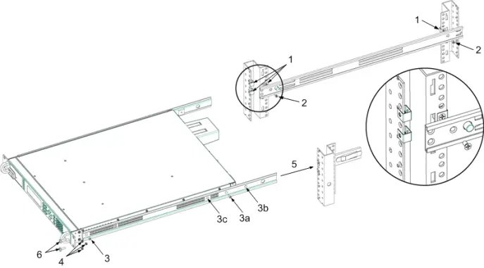
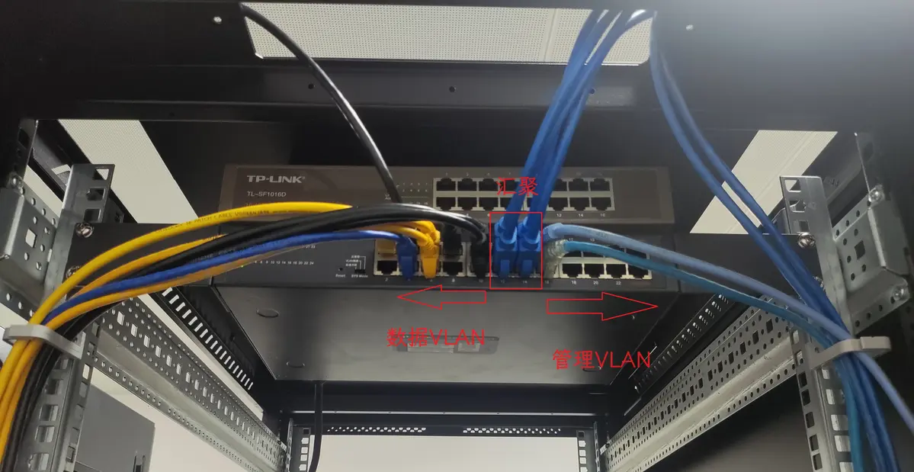
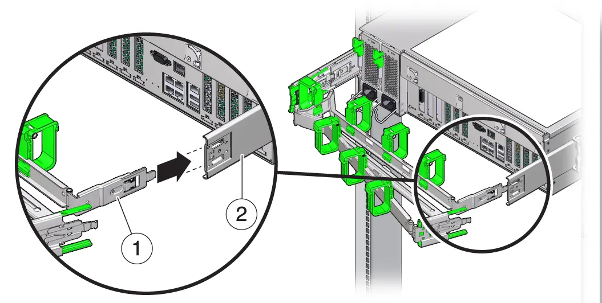

---
tags:
  - 完善
---

# 硬件运维

!!! abstract

    本文档主要介绍硬件运维的注意事项和操作规范。硬件知识和设备说明书见其他文档。

目前，集群机房基础设施基本稳定，大部分运维任务已经可以通过远程方式完成。但我们仍然需要具备基础的硬件知识，并具备动手操作的能力：

- 每月会有一两次更换设备的需求
- 打比赛时需要自己组装集群

硬件运维需要仔细耐心，特别要注意避免硬件损坏。**请爱惜设备**。

## 注意事项

!!! danger "在进行硬件操作时，请务必遵循以下守则！"

    这些注意事项都是我们在运维过程中吃过的苦，请不要掉以轻心！

- **佩戴手套**
    - **（暴论）不戴手套的人都是没被夹过或电过的**。进入机房前请先佩戴手套（尤其是秋冬季节，注意静电危害！）。
    - 既能保护自己的手不被机油、灰尘弄脏或被器件弄伤，也能保护硬件设备免受侵蚀和静电的危险。
    - **例外：拆卸 CPU 时不应当佩戴手套，避免损坏插槽上的触点**。
- **切勿随意乱丢零件**
    - **所有物资请用完放回原位**，否则又会变得非常乱。
    - 去机房之前**带上零件盒**。螺丝等各种小零件需要的时候极其难找。
    - 拆卸零件时务必放置到零件盒中，或用密封袋装好**并标记**，避免日后丢失或混淆。

    <figure markdown="span">
        

        { width=50% align=center }
        

        <figcaption>
        从服务器上拆卸线缆后用标签标记好
        </figcaption>
    </figure>

- **拍照记录**
    - 如果你对将要操作的内容不熟悉，请拍照记录原始状态，以便在操作失败时能够恢复。
    - **对于线缆较多的情况这一点尤其重要！**不要过于自信相信觉得一定能复原。
- **勿用蛮力**
    - 机房内陌生的接口和组件较多，它们往往有特定的插拔方式，不当操作可能导致硬件损坏。
    - 用蛮力的结果 belike：

        <figure markdown="span">
            

            { width=50% align=center }
            

            <figcaption>
            用蛮力导致 PCIe 设备挂耳损坏无法安装
            </figcaption>
        </figure>

- **插好线之后，轻轻拉一下看看有没有插牢**
    - 有些网线很容易脱落，IB 线也可能插反。
    - 有些电源线接口也会有松动：

        <figure markdown="span">
            

            { width=50% align=center }
            

            <figcaption>
            电源线接口松动
            </figcaption>
        </figure>

    - PCIE 卡、网络、电源线接口都有指示灯，巡检时可以多留心一下指示灯的状态。

- **走线**
    - 参考 [操作手册#机柜布局与理线](#机柜布局与理线)，禁止乱飞。
    - 非我们管理的机柜线缆可能很乱，只要没影响到我们就没事。如果他们飞线经过我们，就扔到机柜顶上去。

## 操作规范

### 服务器上/下架

服务器附件盒内一般有上架说明书，按照说明书操作。

服务器的导轨有几种类型：

- **托架式导轨**：我们一般不使用。
- **抽拉式导轨**：
    - 导轨是分段的，抽出内轨后卡扣会自动锁住。根据卡扣的构造不同，需要按压/拉动卡扣才能将内轨推回。

        <figure markdown="span">
            

            { width=80% align=center }
            

            <figcaption>
            抽拉式导轨的内轨卡扣
            </figcaption>
        </figure>

    根据内轨是否可拆卸，分为两种情况：

    - **内轨可拆卸**：先卸下内轨安装到服务器。然后将服务器与内轨一起推入外轨。参考 [:simple-bilibili: Dell PowerEdge R740 服务器卸载/安装混合导轨](https://www.bilibili.com/video/BV1pK411L71n)。

        <figure markdown="span" style="width: 49%; display: inline-block">
            

            { width=80% align=center }
            

            <figcaption>
            将内轨安装到服务器
            </figcaption>
        </figure>
        <figure markdown="span" style="width: 50%; display: inline-block">
            

            { width=80% align=center }
            

            <figcaption>
            将服务器与内轨一起推入外轨
            </figcaption>
        </figure>

    - **内轨不可拆卸**：抬起服务器，将铆钉直接卡在内轨卡槽中。参考 [:simple-bilibili: 浪潮英信服务器 NF5270M6 整机上架安装视频](https://www.bilibili.com/video/BV1ga411H7uN)。

        <figure markdown="span">
            

            { width=80% align=center }
            

            <figcaption>
            将铆钉卡在内轨卡槽中
            </figcaption>
        </figure>

!!! danger "错误案例"

    曾经有没经验的同学来机房上架服务器，用导轨挂钩来承重。这是严重错误的，很容易导致挂钩断裂服务器掉落。

    

        
        
    

    **最好不要让没经验的人上架服务器，联络时一定要说清楚各项注意事项，把教程发给他们。**

- 记得固定好导轨与服务器、导轨与机架的螺丝（如果有），避免抽拉时导轨脱架。

<figure markdown="span">
    

    { width=80% align=center }
    

    <figcaption>
    服务器上架过程
    </figcaption>
</figure>

### 机柜布局与理线

我们的机柜布局约定：

- 机柜顶部为 TOR（Top of Rack）交换机、InfiniBand 交换机等网络设备。
- 机柜底部为服务器，U 数越大、越重的设备应当越靠近底部。
- 为了方便维护，每台服务器之间至少保持 1U 的间隔，普通服务器上架高度不超过 30U。这意味着一个机柜可以承载约 10 台 2U 服务器。

一般的理线方式是利用机柜侧边的理线槽，将线缆梳理至机柜两侧。

<figure markdown="span" style="width: 80%">
    { width=50% style="float: left; " }
    { width=50% align=center }
</figure>

<figcaption>
机柜理线槽
</figcaption>

我们的机柜没有预装理线槽，且有些位置被 PDU 占用，所以在机架上安装理线环，用于清理网线。

- 从最顶上的交换机开始，左侧是数据网络，右侧是管理网络。

    <figure markdown="span">
        

        { width=80% align=center }
        

        <figcaption>
        左数据，右管理
        </figcaption>
    </figure>

- **网线**：使用理线槽梳理。过长的线裁剪打水晶头，或折叠后使用扎带绑好。
- **电源线**：电源线不走理线槽。折叠后使用粗扎带绑好。电源在 PDU 上的顺序与在机架上的顺序应当一致。

有些服务器带有理线臂，可以在不拆卸线缆的同时抽出服务器进行检查。

<figure markdown="span">
    

    { width=80% align=center }
    

    <figcaption>
    理线臂
    </figcaption>
</figure>

但我们没有，也不预留长度，线都扎得比较紧，所以**抽出服务器前必须检查所有线缆都已经卸除**。
