---
tags:
  - 完善
---

# 硬件知识

!!! abstract

    本文档介绍各种各样的硬件知识，从螺丝到线缆到设备接口。

    如果你觉得有需要补充的硬件知识，欢迎动手编辑本文档！

## 螺丝

!!! quote

    -  [其他“硬件”装机冷知识之螺丝与螺丝刀 - NGA](https://ngabbs.com/read.php?tid=26694048)
    -  [Computer case screws - Wikipedia](https://en.wikipedia.org/wiki/Computer_case_screws)

!!! warning "经验之谈"

    螺丝非常容易乱丢！如果从哪里拆下螺丝，请记得用密封袋装好贴上标签！

- 机柜螺丝：常见 M5 和 M6 型号，数字就是直径为几毫米。一般用于固定服务器机架、挂耳等。这种螺母可以固定在机架上。方便旋动。

<figure markdown="span" style="width: 40%">
    { width=50% style="float: left; " }
    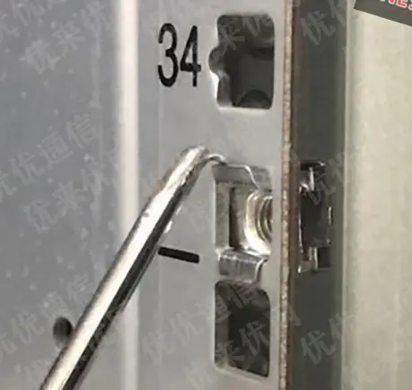{ width=50% align=center }
</figure>

<figcaption>
机柜螺丝
</figcaption>

- 机箱螺丝：下面都是一般情况。**总之用原配的螺丝最好，所以一定要标记清楚！**
    - 机箱中最常见的螺丝是 M3（公制）和 6#32（美制）。
        - 这两者直径相差不大，但螺纹间距（牙距）不同，**极其容易用错导致螺纹滑丝**。
        - 前者的螺纹更细密，后者更松更粗，其实是比较容易分辨的。
        - 一般前者用于 2.5 寸固态硬盘，后者用于 3.5 寸机械硬盘、PCIe 插槽固定。

    <figure markdown="span" style="width: 49%; display: inline-block">
        

        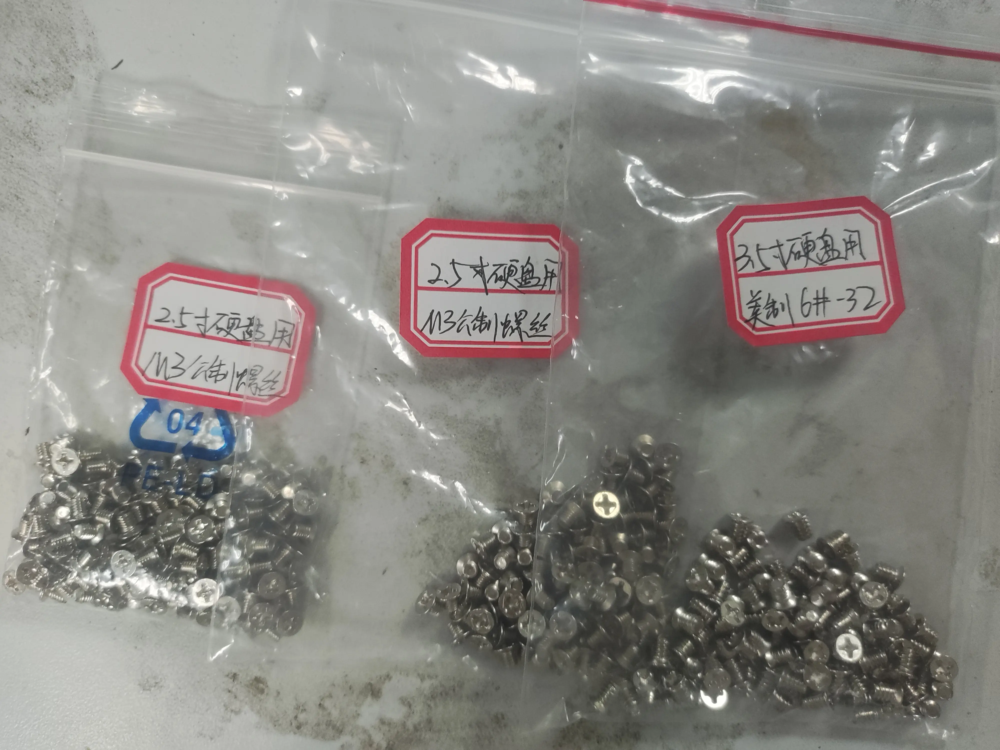{ width=80% align=center }
        

        <figcaption>
        运维时把螺丝分类放好
        </figcaption>
    </figure>
    <figure markdown="span" style="width: 49%; display: inline-block">
        

        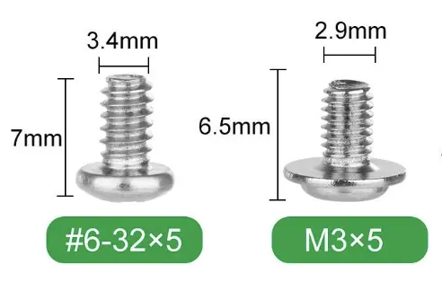{ width=80% align=center }
        

        <figcaption>
        M3 与 6#32 螺丝
        </figcaption>
    </figure>

    - 总之，螺丝不要硬拧，感觉不对就停下来换螺丝，否则螺孔可能就废了。

## 电源线缆

!!! quote

    - [How Much Do You Know About Power Cord Types? - FS](https://community.fs.com/article/small-power-cord-big-difference.html)

- 国标电源插头有 10A 和 16A 之分，其中 16A 插头略大。这两种插头插座不通用。
- 基础负载：10A 插座负载功率=220V×10A=2200W；16A 插座负载功率=220V×16A=3520W。

<figure markdown="span">
    

    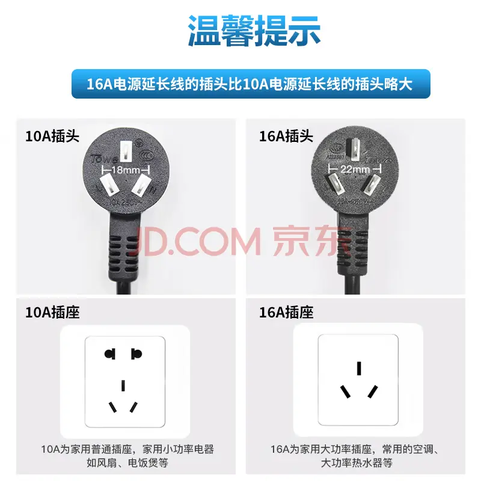{ width=40% align=center }
    

    <figcaption>
    插头
    </figcaption>
</figure>

- 服务器电源插孔有 C13 和 C19 之分，它们的最大电流有区别。C13 一般对应 10A 插头，C19 对应 16A 插头

<figure markdown="span">
    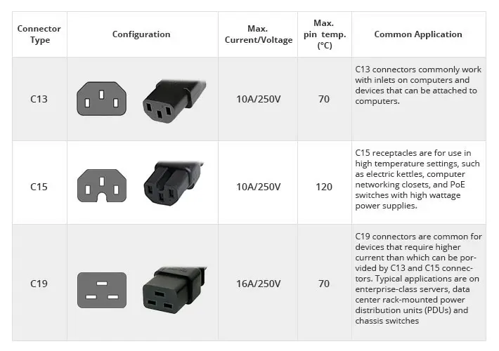{ width=33% style="float: left; " }
    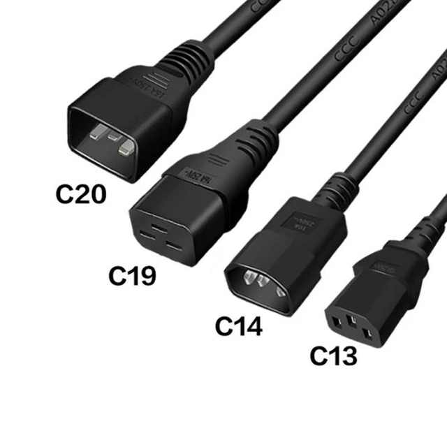{ width=33% style="float: left; " }
    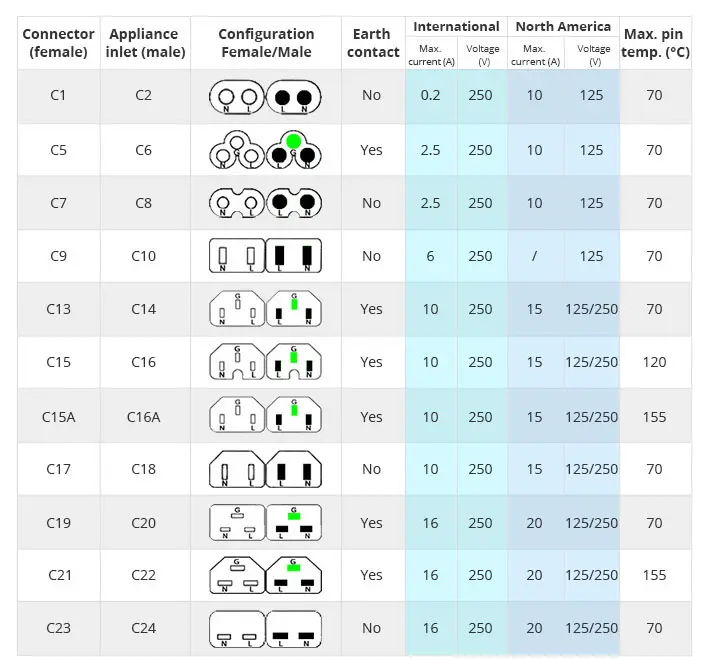{ width=33% align=center }
</figure>

<figcaption>
电源插孔
</figcaption>

- PDU 上常见的组件如下：
    - 10/16A 过载保护器：机柜上的小 PDU 有，过载会跳起来，按下去恢复正常。

!!! warning "经验之谈"

    PDU 不足时我们曾经将两台大功率服务器接到 10A 小 PDU 上，导致 PDU 过载保护器跳闸。应当注意计算 PDU 的额定功率，不要超载。

<figure markdown="span">
    { width=33% style="float: left; " }
    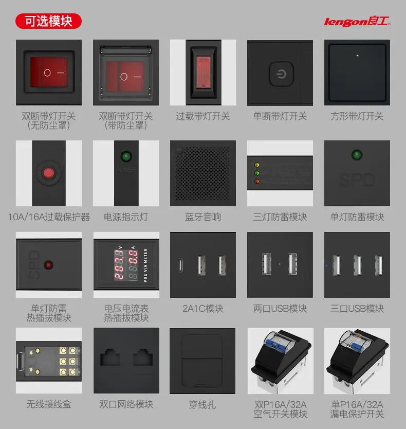{ width=33% style="float: left; " }
    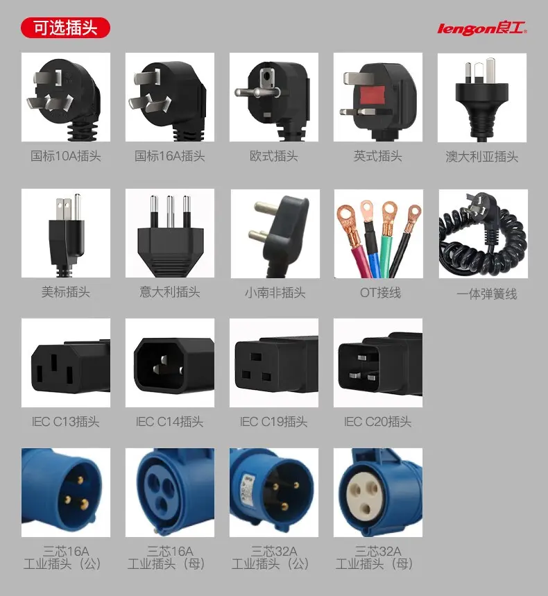{ width=33% align=center }
</figure>

<figcaption>
PDU 组件
</figcaption>

## 网络硬件

光模块、网络线缆、网络设备等硬件介绍见 [认识数据中心网络#认识硬件](../network/datacenter.md#认识硬件)。

## 外围设备及其接口

!!! quote

    - [SAS/ SATA Cables Guide – SFF-8087, 8088, 8470, 8482, 8484, and single device connectors](https://www.servethehome.com/sas-sata-cables-guide-sff8087-8088-8470-8482-8484-single-device-connectors/)
    - [:simple-bilibili:【硬核科普】硬盘的 SATA M.2 NGFF NVME 是什么意思，详解硬盘的总线协议与接口 - 硬件茶谈](https://www.bilibili.com/video/BV1Qv411t7ZL/)

本节主要描述的是存储设备，但这些概念基本适用于各种外围设备。存储设备的连接划分为协议、总线与接口三个层次，如下图所示：

<figure markdown="span">
    

    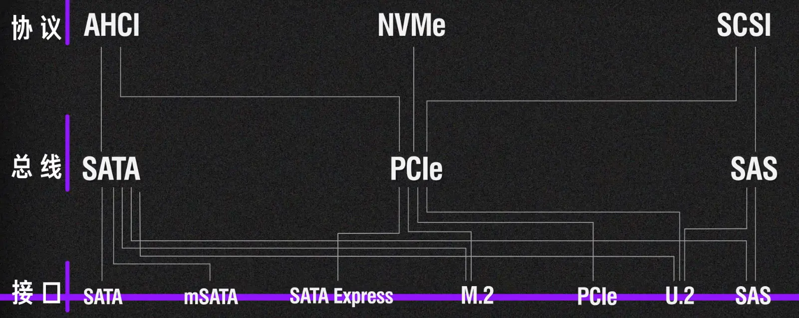
    

    <figcaption>
    存储设备连接层次
    </figcaption>
</figure>

### 总线

总线发展的趋势是从并行演变为串行：

- 并行就是用多根线同时传输数据，串行就是用一根线顺序传输数据。看起来串行慢，但并行占用空间大，I/O 引脚过多变得无法接受，且随着传输速率的提高出现了难以解决的串扰问题。
- 这两种总线架构不同：串行总线只能点对点连接两个设备，而并行总线可以在单一总线上连接多个设备，并且很容易增减总线上的设备。**对于串行总线，我们需要使用交换机和多个总线设备连接**。

<figure markdown="span">
    

    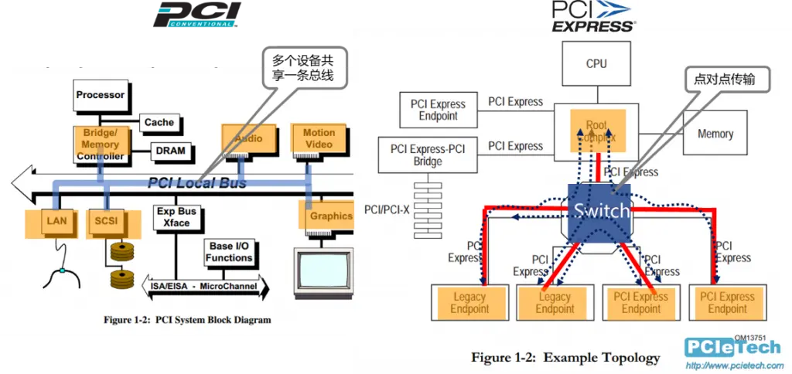{ width=80% align=center }
    

    <figcaption>
    PCI 与 PCIe 总线
    </figcaption>
</figure>

!!! example

    - PCI（Peripheral Component Interconnect）是并行总线，PCIe（PCI Express）是串行总线。
    - ATA（Advanced Technology Attachment）是并行总线，SATA（Serial ATA）是串行总线。
    - SCSI（Small Computer System Interface）是并行总线，SAS（Serial Attached SCSI）是串行总线。
    - USB（Universal Serial Bus）是串行总线。

CPU 可以直连出 PCIe 总线，而 SATA/SAS/USB 等总线总是由芯片组/控制器引出。如今的高速存储都开始使用 PCIe 总线，如 NVMe SSD。

<figure markdown="span">
    

    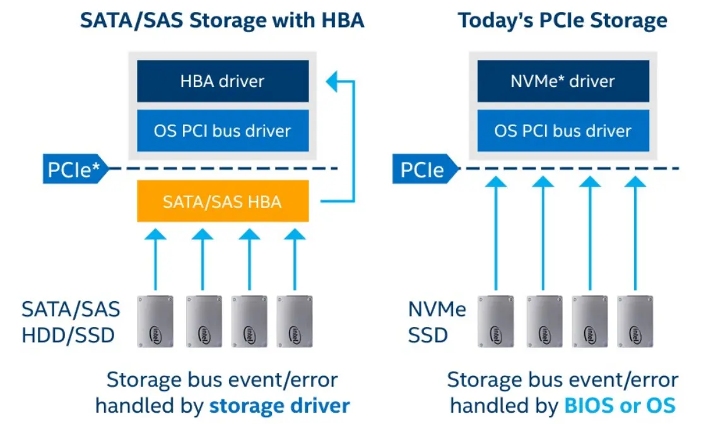{ width=60% align=center }
    

    <figcaption>
    SATA 与 PCIe 存储对比
    </figcaption>
</figure>

#### PCIe Switch

!!! quote

    - [Top 3 Uses for PCI Express Switches](https://www.arrow.com/en/-/media/e81e083f51ea49c28099182f435e1ec7.ashx)

PCIe Switch 是一种用于扩展 PCIe 总线的设备，可以将一个 PCIe 总线扩展为多个 PCIe 总线。它利用了 PCIe 串行总线点对点通信的特点。它的应用场景有：

- **扩展 PCIe 总线**：将一个 PCIe 总线扩展为多个 PCIe 总线，可以连接多个 PCIe 设备。**多见于 GPU 服务器**，一般为 4U，支持 8 卡，比如我们的宁畅 X640 G40。

    如下图所示，CPU 只需要向 PCIe Switch 提供 x4 PCIe，就能扩展出 4 个 x4 PCIe 设备和一个 x1 PCIe 设备。当然这肯定会有延迟、带宽之类的损失，比如在该 PCIe Switch 下的所有设备 Host to Device 的**总带宽**只能局限在 x4，但是 Device to Device 带宽一般可以达到满速。

    <figure markdown="span">
        

        { width=60% align=center }
        

        <figcaption>
        PCIe Switch 扩展 PCIe 总线
        </figcaption>
    </figure>

- **拆分 PCIe 总线**：将一个 PCIe 总线拆分为多个 PCIe 总线，可以连接多个 PCIe 设备。多见于 PCIe 转接卡。这里就不会有总带宽的问题，因为每个设备都有独立的 PCIe 总线。

    !!! example

        比如有一些 PCIe x16 转 4 U.2 的转接卡（因为 U.2 每个只占 x4 通道）。这些自带 PCIe Switch 的转接卡不需要主板支持 PCIe 拆分（PCie Bifurcation）。而比较便宜的 PCIe x16 转 4 U.2 转接卡就不带 PCIe Switch，需要主板支持 PCIe 拆分。这就是价格差异的原因。

    <figure markdown="span">
        

        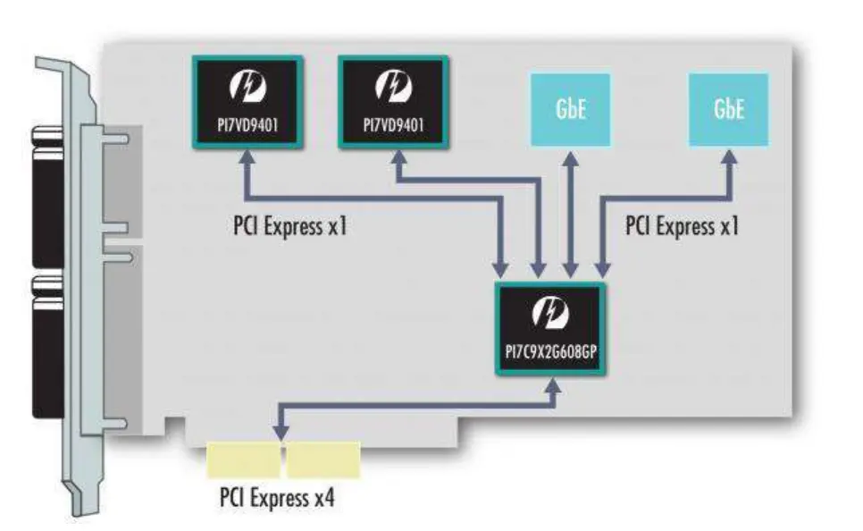{ width=60% align=center }
        

        <figcaption>
        PCIe Switch 拆分 PCIe 总线
        </figcaption>
    </figure>

### 接口

#### SATA

传统机械硬盘都是 SATA 接口，一般为 SATA3，速率 6Gb/s。

<figure markdown="span">
    

    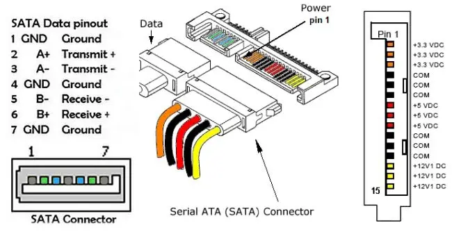{ width=60% align=center }
    

    <figcaption>
    SATA 接口
    </figcaption>
</figure>

#### SAS

既可以称为一种接口，也是一种协议。这种接口能够兼容 SATA 协议，支持 SAS 协议，并进一步支持了 PCIe 通道。这种接口具有多种版本，更新的版本使用更多引脚，支持更高的速率。因为种类众多，接口名称也十分混乱。

SAS 协议由 [T10 技术委员会](https://www.t10.org/)制定，该委员会负责 SCSI 和 SAS 以及相关标准。SAS 使用的接口由 [SFF TA TWG](https://www.snia.org/sff) 制定，该工作组还负责 QSFP 等接口标准。他们制定的协议相互组合以实现一个特定速率的接口，比如 12GB/s 的接口就使用了如下标准相互协作：

<figure markdown="span">
    

    { width=60% align=center }
    

    <figcaption>
    SAS 接口与协议之间的关系
    </figcaption>
</figure>

- [SFF-8482 Serial Attachment 2X Unshielded Connector](https://members.snia.org/document/dl/25920)：可以看到它在 SATA 接口的缺口部分添加了引脚。这种接口的硬盘支持 3、6、12Gb/s 速率。**一般说 SAS 指的都是这种接口**，企业级机械硬盘普遍使用该接口。

    <figure markdown="span">
        

        { width=60% align=center }
        

        <figcaption>
        SFF-8482 接口
        </figcaption>
    </figure>

- [SFF-8630 Serial Attachment 4X Unshielded Connector](https://members.snia.org/document/dl/26381)：在背面添加了更多引脚。这种接口不多见。

    <figure markdown="span">
        

        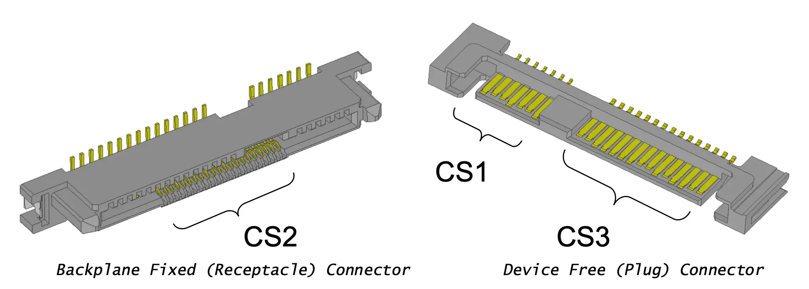{ width=80% align=center }
        

        <figcaption>
        SFF-8630 接口
        </figcaption>
    </figure>

- [SFF-8639 Multifunction 6X Unshielded Connector](https://members.snia.org/document/dl/26489)：背面排满了引脚。这一接口标准定义了 4x PCIe 通道，也称为 **U.2** 接口。该接口普遍用于企业级 2.5 寸 NVMe SSD。

    <figure markdown="span" style="width: 49%; display: inline-block">
        

        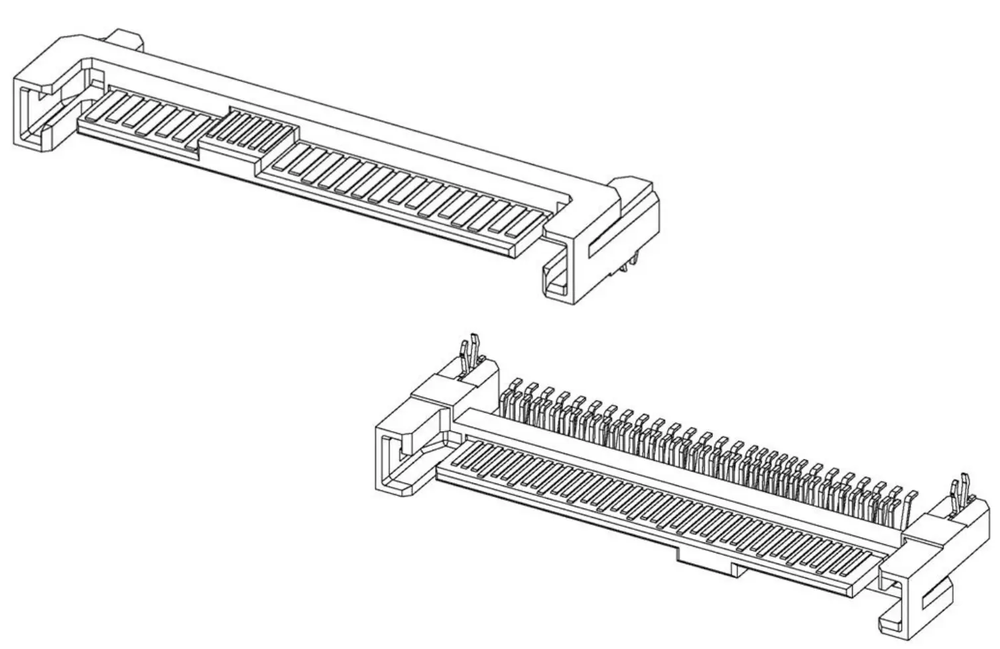
        

        <figcaption>
        SFF-8639 接口
        </figcaption>
    </figure>
    <figure markdown="span" style="width: 50%; display: inline-block">
        

        
        

        <figcaption>
        U.2 与 U.3 引脚定义
        </figcaption>
    </figure>

上面描述的接口一般位于**存储设备**，扁平的接口占用面积较大，因此又定义了一族 Mini 版的接口，常见于**主板、PCIe 转接卡上**，它们也被用于 PCIe 设备连接：

- [SFF-8613 Mini Multilane 4/8X Unshielded Connector (HDun)](https://members.snia.org/document/dl/25938)、[SFF-8614 Mini Multilane 4/8X Shielded Cage/ Connector (HDsh)](https://members.snia.org/document/dl/25939)：分成有屏蔽/无屏蔽两种，前者常用于硬盘背板。我们的 GPU 机柜使用有屏蔽的版本，部分 DAS（直连存储）设备也使用这种接口。又称为 **Mini-SAS HD**。

    <figure markdown="span" style="width: 49%; display: inline-block">
        

        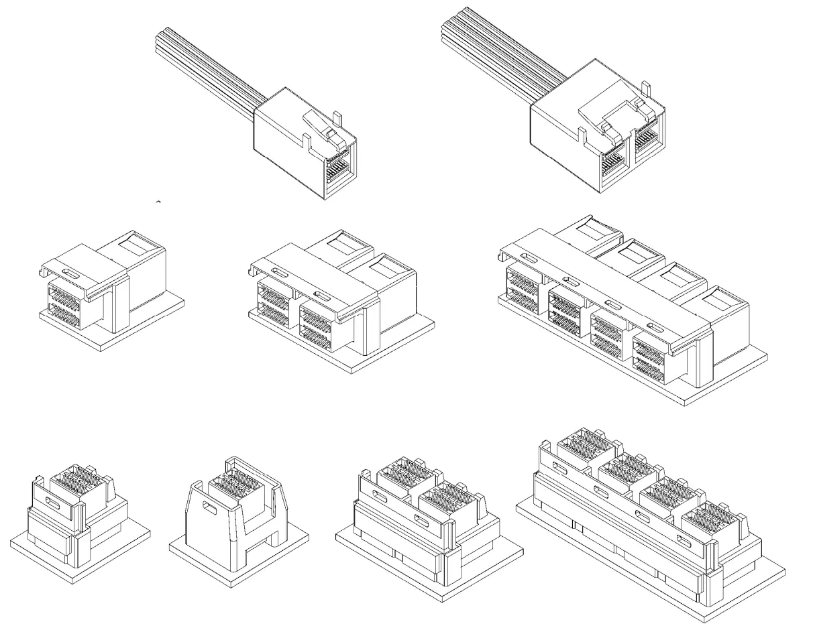
        

        <figcaption>
        SFF-8613 接口
        </figcaption>
    </figure>
    <figure markdown="span" style="width: 50%; display: inline-block">
        

        
        

        <figcaption>
        SFF-8614 接口
        </figcaption>
    </figure>

- [SFF-8086 Mini Multilane 4X 10 Gb/s Common Elements Connector](https://members.snia.org/document/dl/25822)、[SFF-8087 Mini Multilane 4X Unshielded Connector Shell and Plug](https://members.snia.org/document/dl/25823)、[SFF-8088 Mini Multilane 4X Shielded Connector Shell and Plug](https://members.snia.org/document/dl/25824) ：硬盘背板常用该接口连接到主板，因为它能拆分出 4 条 SATA 通道。它分成有屏蔽/无屏蔽两种。又称为 **Mini-SAS**。

    <figure markdown="span" style="width: 49%; display: inline-block">
        

        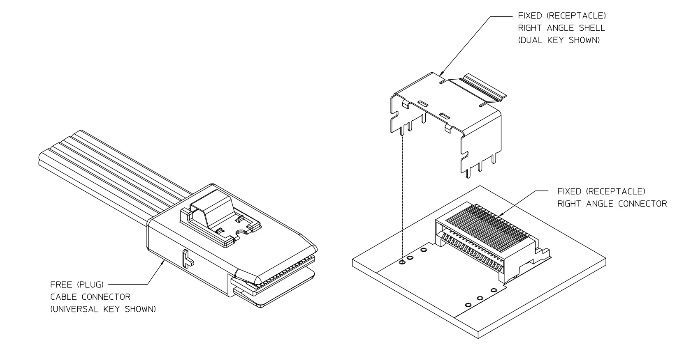
        

        <figcaption>
        SFF-8087 接口
        </figcaption>
    </figure>
    <figure markdown="span" style="width: 50%; display: inline-block">
        

        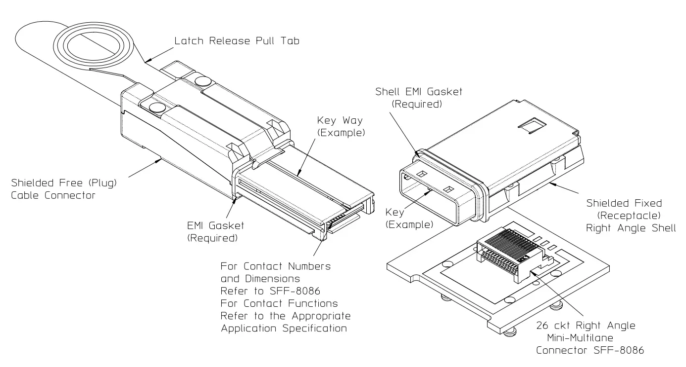
        

        <figcaption>
        SFF-8088 接口
        </figcaption>
    </figure>

- [SFF-8654 0.6mm 4/8X Unshielded I/O Connector](https://members.snia.org/document/dl/26744)：比较新的支持 U.2/NVMe 的硬盘背板一般采用这种接口连接到主板，它支持 PCIe 通道。又称为 **SlimSAS**。

    <figure markdown="span">
        

        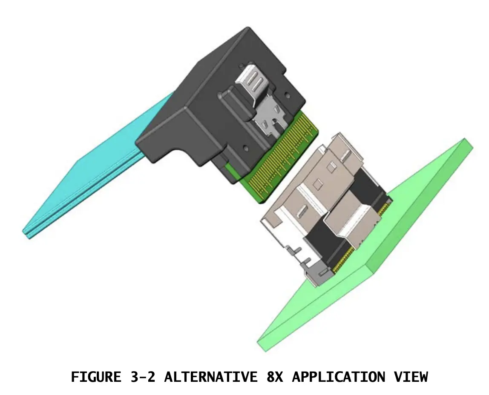{ width=60% align=center }
        

        <figcaption>
        SFF-8654 接口（8X，此外还有 4X）
        </figcaption>
    </figure>

- [SFF-8611 MiniLink 4/8X I/O Cable Assemblies](https://members.snia.org/document/dl/27937)：服务器上并不常见。又称为 **oculink**，用于连接 PCIe 设备，如 GPU。

    <figure markdown="span">
        

        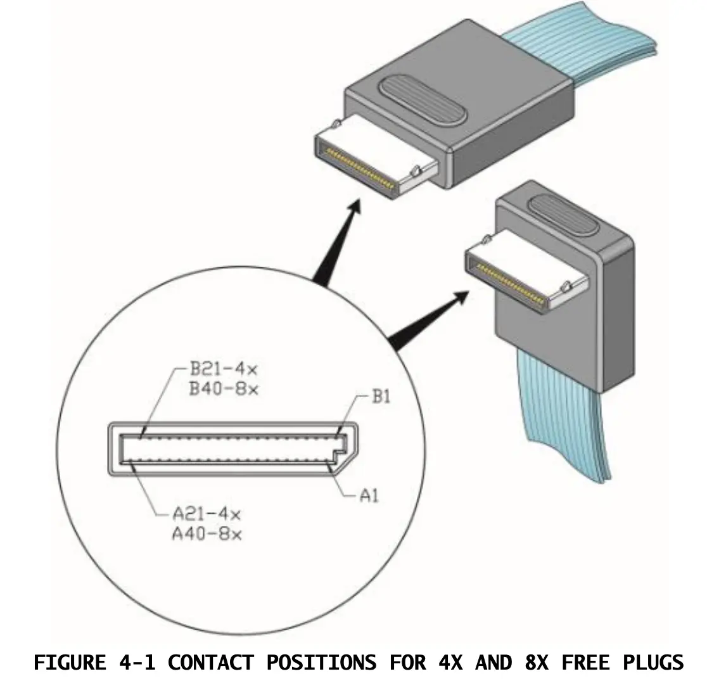{ width=60% align=center }
        

        <figcaption>
        SFF-8611 接口
        </figcaption>
    </figure>
