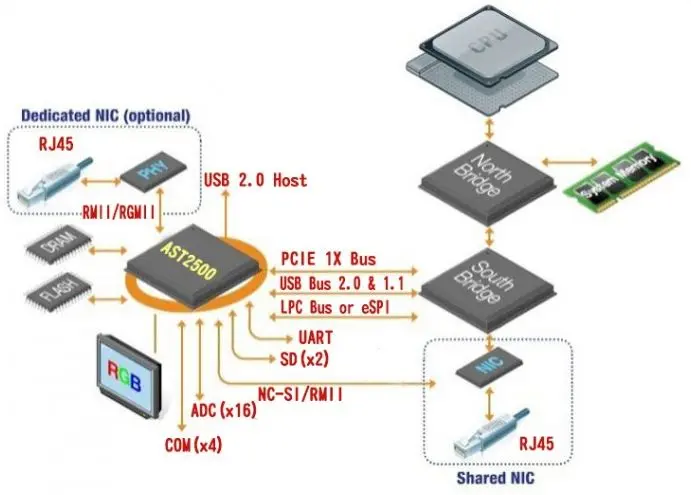
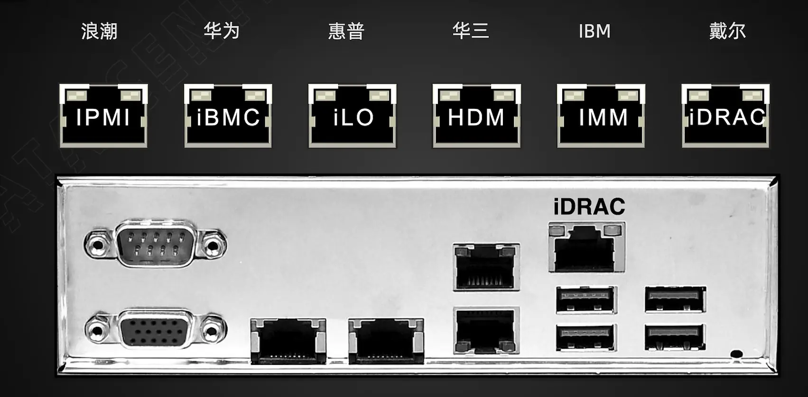
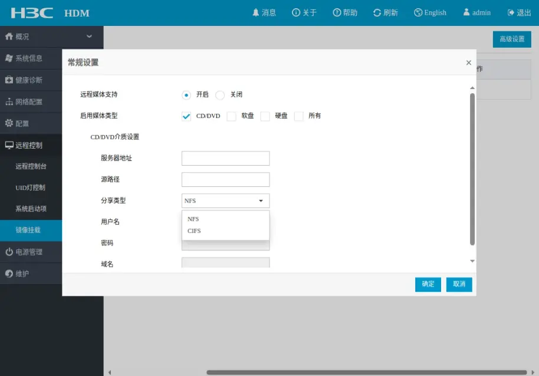
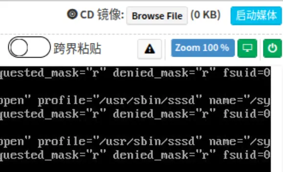

---
tags:
  - 完善
---

# 带外管理

!!! todo

    - [ ] Redfish Ansible 自动化介绍

## 概述

**带外管理（Out-of-Band Management，OOBM）**是一种通过独立于生产网络的管理平面访问和管理远程位置的设备和基础设施的过程。带外管理允许系统管理员通过远程控制监视和管理服务器及其他网络附加设备，**无论该设备是否已启动或操作系统是否已安装或正常运行**。它与带内管理相对，后者要求被管理系统已启动并通过其操作系统的网络设施可用。

在服务器上，带外管理通过独立的**基板管理控制器（Baseboard Management Controller，BMC）**芯片实现。只要服务器上电，它就开始工作，监测硬件状态，提供远程控制和监视功能。BMC 通常包括一个嵌入式 Web 服务器，连接到独立的网络接口，可以通过 IPMI、Redfish 或其他协议访问。Linux Foundation 发起了 OpenBMC 项目，旨在定义标准的 BMC 固件栈，但在可以预见的未来，各个厂商的 BMC 仍然会有一定的差异。

<figure markdown="span" style="width: 49%; display: inline-block;">
    <center>
    { width=80% align=center }
    </center>
    <figcaption>
    BMC 架构
    </figcaption>
</figure>
<figure markdown="span" style="width: 49%; display: inline-block;">
    <center>
    { width=80% align=center }
    </center>
    <figcaption>
    不同服务器厂商的带外管理名称
    </figcaption>
</figure>

[**IPMI（Intelligent Platform Management Interface）**](https://www.intel.la/content/dam/www/public/us/en/documents/specification-updates/ipmi-intelligent-platform-mgt-interface-spec-2nd-gen-v2-0-spec-update.pdf)是一种标准的硬件管理接口，BMC 实现了 IPMI 标准，可以通过 IPMI 协议进行远程管理。[**Redfish**](https://www.dmtf.org/standards/redfish) 是一种新的硬件管理接口，基于 RESTful API，逐渐取代 IPMI。几乎所有服务器都支持 IPMI，目前市售的服务器也大都支持 Redfish。

关于带外管理技术的发展，可以看下面这篇文章：

??? info "[云服务器带外管理：从 IPMI 到 RedFish - CSDN](https://blog.csdn.net/asmartkiller/article/details/106558952)"

    1998 年，IPMI 的出现让这一切好了不少。由 Intel 和 HP 主推的 IPMI 标准，引入了单独的带外管理芯片 BMC：

    所谓的带外，是指在 CPU 这个主计算资源之外。有了这个 ARM based 芯片加持，和开放免费的 IPMI 标准，服务器的管理上了一个台阶。IPMI 定义了一个所谓的服务器管理的最小集，并标准化了相关命令集合。IPMI 消息采用统一格式，它的下层是透明的，可以架构在网络、串行/Moderm 接口、IPMB（I2C）、KCS、SMIC、SMBus 等不同接口上。如 BIOS 和 BMC 之间的 IPMI 消息是在 KCS 或者 IPMB 管道中，而远程控制 Console 则和 BMC 通过网络发送 IPMI 消息。IPMI 的引入极大的方便了服务器的远程管理。尽管 IPMI 标准规定的功能十分有限，但各个服务器厂商则百花齐放，在其基础上扩展了很多实用的功能，包括 Remote Console（KVM，注意不是虚拟机世界那个 KVM），Remote Media 等等新鲜实用的功能。我可以坐在我的 cubicle 里，把我的笔记本上插的 U 盘 Remote Mount 到某个服务器中，更新其中的 BIOS 或者操作系统，并通过 KVM 监视进度。太方便了。

    但隐患已经埋下，这些繁杂的功能没有统一的标准，各家都不通用，而一个云服务厂商为了保障供应链往往会采购不同的品牌的服务器，从而造成了极大的混乱。IPMI 更多的是单点的服务，扩展性（Scale Out）差。而这些仅仅是开始，在它发明的后很长时间，IPMI 的管理网络是一个专有的网络，只有授权的用户才能访问，这导致其在开始设计的时候就对安全性考虑有所欠缺。在爆出安全漏洞后，IPMI2.0 增加了增强身份认证（RAKP+、SHA-1 等），但其后更有别的漏洞爆出。业界呼唤一种新的，重新设计的新标准，一劳永逸的解决这些问题，于是 RedFish 应运而生，IPMI 也在 2015 年公布 2.0 v1.1 标准后，不再更新，被 RedFish 永久代替，Intel 也宣布不再维护，号召大家转战 RedFish。

    RedFish 标准由 DMTF 组织的 SPMF 论坛维护。它的初始提出者和 IPMI 初始提出者几乎一样，为 Intel，HPE（HP 拆分），Dell 和 Emerson。在标准订立之初，就设定了以下目标：

    - 安全
    - 高可扩展管理（Scalable）
    - 人类可读数据界面（Human readable data）
    - 基于现有硬件可实现

    第四条十分浅显易懂，也就是现在支持 IPMI 的 BMC 上，不需要（或者很小）硬件改动，就可以支持 RedFish，也就是硬件兼容。安全性依赖 TLS-Secured HTTP，也就是 HTTPS 来保证。高可扩展性通过定义所有的 API 为 RESTful 形式的 API 来完成。REST（REpresent State Transfer，REST），这个概念从 Web API 而来，相对于传统的 SOAP API，RESTful 的 API 定义很简单（如：POST，GET，PUT 或 DELETE），将对象的状态 State，用 JSON 或 XML 格式在服务器和 Client 之间传递，这也是它的名字的由来。

    这些访问的数据格式都是 JSON 形态的数据。JSON(JavaScript Object Notation) 脱胎于 JavaScript，不过这并不代表 JSON 无法使用于其他语言，它现在迅速成为一种现代数据格式。它比 XML 简单，也是实现人类可读数据界面的重要手段。关于它我就不展开了，网上资料很多。
    光有 RESTful API 和 JSON 格式数据是不够的。RedFish 还引入 OData，定义了一组常见的 RESTful Schema，提供 API 之间的互操作性。如描述 JSON 有效负载的模式、URL 约定、通用属性等等。

    自 RedFish 在 2014 年推出以来，几乎所有重要的大厂都已经开启了“红鱼”之旅。如 Dell 在其 iRAC 中加入了 RedFish，SuperMicro 引入了 RedFish。值得一提的是，国产之光的华为服务器的 iBMC 中也全面支持了 RedFish，国产 BIOS 和 BMC 领军企业百敖软件自研 BMC 中也全面支持了 RedFish。最后要多说一句，RedFish 和 IPMI 并不矛盾，很多现有 BMC 同时支持 IPMI 2.0 和 RedFish，有些甚至在 IPMI 上包装了一层 RedFish 界面。全面淘汰 IPMI 还需时日，同时支持两者也保证了过渡的平滑性。

## 访问 IPMI 界面

集群服务器的 IPMI 界面的域名为 `<node_name>-ipmi.clusters.zjusct.io`。比如 `root` 节点的 IPMI 界面为 [`root-ipmi.clusters.zjusct.io`](https://root-ipmi.clusters.zjusct.io)。IPMI 账密托管在 VaultWarden 中。

大部分厂商 IPMI 界面都有帮助手册可以查看。即使没有，操作应该也是十分直观的，这里不进行介绍。

请自行探索下列功能：

- 查看服务器的硬件信息
- 使用 KVM 或控制台重定向功能远程控制服务器
- 控制服务器的电源
- 控制服务器的风扇转速

### 远程挂载镜像

**远程管理时，可以通过 IPMI 挂载本地/远程的 ISO 镜像到服务器上，从而远程安装操作系统。**

IPMI 界面中可能有两处地方可以找到远程挂载镜像：

- 选项卡中的“远程镜像”：

    不同厂商的 IPMI 支持不同的挂载方式，一般为 HTTP 或 NFS。

    <figure markdown="span">
        <center>
        { width=80% align=center }
        </center>
        <figcaption>
        新华三 IPMI 镜像挂载选项卡
        </figcaption>
    </figure>

    !!! tip "远程挂载镜像推荐挂载小镜像"

        建议挂载如 Debian netinst 镜像（约 600MB 左右）。如果必须挂载大镜像（如 Ubuntu 基础镜像在 2GB 以上），尽量在同一个局域网内放置 HTTP 服务器并挂载。

    !!! warning "使用 HTTP 服务器"

        Python 内置的 HTTP 服务器实现不完善，服务器 IPMI 无法挂载镜像，比如超微：

        ```shell
        python3 -m http.server 8000
        ```

        更推荐使用 Nginx Docker：

        ```shell
        docker run -p 8000:80 -v /path/to/iso:/usr/share/nginx/html nginx
        ```

- KVM 远程控制页面右上角可能有“挂载镜像”按钮：

    <figure markdown="span">
        <center>
        { width=80% align=center }
        </center>
        <figcaption>
        浪潮 KVM 镜像挂载按钮
        </figcaption>
    </figure>

完成挂载后，进入启动菜单，应该能看到挂载的镜像。一般是 AMI: Virtual CD/DVD ROM 等选项。

以下是一些具体的例子：

!!! example "宁畅"

    root 是宁畅 IPMI。进入 BMC Settings - Media Redirection，在 Function settings 选项卡中勾选 Remote Media Support，就会出现远程挂载的选项。填写例如下：

    - Server Address for CD/DVD Images: `192.168.1.1`
    - Path in server:`/home/user/download`

    **注意 Path 不应当写文件名，应该写目录名。**Save 后切换到 Remote Media 选项卡即可选择需要挂载的镜像，仅能扫描该目录下的 `.iso` 文件，不支持递归搜索。选择后点击右侧图标挂载。

!!! example "新华三"

    新华三只支持 NFS/CIFS 挂载。需要安装 Ubuntu，但 Ubuntu 没有 netinst 包。如果使用 KVM 挂载，传输速度极慢。你要是愿意等，并且网络状态稳定，可以慢慢完成安装过程。**但远程管理的网络状况一般不太稳定，镜像容易上传到一半断掉。**

    更建议通过 KVM 挂载极小的 iPXE 或 netboot.xyz 镜像作为跳板，引导进入 Linux 安装程序后令其自行下载大镜像。

## 使用 `ipmitool`

[:simple-github: `ipmitool`](https://github.com/ipmitool/ipmitool) 是一个 IPMI 命令行工具，但它目前已经进入 Public Archive 状态，不再维护。

目前，我们使用它制作一些集群操作的自动化脚本，例如：

```shell title="ipmi.sh"
#!/bin/bash
for host in ${hosts[@]}
do
  ipmitool -I lanplus -H $host -U $(bw get username $host) -P $(bw get password $host) chassis power $1
done
```

脚本见 [:simple-gitlab: ZJU Git](https://git.zju.edu.cn/zjusct/ops/scripts/)。

## Redfish

!!! quote

    - [Introduction to Redfish - DMTF](https://www.dmtf.org/sites/default/files/2017_12_Redfish_Introduction_and_Overview.pdf)：DMTF 入门 Presentation，普及基础概念。

IPMI 实现 IPMI over LAN，使用 Remote Management Control Protocol（RMCP）封装 IPMI 消息，通过 UDP 与服务器 623 端口通信。例如，下面是使用 Wireshark 抓取的 IPMI over LAN 通信过程：

```text
Src    Dst    Proto Info
Client Server IPMB  Session ID 0x0
Server Client IPMB  Session ID 0x0
Client Server IPMB  Session ID 0x0, payload type: IPMI Message
Client Server RMCP+ Session ID 0x0, payload type: RMCP+ Open Session Request
Server Client RMCP+ Session ID 0x0, payload type: RMCP+ Open Session Response
Client Server RMCP+ Session ID 0x0, payload type: RAKP Message 1
Client Server RMCP+ Session ID 0x48422efa, payload type: IPMI Message
```

该协议可读性很差，需要使用专门的工具解析。而 Redfish 用一句话总结就是 **HTTPS in JSON format based on OData v4**，使用 RESTful API，更加直观易用，适配现代 Web 开发。例如，访问支持 Redfish 的服务器的带外管理地址下的 `/redfish/v1`，就能得到 JSON 格式的数据（已截断）：

```json title="GET https://***.***.***.***/redfish/v1"
{
    "@odata.context": "/redfish/v1/$metadata#ServiceRoot.ServiceRoot",
    "@odata.id": "/redfish/v1/",
    "@odata.type": "#ServiceRoot.v1_5_2.ServiceRoot",
    "Id": "RootService",
    "Name": "Root Service",
    "Oem": {
        "Public": {
            "ManagementIPv4": "***.***.***.***",
            "Manufacturer": "IEIT SYSTEMS",
            "Model": "SA5212-M7-A0-R0-00",
            "SerialNumber": "********"
        }
    },
    "RedfishVersion": "1.13.0",
    "AccountService": {
        "@odata.id": "/redfish/v1/AccountService"
    },
    "Chassis": {
        "@odata.id": "/redfish/v1/Chassis"
    },
}
```
