---
tags:
  - stable
---

# IPv6

!!! quote

    - 华为文档

IPv6 是下一代互联网协议、互联网的发展方向，受到国家重视，在国内推广和应用已经达到一定规模。浙江大学校园网也部署了 IPv6，校园网不同区域存在 SLAAC 或 DHCPv6 配置方式，但均没有下发前缀，使得用户接入的路由器无法正常使用 IPv6 功能（目前支持 NATv6 的路由器较少），因此集群内部也没有配置 IPv6。

## IPv6 原理

### IPv6 地址

IPv6 地址分为单播地址、任播地址（Anycast Address）、组播地址三种类型。

- 单播地址：标识了一个接口，由于每个接口属于一个节点，因此每个节点的任何接口上的单播地址都可以标识这个节点。发往单播地址的报文，由此地址标识的接口接收。
    - 未指定地址：IPv6 中的未指定地址即 `0:0:0:0:0:0:0:0/128` 或者 `::/128`。该地址可以表示某个接口或者节点还没有 IP 地址，可以作为某些报文的源 IP 地址（例如在 NS 报文的重复地址检测中会出现）。源 IP 地址是 `::` 的报文不会被路由设备转发。
    - 环回地址：IPv6 中的环回地址即 `0:0:0:0:0:0:0:1/128` 或者 `::1/128`。环回与 IPv4 中的`127.0.0.1`作用相同，主要用于设备给自己发送报文。该地址通常用来作为一个虚接口的地址（如 Loopback 接口）。实际发送的数据包中不能使用环回地址作为源 IP 地址或者目的 IP 地址。
    - 全球单播地址

        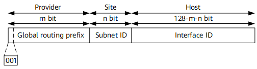

        - 全球单播地址是带有全球单播前缀的 IPv6 地址，其作用类似于 IPv4 中的公网地址。这种类型的地址允许路由前缀的聚合，从而限制了全球路由表项的数量。
        - 全球单播地址由全球路由前缀（Global routing prefix）、子网 ID（Subnet ID）和接口标识（Interface ID）组成。
            - Global routing prefix：全球路由前缀。由提供商（Provider）指定给一个组织机构，通常全球路由前缀至少为 48 位。目前已经分配的全球路由前缀的前 3bit 均为 `001`。
            - Subnet ID：子网 ID。组织机构可以用子网 ID 来构建本地网络（Site）。子网 ID 通常最多分配到第 64 位。子网 ID 和 IPv4 中的子网号作用相似。
            - Interface ID：接口标识。用来标识一个设备（Host）。

    - 链路本地地址

        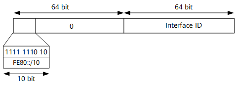

        - 链路本地地址是 IPv6 中的应用范围受限制的地址类型，只能在连接到同一本地链路的节点之间使用。它使用了特定的本地链路前缀 `FE80::/10`（最高 10 位值为 `1111111010`），同时将接口标识添加在后面作为地址的低 64 比特。
        - 当一个节点启动 IPv6 协议栈时，启动时节点的每个接口会自动配置一个链路本地地址（其固定的前缀+EUI-64 规则形成的接口标识）。这种机制使得两个连接到同一链路的 IPv6 节点不需要做任何配置就可以通信。所以链路本地地址广泛应用于邻居发现，无状态地址配置等应用。
        - 以链路本地地址为源地址或目的地址的 IPv6 报文不会被路由设备转发到其他链路。

    - 唯一本地地址

        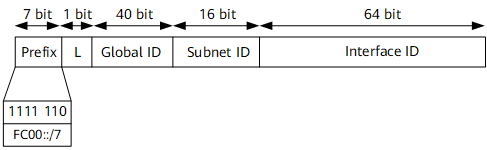

        - 唯一本地地址是另一种应用范围受限的地址，它仅能在一个站点内使用。由于本地站点地址的废除（RFC3879），唯一本地地址被用来代替本地站点地址。
        - 唯一本地地址的作用类似于 IPv4 中的私网地址，任何没有申请到提供商分配的全球单播地址的组织机构都可以使用唯一本地地址。唯一本地地址只能在本地网络内部被路由转发而不会在全球网络中被路由转发。
        - 唯一本地地址格式：
            - Prefix：前缀；固定为 `FC00::/7`。
            - L：L 标志位；值为 1 代表该地址为在本地网络范围内使用的地址；值为 0 被保留，用于以后扩展。
            - Global ID：全球唯一前缀；通过伪随机方式产生。
            - Subnet ID：子网 ID；划分子网使用。
            - Interface ID：接口标识。
        - 唯一本地地址特点：
            - 具有全球唯一的前缀（虽然随机方式产生，但是冲突概率很低）。
            - 可以进行网络之间的私有连接，而不必担心地址冲突等问题。
            - 具有知名前缀（FC00::/7），方便边缘设备进行路由过滤。
            - 如果出现路由泄漏，该地址不会和其他地址冲突，不会造成 Internet 路由冲突。
            - 应用中，上层应用程序将这些地址看作全球单播地址对待。
            - 独立于互联网服务提供商 ISP（Internet Service Provider）。

- 组播地址：IPv6 的组播与 IPv4 相同，用来标识一组接口，一般这些接口属于不同的节点。一个节点可能属于 0 到多个组播组。发往组播地址的报文被组播地址标识的所有接口接收。例如组播地址 `FF02::1` 表示链路本地范围的所有节点，组播地址 `FF02::2` 表示链路本地范围的所有路由器。

    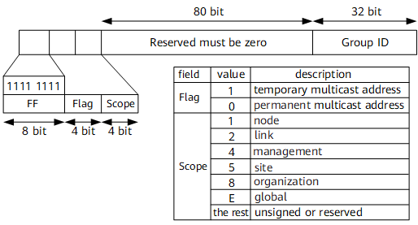

    - 一个 IPv6 组播地址由前缀，标志（Flag）字段、范围（Scope）字段以及组播组 ID（Group ID）4 个部分组成：
        - 前缀：IPv6 组播地址的前缀是 `FF00::/8`。
        - 标志字段（Flag）：长度 4bit，目前只使用了后面 3 个比特（第一位必须置 0）。当最后一位值为 0 时，表示当前的组播地址是由 IANA 所分配的一个永久分配地址；当最后一位值为 1 时，表示当前的组播地址是一个临时组播地址（非永久分配地址）。
        - 范围字段（Scope）：长度 4bit，用来限制组播数据流在网络中发送的范围。
        - 组播组 ID（Group ID）：长度 112bit，用以标识组播组。目前，RFC2373 并没有将所有的 112 位都定义成组标识，而是建议仅使用该 112 位的最低 32 位作为组播组 ID，将剩余的 80 位都置 0。这样每个组播组 ID 都映射到一个唯一的以太网组播 MAC 地址（RFC2464）。
    - 被请求节点组播地址
        - 被请求节点组播地址通过节点的单播或任播地址生成。当一个节点具有了单播或任播地址，就会对应生成一个被请求节点组播地址，并且加入这个组播组。一个单播地址或任播地址对应一个被请求节点组播地址。该地址主要用于邻居发现机制和地址重复检测功能。
        - IPv6 中没有广播地址，也不使用 ARP。但是仍然需要从 IP 地址解析到 MAC 地址的功能。在 IPv6 中，这个功能通过邻居请求 NS（Neighbor Solicitation）报文完成。当一个节点需要解析某个 IPv6 地址对应的 MAC 地址时，会发送 NS 报文，该报文的目的 IP 就是需要解析的 IPv6 地址对应的被请求节点组播地址；只有具有该组播地址的节点会检查处理。
        - 被请求节点组播地址由前缀 `FF02::1:FF00:0/104`和单播地址的最后 24 位组成。

- 任播地址：任播地址标识一组网络接口（通常属于不同的节点）。目标地址是任播地址的数据包将发送给其中路由意义上最近的一个网络接口。
    - 任播地址设计用来在给多个主机或者节点提供相同服务时提供冗余功能和负载分担功能。目前，任播地址的使用通过共享单播地址方式来完成。将一个单播地址分配给多个节点或者主机，这样在网络中如果存在多条该地址路由，当发送者发送以任播地址为目的 IP 的数据报文时，发送者无法控制哪台设备能够收到，这取决于整个网络中路由协议计算的结果。这种方式可以适用于一些无状态的应用，例如 DNS 等。
    - IPv6 中没有为任播规定单独的地址空间，任播地址和单播地址使用相同的地址空间。目前 IPv6 中任播主要应用于移动 IPv6。
    - IPv6 任播地址仅可以被分配给路由设备，不能应用于主机。任播地址不能作为 IPv6 报文的源地址。
    - 子网路由器任播地址
        - 子网路由器任播地址是已经定义好的一种任播地址（RFC3513）。发送到子网路由器任播地址的报文会被发送到该地址标识的子网中路由意义上最近的一个设备。所有设备都必须支持子网任播地址。子网路由器任播地址用于节点需要和远端子网上所有设备中的一个（不关心具体是哪一个）通信时使用。例如，一个移动节点需要和它的“家乡”子网上的所有移动代理中的一个进行通信。
        - 子网路由器任播地址由 n bit 子网前缀标识子网，其余用 0 填充。

!!! note "总结"

    | 地址 | 作用 |
    | --- | --- |
    | `::` | 未指定地址 |
    | `::1` | 环回地址 |
    | `2000::/3` | 全球单播地址 |
    | `FE80::/10` | 链路本地地址 |
    | `FC00::/7` | 唯一本地地址 |
    | `FF00::/8` | 组播地址 |
    | `FF02::1` | 链路本地范围的所有节点 |
    | `FF02::2` | 链路本地范围的所有路由器 |

### ICMPv6

在 IPv6 中，ICMPv6 除了提供 ICMPv4 常用的功能之外，还是其它一些功能的基础，如邻接点发现、无状态地址配置（包括重复地址检测）、PMTU 发现等。ICMPv6 的协议类型号（即 IPv6 报文中的 Next Header 字段的值）为 58。

ICMPv6 错误报文用于报告在转发 IPv6 数据包过程中出现的错误。ICMPv6 错误报文可以分为以下 4 种：

- 目的不可达错误报文
- 数据包过大错误报文
- 时间超时错误报文
- 参数错误报文

ICMPv6 信息报文提供诊断功能和附加的主机功能，比如多播侦听发现和邻居发现。常见的 ICMPv6 信息报文主要包括回送请求报文（Echo Request）和回送应答报文（Echo Reply），这两种报文也就是通常使用的 Ping 报文。

### NDP

邻居发现协议 NDP（Neighbor Discovery Protocol）是 IPv6 协议体系中一个重要的基础协议。邻居发现协议替代了 IPv4 的 ARP（Address Resolution Protocol）和 ICMP 路由器发现（Router Discovery），它定义了使用 ICMPv6 报文实现地址解析，跟踪邻居状态，重复地址检测，路由器发现以及重定向等功能。

#### 地址解析

在 IPv4 中，当主机需要和目标主机通信时，必须先通过 ARP 协议获得目的主机的链路层地址。在 IPv6 中，同样需要从 IP 地址解析到链路层地址的功能。邻居发现协议实现了这个功能。

!!! note "ICMPv6 与 ARP 的比较"

    ARP 报文是直接封装在以太网报文中，以太网协议类型为 `0x0806`，普遍观点认为 ARP 定位为第 2.5 层的协议。ND 本身基于 ICMPv6 实现，以太网协议类型为 0x86DD，即 IPv6 报文，IPv6 下一个报头字段值为 58，表示 ICMPv6 报文，由于 ND 协议使用的所有报文均封装在 ICMPv6 报文中，一般来说，ND 被看作第 3 层的协议。在三层完成地址解析，主要带来以下几个好处：
    
    - 地址解析在三层完成，不同的二层介质可以采用相同的地址解析协议。
    - 可以使用三层的安全机制避免地址解析攻击。
    - 使用组播方式发送请求报文，减少了二层网络的性能压力。

地址解析过程中使用了两种 ICMPv6 报文：邻居请求报文 NS（Neighbor Solicitation）和邻居通告报文 NA（Neighbor Advertisement）。

- NS 报文：在地址解析中的作用类似于 IPv4 中的 ARP 请求报文。
- NA 报文：在地址解析中的作用类似于 IPv4 中的 ARP 应答报文。

<figure markdown="span">
    <center>
    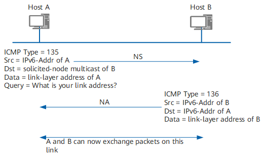{ width=80% align=center }
    </center>
    <figcaption>
    邻居发现协议
    </figcaption>
</figure>

!!! example

    Host A 在向 Host B 发送报文之前它必须要解析出 Host B 的链路层地址，所以首先 Host A 会发送一个 NS 报文，其中源地址为 Host A 的 IPv6 地址，目的地址为 Host B 的被请求节点组播地址，需要解析的目标 IP 为 Host B 的 IPv6 地址，这就表示 Host A 想要知道 Host B 的链路层地址。同时需要指出的是，在 NS 报文的 Options 字段中还携带了 Host A 的链路层地址。
    
    当 Host B 接收到了 NS 报文之后，就会回应 NA 报文，其中源地址为 Host B 的 IPv6 地址，目的地址为 Host A 的 IPv6 地址（使用 NS 报文中的 Host A 的链路层地址进行单播），Host B 的链路层地址被放在 Options 字段中。这样就完成了一个地址解析的过程。

#### 跟踪邻居状态

通过邻居或到达邻居的通信，会因各种原因而中断，包括硬件故障、接口卡的热插入等。如果目的地失效，则恢复是不可能的，通信失败；如果路径失效，则恢复是可能的。因此节点需要维护一张邻居表，每个邻居都有相应的状态，状态之间可以迁移。

RFC2461 中定义了 5 种邻居状态，分别是：未完成（Incomplete）、可达（Reachable）、陈旧（Stale）、延迟（Delay）、探查（Probe）。Empty 表示邻居表项为空。

<figure markdown="span">
    <center>
    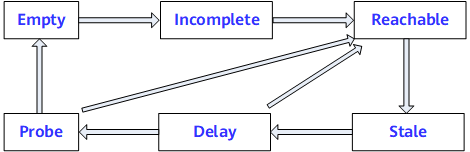{ width=80% align=center}
    </center>
    <figcaption>
    邻居状态
    </figcaption>
</figure>

!!! example

    下面以 A、B 两个邻居节点之间相互通信过程中 A 节点的邻居状态变化为例（假设 A、B 之前从未通信），说明邻居状态迁移的过程。
    
    1. A 先发送 NS 报文，并生成缓存条目，此时，邻居状态为 Incomplete。
    2. 若 B 回复 NA 报文，则邻居状态由 Incomplete 变为 Reachable，否则固定时间后邻居状态由 Incomplete 变为 Empty，即删除表项。
    3. 经过邻居可达时间，邻居状态由 Reachable 变为 Stale，即未知是否可达。
    4. 如果在 Reachable 状态，A 收到 B 的非请求 NA 报文，且报文中携带的 B 的链路层地址和表项中不同，则邻居状态马上变为 Stale。
    5. 在 Stale 状态若 A 要向 B 发送数据，则邻居状态由 Stale 变为 Delay。
    6. 在经过一段固定时间后，邻居状态由 Delay 变为 Probe，则发送 NS 请求。其间若有 NA 应答，则邻居状态由 Delay 变为 Reachable。
    7. 在 Probe 状态，A 每隔一定时间间隔发送单播 NS，发送固定次数后，有应答则邻居状态变为 Reachable，否则邻居状态变为 Empty，即删除表项。

#### 重复地址检测

重复地址检测 DAD（Duplicate Address Detect）是在接口使用某个 IPv6 单播地址之前进行的，主要是为了探测是否有其它的节点使用了该地址。尤其是在地址自动配置的时候，进行 DAD 检测是很必要的。一个 IPv6 单播地址在分配给一个接口之后且通过重复地址检测之前称为试验地址（Tentative Address）。此时该接口不能使用这个试验地址进行单播通信，但是仍然会加入两个组播组：ALL-NODES 组播组和试验地址所对应的 Solicited-Node 组播组。

IPv6 重复地址检测技术和 IPv4 中的 ARP 类似：节点向试验地址所对应的 Solicited-Node 组播组发送 NS 报文。NS 报文中目标地址即为该试验地址。如果收到某个其他站点回应的 NA 报文，就证明该地址已被网络上使用，节点将不能使用该试验地址通讯。

<figure markdown="span">
    <center>
    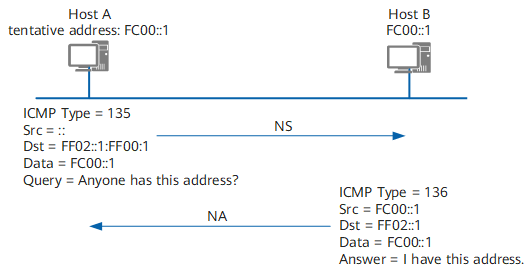{ width=80% align=center}
    </center>
    <figcaption>
    重复地址检测
    </figcaption>
</figure>

!!! example

    Host A 的 IPv6 地址 FC00::1 为新配置地址，即 FC00::1 为 Host A 的试验地址。Host A 向 FC00::1 的 Solicited-Node 组播组发送一个以 FC00::1 为请求的目标地址的 NS 报文进行重复地址检测，由于 FC00::1 并未正式指定，所以 NS 报文的源地址为未指定地址。当 Host B 收到该 NS 报文后，有两种处理方法：
    
    - 如果 Host B 发现 FC00::1 是自身的一个试验地址，则 Host B 放弃使用这个地址作为接口地址，并且不会发送 NA 报文。
    - 如果 Host B 发现 FC00::1 是一个已经正常使用的地址，Host B 会向 FF02::1 发送一个 NA 报文，该消息中会包含 FC00::1。这样，Host A 收到这个消息后就会发现自身的试验地址是重复的。Host A 上该试验地址不生效，被标识为 duplicated 状态。

#### 路由器发现

路由器发现功能用来发现与本地链路相连的设备，并获取与地址自动配置相关的前缀和其他配置参数。

在 IPv6 中，IPv6 地址可以支持无状态的自动配置，即主机通过某种机制获取网络前缀信息，然后主机自己生成地址的接口标识部分。路由器发现功能是 IPv6 地址自动配置功能的基础，主要通过以下两种报文实现：

- 路由器通告 **RA（Router Advertisement）**报文：每台设备为了让二层网络上的主机和设备知道自己的存在，定时都会组播发送 RA 报文，RA 报文中会带有网络前缀信息，及其他一些标志位信息。
- 路由器请求 **RS（Router Solicitation）**报文：很多情况下主机接入网络后希望尽快获取网络前缀进行通信，此时主机可以立刻发送 RS 报文，网络上的设备将回应 RA 报文。

<figure markdown="span">
    <center>
    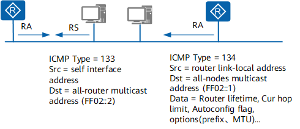{ width=80% align=center}
    </center>
    <figcaption>
    路由器发现
    </figcaption>
</figure>

#### 地址自动配置（SLAAC）

IPv4 使用 DHCP 实现自动配置，包括 IP 地址，缺省网关等信息，简化了网络管理。IPv6 地址增长为 128 位，且终端节点多，对于自动配置的要求更为迫切，除保留了 DHCP 作为有状态自动配置外，还增加了**无状态自动配置（StateLess Address AutoConfiguration，SLAAC）**。无状态自动配置即自动生成链路本地地址，主机根据 RA 报文的前缀信息，自动配置全球单播地址等，并获得其他相关信息。

IPv6 主机无状态自动配置过程：

1. 根据接口标识产生链路本地地址。
2. 发出邻居请求，进行重复地址检测。
3. 如地址冲突，则停止自动配置，需要手工配置。
4. 如不冲突，链路本地地址生效，节点具备本地链路通信能力。
5. 主机会发送 RS 报文（或接收到设备定期发送的 RA 报文）。
6. **根据 RA 报文中的前缀信息和接口标识得到 IPv6 地址**。

!!! note "从第 6 步可以知道，如果没有 RA 报文，则无法进行 SLAAC 自动配置。"

#### 默认路由器优先级和路由信息发现

当主机所在的链路中存在多个设备时，主机需要根据报文的目的地址选择转发设备。在这种情况下，设备通过发布默认路由优先级和特定路由信息给主机，提高主机根据不同的目的地选择合适的转发设备的能力。

在 RA 报文中，定义了默认路由优先级和路由信息两个字段，帮助主机在发送报文时选择合适的转发设备。

主机收到包含路由信息的 RA 报文后，会更新自己的路由表。当主机向其他设备发送报文时，通过查询该列表的路由信息，选择合适的路由发送报文。

主机收到包含默认设备优先级信息的 RA 报文后，会更新自己的默认路由列表。当主机向其他设备发送报文时，如果没有路由可选，则首先查询该列表，然后选择本链路内优先级最高的设备发送报文；如果该设备故障，主机根据优先级从高到低的顺序，依次选择其他设备。

#### 重定向

当网关设备发现报文从其它网关设备转发更好，它就会发送重定向报文告知报文的发送者，让报文发送者选择另一个网关设备。重定向报文也承载在 ICMPv6 报文中，报文中会携带更好的路径下一跳地址和需要重定向转发的报文的目的地址等信息。

<figure markdown="span">
    <center>
    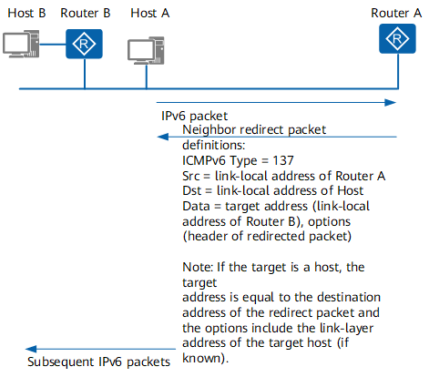{ width=80% align=center}
    </center>
    <figcaption>
    重定向
    </figcaption>
</figure>

!!! exmaple

    Host A 需要和 Host B 通信，Host A 的默认网关设备是 Router A，当 Host A 发送报文给 Host B 时报文会被送到 Router A。Router A 接收到 Host A 发送的报文以后会发现实际上 Host A 直接发送给 Router B 更好，它将发送一个重定向报文给主机 A，其中报文中更好的路径下一跳地址为 Router B，Destination Address 为 Host B。Host A 接收到了重定向报文之后，会在默认路由表中添加一个主机路由，以后发往 Host B 的报文就直接发送给 Router B。

当设备收到一个报文后，只有在如下情况下，设备会向报文发送者发送重定向报文：

- 报文的目的地址不是一个组播地址。
- 报文并非通过路由转发给设备。
- 经过路由计算后，路由的下一跳出接口是接收报文的接口。
- 设备发现报文的最佳下一跳 IP 地址和报文的源 IP 地址处于同一网段。
- 设备检查报文的源地址，发现自身的邻居表项中有用该地址作为全球单播地址或链路本地地址的邻居存在。

## IPv6 实践

### 校园网 SLAAC

目前，东四教学楼（即集群所在区域）采用 SLAAC 自动配置，让我们来看一下 SLAAC 自动配置的过程。

<figure markdown="span">
    <center>
    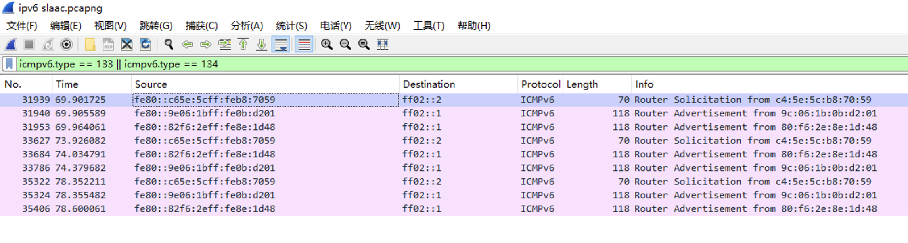{ width=80% align=center}
    </center>
    <figcaption>
    WireShark 抓取到的 RS、RA 报文
    </figcaption>
</figure>

上图展示了在校园网抓包时捕获到的 RS 和 RA 报文。可以看到设备接入网络后向 `FF02::2` 组播地址发送 RS 报文（还记得这个组播地址代表什么吗？），路由器接收到 RS 报文后，向 `FF02::1` 组播地址发送 RA 报文，其中包含了前缀信息。在上图中总是能看到两个 RA 报文，其中第二个 RA 报文到达的时间晚约 0.3 秒。我们取其中一个 RA 报文进行分析：

```text
Internet Control Message Protocol v6
    Type: Router Advertisement (134)
    Code: 0
    Checksum: 0x89b9 [correct]
    [Checksum Status: Good]
    Cur hop limit: 64
    Flags: 0x00, Prf (Default Router Preference): Medium
    Router lifetime (s): 1800
    Reachable time (ms): 0
    Retrans timer (ms): 0
    ICMPv6 Option (Source link-layer address : 9c:06:1b:0b:d2:01)
        Type: Source link-layer address (1)
        Length: 1 (8 bytes)
        Link-layer address: H3CTechnolog_0b:d2:01 (9c:06:1b:0b:d2:01)
    ICMPv6 Option (MTU : 1500)
        Type: MTU (5)
        Length: 1 (8 bytes)
        Reserved
        MTU: 1500
    ICMPv6 Option (Prefix information : 2001:da8:e000:731a::/64)
        Type: Prefix information (3)
        Length: 4 (32 bytes)
        Prefix Length: 64
        Flag: 0xc0, On-link flag(L), Autonomous address-configuration flag(A)
        Valid Lifetime: 2592000 (30 days)
        Preferred Lifetime: 604800 (7 days)
        Reserved
        Prefix: 2001:da8:e000:731a::
```

可以看到 RA 报文中携带了前缀信息。设备收到 RA 报文后，根据前缀信息自动配置 IPv6 地址。这一过程通常采用 EUI-64 算法，即将 MAC 地址的中间 16 位 `FFFE` 插入到 MAC 地址的中间，然后将第 7 位取反，作为接口标识。

如果收到了多个 RA 报文，并且这些报文中的前缀信息不同，则设备会具有多个 SLAAC 的 IPv6 地址。

### 华为路由器配置 SLAAC

要在局域网中配置 SLAAC，就是要在路由器上配置 RA 报文发送。在华为路由器文档中，这块内容位于“配置邻居发现功能”章节。缺省情况下，RA 报文中的前缀信息为发送 RA 报文接口所在链路的网络前缀。

```text
interface interface-type interface-number
# 开启 IPv6 RA 报文发布
undo ipv6 nd ra halt
# 按需配置 RA 报文中携带的前缀
ipv6 nd ra prefix ipv6-address prefix-length valid-lifetime preferred-lifetime [ no-autoconfig ] [ off-link ]
```

## DHCPv6 原理

目前 IPv6 地址的分配方法有以下几种：

- 手动配置。手动配置 IPv6 地址/前缀及其他网络配置参数（DNS、NIS、SNTP 服务器地址等参数）。
- 无状态自动地址分配。由接口 ID 生成链路本地地址，再根据路由通告报文 RA（Router Advertisement）包含的前缀信息自动配置本机地址。
- 有状态自动地址分配，即 DHCPv6 方式。DHCPv6 又分为如下两种：
    - DHCPv6 有状态自动分配。DHCPv6 服务器自动分配 IPv6 地址/PD 前缀及其他网络配置参数（DNS、NIS、SNTP 服务器地址等参数）。
    - DHCPv6 无状态自动分配。主机 IPv6 地址仍然通过路由通告方式自动生成，DHCPv6 服务器只分配除 IPv6 地址以外的配置参数，包括 DNS、NIS、SNTP 服务器等参数。

### DHCPv6 基本概念

- 组播地址
    - 在 DHCPv6 协议中，客户端不用配置 DHCPv6 Server 的 IPv6 地址，而是发送目的地址为组播地址的 Solicit 报文来定位 DHCPv6 服务器。
    - 在 DHCPv4 协议中，客户端发送广播报文来定位服务器。为避免广播风暴，在 IPv6 中，已经没有了广播类型的报文，而是采用组播报文。DHCPv6 用到的组播地址有两个：
        - `FF02::1:2`（All DHCP Relay Agents and Servers）：所有 DHCPv6 服务器和中继代理的组播地址，这个地址是链路范围的，用于客户端和相邻的服务器及中继代理之间通信。所有 DHCPv6 服务器和中继代理都是该组的成员。
        - FF05::1:3（All DHCP Servers）：所有 DHCPv6 服务器组播地址，这个地址是站点范围的，用于中继代理和服务器之间的通信，站点内的所有 DHCPv6 服务器都是此组的成员。
- UDP 端口号
    - DHCPv6 报文承载在 UDPv6 上。
    - 客户端侦听的 UDP 目的端口号是 546。
    - 服务器、中继代理侦听的 UDP 端口号是 547。
- DHCP 唯一标识符（DUID）
    - DHCP 设备唯一标识符 DUID（DHCPv6 Unique Identifier），每个服务器或客户端有且只有一个唯一标识符，服务器使用 DUID 来识别不同的客户端，客户端则使用 DUID 来识别服务器。
    - 客户端和服务器 DUID 的内容分别通过 DHCPv6 报文中的 Client Identifier 和 Server Identifier 选项来携带。两种选项的格式一样，通过 option-code 字段的取值来区分是 Client Identifier 还是 Server Identifier 选项。
- 身份联盟（IA）
    - 身份联盟 IA（Identity Association）是使得服务器和客户端能够识别、分组和管理一系列相关 IPv6 地址的结构。每个 IA 包括一个 IAID 和相关联的配置信息。
    - 客户端必须为它的每一个要通过服务器获取 IPv6 地址的接口关联至少一个 IA。客户端用给接口关联的 IA 来从服务器获取配置信息。每个 IA 必须明确关联到一个接口。
    - IA 的身份由 IAID 唯一确定，同一个客户端的 IAID 不能出现重复。IAID 不应因为设备的重启等因素发生丢失或改变。
    - IA 中的配置信息由一个或多个 IPv6 地址以及 T1 和 T2 生存期组成。IA 中的每个地址都有首选生存期和有效生存期。
    - 一个接口至少关联一个 IA，一个 IA 可以包含一个或多个地址信息。

### DHCPv6 报文格式

目前 DHCPv6 定义了如下十三种类型报文，DHCPv6 服务器和 DHCPv6 客户端之间通过这十三种类型的报文进行通信。下表对 DHCPv6 和 DHCPv4 报文进行了类比。

| 报文类型 | DHCPv6 报文          | DHCPv4 报文    | 说明                                                         |
| -------- | ------------------- | ------------- | ------------------------------------------------------------ |
| 1        | SOLICIT             | DHCP DISCOVER | DHCPv6 客户端使用 Solicit 报文来确定 DHCPv6 服务器的位置。        |
| 2        | ADVERTISE           | DHCP OFFER    | DHCPv6 服务器发送 Advertise 报文来对 Solicit 报文进行回应，宣告自己能够提供 DHCPv6 服务。 |
| 3        | REQUEST             | DHCP REQUEST  | DHCPv6 客户端发送 Request 报文来向 DHCPv6 服务器请求 IPv6 地址和其它配置信息。 |
| 4        | CONFIRM             | -             | DHCPv6 客户端向任意可达的 DHCPv6 服务器发送 Confirm 报文检查自己目前获得的 IPv6 地址是否适用与它所连接的链路。 |
| 5        | RENEW               | DHCP REQUEST  | DHCPv6 客户端向给其提供地址和配置信息的 DHCPv6 服务器发送 Renew 报文来延长地址的生存期并更新配置信息。 |
| 6        | REBIND              | DHCP REQUEST  | 如果 Renew 报文没有得到应答，DHCPv6 客户端向任意可达的 DHCPv6 服务器发送 Rebind 报文来延长地址的生存期并更新配置信息。 |
| 7        | REPLY               | DHCP ACK/NAK  | DHCPv6 服务器在以下场合发送 Reply 报文：DHCPv6 服务器发送携带了地址和配置信息的 Reply 消息来回应从 DHCPv6 客户端收到的 Solicit、Request、Renew、Rebind 报文。DHCPv6 服务器发送携带配置信息的 Reply 消息来回应收到的 Information-Request 报文。用来回应 DHCPv6 客户端发来的 Confirm、Release、Decline 报文。 |
| 8        | RELEASE             | DHCP RELEASE  | DHCPv6 客户端向为其分配地址的 DHCPv6 服务器发送 Release 报文，表明自己不再使用一个或多个获取的地址。 |
| 9        | DECLINE             | DHCP DECLINE  | DHCPv6 客户端向 DHCPv6 服务器发送 Decline 报文，声明 DHCPv6 服务器分配的一个或多个地址在 DHCPv6 客户端所在链路上已经被使用了。 |
| 10       | RECONFIGURE         | -             | DHCPv6 服务器向 DHCPv6 客户端发送 Reconfigure 报文，用于提示 DHCPv6 客户端，在 DHCPv6 服务器上存在新的网络配置信息。 |
| 11       | INFORMATION-REQUEST | DHCP INFORM   | DHCPv6 客户端向 DHCPv6 服务器发送 Information-Request 报文来请求除 IPv6 地址以外的网络配置信息。 |
| 12       | RELAY-FORW          | -             | 中继代理通过 Relay-Forward 报文来向 DHCPv6 服务器转发 DHCPv6 客户端请求报文。 |
| 13       | RELAY-REPL          | -             | DHCPv6 服务器向中继代理发送 Relay-Reply 报文，其中携带了转发给 DHCPv6 客户端的报文。 |

### DHCPv6 有状态自动分配

IPv6 主机通过有状态 DHCPv6 方式获取 IPv6 地址和其他配置参数（例如 DNS 服务器的 IPv6 地址等）。

DHCPv6 服务器为客户端分配地址/前缀的过程分为两类：

- DHCPv6 四步交互分配过程
- DHCPv6 两步交互快速分配过程

#### DHCPv6 四步交互

四步交互常用于网络中有多个 DHCPv6 服务器的情况。DHCPv6 客户端首先通过组播发送 Solicit 报文来定位可以为其提供服务的 DHCPv6 服务器，在收到多个 DHCPv6 服务器的 Advertise 报文后，根据 DHCPv6 服务器的优先级选择一个为其分配地址和配置信息的服务器，接着通过 Request/Reply 报文交互完成地址申请和分配过程。

DHCPv6 服务器端如果没有配置使能两步交互，无论客户端报文中是否包含 Rapid Commit 选项，服务器都采用四步交互方式为客户端分配地址和配置信息。

<figure markdown="span">
    <center>
    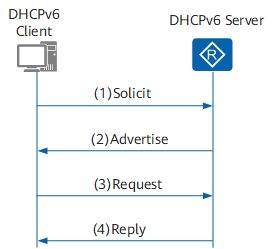{ width=80% align=center}
    </center>
    <figcaption>
    DHCPv6 四步交互地址分配过程
    </figcaption>
</figure>

DHCPv6 四步交互地址分配过程如下：

1. DHCPv6 客户端发送 Solicit 报文，请求 DHCPv6 服务器为其分配 IPv6 地址和网络配置参数。
2. 如果 Solicit 报文中没有携带 Rapid Commit 选项，或 Solicit 报文中携带 Rapid Commit 选项，但服务器不支持快速分配过程，则 DHCPv6 服务器回复 Advertise 报文，通知客户端可以为其分配的地址和网络配置参数。
3. 如果 DHCPv6 客户端接收到多个服务器回复的 Advertise 报文，则根据 Advertise 报文中的服务器优先级等参数，选择优先级最高的一台服务器，并向所有的服务器发送 Request 组播报文，该报文中携带已选择的 DHCPv6 服务器的 DUID。
4. DHCPv6 服务器回复 Reply 报文，确认将地址和网络配置参数分配给客户端使用。

#### DHCPv6 两步交互

两步交互常用于网络中只有一个 DHCPv6 服务器的情况。DHCPv6 客户端首先通过组播发送 Solicit 报文来定位可以为其提供服务的 DHCPv6 服务器，DHCPv6 服务器收到客户端的 Solicit 报文后，为其分配地址和配置信息，直接回应 Reply 报文，完成地址申请和分配过程。

两步交换可以提高 DHCPv6 过程的效率，但在有多个 DHCPv6 服务器的网络中，多个 DHCPv6 服务器都可以为 DHCPv6 客户端分配 IPv6 地址，回应 Reply 报文，但是客户端实际只可能使用其中一个服务器为其分配的 IPv6 地址和配置信息。为了防止这种情况的发生，管理员可以配置 DHCPv6 服务器是否支持两步交互地址分配方式。

- DHCPv6 服务器端如果配置使能了两步交互，并且客户端报文中也包含 Rapid Commit 选项，服务器采用两步交互方式为客户端分配地址和配置信息。
- 如果 DHCPv6 服务器不支持快速分配地址，则采用四步交互方式为客户端分配 IPv6 地址和其他网络配置参数。

<figure markdown="span">
    <center>
    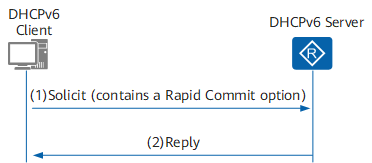{ width=80% align=center}
    </center>
    <figcaption>
    DHCPv6 两步交互地址分配过程
    </figcaption>
</figure>

DHCPv6 两步交互地址分配过程如下：

1. DHCPv6 客户端在发送的 Solicit 报文中携带 Rapid Commit 选项，标识客户端希望服务器能够快速为其分配地址和网络配置参数。
2. DHCPv6 服务器接收到 Solicit 报文后，将进行如下处理：
   - 如果 DHCPv6 服务器支持快速分配地址，则直接返回 Reply 报文，为客户端分配 IPv6 地址和其他网络配置参数，Reply 报文中也携带 Rapid Commit 选项。
   - 如果 DHCPv6 服务器不支持快速分配过程，则采用四步交互方式为客户端分配 IPv6 地址/前缀和其他网络配置参数。

### DHCPv6 无状态自动分配

IPv6 节点可以通过 DHCPv6 无状态方式获取配置参数（包括 DNS、SIP、SNTP 等服务器配置信息，不包括 IPv6 地址）。

<figure markdown="span">
    <center>
    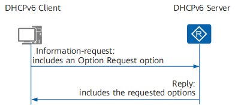{ width=80% align=center}
    </center>
    <figcaption>
    DHCPv6 无状态自动分配过程
    </figcaption>
</figure>

DHCPv6 无状态工作过程如下：

1. DHCPv6 客户端以组播方式向 DHCPv6 服务器发送 Information-Request 报文，该报文中携带 Option Request 选项，指定 DHCPv6 客户端需要从 DHCPv6 服务器获取的配置参数。
2. DHCPv6 服务器收到 Information-Request 报文后，为 DHCPv6 客户端分配网络配置参数，并单播发送 Reply 报文，将网络配置参数返回给 DHCPv6 客户端。DHCPv6 客户端根据收到 Reply 报文提供的参数完成 DHCPv6 客户端无状态配置。

### DHCPv6 PD 工作原理

DHCPv6 前缀代理 DHCPv6 PD(Prefix Delegation) 是一种前缀分配机制，并在 RFC3633 中得以标准化。在一个层次化的网络拓扑结构中，不同层次的 IPv6 地址分配一般是手工指定的。手工配置 IPv6 地址扩展性不好，不利于 IPv6 地址的统一规划管理。

通过 DHCPv6 前缀代理机制，下游网络设备不需要再手工指定用户侧链路的 IPv6 地址前缀，它只需要向上游网络设备提出前缀分配申请，上游网络设备便可以分配合适的地址前缀给下游设备，下游设备把获得的前缀 (一般前缀长度小于 64) 进一步自动细分成 64 前缀长度的子网网段，把细分的地址前缀再通过路由通告 (RA) 至与 IPv6 主机直连的用户链路上，实现 IPv6 主机的地址自动配置，完成整个系统层次的地址布局。

<figure markdown="span">
    <center>
    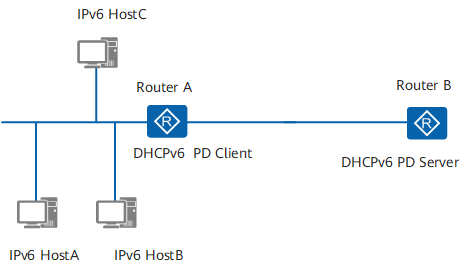{ width=80% align=center}
    </center>
    <figcaption>
    DHCPv6 PD 工作原理
    </figcaption>
</figure>

DHCPv6 PD 的工作方式与 DHCPv6 有状态自动分配类似，支持四步或两步交互，只是 DHCPv6 报文中包含 PD 前缀信息。

### DHCPv6 中继工作原理

DHCPv6 客户端通过 DHCPv6 中继转发报文，获取 IPv6 地址/前缀和其他网络配置参数（例如 DNS 服务器的 IPv6 地址等）。

<figure markdown="span">
    <center>
    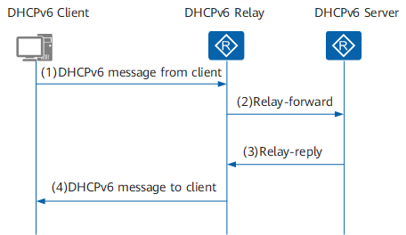{ width=80% align=center}
    </center>
    <figcaption>
    DHCPv6 中继工作原理
    </figcaption>
</figure>

DHCPv6 中继工作交互过程如下：

1. DHCPv6 客户端向所有 DHCPv6 服务器和 DHCPv6 中继发送目的地址为 FF02::1:2（组播地址）的请求报文。
1. 根据 DHCPv6 中继转发报文有如下两种情况：
    - 如果 DHCPv6 中继和 DHCPv6 客户端位于同一个链路上，即 DHCPv6 中继为 DHCPv6 客户端的第一跳中继，中继转发直接来自客户端的报文，此时 DHCPv6 中继实质上也是客户端的 IPv6 网关设备。DHCPv6 中继收到客户端的报文后，将其封装在 Relay-Forward 报文的中继消息选项（Relay Message Option）中，并将 Relay-Forward 报文发送给 DHCPv6 服务器或下一跳中继。
    - 如果 DHCPv6 中继和 DHCPv6 客户端不在同一个链路上，中继收到的报文是来自其他中继的 Relay-Forward 报文。中继构造一个新的 Relay-Forward 报文，并将 Relay-Forward 报文发送给 DHCPv6 服务器或下一跳中继。
1. DHCPv6 服务器从 Relay-Forward 报文中解析出 DHCPv6 客户端的请求，为 DHCPv6 客户端选取 IPv6 地址和其他配置参数，构造应答消息，将应答消息封装在 Relay-Reply 报文的中继消息选项中，并将 Relay-Reply 报文发送给 DHCPv6 中继。
1. DHCPv6 中继从 Relay-Reply 报文中解析出 DHCPv6 服务器的应答，转发给 DHCPv6 客户端。如果 DHCPv6 客户端接收到多个 DHCPv6 服务器的应答，则根据报文中的服务器优先级选择一个 DHCPv6 服务器，后续从该 DHCPv6 服务器获取 IPv6 地址和其他网络配置参数。

## DHCPv6 实践

### 校园网有状态 DHCPv6

目前，玉泉校区 32 舍有线网络采用 DHCPv6 有状态配置，让我们来看一下 DHCPv6 有状态配置的过程。

<figure markdown="span">
    <center>
    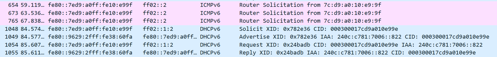{ width=80% align=center}
    </center>
    <figcaption>
    WireShark 抓取到的 DHCPv6 报文
    </figcaption>
</figure>

上图展示了在校园网抓包时捕获到的 DHCPv6 报文。可以看到设备接入网络后首先发送 RS 报文尝试进行 SLAAC 配置，没有应答。使能设备的 DHCPv6 客户端功能，设备向组播地址 `FF02::1:2` 发送 DHCPv6 Solicit 报文（还记得这个组播地址代表什么吗？）尝试进行 DHCPv6 有状态配置。局域网中的 DHCPv6 服务器接收到 Solicit 报文后，向设备发送 Advertise 报文，其中包含 IA Address 即为服务器分配给客户端的 IPv6 地址。随后的 Request 和 Reply 完成 DHCPv6 配置。

让我们看看 Advertise 报文的详细内容：

```text
DHCPv6
    Message type: Advertise (2)
    Transaction ID: 0x8ed327
    Identity Association for Non-temporary Address
        Option: Identity Association for Non-temporary Address (3)
        Length: 40
        IAID: 00000002
        T1: 302400
        T2: 483840
        IA Address
            Option: IA Address (5)
            Length: 24
            IPv6 address: ****:****:****:****:****:****:****:****
            Preferred lifetime: 604800
            Valid lifetime: 2592000
    Client Identifier
    Server Identifier
```

### 华为路由器配置 IPv6 中继

在上一节我们已经看到，校园网 DHCPv6 下发的 IPv6 地址前缀为 128 位，这样的地址连 DHCPv6 中继都无法配置。因此本节内容在校园网没什么用，仅作为一次尝试的记录。

```text
# 配置 DHCPv6 服务器组
dhcpv6 server group zju
# 在这一步失败了，无法获知校园网 DHCPv6 服务器的全球单播地址
dhcpv6-server ???????
quit
# 在 VLANIF 接口上配置 DHCPv6 中继
interface vlanif 1
dhcpv6 relay server-select zju
# 配置邻居发现报文中的标志，以告知启用 DHCPv6 有状态配置
ipv6 nd autoconfig managed-address-flag
ipv6 nd autoconfig other-flag
```
