---
tags:
  - stable
---

# L2TP

!!! quote

    - [L2TP 配置 - 华为](https://support.huawei.com/enterprise/zh/doc/EDOC1100332366/83e5177f?idPath=24030814|21782164|7923148|256863201)
    - [L2TP Tunnel Setup and Teardown - Cisco](https://www.cisco.com/c/en/us/support/docs/dial-access/virtual-private-dialup-network-vpdn/23980-l2tp-23980.html)
    - [L2TP 接入特性描述 - 华为](https://support.huawei.com/hedex/hdx.do?docid=EDOC1100168801&id=ZH-CN_CONCEPT_0172359012)

二层隧道协议（Layer 2 Tunneling Protocol，L2TP）是虚拟私有拨号网（Virtual Private Dial-up Network，VPDN）隧道协议的一种。L2TP 协议提供了对 PPP 链路层数据包的隧道（Tunnel）传输支持，允许二层链路端点和 PPP 会话点驻留在不同设备上，并采用包交换技术进行信息交互，从而扩展了 PPP 模型。L2TP 功能可以简单描述为在非点对点的网络上建立点对点的 PPP 会话连接。L2TP 协议结合了二层转发协议（Layer 2 Forwarding，L2F）协议和点对点隧道协议（Point-to-Point Tunneling protocol，PPTP）协议的优点，成为 IETF 有关二层隧道协议的工业标准。

L2TP 是应用于远程办公场景中为出差员工远程访问企业内网资源提供接入服务的一种重要 VPN 技术。传统的拨号网络需要租用因特网服务提供商（Internet Service Provider，ISP）的电话线路，申请公共的号码或 IP 地址，不仅产生高额的费用，而且无法为远程用户尤其是出差员工提供便利的接入服务。L2TP 技术出现以后，使用 L2TP 隧道承载 PPP 报文在 Internet 上传输成为了解决上述问题的一种途径。无论出差员工是通过传统拨号方式接入 Internet，还是通过以太网方式接入 Internet，L2TP 都可以提供远程接入服务。

在了解 L2TP 之前，先让我们来了解一下 PPP 协议。

## PPP 原理

点对点协议（Point-to-Point Protocol，PPP）

!!! quote

    - [RFC 1661 - The Point-to-Point Protocol (PPP)](https://datatracker.ietf.org/doc/html/rfc1661)
    - [1. Intro to the Point to Point Protocol PPP - YouTube](https://www.youtube.com/watch?v=7PtTn38f4os&ab_channel=SystemEngineer)
    - [PPP 配置 - 华为](https://support.huawei.com/enterprise/zh/doc/EDOC1100112418/294c574c)
    - [PPP - WireShark](https://wiki.wireshark.org/PPP)

PPP 诞生的目的是为了封装三层网络协议，使得两个节点之间的通信可以跨越不同的物理链路。

### PPP 组成部分

PPP 由两个部分组成：

- 链路控制协议（Link Control Protocol，LCP）：建立、配置、测试链路。包括认证、错误检测、多路复用、环回检测等功能。
- 网络控制协议（Network Control Protocol，NCP）：配置网络层协议。对于 PPP 封装的每一种网络层协议，都需要一个 NCP。比如对于 IPv4 是 IPCP，对于 IPv6 是 IPv6CP。

<figure markdown="span">
    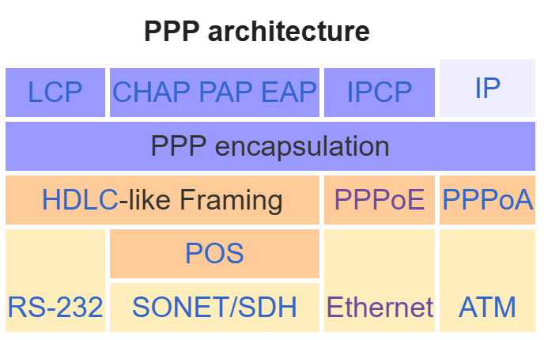{ width=50% align=center style="float: left;" }
    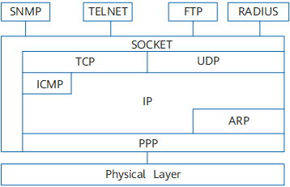{ width=50% align=center }
    <figcaption>
    PPP 协议栈
    <br/><small>
    [Wikipedia](https://en.wikipedia.org/wiki/Point-to-Point_Protocol), [Huawei](https://support.huawei.com/enterprise/en/doc/EDOC1100112361/a57612e/ppp-packet-format)
    </small>
    </figcaption>
</figure>

### PPP 帧格式

<figure markdown="span">
    <center>
    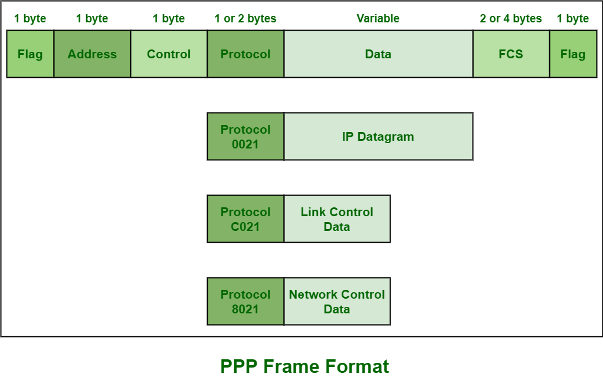{ width=80% align=center }
    </center>
    <figcaption>
    PPP 帧格式
    <br/><small>
    [GeeksforGeeks](https://www.geeksforgeeks.org/point-to-point-protocol-ppp-frame-format/)
    </small>
    </figcaption>
</figure>

### LCP

!!! quote

    - [Protocols/lcp - WireShark](https://wiki.wireshark.org/Protocols/lcp)
    - [PPP Link Control Protocol (LCP) - Huawei](https://forum.huawei.com/enterprise/en/ppp-link-control-protocol-lcp/thread/765272277523587072-667213852955258880)

当 PPP 帧 Protocol 字段为 `0xC021` 时，表示 LCP 协议。

<figure markdown="span">
    <center>
    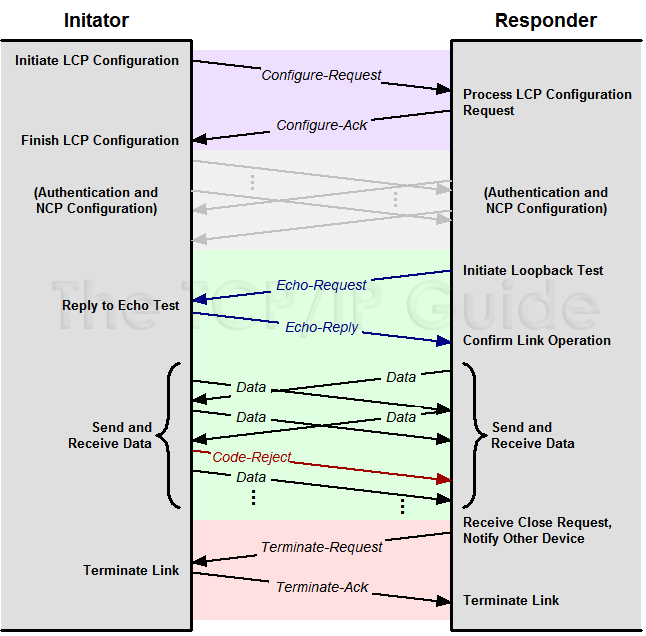{ width=80% align=center }
    </center>
    <figcaption>
    LCP 时序图
    <br/><small>
    [The TCP/IP Guide](http://www.tcpipguide.com/free/t_PPPLinkControlProtocolLCP.htm)
    </small>
    </figcaption>
</figure>

<figure markdown="span">
    <center>
    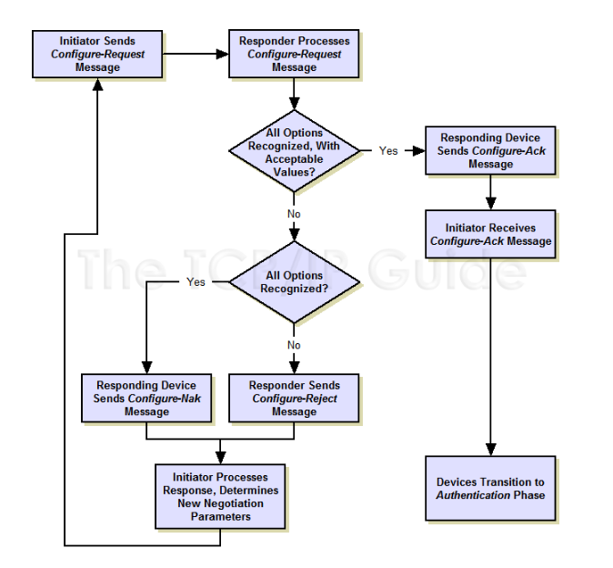{ width=80% align=center }
    </center>
    <figcaption>
    LCP 状态图
    <br/><small>
    [The TCP/IP Guide](http://www.tcpipguide.com/free/t_PPPLinkControlProtocolLCP-2.htm)
    </small>
    </figcaption>
</figure>

### CHAP

挑战 - 应答认证协议（Challenge-Handshake Authentication Protocol，CHAP）

!!! quote

    - [RFC 1994 - PPP Challenge Handshake Authentication Protocol (CHAP)](https://datatracker.ietf.org/doc/html/rfc1994)

CHAP 验证协议为三次握手验证协议。它只在网络上传输用户名，而并不传输用户密码，因此安全性要比 PAP 高。

<figure markdown="span">
    <center>
    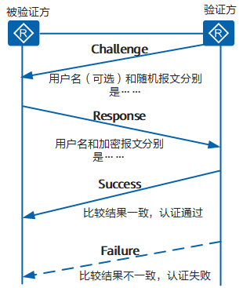
    </center>
    <figcaption>
    CHAP 时序图
    <br/><small>
    [Huawei](https://support.huawei.com/enterprise/zh/doc/EDOC1100112418/935e3094)
    </small>
    </figcaption>
</figure>

### IPCP

IP 控制协议（IP Control Protocol，IPCP）

!!! quote

    - [RFC 1332 - The PPP Internet Protocol Control Protocol (IPCP)](https://datatracker.ietf.org/doc/html/rfc1332)

IPCP 是 PPP 的一个 NCP，用于配置 IPv4 协议。协商内容包括 IP 地址、DNS 服务器地址等。

<figure markdown="span">
    <center>
    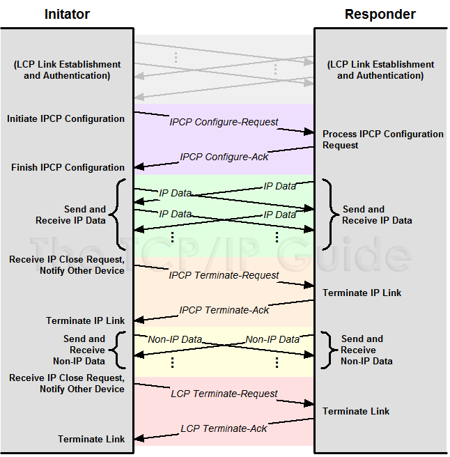{ width=80% align=center }
    </center>
    <figcaption>
    IPCP 时序图
    <br/><small>
    [The TCP/IP Guide](http://www.tcpipguide.com/free/t_PPPNetworkControlProtocolsIPCPIPXCPNBFCPandothers-2.htm)
    </small>
    </figcaption>
</figure>

### PPP 建链过程

<figure markdown="span">
    <center>
    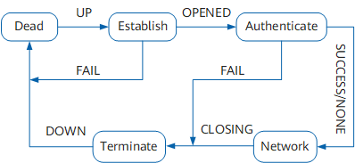
    </center>
    <figcaption>
    PPP 状态图
    <br/><small>
    [Huawei](https://support.huawei.com/enterprise/zh/doc/EDOC1100112418/935e3094)
    </small>
    </figcaption>
</figure>

PPP 运行的过程简单描述如下：

1. 通信双方开始建立 PPP 链路时，先进入到 Establish 阶段。
2. 在 Establish 阶段，PPP 链路进行 LCP 协商。协商内容包括工作方式是 SP（Single-link PPP）还是 MP（Multilink PPP）、最大接收单元 MRU（Maximum Receive Unit）、验证方式和魔术字（magic number）等选项。LCP 协商成功后进入 Opened 状态，表示底层链路已经建立。
3. 如果配置了验证，将进入 Authenticate 阶段，开始 CHAP 或 PAP 验证。如果没有配置验证，则直接进入 Network 阶段。
4. 在 Authenticate 阶段，如果验证失败，进入 Terminate 阶段，拆除链路，LCP 状态转为 Down。如果验证成功，进入 Network 阶段，此时 LCP 状态仍为 Opened。
5. 在 Network 阶段，PPP 链路进行 NCP 协商。通过 NCP 协商来选择和配置一个网络层协议并进行网络层参数协商。只有相应的网络层协议协商成功后，该网络层协议才可以通过这条 PPP 链路发送报文。
6. NCP 协商包括 IPCP（IP Control Protocol）、MPLSCP（MPLS Control Protocol）等协商。IPCP 协商内容主要包括双方的 IP 地址。
7. NCP 协商成功后，PPP 链路将一直保持通信。PPP 运行过程中，可以随时中断连接，物理链路断开、认证失败、超时定时器时间到、管理员通过配置关闭连接等动作都可能导致链路进入 Terminate 阶段。
8. 在 Terminate 阶段，如果所有的资源都被释放，通信双方将回到 Dead 阶段，直到通信双方重新建立 PPP 连接，开始新的 PPP 链路建立。

## L2TP 原理

### L2TP 组成部分

- PPP 终端：L2TP 应用中，PPP 终端指发起拨号，将数据封装为 PPP 类型的设备，如远程用户 PC、企业分支网关等均可作为 PPP 终端。
- L2TP 访问集中器（L2TP Access Concentrator，LAC）：交换网络上具有 PPP 和 L2TP 协议处理能力的设备。LAC 根据 PPP 报文中所携带的用户名或者域名信息，和 LNS 建立 L2TP 隧道连接，将 PPP 协商延展到 LNS。
    - NAS-Initiated 场景：在传统的拨号网络中，ISP 在 NAS 上部署 LAC，或在企业分支的以太网络中，为 PPP 终端配备网关设备，网关作为 PPPoE 服务器，同时部署为 LAC。
    - L2TP Client-Initiated 场景：企业分支在网关设备配置可以主动向 LNS 发起 L2TP 隧道连接请求的 L2TP Client，不需要远端系统拨号触发，L2TP Client 为 LAC。
    - Client-Initiated 场景：出差人员使用 PC 或移动终端接入 Internet，在 PC 或移动终端上使用 L2TP 拨号软件，则 PC 或移动终端终端为 LAC。
    - LAC 可以发起建立多条 L2TP 隧道使数据流之间相互隔离。
- L2TP 网络服务器（L2TP Network Server，LNS）：终止 PPP 会话的一端，通过 LNS 的认证，PPP 会话协商成功，远程用户可以访问企业总部的资源。对 L2TP 协商，LNS 是 LAC 的对端设备，即 LAC 和 LNS 建立了 L2TP 隧道；对 PPP，LNS 是 PPP 会话的逻辑终止端点，即 PPP 终端和 LNS 建立了一条点到点的虚拟链路。LNS 位于企业总部私网与公网边界，通常是企业总部的网关设备。必要时，LNS 还兼有网络地址转换（NAT）功能，对企业总部网络内的私有 IP 地址与公共 IP 地址进行转换。

在 LAC 和 LNS 的 L2TP 交互过程中存在两种类型的连接。

- 隧道（Tunnel）连接：L2TP 隧道在 LAC 和 LNS 之间建立，一对 LAC 和 LNS 可以建立多个 L2TP 隧道，一个 L2TP 隧道可以包含多个 L2TP 会话。
- 会话（Session）连接：L2TP 会话发生在隧道连接成功之后，L2TP 会话承载在 L2TP 隧道之上，每个 L2TP 会话对应一个 PPP 会话，PPP 会话的数据帧通过 L2TP 会话所在的 L2TP 隧道传输。

### L2TP 报文

在 L2TP 隧道中交换的的数据包可分类为控制数据包或是数据包。L2TP 提供控制数据包的可靠性，数据包则没有。

<figure markdown="span">
    <center>
    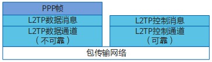{ width=80% align=center }
    </center>
    <figcaption>
    L2TP 协议架构
    <br/><small>
    [Huawei](https://support.huawei.com/enterprise/zh/doc/EDOC1100332366/1aec46c5)
    </small>
    </figcaption>
</figure>

- 控制消息：用于 L2TP 隧道和会话连接的建立、维护和拆除。在控制消息的传输过程中，使用消息丢失重传和定时检测隧道连通性等机制来保证控制消息传输的可靠性，支持对控制消息的流量控制和拥塞控制。
    - AVP：控制消息中的参数统一使用属性值对（Attribute Value Pair，AVP）来表示，使得协议具有很好的互操作性和可扩展性。控制消息包含多个 AVP。
- 数据消息：用于封装 PPP 数据帧并在隧道上传输。数据消息是不可靠的传输，不重传丢失的数据报文，不支持对数据消息的流量控制和拥塞控制。

<figure markdown="span">
    <center>
    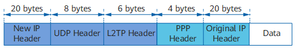{ width=80% align=center }
    </center>
    <figcaption>
    L2TP 报文格式
    <br/><small>
    [Huawei](https://support.huawei.com/enterprise/zh/doc/EDOC1100332366/1aec46c5)
    </small>
    </figcaption>
</figure>

!!! warning "报文长度"

    L2TP 报文进行了多次封装，比原始报文多出 38 个字节（如果需要携带序列号信息，则比原始报文多出 42 个字节），封装后报文的长度可能会超出接口的 MTU 值，而 L2TP 协议本身不支持报文分片功能，这时需要设备支持对 IP 报文的分片功能。当 L2TP 报文长度超出发送接口的 MTU 值时，在发送接口进行报文分片处理，接收端对收到分片报文进行还原，重组为 L2TP 报文。

### Client-Initiated 场景

!!! info

    移动办公用户（即出差员工）通过以太网方式接入 Internet，LNS 是企业总部的出口网关。移动办公用户可以通过移动终端上的 VPN 软件与 LNS 设备直接建立 L2TP 隧道，而无需再经过一个单独的 NAS 设备。该场景下，用户远程访问企业内网资源可以不受地域限制，使得远程办公更为灵活方便。

Client-Initiated 场景，移动办公用户在访问企业总部服务器之前，需要先通过 L2TP VPN 软件与 LNS 建立 L2TP 隧道。

<figure markdown="span">
    <center>
    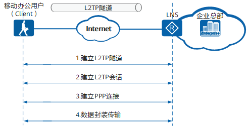
    </center>
    <figcaption>
    Client-Initiated 场景下 L2TP 隧道建立过程
    <br/><small>
    [Huawei](https://support.huawei.com/enterprise/zh/doc/EDOC1100332366/f38fe3f0?idPath=24030814|21782164|7923148|256863201)
    </small>
    </figcaption>
</figure>

1. 移动办公用户与 LNS 建立 L2TP 隧道。
1. 移动办公用户与 LNS 建立 L2TP 会话：移动办公用户在第 3 步会与 LNS 间建立 PPP 连接，L2TP 会话用来记录和管理它们之间的 PPP 连接状态。因此，在建立 PPP 连接以前，隧道双方需要为 PPP 连接预先协商出一个 L2TP 会话。会话中携带了移动办公用户的 LCP 协商信息和用户认证信息，LNS 对收到的信息认证通过后，通知移动办公用户会话建立成功。L2TP 会话连接由会话 ID 进行标识。
1. 移动办公用户与 LNS 建立 PPP 连接：移动办公用户通过与 LNS 建立 PPP 连接获取 LNS 分配的企业内网 IP 地址。
1. 移动办公用户发送业务报文访问企业总部服务器。

报文的封装和解封装过程：

<figure markdown="span">
    <center>
    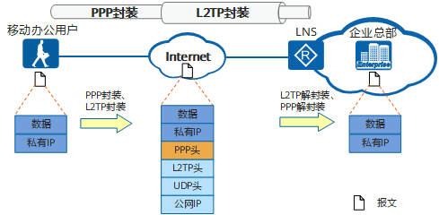
    </center>
    <figcaption>
    Client-Initiated 场景下报文的封装过程
    <br/><small>
    [Huawei](https://support.huawei.com/enterprise/zh/doc/EDOC1100332366/f38fe3f0?idPath=24030814|21782164|7923148|256863201)
    </small>
    </figcaption>
</figure>

1. 移动办公用户向企业总部服务器发送业务报文：业务报文通过 L2TP 拨号软件进行 PPP 封装和 L2TP 封装，然后按照移动办公用户 PC 的本地路由转发给 LNS。
1. LNS 接收到报文以后，拆除报文的 L2TP 头和 PPP 头，然后按照到企业内网的路由将报文转发给企业总部服务器。
1. 企业总部服务器收到移动办公用户的报文后，向移动办公用户返回响应报文。

### L2TP Client-Initiated 场景

!!! info

    L2TP 除了可以为出差员工提供远程接入服务以外，还可以进行企业分支与总部的内网互联，实现分支用户与总部用户的互访。
    
    企业分支用户访问企业总部时，会部署 L2TP Client 自动向 LNS 发起拨号，建立 L2TP 隧道和会话，此时不需要分支机构用户拨号来触发。对于分支机构用户来说，访问总部网络就跟访问自己所在的分支机构网络一样，完全感觉不到自己是在远程接入。L2TP Client 是企业分支的出口网关，LNS 是企业总部的出口网关。L2TP Client 和 LNS 部署了 L2TP 以后，L2TP Client 设备会主动向 LNS 发起 L2TP 隧道建立请求，隧道建立完成后，分支用户访问总部的流量直接通过 L2TP 隧道传输到对端。该场景下，L2TP 隧道建立在 L2TP Client 与 LNS 之间，隧道对于用户是透明的，用户感知不到隧道的存在。
    
    当我们在路由器上配置 L2TP 上网时，即为 L2TP Client-Initiated 场景。

L2TP Client-Initiated 场景，L2TP Client 和 LNS 配置完 L2TP 以后，L2TP Client 会主动向 LNS 发起隧道协商请求。

<figure markdown="span">
    <center>
    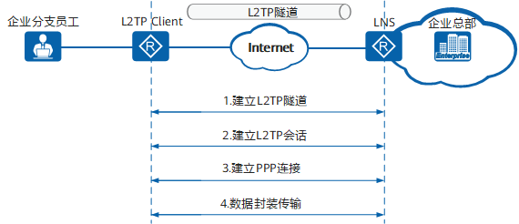
    </center>
    <figcaption>
    L2TP Client-Initiated 场景下 L2TP 隧道建立过程
    <br/><small>
    [Huawei](https://support.huawei.com/enterprise/zh/doc/EDOC1100332366/f38fe3f0?idPath=24030814|21782164|7923148|256863201)
    </small>
    </figcaption>
</figure>

1. L2TP Client 与 LNS 建立 L2TP 隧道。
1. L2TP Client 与 LNS 建立 L2TP 会话：L2TP Client 在第 3 步会与 LNS 间建立 PPP 连接，L2TP 会话用来记录和管理它们之间的 PPP 连接状态。因此，在建立 PPP 连接以前，隧道双方需要为 PPP 连接预先协商出一个 L2TP 会话。
1. L2TP Client 与 LNS 建立 PPP 连接：L2TP Client 通过与 LNS 建立 PPP 连接获取 LNS 分配的企业内网 IP 地址。
1. 企业分支员工发送访问企业总部服务器的业务报文，报文经过 L2TP Client 和 LNS 的加解封装后到达对端。

报文的封装和解封装过程：

<figure markdown="span">
    <center>
    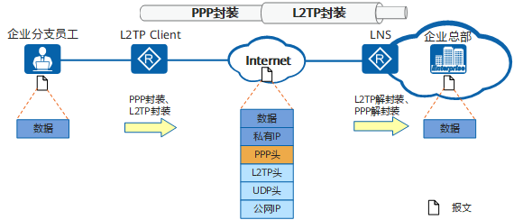
    </center>
    <figcaption>
    L2TP Client-Initiated 场景下报文的封装过程
    <br/><small>
    [Huawei](https://support.huawei.com/enterprise/zh/doc/EDOC1100332366/f38fe3f0?idPath=24030814|21782164|7923148|256863201)
    </small>
    </figcaption>
</figure>

1. 企业分支员工向总部内网服务器发送访问请求：分支员工的 PC 按照本地路由将请求报文转发给 L2TP Client。
1. L2TP Client 收到报文后使用 VT（Virtual-Template）接口对此报文进行 PPP 封装和 L2TP 封装：报文封装完成后 L2TP Client 再按照到 Internet 的公网路由将封装好的报文发送出去。
1. LNS 设备接收到报文以后，使用 VT 接口拆除报文的 L2TP 头和 PPP 头，然后按照到企业内网的路由将报文转发给总部内网服务器。
1. 企业总部服务器收到分支员工的报文后，向分支员工返回响应报文。

### L2TP 安全性

!!! quote

    - [配置 L2TP 隧道验证方式 - 华为](https://support.huawei.com/enterprise/zh/doc/EDOC1100143283/14c04466)

L2TP 隧道提供简单的隧道验证功能：LAC 与 LNS 的隧道验证通过之后，隧道才能建立成功。L2TP 隧道支持本地认证、远端（RADIUS）认证和 RADIUS 强制隧道验证。

L2TP 协议自身不提供加密与可靠性验证的功能，可以和安全协议搭配使用，从而实现数据的加密传输。经常与 L2TP 协议搭配的加密协议是 IPsec，当这两个协议搭配使用时，通常合称 L2TP/IPsec。

### L2TP 隧道建立过程

L2TP 隧道建立过程中涉及的消息包括：

- SCCRQ（Start-Control-Connection-Request）：用来向对端请求建立控制连接。
- SCCRP（Start-Control-Connection-Reply）：用来告诉对端，本端收到了对端的 SCCRQ 消息，允许建立控制连接。
- StopCCN（Stop-Control-Connection-Notification）：用来通知对端拆除控制连接。
- SCCCN（Start-Control-Connection-Connected）：用来告诉对端，本端收到了对端的 SCCRP 消息，本端已完成隧道的建立。
- Hello：用来检测隧道的连通性。
- ZLB（Zero-Length Body）：如果本端的队列没有要发送的消息时，发送 ZLB 给对端。在控制连接的拆除过程中，发送方需要发送 STOPCCN，接收方发送 ZLB。ZLB 只有 L2TP 头，没有负载部分，因此而得名。

控制连接的建立先于会话连接。只有控制连接建立起来了，会话连接才可能建立起来。

<figure markdown="span">
    <center>
    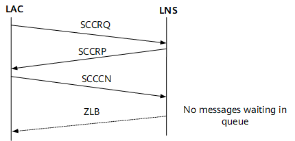
    </center>
    <figcaption>
    控制连接建立的三次握手
    <br/><small>
    [Huawei](https://support.huawei.com/enterprise/zh/doc/EDOC1100332366/83e5177f?idPath=24030814|21782164|7923148|256863201)
    </small>
    </figcaption>
</figure>

- LAC 和 LNS 之间路由相互可达后，LAC 端设置相应 AVP，向 LNS 端发出 SCCRQ 报文，请求建立控制连接。
- LNS 收到来自 LAC 的 SCCRQ。根据其中的 AVP，如果同意建立隧道，便发送 SCCRP 报文给 LAC。
- LAC 对接收到的 SCCRP 报文进行检查，从中取出隧道信息，并向 LNS 发送 SCCCN 报文，表示控制连接建立成功。
- 当消息队列中没有消息时，LNS 发送 ZLB 给对端。

隧道验证是和建立隧道同时进行的，不是单独进行的。隧道验证过程如下：

1. 首先 LAC 向 LNS 发 SCCRQ 请求消息时，产生一个随机的字符串作为本端的 CHAP Challenge（SCCRQ 携带的字段）发给 LNS。
1. LNS 收到 SCCRQ 后，利用 LAC 侧发送的 CHAP Challenge 和本端配置的密码产生一个 16 个字节的 Response；同时也产生一个随机的字符串（LNS CHAP Challenge），将随机生成的这个字符串和 Response 放在 SCCRP 中一起发给 LAC。
1. LAC 端收到 SCCRP 后，对 LNS 进行验证。
    - LAC 端利用自己的 CHAP Challenge 和本端配置的密码，产生一个新的 16 字节的字符串；
    - LAC 端将新产生的字符串与 LNS 端发来的 SCCRP 中带的 LNS CHAP Response 做比较，如果相同，则隧道验证通过，否则隧道验证不通过，断掉隧道连接。
1. 如果验证通过，LAC 将自己的 CHAP Response 放在 SCCCN 消息中发给 LNS。
1. LNS 收到 SCCCN 消息后，也进行验证：
    - LNS 端利用本端的 CHAP Challenge、本端配置的密码，产生一个 16 字节的字符串；
    - LNS 端与 SCCCN 消息中得到的 LAC CHAP Response 做比较。如果相同，则验证通过，否则拆除隧道。

L2TP 使用 Hello 报文检测隧道的连通性。LAC 和 LNS 定时向对端发送 Hello 报文，若在一段时间内未收到 Hello 报文的应答，则重复发送 Hello 报文。如果重复发送报文的次数超过 5 次，则认为 L2TP 隧道已经断开，该 PPP 会话将被清除。此时需要重新建立隧道。

控制连接拆除的发起端可以是 LAC 或 LNS。发起端通过发送 StopCCN 消息报文到对端来通知对端拆除控制连接。对端收到后发送 ZLB ACK 消息作为回应，同时在一定时间内保持控制连接以防止 ZLB ACK 消息丢失。

### L2TP 会话建立过程

L2TP 会话建立过程中涉及的消息包括：

- ICRQ（Incoming-Call-Request）：只有 LAC 才会发送；每当检测到用户的呼叫请求，LAC 就发送 ICRQ 消息给 LNS，请求建立会话连接。ICRQ 中携带会话参数。
- ICRP（Incoming-Call-Reply）：只有 LNS 才会发送；收到 LAC 的 ICRQ，LNS 就使用 ICRP 回复，表示允许建立会话连接。
- ICCN（Incoming-Call-Connected）：只有 LAC 才会发送；LAC 收到 LNS 的 ICRP，就使用 ICCN 回复，表示 LAC 已回复用户的呼叫，通知 LNS 建立会话连接。
- CDN（Call-Disconnect-Notify）：用来通知对端拆除会话连接，并告知对端拆除的原因。
- ZLB（Zero-Length Body）：如果本端的队列没有要发送的消息时，发送 ZLB 给对端。在会话连接的拆除过程中，发送 ZLB 还表示收到 CDN。ZLB 只有 L2TP 头，没有负载部分，因此而得名。

控制连接成功建立之后，一旦检测到用户呼叫，就请求建立会话连接。与控制连接不同的是，会话连接的建立具有方向性。L2TP 的会话建立由 PPP 触发。

<figure markdown="span">
    <center>
    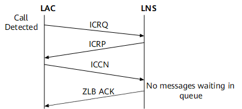
    </center>
    <figcaption>
    会话连接建立过程
    <br/><small>
    [Huawei](https://support.huawei.com/enterprise/zh/doc/EDOC1100332366/83e5177f?idPath=24030814|21782164|7923148|256863201)
    </small>
    </figcaption>
</figure>

会话连接拆除的发起端可以是 LAC 或 LNS。发起端通过发送 CDN 消息报文到对端来通知对端拆除会话连接。对端收到后发送 ZLB ACK 消息作为回应。

用户验证会进行两次：第一次发生在 LAC 侧，第二次发生在 LNS 侧。用户验证方式有三种：代理验证、强制 CHAP 验证和 LCP 重协商。

- LCP 重协商：如果需要在 LNS 侧进行比 LAC 侧更严格的认证，或者 LNS 侧需要直接从用户获取某些信息（当 LNS 与 LAC 是不同厂商的设备时可能发生这种情况），则可以配置 LNS 与用户间进行 LCP 重协商。LCP 重协商使用相应虚拟接口模板 VT 上配置的验证方式。此时将忽略 NAS 侧的代理验证信息。
- 强制 CHAP 验证：如果只配置强制 CHAP 验证，则 LNS 对用户进行 CHAP 验证，如果验证不过的话，会话就不能建立成功。
- 代理验证：如果既不配置 LCP 重协商，也不配置强制 CHAP 验证，则 LNS 对用户进行的是代理验证。代理验证就是 LAC 侧将 PAP 认证和 CHAP 认证的认证信息通过 ICCN 报文传给 LNS，LNS 侧会利用这些认证信息对用户进行认证。

### L2TP MTU 调优

!!! quote

    - [MTU Tuning for L2TP - Cisco](https://www.cisco.com/c/en/us/support/docs/dial-access/virtual-private-dialup-network-vpdn/24320-l2tp-mtu-tuning.html)

配置 L2TP 时候应当考虑最大传输单元（MTU）。

当以太网链路 MTU 为 1500 时，推荐配置如下：

- L2TP 隧道上的 IP MTU 为 1460。
- TCP MSS 为 1420。

在下面的抓包实践中会看到，PPP LCP 负责协商 L2TP 链路 MTU。

## L2TP 实践

本节我们通过抓包实践了解不同系统下 L2TP 的工作过程。

### Windows

点击 VPN Connect 后，可以看到 Windows 立即向 LNS 建立 L2TP 隧道。


LAC 的 ICCN 接着 LNS 的 ZLB 标志着 L2TP 隧道建立成功，接下来进入 PPP Establish 阶段。


PPP Establish 阶段使用 PPP LCP 协商链路配置（MTU、压缩等）和验证方式，让我们来看看其中的一些报文内容：

!!! info ""

    === "来自客户端的 Configuration Request"
    
        ```text
        PPP Link Control Protocol
            Code: Configuration Request (1)
            Identifier: 1 (0x01)
            Length: 18
            Options: (14 bytes), Maximum Receive Unit, Magic Number, Protocol Field Compression, Address and Control Field Compression
                Maximum Receive Unit: 1400
                Magic Number: 0x776b2584
                Protocol Field Compression
                Address and Control Field Compression
        ```
    
    === "来自服务器的 Configuration Request"
    
        ```text
        PPP Link Control Protocol
            Code: Configuration Ack (2)
            Identifier: 101 (0x65)
            Length: 15
            Options: (11 bytes), Authentication Protocol, Magic Number
                Authentication Protocol: Challenge Handshake Authentication Protocol (0xc223)
                Magic Number: 0x2b80df7b
        ```

Establish 成功后进入 Authenticate 阶段，由于服务器配置了 CHAP 验证，此处为三次 CHAP 握手。


Authenticate 阶段成功后，进入 Network 阶段。可以看到客户端请求 IPV6CP 和 IPCP 协商，服务器拒绝了 IPV6CP，回复了 IPCP。


让我们来看看最后一个从服务端发给客户端的 IPCP 报文内容：

```text
PPP IP Control Protocol
    Code: Configuration Ack (2)
    Identifier: 8 (0x08)
    Length: 22
    Options: (18 bytes), IP Address, Primary DNS Server IP Address, Secondary DNS Server IP Address
        IP Address
            Type: IP Address (3)
            Length: 6
            IP Address: ***.***.***.***(VPN IP)
        Primary DNS Server IP Address
            Type: Primary DNS Server IP Address (129)
            Length: 6
            Primary DNS Address: ***.***.***.***
        Secondary DNS Server IP Address
            Type: Secondary DNS Server IP Address (131)
            Length: 6
            Secondary DNS Address: ***.***.***.***
```

通过 IPCP，服务器给客户端分配了一个 VPN 中的 IP 地址。

接下来，各种 IP 流量都封装到 PPP 中。让我们以 DNS 为例看看封装：

```text
Frame 162: 114 bytes on wire (912 bits), 114 bytes captured (912 bits) on interface \Device\NPF_{************************************}, id 0
Ethernet II, Src: MicroStarINT_**:**:** (04:7c:16:**:**:**), Dst: HuaweiTechno_**:**:** (7c:d9:a0:**:**:**)
Internet Protocol Version 4, Src: ***.***.***.***(Client), Dst: ***.***.***.***(LNS)
User Datagram Protocol, Src Port: 1701, Dst Port: 1701
Layer 2 Tunneling Protocol, Type: Data Message
Point-to-Point Protocol, Protocol: Internet Protocol Version 4
Internet Protocol Version 4, Src: ***.***.***.***(VPN IP), Dst: ***.***.***.***(DNS Server)
User Datagram Protocol, Src Port: 63077, Dst Port: 53
Domain Name System (query)
```

按下 Disconnect 按钮后，PPP 和 L2TP 连接先后中断：


### 华为 AR 路由器（AR101GW-Lc-S、AR6121EC-W）

!!! bug

    华为 AR 系列路由器的 L2TP 实现与浙江大学校园网 L2TP 配置存在兼容性问题。我们已经向华为反映过该问题，并得到答复，这是因为上游（校园网）配置不合理，应当由上游修改配置。
    
    经测试，TP-Link、RouterOS、OpenWRT 和 Windows 等系统/设备则没有兼容性问题。

本次实践以上面这个 Bug 为例，进行网络诊断。

#### 华为的 L2TP 实现

- 华为通过虚拟模板接口（Virtual-Template）实现 L2TP 隧道。
- 隧道建立后，可以将流量路由到虚拟模板接口上，这样流量就会被封装到 L2TP 报文中。
- **导致 Bug 的一点**：自动为会话对端建立直连路由。

这样的实现导致当隧道对端和会话对端相同时，数据包无法路由到隧道对端。

#### 环境介绍

实验环境内有多台 LNS 服务器，使用负载均衡：

- `10.0.2.72`
- `10.0.2.73`
- `10.5.1.9`
- `10.5.1.7`
- `10.5.1.5`

实验使用 AR101GW-Lc-S，WAN 口为 GigabitEthernet0/0/4。

内网网段 `10.0.0.0/8`，需要设置静态路由：

```text
Destination/Mask    Proto   Pre  Cost      Flags NextHop         Interface
       10.0.0.0/8   Static  1    0           D   10.78.18.254    GigabitEthernet0/0/4
```

#### 命令操作

- 首先测试网络连通情况：

```text
<Huawei>display ip routing-table 
Route Flags: R - relay, D - download to fib
------------------------------------------------------------------------------
Routing Tables: Public
         Destinations : 12       Routes : 12       

Destination/Mask    Proto   Pre  Cost      Flags NextHop         Interface

        0.0.0.0/0   Unr     60   0           D   10.78.18.254    GigabitEthernet0/0/4
       10.0.0.0/8   Static  1    0           D   10.78.18.254    GigabitEthernet0/0/4
     10.78.18.0/24  Direct  0    0           D   10.78.18.3      GigabitEthernet0/0/4
     10.78.18.3/32  Direct  0    0           D   127.0.0.1       GigabitEthernet0/0/4
   10.78.18.255/32  Direct  0    0           D   127.0.0.1       GigabitEthernet0/0/4
      127.0.0.0/8   Direct  0    0           D   127.0.0.1       InLoopBack0
      127.0.0.1/32  Direct  0    0           D   127.0.0.1       InLoopBack0
127.255.255.255/32  Direct  0    0           D   127.0.0.1       InLoopBack0
    192.168.1.0/24  Direct  0    0           D   192.168.1.1     Vlanif1
    192.168.1.1/32  Direct  0    0           D   127.0.0.1       Vlanif1
  192.168.1.255/32  Direct  0    0           D   127.0.0.1       Vlanif1
255.255.255.255/32  Direct  0    0           D   127.0.0.1       InLoopBack0
<Huawei>ping lns.zju.edu.cn
  PING lns.zju.edu.cn (10.0.2.72): 56  data bytes, press CTRL_C to break
    Reply from 10.0.2.72: bytes=56 Sequence=1 ttl=62 time=1 ms
    Reply from 10.0.2.72: bytes=56 Sequence=2 ttl=62 time=1 ms
    Reply from 10.0.2.72: bytes=56 Sequence=3 ttl=62 time=1 ms
    Reply from 10.0.2.72: bytes=56 Sequence=4 ttl=62 time=1 ms
    Reply from 10.0.2.72: bytes=56 Sequence=5 ttl=62 time=1 ms

  --- lns.zju.edu.cn ping statistics ---
    5 packet(s) transmitted
    5 packet(s) received
    0.00% packet loss
    round-trip min/avg/max = 1/1/1 ms

<Huawei>ping 10.5.1.9
  PING 10.5.1.9: 56  data bytes, press CTRL_C to break
    Reply from 10.5.1.9: bytes=56 Sequence=1 ttl=62 time=1 ms
    Reply from 10.5.1.9: bytes=56 Sequence=2 ttl=62 time=1 ms
    Reply from 10.5.1.9: bytes=56 Sequence=3 ttl=62 time=1 ms
    Reply from 10.5.1.9: bytes=56 Sequence=4 ttl=62 time=1 ms
    Reply from 10.5.1.9: bytes=56 Sequence=5 ttl=62 time=1 ms

  --- 10.5.1.9 ping statistics ---
    5 packet(s) transmitted
    5 packet(s) received
    0.00% packet loss
    round-trip min/avg/max = 1/1/1 ms
```

- 其次展示当前的 L2TP 配置：

```text
<Huawei>sys
[Huawei]interface Virtual-Template 1
[Huawei-Virtual-Template1]display this
[V200R010C10SPC700]
#
interface Virtual-Template1
 ppp chap user ***
 ppp chap password cipher ***
 ppp pap local-user *** password cipher ***
 ppp ipcp dns admit-any
 ppp ipcp dns request
 mtu 1400
 tcp adjust-mss 1200
 ip address ppp-negotiate
 nat outbound 2997 
#
return
[Huawei-Virtual-Template1]return
<Huawei>display l2tp-group 
----------------------------------------- 
  L2TP-GROUP    GROUP-NUMBER  
----------------------------------------- 
  2               2                                  
-----------------------------------------
<Huawei>sys
[Huawei]l2tp-group 2
[Huawei-l2tp2]display this 
[V200R010C10SPC700]
#
l2tp-group 2
 undo tunnel authentication
 start l2tp ip 10.5.1.9 fullusername ***
#
[Huawei-l2tp2] quit
```

- 启动 `10.5.1.9` 的 L2TP 连接，并测试网络连通情况：

```text
[Huawei]interface Virtual-Template 1
[Huawei-Virtual-Template1]l2tp-auto-client enable
<Huawei>display l2tp tunnel

 Total tunnel : 1
 LocalTID RemoteTID RemoteAddress    Port   Sessions RemoteName
 8        11729     10.5.1.9         1701   1        ZJG_MX960-4
<Huawei>display l2tp se
<Huawei>display l2tp session 

 Total session : 1
 LocalSID  RemoteSID  LocalTID  Interface            LclTAddr        RmtTAddr        LclSAddr        RmtSAddr
 1         5079       8         Virtual-Template1:0  10.78.18.3      10.5.1.9        210.32.148.92   10.0.2.72       
<Huawei>display ip routing
<Huawei>display ip routing-table 
Route Flags: R - relay, D - download to fib
------------------------------------------------------------------------------
Routing Tables: Public
         Destinations : 14       Routes : 14       

Destination/Mask    Proto   Pre  Cost      Flags NextHop         Interface

        0.0.0.0/0   Static  60   0           D   210.32.148.92   Virtual-Template1
       10.0.0.0/8   Static  1    0           D   10.78.18.254    GigabitEthernet0/0/4
      10.0.2.72/32  Direct  0    0           D   10.0.2.72       Virtual-Template1
     10.78.18.0/24  Direct  0    0           D   10.78.18.3      GigabitEthernet0/0/4
     10.78.18.3/32  Direct  0    0           D   127.0.0.1       GigabitEthernet0/0/4
   10.78.18.255/32  Direct  0    0           D   127.0.0.1       GigabitEthernet0/0/4
      127.0.0.0/8   Direct  0    0           D   127.0.0.1       InLoopBack0
      127.0.0.1/32  Direct  0    0           D   127.0.0.1       InLoopBack0
127.255.255.255/32  Direct  0    0           D   127.0.0.1       InLoopBack0
    192.168.1.0/24  Direct  0    0           D   192.168.1.1     Vlanif1
    192.168.1.1/32  Direct  0    0           D   127.0.0.1       Vlanif1
  192.168.1.255/32  Direct  0    0           D   127.0.0.1       Vlanif1
  210.32.148.92/32  Direct  0    0           D   127.0.0.1       Virtual-Template1
255.255.255.255/32  Direct  0    0           D   127.0.0.1       InLoopBack0

<Huawei>ping baidu.com
  PING baidu.com (110.242.68.66): 56  data bytes, press CTRL_C to break
    Reply from 110.242.68.66: bytes=56 Sequence=1 ttl=49 time=31 ms
    Reply from 110.242.68.66: bytes=56 Sequence=2 ttl=49 time=31 ms
    Reply from 110.242.68.66: bytes=56 Sequence=3 ttl=49 time=31 ms
    Reply from 110.242.68.66: bytes=56 Sequence=4 ttl=49 time=31 ms
    Reply from 110.242.68.66: bytes=56 Sequence=5 ttl=49 time=31 ms

  --- baidu.com ping statistics ---
    5 packet(s) transmitted
    5 packet(s) received
    0.00% packet loss
    round-trip min/avg/max = 31/31/31 ms

```

- 关闭 L2TP 连接：

```text
<Huawei>sys
Enter system view, return user view with Ctrl+Z.
[Huawei]interface Virtual-Template 1
[Huawei-Virtual-Template1]undo l2tp-auto-client enable
[Huawei-Virtual-Template1]return
<Huawei>display l2tp tunnel

 Total tunnel : 1
 LocalTID RemoteTID RemoteAddress    Port   Sessions RemoteName
 8        11729     10.5.1.9         1701   0        ZJG_MX960-4
<Huawei>reset l2tp tunnel local-id 8
  Info: Clear the tunnel, LocID = 8.
```

- 修改并启动到 `10.0.2.72` 的 L2TP 连接，测试网络连通情况：

```text
<Huawei>sys
[Huawei]l2tp-group 2
[Huawei-l2tp2]display this
[V200R010C10SPC700]
#
l2tp-group 2
 undo tunnel authentication
 start l2tp ip 10.5.1.9 fullusername ***
#
return
[Huawei-l2tp2]start l2tp ip 10.0.2.72 fullusername ***
[Huawei-l2tp2]display this
[V200R010C10SPC700]
#
l2tp-group 2
 undo tunnel authentication
 start l2tp ip 10.0.2.72 fullusername ***
#
return
[Huawei-l2tp2]quit
[Huawei]interface Virtual-Template 1
[Huawei-Virtual-Template1]l2tp-auto-client enable
[Huawei-Virtual-Template1]return
<Huawei>display ip routing-table 
Route Flags: R - relay, D - download to fib
------------------------------------------------------------------------------
Routing Tables: Public
         Destinations : 14       Routes : 14       

Destination/Mask    Proto   Pre  Cost      Flags NextHop         Interface

        0.0.0.0/0   Static  60   0           D   210.32.149.51   Virtual-Template1
       10.0.0.0/8   Static  1    0           D   10.78.18.254    GigabitEthernet0/0/4
      10.0.2.72/32  Direct  0    0           D   10.0.2.72       Virtual-Template1
     10.78.18.0/24  Direct  0    0           D   10.78.18.3      GigabitEthernet0/0/4
     10.78.18.3/32  Direct  0    0           D   127.0.0.1       GigabitEthernet0/0/4
   10.78.18.255/32  Direct  0    0           D   127.0.0.1       GigabitEthernet0/0/4
      127.0.0.0/8   Direct  0    0           D   127.0.0.1       InLoopBack0
      127.0.0.1/32  Direct  0    0           D   127.0.0.1       InLoopBack0
127.255.255.255/32  Direct  0    0           D   127.0.0.1       InLoopBack0
    192.168.1.0/24  Direct  0    0           D   192.168.1.1     Vlanif1
    192.168.1.1/32  Direct  0    0           D   127.0.0.1       Vlanif1
  192.168.1.255/32  Direct  0    0           D   127.0.0.1       Vlanif1
  210.32.149.51/32  Direct  0    0           D   127.0.0.1       Virtual-Template1
255.255.255.255/32  Direct  0    0           D   127.0.0.1       InLoopBack0

<Huawei>display l2tp tunnel 

 Total tunnel : 1
 LocalTID RemoteTID RemoteAddress    Port   Sessions RemoteName
 9        5476      10.0.2.72        1701   1        ZJG_MX960-4
<Huawei>display l2tp session 

 Total session : 1
 LocalSID  RemoteSID  LocalTID  Interface            LclTAddr        RmtTAddr        LclSAddr        RmtSAddr
 1         12710      9         Virtual-Template1:0  10.78.18.3      10.0.2.72       210.32.149.51   10.0.2.72       
<Huawei>ping baidu.com
  PING baidu.com (110.242.68.66): 56  data bytes, press CTRL_C to break
    Request time out
    Request time out
    Request time out
    Request time out
    Request time out

  --- baidu.com ping statistics ---
    5 packet(s) transmitted
    0 packet(s) received
    100.00% packet loss

```

#### 抓包分析

对 WAN 口做镜像，使用 WireShark 监控网络流量，下面是华为路由器的表现：

- LNS 设置为 `10.5.1.9` 时：可以看到一切正常，L2TP 隧道建立后成功进行 PPP 拨号，IPCP 配置完成后开始出现业务流量，PPP LCP Echo/Request 也正常。

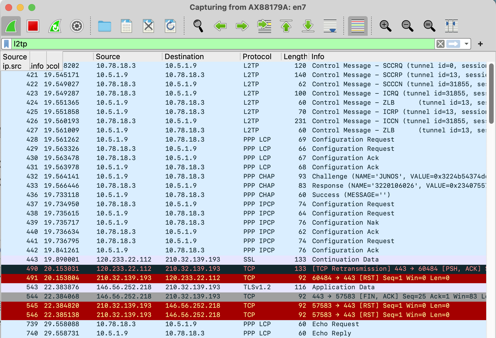

- LNS 设置为 `10.0.2.72` 时：到 IPCP 配置成功这里还是正常的，但随后可以看到，来自 LNS 的 PPP Echo Request 没有得到华为路由器的回应，也没有业务流量从 WAN 口转发出来。大致可以判定是路由问题。

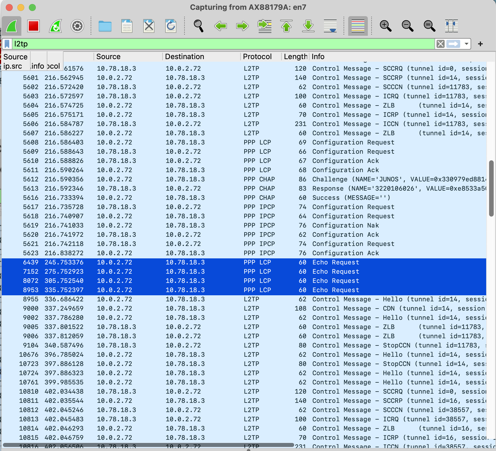

在 Web 管理页面可以看到隧道失败信息为：`There was no SCCCN response from the peer and the packet retransmission count reached the limit`。


这个失败信息也与抓包观测到的不符。我们已经看到隧道建立阶段成功，进入了会话建立阶段，因此这个报错也应该是有问题的。

#### 分析问题

对比两次 L2TP 拨号，可以发现：

- 会话对端地址不变，始终为 `10.0.2.72`。

- 当 L2TP 会话建立时，华为路由器会**自动生成会话对端的直连路由**：

    ```text
    10.0.2.72/32  Direct  0    0           D   10.0.2.72       Virtual-Template1
    ```

- 隧道对端地址发生了变化，若为 `10.5.1.9`（和会话对端不同）则正常，为 `10.0.2.72` （和会话对端相同）则不正常。

观察 LNS 为 `10.0.2.72` 的会话，可以发现：

- 会话建立后，华为路由器不再能够向 LNS 发送消息，**不响应来自 LNS 的 PPP LCP Echo Request**

- 一旦 LNS 发来 CDN 中断会话后，华为路由器又能立即发送 ZLB 和 StopCCN，拆除隧道控制连接
- 随后开始新一轮 L2TP 拨号

综合上面的表现可以推测，这是华为路由器自动生成会话对端的直连路由，造成隧道对端和会话对端地址相同时，任何通向隧道对端的数据包（包括 PPP LCP 和业务流量）都会进入 Virtual Template 接口循环，无法被发送到隧道对端，故也无法在 WAN 口抓包看到。示意图如下：


而一旦会话结束，该表项被删除，路由器马上又能正确转发到该地址的包，因此能够发送 StopCCN。

在 TP-Link、RouterOS 和 Windows 设备上查看路由表，就没有看到为 L2TP 会话对端新建的条目。因此，可以判定路由问题就是导致华为设备在该情境下 L2TP 失败的原因。
