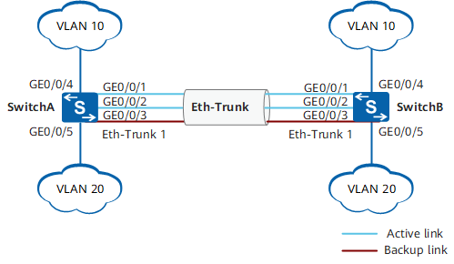

---
tags:
  - stable
---

# 链路聚合

!!! quote

    本文档大部分内容来自华为和新华三官方文档。

## 链路聚合原理

!!! info "相关的标准"

    - IEEE 802.3ad（LACP）：2000 年。支持链路聚合的设备基本都使用该标准，包括 TP-Link、锐捷、华为等。这些设备能够通过 LACP 自动调整状态，一般不会出现兼容性问题。
    - IEEE 802.1AX：2020 年，似乎还没普及。

**链路聚合组 LAG（Link Aggregation Group）**是指将若干条以太链路捆绑在一起所形成的逻辑链路。每个聚合组唯一对应着一个逻辑接口，这个逻辑接口称之为**链路聚合接口或 Eth-Trunk 接口**。链路聚合接口可以作为普通的以太网接口来使用，与普通以太网接口的差别在于：转发的时候链路聚合组需要从成员接口中选择一个或多个接口来进行数据转发。

- **活动接口和非活动接口**：链路聚合组的成员接口存在活动接口和非活动接口两种。转发数据的接口称为活动接口，不转发数据的接口称为非活动接口。当前活动接口数目达到上限阈值时，再向 Eth-Trunk 中添加成员接口，不会增加 Eth-Trunk 活动接口的数目，超过上限阈值的链路状态将被置为 Down，作为备份链路。
- **链路聚合模式**：根据是否启用链路聚合控制协议 LACP（Link Aggregation Control Protocol），链路聚合分为手工模式和 LACP 模式。**一般采用 LACP 模式**，它基于 IEEE 802.3ad 标准实现链路动态聚合与解聚合，以供设备根据自身配置自动形成聚合链路并启动聚合链路收发数据。聚合链路形成以后，LACP 负责维护链路状态，在聚合条件发生变化时，自动调整链路聚合。
- **负载分担方式**：
    - 在使用 Eth-Trunk 转发数据时，由于聚合组两端设备之间有多条物理链路，可能会产生同一数据流的第一个数据帧在一条物理链路上传输，而第二个数据帧在另外一条物理链路上传输的情况。这样一来同一数据流的第二个数据帧就有可能比第一个数据帧先到达对端设备，从而产生接收数据包乱序的情况。
    - 为了避免这种情况的发生，Eth-Trunk 采用**逐流负载分担**的机制，把数据帧中的地址通过 HASH 算法生成 HASH-KEY 值，然后根据这个数值在 Eth-Trunk 转发表中寻找对应的出接口，不同的 MAC 或 IP 地址 HASH 得出的 HASH-KEY 值不同，从而出接口也就不同，这样既保证了同一数据流的帧在同一条物理链路转发，又实现了流量在聚合组内各物理链路上的负载分担。逐流负载分担能保证包的顺序，但不能保证带宽利用率。
    - 华为和锐捷交换机都支持以下负载分担算法：源 MAC 地址、目的 MAC 地址、源 MAC 地址和目的 MAC 地址、源 IP 地址、目的 IP 地址、源 IP 地址和目的 IP 地址。

!!! warning "注意事项"

    - 如果本端设备接口加入了 Eth-Trunk，与该接口直连的对端接口也必须加入 Eth-Trunk，两端才能正常通信。
    - Eth-Trunk 链路两端相连的物理接口的数量、双工方式、流控配置必须一致。
    - 两台设备对接时需要保证两端设备上链路聚合的模式一致。

## 链路聚合实践

### 路由器、交换机链路聚合

思路：

1. 新建链路聚合端口
2. 把物理端口加入链路聚合端口
3. 根据需要配置 LACP 协议的具体配置

```text
<HUAWEI> system-view
[HUAWEI] sysname SwitchA
# 创建链路聚合接口 Eth-Trunk1
[SwitchA] interface eth-trunk 1
[SwitchA-Eth-Trunk1] mode lacp
[SwitchA-Eth-Trunk1] quit
# 将物理接口加入 Eth-Trunk1
[SwitchA] interface gigabitethernet 0/0/1
[SwitchA-GigabitEthernet0/0/1] eth-trunk 1
[SwitchA-GigabitEthernet0/0/1] quit
[SwitchA] interface gigabitethernet 0/0/2
[SwitchA-GigabitEthernet0/0/2] eth-trunk 1
[SwitchA-GigabitEthernet0/0/2] quit
[SwitchA] interface gigabitethernet 0/0/3
[SwitchA-GigabitEthernet0/0/3] eth-trunk 1
[SwitchA-GigabitEthernet0/0/3] quit
```

### 链路聚合与 VLAN

<figure markdown="span">
    
    <figcaption>VLAN 与 LACP 模式链路聚合组网</figcaption>
</figure>

配置 Eth-Trunk 按前文所述，接下来和普通端口一样加入 VLAN：

```text
[SwitchA] vlan batch 10 20
# 配置 Eth-Trunk1 接口允许 VLAN10 和 VLAN20 通过。SwitchB 的配置与 SwitchA 类似，不再赘述。
[SwitchA] interface eth-trunk 1
[SwitchA-Eth-Trunk1] port link-type trunk
[SwitchA-Eth-Trunk1] port trunk allow-pass vlan 10 20
[SwitchA-Eth-Trunk1] quit
# 查看各 Switch 设备的 Eth-Trunk 信息，查看链路是否协商成功。
[SwitchA] display eth-trunk 1
Eth-Trunk1's state information is:
Local:
LAG ID: 1                       WorkingMode: LACP
Preempt Delay: Disabled         Hash arithmetic: According to SIP-XOR-DIP
System Priority: 100            System ID: 00e0-fca8-0417
Least Active-linknumber: 1      Max Active-linknumber: 2
Operate status: up              Number Of Up Port In Trunk: 2
--------------------------------------------------------------------------------
ActorPortName                    Status     PortType PortPri   PortNo PortKey   PortState  Weight
GigabitEthernet0/0/1             Selected  1GE       100      6145    2865      11111100     1
GigabitEthernet0/0/2             Selected  1GE       100      6146    2865      11111100     1
GigabitEthernet0/0/3             Unselect  1GE       32768    6147    2865      11100000     1

Partner:
--------------------------------------------------------------------------------
ActorPortName                     SysPri    SystemID    PortPri PortNo PortKey   PortState
GigabitEthernet0/0/1              32768  00e0-fca6-7f85  32768     6145   2609      11111100
GigabitEthernet0/0/2              32768  00e0-fca6-7f85  32768     6146   2609      11111100
GigabitEthernet0/0/3              32768  00e0-fca6-7f85  32768     6147   2609      11110000
```

### 操作系统（Linux）链路聚合

!!! quote

    - [S 系列交换机链路聚合特性对接替换指导书](https://forum.huawei.com/enterprise/zh/thread/580890234458095616)
    - [H3C 交换机与服务器对接操作指导 -6W100-新华三集团-H3C](https://www.h3c.com/cn/Service/Document_Software/Document_Center/Home/Server/00-Public/Configure/Interoperability_Guides/H3C-9037/)
    - [Bonding - Debian Wiki](https://wiki.debian.org/Bonding)
    - [systemd.netdev](https://www.freedesktop.org/software/systemd/man/latest/systemd.netdev.html#)

Linux 支持链路聚合，故服务器端也可以与网络设施进行链路聚合。下面展示 LACP 模式的配置。

#### 准备工作

- 确保服务器的接口正确连接到交换机的对应端口
- 交换机需预先配置为 LACP 动态聚合模式（802.3ad）

#### 配置步骤（使用 ifenslave）

1. **安装必要软件包**：

    ```bash
    sudo apt update
    sudo apt install ifenslave vlan
    ```

2. **加载内核模块**：

    ```bash
    echo "bonding" >> /etc/modules
    echo "8021q" >> /etc/modules
    sudo modprobe bonding
    sudo modprobe 8021q
    ```

3. **创建 bonding 配置文件**：

    ```bash
    sudo nano /etc/modprobe.d/bonding.conf
    ```

    添加以下内容：

    ```text
    alias bond0 bonding
    options bonding mode=4 miimon=100 downdelay=200 updelay=200 lacp_rate=1
    ```

4. **配置网络接口**（示例使用 2 个接口，可扩展至 4 个）：

    ```bash
    sudo nano /etc/network/interfaces
    ```

    添加以下配置：

    ```text
    # 物理接口配置
    auto enp1s0f0
    iface enp1s0f0 inet manual
        bond-master bond0

    auto enp1s0f1
    iface enp1s0f1 inet manual
        bond-master bond0

    # LACP 聚合配置
    auto bond0
    iface bond0 inet manual
        bond-mode 4                # 802.3ad (LACP)
        bond-miimon 100            # 链路检测间隔（毫秒）
        bond-downdelay 200         # 接口下线延迟
        bond-updelay 200           # 接口上线延迟
        bond-lacp-rate 1           # LACP 速率（1=fast, 0=slow）
        bond-xmit-hash-policy layer2+3  # 流量分发策略
        address 192.168.1.100      # 服务器 IP
        netmask 255.255.255.0
        gateway 192.168.1.1
        mtu 9000                   # 建议与交换机一致（如启用巨帧）
    ```

#### 配置步骤（使用 systemd-networkd）

1. **创建 bonding 配置文件**：

    ```text title="/etc/systemd/network/bond0.netdev"
    [NetDev]
    Name=bond0
    Description=LACP to H3C Switch
    Kind=bond

    [Bond]
    Mode=802.3ad
    MIIMonitorSec=100ms
    ```

2. **创建网络接口配置文件**：

    ```text title="/etc/systemd/network/bond0.network"
    [Match]
    Name=ens*

    [Network]
    Bond=bond0
    Address=
    Gateway=
    DNS=
    ```

#### 验证配置

1. **查看 bond 状态**：

    ```bash
    cat /proc/net/bonding/bond0
    ```

    应看到：

    - Bonding Mode: IEEE 802.3ad Dynamic link aggregation
    - 所有 Slave 接口状态为 up
    - 正确的 LACP Partner 信息

2. **测试网络连通性**：

    ```bash
    ping -I bond0.123 10.123.0.1
    ```

注意事项

1. **MTU 一致性**：

    - 所有物理接口、bond 接口和 VLAN 接口的 MTU 必须匹配
    - 交换机端接口需同样配置 MTU 9000（如使用 jumbo frames）

2. **LACP 参数匹配**：

    - `bond-lacp-rate 1`对应交换机的 fast 模式（H3C 默认）
    - `bond-mode 4`必须与交换机的 dynamic 聚合模式对应

3. **多接口处理**：

    - 如需使用全部 4 个接口，在 bond-slaves 中添加所有接口名
    - 交换机侧需将 4 个接口加入同一聚合组

4. **故障排查**：

    - 检查`dmesg | grep bond`是否有错误
    - 使用`ethtool <interface>`检查物理链路状态
    - 交换机侧使用`display link-aggregation verbose`验证聚合状态

5. **性能优化**：

    - 对于 10G 接口，建议使用`bond-xmit-hash-policy layer3+4`
    - 可调整`miimon`为更短间隔（如 50ms）实现快速故障检测

6. **网络服务重启**：

    ```bash
    systemctl restart networking
    ```

### Bootloader 链路聚合

https://edk2.groups.io/g/discuss/topic/bonding_support_for_pxe_boot/80424734

https://www.reddit.com/r/networking/comments/opciu4/problem_with_pxe_boot_over_lacp_on_aruba_switches/
