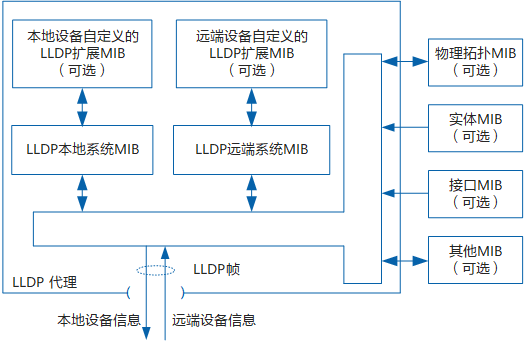

---
tags:
  - stable
---

# LLDP

## LLDP 原理

!!! quote

    - 华为文档

LLDP（Link Layer Discovery Protocol）是 IEEE 802.1ab 中定义的链路层发现协议。LLDP 是一种标准的二层发现方式，可以将本端设备的管理地址、设备标识、接口标识等信息组织起来，并发布给自己的邻居设备，邻居设备收到这些信息后将其以标准的管理信息库 MIB（Management Information Base）的形式保存起来，以供网络管理系统查询及判断链路的通信状况。

随着网络规模越来越大，网络设备种类繁多，并且各自的配置错综复杂，对网络管理能力的要求也越来越高。传统网络管理系统多数只能分析到三层网络拓扑结构，无法确定网络设备的详细拓扑信息、是否存在配置冲突等。因此需要有一个标准的二层信息交流协议。

LLDP 提供了一种标准的链路层发现方式。通过 LLDP 获取的设备二层信息能够快速获取相连设备的拓扑状态；显示出客户端、交换机、路由器、应用服务器以及网络服务器之间的路径；检测设备间的配置冲突、查询网络失败的原因。企业网用户可以通过使用网管系统，对支持运行 LLDP 协议的设备进行链路状态监控，在网络发生故障的时候快速进行故障定位。

### LLDP 工作方式

LLDP 可以将本地设备的信息组织起来并发布给自己的远端设备，本地设备将收到的远端设备信息以标准 MIB 的形式保存起来。工作原理如下图所示。

<figure markdown="span">
    

    { width=80% align=center}
    

    <figcaption>
    LLDP 工作原理
    </figcaption>
</figure>

LLDP 基本实现原理为：

1. LLDP 模块通过 LLDP 代理与设备上物理拓扑 MIB、实体 MIB、接口 MIB 以及其他类型 MIB 的交互，来更新自己的 LLDP 本地系统 MIB，以及本地设备自定义的 LLDP 扩展 MIB。
2. 将本地设备信息封装成 LLDP 帧发送给远端设备。
3. 接收远端设备发过来的 LLDP 帧，更新自己的 LLDP 远端系统 MIB，以及远端设备自定义的 LLDP 扩展 MIB。
4. 通过 LLDP 代理收发 LLDP 帧，设备就很清楚地知道远端设备的信息，包括连接的是远端设备的哪个接口、远端设备的 MAC 地址等信息。

LLDP 本地（远端）系统 MIB 用来保存本地（远端）设备信息。这些信息包括设备 ID、接口 ID、系统名称、系统描述、接口描述、网络管理地址等。

LLDP 代理完成下列任务：

- 维护 LLDP 本地系统 MIB 和 LLDP 远端系统 MIB。
- 在本地状态发生变化的情况下，提取 LLDP 本地系统 MIB 信息并向远端设备发送。在本地设备状态信息没有变化的情况下，按照一定的周期提取 LLDP 本地系统 MIB 信息向远端设备发送。
- 识别并处理收到的 LLDP 帧。
- LLDP 本地系统 MIB 或 LLDP 远端系统 MIB 的状态发生变化的情况下，向网管发送 LLDP 告警。

### LLDP 报文收发机制

LLDP 报文发送机制：

- 当使能 LLDP 功能时，设备会周期性地向邻居设备发送 LLDP 报文。如果设备的本地配置发生变化则立即发送 LLDP 报文，以将本地信息的变化情况尽快通知给邻居设备。为了防止本地信息的频繁变化而引起 LLDP 报文的大量发送，每发送一个 LLDP 报文后都需延迟一段时间后再继续发送下一个报文。
- 当发现新的邻居设备（即收到一个新的 LLDP 报文且本地尚未保存发送该报文设备信息），或者设备的 LLDP 功能由去使能状态变为使能，或者设备的接口状态由 Down 变为 Up 的时候，该设备将自动启用快速发送机制。即将 LLDP 报文的发送周期缩短为 1 秒，并连续发送指定数量的 LLDP 报文后再恢复为正常的发送周期。

LLDP 报文接收机制：

当使能 LLDP 功能时，设备会对收到的 LLDP 报文及其携带的 TLV 进行有效性检查，通过检查后再将邻居信息保存到本地设备，并根据 LLDPDU 报文中 TLV 携带的 TTL 值设置邻居信息在本地设备的老化时间。如果接收到的 LLDPDU 中的 TTL 值等于零，将立刻老化掉该邻居信息。

## LLDP 实践

在 Linux 系统上使用 `lldpd`，见 [Linux 网络#lldpd](../network/linux.md#lldpd)。

在华为设备上配置和查看 LLDP，见 [华为#LLDP](../network/huawei.md#lldp)。
