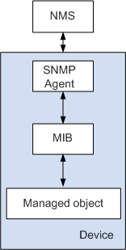

---
tags:
  - help
---

# SNMP

!!! quote

    - [什么是 SNMP - 华为](https://support.huawei.com/enterprise/zh/doc/EDOC1100087025)

!!! todo

    - [ ] 使用可视化浏览器查阅产商提供的 MIB。

## SNMP 原理

简单网络管理协议 SNMP（Simple Network Management Protocol）用于网络设备的管理。网络设备种类多种多样，不同设备厂商提供的管理接口（如命令行接口）各不相同，这使得网络管理变得愈发复杂。为解决这一问题，SNMP 应运而生。SNMP 作为广泛应用于 TCP/IP 网络的网络管理标准协议，提供了统一的接口，从而实现了不同种类和厂商的网络设备之间的统一管理。

### SNMP 系统组成

SNMP 系统由网络管理系统 NMS（Network Management System）、SNMP Agent、被管对象 Management object 和管理信息库 MIB（Management Information Base）四部分组成。NMS 作为整个网络的网管中心，对设备进行管理。

每个被管理设备中都包含驻留在设备上的 SNMP Agent 进程、MIB 和多个被管对象。NMS 通过与运行在被管理设备上的 SNMP Agent 交互，由 SNMP Agent 通过对设备端的 MIB 进行操作，完成 NMS 的指令。

<figure markdown="span">
<center>{ width=80% align=center }</center>
<figcaption>SNMP 系统组成</figcaption>
</figure>

- Managed Object：指被管理对象。每一个设备可能包含多个被管理对象，被管理对象可以是设备中的某个硬件，也可以是在硬件、软件（如路由选择协议）上配置的参数集合。
- MIB
    - MIB 是一个数据库，指明了被管理设备所维护的变量。MIB 在数据库中定义了被管理设备的一系列属性：对象的名称、对象的状态、对象的访问权限和对象的数据类型等。MIB 也可以看作是 NMS 和 SNMP Agent 之间的一个接口，通过这个接口，NMS 对被管理设备所维护的变量进行查询/设置操作。
    - MIB 是以树状结构进行存储的。树的节点表示被管理对象，它可以用从根开始的一条路径唯一地识别，这条路径就称为 OID，如 system 的 OID 为 1.3.6.1.2.1.1，interfaces 的 OID 为 1.3.6.1.2.1.2。
- SNMP Agent
    - SNMP Agent 接收到 NMS 的请求信息后，通过 MIB 表完成相应指令后，并把操作结果响应给 NMS。
    - 当设备发生故障或者其它事件时，设备会通过 SNMP Agent 主动发送 SNMP Traps 给 NMS，向 NMS 报告设备当前的状态变化。
- NMS
    - NMS 可以向设备上的 SNMP Agent 发出请求，查询或修改一个或多个具体的参数值。
    - NMS 可以接收设备上的 SNMP Agent 主动发送的 SNMP Traps，以获知被管理设备当前的状态。

### SNMP 版本

SNMP 协议分为三个版本：SNMPv1、SNMPv2c 和 SNMPv3。

- SNMPv1 是 SNMP 协议的最初版本，提供最小限度的网络管理功能。SNMPv1 基于团体名认证，安全性较差，且返回报文的错误码也较少。
- SNMPv2c 也采用团体名认证。在 SNMPv1 版本的基础上引入了 GetBulk 和 Inform 操作，支持更多的标准错误码信息，支持更多的数据类型（Counter64、Counter32）。
- SNMPv3 主要在安全性方面进行了增强，提供了基于 USM（User Security Module）的认证加密和基于 VACM（View-based Access Control Model）的访问控制。SNMPv3 版本支持的操作和 SNMPv2c 版本支持的操作一样。

SNMP 报文是普通的 UDP 报文，协议中规定有两个默认端口号：

- 端口号 161：NMS 发送 Get、GetNext、GetBulk 和 Set 操作请求以及 SNMP Agent 响应这些请求操作时，使用该端口号。该端口号支持用户配置，但是需要保证 NMS 发送请求报文使用的端口号与 SNMP Agent 响应请求报文使用的端口号要一致。
- 端口号 162：SNMP Agent 向 NMS 发送 Trap 或 Inform 时，使用该端口号。该端口号支持用户配置，但是需要保证 SNMP Agent 发送 Trap 或 Inform 的端口号与 NMS 监听 Trap 或 Inform 的端口号要一致。

### SNMP 查询

SNMP 查询操作有三种：Get、GetNext 和 GetBulk。SNMPv1 版本不支持 GetBulk 操作。

- Get 操作：NMS 使用该操作从 SNMP Agent 中获取一个或多个参数值。
- GetNext 操作：NMS 使用该操作从 SNMP Agent 中获取一个或多个参数的下一个参数值。
- GetBulk 操作：基于 GetNext 实现，相当于连续执行多次 GetNext 操作。在 NMS 上可以设置被管理设备在一次 GetBulk 报文交互时，执行 GetNext 操作的次数。

报文中的主要字段如下：

!!! note ""

    === "SNMPv3"

        报文中的主要字段定义如下：

        - 版本：表示 SNMP 的版本，如果是 SNMPv3 报文则对应字段值为 3。
        - MsgID：请求报文的序列号。
        - MaxSize：消息发送者所能够容纳的消息最大字节，同时也表明了发送者能够接收到的最大字节数。
        - Flags：消息标识位，占一个字节，有三个特征位：reportableFlag，privFlag 和 authFlag。
            - reportableFlag=1，在能够导致 Report PDU 生成的情况下，SNMPv3 报文接收方必须向发送方发送 Report PDU；reportableFlag=0，SNMPv3 报文接收方不发送 Report PDU。只有在 SNMP PDU 部分不能被解密时（比如由于密钥错误导致解密失败等）才会用到 Report。
            - privFlag=1，对 SNMPv3 报文进行加密；privFlag=0，不对 SNMPv3 报文进行加密。
            - authFlag=1，对 SNMPv3 报文进行鉴权；authFlag=0，不对 SNMPv3 报文进行鉴权。
            - 除了 privFlag=1，authFlag=0 的情况外，其他任意组合都可以，所以在配置 SNMPv3 的安全级别的时候需要注意：如果用户组是 privacy 级别，用户和告警主机就必须是 privacy 级别；用户组是 authentication 级别，用户和告警主机可以是 privacy 或者 authentication 级别。
        - SecurityModel：消息采用的安全模型，发送方和接收方必须采用相同的安全模型。
        - SecurityParameters：安全参数，包含 SNMP 实体引擎的相关信息、用户名、鉴权参数、加密参数等安全信息。
        - Context EngineID：SNMP 唯一标识符，和 PDU 类型一起决定应该发往哪个应用程序。
        - Context Name：用于确定 Context EngineID 对被管理设备的 MIB 视图。

    === "SNMPv1/2"

        - 版本：表示 SNMP 的版本，如果是 SNMPv1 报文则对应字段值为 0，SNMPv2c 则为 1。
        - 团体名：用于在 SNMP Agent 与 NMS 之间完成认证，字符串形式，用户可自行定义。团体名包括“read”和“write”两种，执行 SNMP 查询操作时，采用“read”团体名进行认证；执行 SNMP 设置操作时，则采用“write”团体名进行认证。
        - Request ID：用于匹配请求和响应，SNMP 给每个请求分配全局唯一的 ID。
        - Non repeaters/Max repetitions：GetBulk 操作基于 GetNext 操作实现，相当于多次执行 GetNext 操作，这两个参数用于设置执行 GetNext 操作次数。
        - Error status：用于表示在处理请求时出现的状况。
        - Error index：差错索引。当出现异常情况时，提供变量绑定列表（Variable bindings）中导致异常的变量的信息。
        - Variable bindings：变量绑定列表，由变量名和变量值对组成。

### SNMP Trap

SNMP Traps 是指 SNMP Agent 主动将设备产生的告警或事件上报给 NMS，以便网络管理员及时了解设备当前运行的状态。

SNMP Agent 上报 SNMP Traps 有两种方式：Trap 和 Inform。SNMPv1 版本不支持 Inform。Trap 和 Inform 的区别在于，SNMP Agent 通过 Inform 向 NMS 发送告警或事件后，NMS 需要回复 InformResponse 进行确认。

Trap 不属于 NMS 对被管理设备的基本操作，它是被管理设备的自发行为。当被管理设备达到告警的触发条件时，会通过 SNMP Agent 向 NMS 发送 Trap 消息，告知设备侧出现的异常情况，便于网络管理人员及时处理。例如被管理设备热启动后，SNMP Agent 会向 NMS 发送 warmStart 的 Trap。

这种 Trap 信息是受限制的。只有在设备端的模块达到模块预定义的告警触发条件时，SNMP Agent 才会向管理进程报告。这种方法的好处是仅在严重事件发生时才发送 Trap 信息，减少报文交互产生的流量。

### MIB 详解

!!! quote

    - [S200, S300, S500, S1700, S2700, S5700, S6700 V200R023C00 MIB 参考 - 华为](https://support.huawei.com/enterprise/zh/doc/EDOC1100333396/2f6c0513?idPath=24030814|259023469|259023623|22318634|252516943)
    - [Support - 01-MIB overview- H3C](https://www.h3c.com/en/Support/Resource_Center/EN/Home/Public/00-Public/Technical_Documents/Reference_Guides/MIB_Companion/H3C_S6805_S9820_64H_MIB_Companion_Rele-11259/00/202305/1853809_294551_0.htm)

MIB 定义被管理对象的一系列属性，包括

- 对象的名字
- 对象的访问权限
- 对象的数据类型

管理信息结构 SMI（Structure of Management Information）规定了被管理的对象应该如何定义和组织，它定义了一系列 MIB 可以使用的数据类型，比如 Counter、Gauge 等。

MIB 文件一旦发布，OID 就和被定义的对象绑定，不能修改。MIB 节点不能被删除，只能将它的状态置为“obsolete”，表明该节点已经被废除。

MIB 可以分为公有 MIB 和私有 MIB 两种。

- 公有 MIB：一般由 RFC 定义，主要用来对各种公有协议进行结构化设计和接口标准化处理。大多数的设备制造商都需要按照 RFC 的定义来提供 SNMP 接口。
- 私有 MIB：是公有 MIB 的必要补充，当公司自行开发私有协议或者特有功能时，可以利用私有 MIB 来完善 SNMP 接口的管理功能，同时对第三方网管软件管理存在私有协议或特有功能的设备提供支持。

MIB 对象分为三类：

- 标量对象（Scalar Object）：只有一个实例，如系统名称、系统描述等。
    - 要访问标量对象，必须在标量对象后加上索引 `.0` 表示这个标量对象的唯一实例。
- 表对象（Table Object）：将多个相关的对象组织成表。
    - 在表中，每一列是对象，每一行是它们的实例。
    - 列对象（Column Object）：表中的每一列。

```text
PDU-MIB DEFINITIONS ::= BEGIN
IMPORTS
enterprises, Counter,
TimeTicks, Gauge FROM RFC1155-SMI
OBJECT-TYPE FROM RFC-1212

sysUpTime, DisplayString FROM RFC1213-MIB
TRAP-TYPE FROM RFC-1215;
pdu OBJECT IDENTIFIER ::= { enterprises 42578 }
pdu1 OBJECT IDENTIFIER ::= { pdu 1 }
pdu2 OBJECT IDENTIFIER ::= { pdu 2 }
pdu3 OBJECT IDENTIFIER ::= { pdu 3 }
pdu4 OBJECT IDENTIFIER ::= { pdu 4 }
pdu5 OBJECT IDENTIFIER ::= { pdu 5 }

baseinfo1 OBJECT IDENTIFIER ::= { pdu1 1 }

cascadeAlarmPDU1 OBJECT-TYPE
SYNTAX INTEGER (0..3)
ACCESS read-only
STATUS optional
DESCRIPTION
        " "
::= { baseinfo1 1 }

deviceNamePDU1 OBJECT-TYPE
SYNTAX DisplayString (SIZE (32))
ACCESS read-write
STATUS optional
DESCRIPTION
        " "
::= { baseinfo1 2 }
```

## SNMP 实践

!!! tip "报文示例请查看参考链接中华为的介绍文章，下面的实践环节不会演示抓包。"

### 使用 [Net-SNMP](http://www.net-snmp.org/)

Net-SNMP 是一个开源的 SNMP 工具包，提供了全面的 SNMP 功能：

- 命令行工具 `snmpwalk`、`snmpget`、`snmpset` 等。
- `snmptrapd` 守护进程，用于接收 SNMP Trap。
- `snmpd` 守护进程，用于提供 SNMP 服务。
- C 和 Perl API，用于开发自定义的 SNMP 程序。

其中 `snmpwalk` 是最常见的 SNMP 查询工具。下面以智能 PDU 为例，演示如何使用 `snmpwalk` 查询设备信息：

```shell
$ snmpwalk -v3 -l authPriv -u <username> -a MD5 -A <auth_key> -x DES -X <priv_key1> <device_ip>
iso.3.6.1.2.1.1.1.0 = STRING: "DG-352-IP HV1.00 SV1.36 WV1.38"
iso.3.6.1.2.1.1.2.0 = OID: iso.3.6.1.4.1.42578
iso.3.6.1.2.1.1.3.0 = Timeticks: (1219) 0:00:12.19
iso.3.6.1.2.1.1.4.0 = STRING: "zjusct"
iso.3.6.1.2.1.1.5.0 = STRING: "pdu3"
iso.3.6.1.2.1.1.6.0 = STRING: "rack3"
iso.3.6.1.2.1.1.7.0 = INTEGER: 4
$ snmpset -v3 <auth> <device_ip> <oid> s pdu1
iso.3.6.1.2.1.1.5.0 = STRING: "pdu1"
```

集群中的基础设施均支持 SNMPv3，且采用的认证方式大多为 MD5 和 DES。

### 在 [oid-info](http://www.oid-info.com/index.htm) 查询 MIB 信息

对于上面的查询结果，可以在 oid-info 网站上查询到对应的 MIB 信息。以第一行为例，`iso` 对应的 OID 为 1，查询 `1.3.6.1.2.1.1.1` 可以得到如下结果：

```text
{iso(1) identified-organization(3) dod(6) internet(1) mgmt(2) mib-2(1) system(1) sysDescr(1)}
sysDescr OBJECT-TYPE
SYNTAX DisplayString (SIZE (0..255))
MAX-ACCESS read-only
STATUS current
DESCRIPTION
"A textual description of the entity. This value should
include the full name and version identification of
the system's hardware type, software operating-system,
and networking software."
```

可以看出，这是一个标量对象，只有一个实例，通过 `sysDescr.0` 访问。
