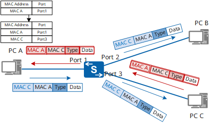
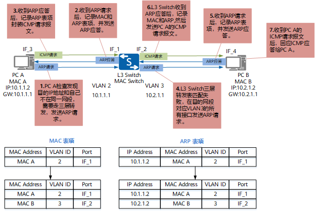
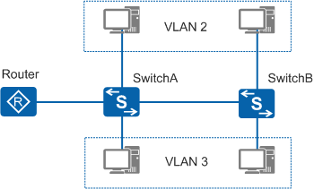
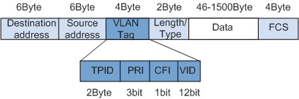
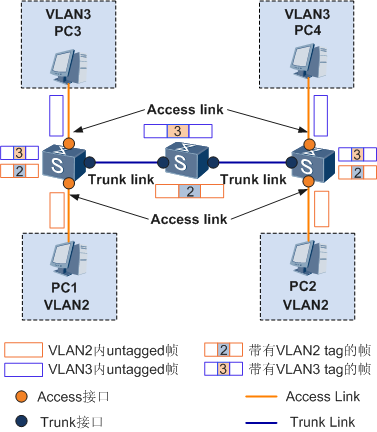
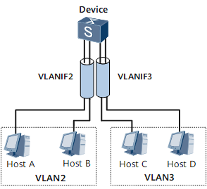
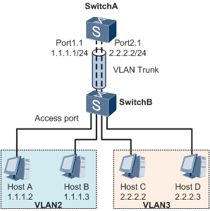

---
tags:
  - stable
---

# VLAN

!!! quote

    - [【交换机在江湖】第十二章 VLAN 基础篇 - 华为](https://forum.huawei.com/enterprise/zh/thread/580889430837837824)
    - [无线接入控制器 (AC 和 FITAP) 产品文档 - 华为](https://support.huawei.com/hedex/hdx.do?docid=EDOC1100064375&id=dc_fd_vlan_0006)
    - [VLAN 技术指导 - 华为](https://support.huawei.com/enterprise/zh/doc/EDOC1100086528)
    - [一个视频，彻底搞清 tag untag pvid vid access trunk 这些概念的区别和联系！ - Bilibili](https://www.bilibili.com/video/BV1ty421e7hk)

## VLAN 简介

!!! note "以太网交换基础"

    二层、三层交换原理在此略过。如果你对下面两张图的内容不熟悉，建议查阅相关资料。

    <figure markdown="span" style="width: 49%; display: inline-block">
      
      <figcaption>二层交换</figcaption>
    </figure>
    <figure markdown="span" style="width: 49%; display: inline-block">
      
      <figcaption>三层交换</figcaption>
    </figure>

VLAN（Virtual Local Area Network）即虚拟局域网，是将一个物理的 LAN 在逻辑上划分成多个广播域的通信技术。每个 VLAN 是一个广播域，VLAN 内的主机间通信就和在一个 LAN 内一样，而 VLAN 间则不能直接互通，这样，广播报文就被限制在一个 VLAN 内。

<figure markdown="span">
  { width=80% }
  <figcaption>VLAN 示意图</figcaption>
</figure>

## VLAN Tag

要使交换机能够分辨不同 VLAN 的报文，需要在报文中添加标识 VLAN 信息的字段。IEEE 802.1Q 协议规定，在以太网数据帧的目的 MAC 地址和源 MAC 地址字段之后、协议类型字段之前加入 4 个字节的 VLAN 标签（又称 VLAN Tag，简称 Tag），用以标识 VLAN 信息。VLAN 数据帧格式如图 2 所示。

<figure markdown="span">
  { width=80% }
  <figcaption>VLAN 数据帧格式</figcaption>
</figure>
其中，数据帧中的 VID（VLAN ID）字段标识了该数据帧所属的 VLAN，数据帧只能在其所属 VLAN 内进行传输。

## VLAN 划分

!!! warning "注意事项"

    由于设备所有的接口都默认加入 VLAN1，因此当网络中存在 VLAN1 的未知单播、组播或者广播报文时，可能会引起广播风暴。对于不需要加入 VLAN1 的接口及时退出 VLAN1，避免环路。

- 执行命令 `vlan vlan-id`，创建 VLAN 并进入 VLAN 视图。
- 使用 `vlan batch` 命令可以批量创建多个 VLAN。如果该 VLAN 已经存在，不会再重新创建，保留原来的 VLAN 及其相关配置。

```text
<HUAWEI> system-view
[HUAWEI] vlan 100
[HUAWEI-vlan100] quit
[HUAWEI] display vlan summary
Static VLAN:
Total 2 static VLAN.
1 100

Dynamic VLAN:
Total 0 dynamic VLAN.

Reserved VLAN:
Total 0 reserved VLAN.
```

## VLAN 接口

- Access 接口：对于交换机来说，其内部处理的数据帧都带有 VLAN 标签，而现网中交换机连接的设备有些只会收发 Untagged 帧，要与这些设备交互，就需要接口能够识别 Untagged 帧并在收发时给帧添加、剥除 VLAN 标签。
- Trunk 接口：同时，现网中属于同一个 VLAN 的用户可能会被连接在不同的交换机上，且跨越交换机的 VLAN 可能不止一个，如果需要用户间的互通，就需要交换机间的接口能够同时识别和发送多个 VLAN 的数据帧。

<figure markdown="span">
  { width=80% }
  <figcaption>不同 VLAN 接口对数据帧的处理方式</figcaption>
</figure>

不同产商对 VLAN 的接口定义有所不同，下面介绍了华为和 TP-Link 的 VLAN 接口定义。

!!! info ""

    === "华为"

        根据接口连接对象以及对收发数据帧处理的不同，华为定义了 3 种接口的链路类型：Access、Trunk 和 Hybrid，以适应不同的连接和组网：

        | 接口类型 | 对接收不带 Tag 的报文处理 | 对接收带 Tag 的报文处理 | 发送帧处理过程 |
        | --- | --- | --- | --- |
        | Access 接口 | 接收该报文，并打上缺省的 VLAN ID。 | 当 VLAN ID 与缺省 VLAN ID 相同时，接收该报文，否则丢弃该报文。 | 先剥离帧的 PVID Tag，然后再发送。 |
        | Trunk 接口 | 打上缺省的 VLAN ID，当缺省 VLAN ID 在允许通过的 VLAN ID 列表里时，接收该报文，否则丢弃该报文。| 当 VLAN ID 在接口允许通过的 VLAN ID 列表里时，接收该报文，否则丢弃该报文。| 当 VLAN ID 与缺省 VLAN ID 相同，且是该接口允许通过的 VLAN ID 时，去掉 Tag，发送该报文。<br/>当 VLAN ID 与缺省 VLAN ID 不同，且是该接口允许通过的 VLAN ID 时，保持原有 Tag，发送该报文。|
        | Hybrid 接口 | 同 Trunk。 | 同 Trunk。 |当 VLAN ID 是该接口允许通过的 VLAN ID 时，发送该报文。可以通过命令设置发送时是否携带 Tag。|

    === "TP-Link"

        我们持有的两台 TP-Link 交换机，所有端口均为 GENERAL，可以配置为 tagged 和 untagged。

        <table>
        <thead>
        <tr>
            <th rowspan="2">端口类型</th>
            <th colspan="2">接收报文</th>
            <th rowspan="2">发送报文</th>
        </tr>
        <tr>
            <th>不带 Tag</th>
            <th>带 Tag</th>
        </tr>
        </thead>
        <tbody>
        <tr>
            <td>ACCESS</td>
            <td rowspan="3">添加缺省的 VLAN Tag，即输入端 PVID</td>
            <td>当 VID = PVID，接收，否则丢弃</td>
            <td>去掉 Tag</td>
        </tr>
        <tr>
            <td>TRUNK</td>
            <td rowspan="2">当 VID 属于允许通过的 VLAN ID 时，接收，否则丢弃</td>
            <td>保持原有 Tag</td>
        </tr>
        <tr>
            <td>GENERAL</td>
            <td>配置为 Tag 时，保持原有 Tag<br>配置为 Untagged 时，去掉 Tag</td>
        </tr>
        </tbody>
        </table>

一般情况下，接设备的端口为 Access 接口，接交换机的端口为 Trunk 接口。

=== "Access"

    === "示例"

        ```text
        [HUAWEI] interface gigabitethernet 1/0/1
        [HUAWEI-GigabitEthernet1/0/1] port link-type access
        [HUAWEI-GigabitEthernet1/0/1] port default vlan 100
        [HUAWEI-GigabitEthernet1/0/1] quit
        [HUAWEI] display port vlan gigabitethernet 1/0/1
        Port                        Link Type    PVID  Trunk VLAN List
        -------------------------------------------------------------------------------
        GigabitEthernet1/0/1        access       100   -
        ```

    === "命令格式"

        ```text
        interface interface-type interface-number
        port link-type access
        port default vlan vlan-id
        ```

=== "Trunk"

    === "示例"

        ```text
        [HUAWEI] interface gigabitethernet 1/0/2
        [HUAWEI-GigabitEthernet1/0/2] port link-type trunk
        [HUAWEI-GigabitEthernet1/0/2] port trunk allow-pass vlan 100
        [HUAWEI-GigabitEthernet1/0/2] quit
        [HUAWEI] display port vlan gigabitethernet 1/0/2
        Port                        Link Type    PVID  Trunk VLAN List
        -------------------------------------------------------------------------------
        GigabitEthernet1/0/2        trunk        1     1 100
        ```

    === "命令格式"

        ```text
        interface interface-type interface-number
        port link-type trunk
        port trunk allow-pass vlan { { vlan-id1 [ to vlan-id2 ] } &<1-10> | all }
        port trunk pvid vlan vlan-id
        ```

=== "Hybrid"

    === "示例"

        ```text
        [HUAWEI] interface gigabitethernet 1/0/3
        [HUAWEI-GigabitEthernet1/0/3] port link-type hybrid
        [HUAWEI-GigabitEthernet1/0/3] port hybrid tagged vlan 100
        [HUAWEI-GigabitEthernet1/0/3] quit
        [HUAWEI] display port vlan gigabitethernet 1/0/3
        Port                        Link Type    PVID  Trunk VLAN List
        -------------------------------------------------------------------------------
        GigabitEthernet1/0/3        hybrid       1     100
        ```

    === "命令格式"

        ```text
        interface interface-type interface-number
        port link-type hybrid
        // 将 Hybrid 接口以 Untagged 方式加入 VLAN，接口在发送帧时将帧中的 VLAN Tag 去掉。
        port hybrid untagged vlan { { vlan-id1 [ to vlan-id2 ] } &<1-10> | all }
        // 将 Hybrid 接口以 Tagged 方式加入 VLAN，接口在发送帧时不将帧中的 VLAN Tag 去掉。
        port hybrid tagged vlan { { vlan-id1 [ to vlan-id2 ] } &<1-10> | all }
        // 配置 Hybrid 接口的缺省 VLAN。
        port hybrid pvid vlan vlan-id
        ```

=== "使用端口组 port-group"

    ```text
    [Huawei] port-group group-member GigabitEthernet 0/0/10 to GigabitEthernet 0/0/20
    [Huawei-port-group]port link-type access
    [Huawei-port-group]port default vlan 100
    ```

## VLAN 间通信

划分 VLAN 后，不同 VLAN 之间不能直接通信。如果要实现 VLAN 间通信，需要借助路由器。

三层交换技术是将路由技术与交换技术合二为一的技术，在交换机内部实现了路由，提高了网络的整体性能。三层交换机通过路由表传输第一个数据流后，会产生一个 MAC 地址与 IP 地址的映射表。当同样的数据流再次通过时，将根据此表直接从二层通过而不是通过三层，从而消除了路由器进行路由选择而造成的网络延迟，提高了数据包转发效率。

为了保证第一次数据流通过路由表正常转发，路由表中必须有正确的路由表项。因此必须在三层交换机上部署三层接口并部署路由协议，实现三层路由可达。三层交换机一般使用 VLANIF 接口实现该功能。

!!! info ""

    === "华为：VLANIF"

        VLANIF 接口是三层逻辑接口，可以部署在三层交换机上，也可以部署在路由器上。

        <figure markdown="span">
        { width=80% }
        <figcaption>通过 VLANIF 接口实现 VLAN 间的通信</figcaption>
        </figure>

        配置：

        - 在 Device 上创建 2 个 VLANIF 接口并配置 VLANIF 接口的 IP 地址，保证两个 VLANIF 接口对应的 IP 地址路由可通。
        - 将用户设备的缺省网关设置为所属 VLAN 对应 VLANIF 接口的 IP 地址。

        主机 A 和 C 的通信过程：

        - 主机 A 将主机 C 的 IP 地址和自己所在网段进行比较，发现主机 C 和自己不在同一个子网。
        - 主机 A 发送 ARP 请求给自己的网关 Device，请求网关的 MAC 地址。
        - Device 收到该 ARP 请求后，返回 ARP 应答报文，报文中源 MAC 地址为 VLANIF2 的 MAC 地址。
        - 主机 A 学习到网关的 MAC 地址。
        - 主机 A 向网关发送目的 MAC 为 VLANIF 接口 MAC 地址、目的 IP 为主机 C 的 IP 地址的报文。
        - Device 收到该报文后进行三层转发，发现主机 C 的 IP 地址为直连路由，报文将通过 VLANIF3 接口进行转发。
        - Device 作为 VLAN3 内主机的网关，向 VLAN3 内发送一个 ARP 广播，请求主机 C 的 MAC 地址。
        - 主机 C 收到网关发送的 ARP 广播后，对此请求进行 ARP 应答。
        - 网关收到主机 C 的应答后，就把主机 A 的报文发送给主机 C。主机 A 之后要发给 C 的报文都先发送给网关，由网关做三层转发。

### VLAN 互通

!!! quote

    - [【交换机在江湖】第十四章 VLAN 通信篇 - 华为](https://forum.huawei.com/enterprise/zh/thread/blog/580894324915322880)

VLAN 间通信场景极多，这里仅介绍一种场景：不同 VLAN 不同网段用户间的通信，用户通过二层交换机互联，仅通过一台三层交换机实现 VLAN 间通信。比如下图中 VLAN2 是数据网，VLAN3 是管理网，TOR 交换机为二层，核心交换机为三层，如何实现数据和管理网之间的通信？

<figure markdown="span">
  
  <figcaption>跨交换机不同 VLAN 不同网段用户间的通信</figcaption>
</figure>

思路如下：

1. 三层交换机才能实现 VLAN 间路由，因此需要在核心交换机上配置 VLANIF 接口。

    ```text
    # 创建 VLANIF 接口并配置 IP 地址
    [HUAWEI] interface Vlanif2
    [HUAWEI-Vlanif2] ip address ***.***.1.***
    [HUAWEI-Vlanif2] quit
    [HUAWEI] interface Vlanif3
    [HUAWEI-Vlanif3] ip address ***.***.2.***
    [HUAWEI-Vlanif3] quit
    # 配置到 TOR 交换机的端口为 Trunk 接口
    [HUAWEI] interface GigabitEthernet 1/0/1
    [HUAWEI-GigabitEthernet1/0/1] port link-type trunk
    [HUAWEI-GigabitEthernet1/0/1] port trunk allow-pass vlan 2 3
    [HUAWEI-GigabitEthernet1/0/1] quit
    ```

2. 在二层交换机上按上一节方法划分 VLAN 即可。

### 恢复 VLAN 缺省配置

=== "Access"

    ```text
    undo port default vlan
    ```

=== "Trunk"

    ```text
    undo port trunk pvid vlan
    undo port trunk allow-pass vlan all
    port trunk allow-pass vlan 1
    ```

=== "Hybrid"

    ```text
    undo port hybrid pvid vlan
    undo port hybrid vlan all
    port hybrid untagged vlan 1
    ```
