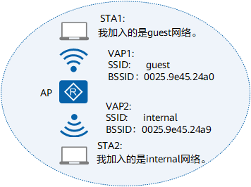

---
tags:
  - archive
---

# WLAN

!!! warning "archive"

    集群没有企业级 WLAN 设备，以后估计也不会有。

!!! quote

    - [WLAN-FAT AP 介绍 - 华为](https://support.huawei.com/enterprise/zh/doc/EDOC1100033976/abe6c7b7)

无线局域网 WLAN（Wireless Local Area Network）广义上是指以无线电波、激光、红外线等来代替有线局域网中的部分或全部传输介质所构成的网络。本文介绍的 WLAN 技术是基于 802.11 标准系列的，即利用高频信号（例如 2.4GHz 或 5GHz）作为传输介质的无线局域网。

802.11 是 IEEE 在 1997 年为 WLAN 定义的一个无线网络通信的工业标准。此后这一标准又不断得到补充和完善，形成 802.11 的标准系列，例如 802.11、802.11a、802.11b、802.11e、802.11g、802.11i、802.11n、802.11ac 等。

## WLAN 原理

### 基本概念

- 工作站 STA（Station）：支持 802.11 标准的终端设备。
- 接入点 AP（Access Point）：为 STA 提供基于 802.11 标准的无线接入服务，起到有线网络和无线网络的桥接作用。
- 虚拟接入点 VAP（Virtual Access Point）：是 AP 设备上虚拟出来的业务功能实体。用户可以在一个 AP 上创建不同的 VAP 来为不同的用户群体提供无线接入服务。
- 服务集标识符 SSID（Service Set Identifier）：表示无线网络的标识，用来区分不同的无线网络。例如，当我们在笔记本电脑上搜索可接入无线网络时，显示出来的网络名称就是 SSID。
    - 基本服务集标识符 BSSID（Basic Service Set Identifier），表示 AP 上每个 VAP 的数据链路层 MAC 地址。
    - 扩展服务集标识符 ESSID（Extended Service Set Identifier），是一个或一组无线网络的标识，图中所示的“guest”或“internal”。STA 可以先扫描所有网络，然后选择特定的 SSID 接入某个指定无线网络。通常，我们所指的 SSID 即为 ESSID。

    !!! note "简单理解，BSSID 是 MAC 地址，ESSID 是 WiFi 名称。"

- 基本服务集 BSS（Basic Service Set）：一个 AP 所覆盖的范围。在一个 BSS 的服务区域内，STA 可以相互通信。
- 国家码：用来标识射频所在的国家，它规定了射频特性，如功率、信道值和可用于帧传输的信道总数。在第一次配置设备之前，必须配置有效的国家码。

<figure markdown="span">
    <center>
    { width=80% align=center}
    </center>
    <figcaption>
    WLAN 基本概念
    </figcaption>
</figure>

传统 ICT 厂商将 WLAN 架构分为两种：自治式架构（Fat AP）和集中式架构（Fit AP）。下文以华为为例，但概念基本通用。华为 AP 架构如下所示。

- 自治式网络架构：
    - 又称为胖接入点（FAT AP）架构。在该架构下，AP 实现所有无线接入功能，不需要 AC 设备。
    - WLAN 早期广泛采用自治式架构。FAT AP 的功能强大，独立性好，但是设备结构复杂，价格昂贵，难于管理。随着企业大量部署 AP，对 AP 的配置、升级软件等管理工作给用户带来很高的操作成本和维护成本，自治式架构应用逐步减少。
- 瘦接入点（FIT AP）架构
    - 在该架构下，通过 AC 集中管理和控制多个 AP，所有无线接入功能由 AP 和 AC 共同完成。
    - AC 集中处理所有的安全、控制和管理功能，例如移动管理、身份验证、VLAN 划分、射频资源管理和数据包转发等。
    - FIT AP 完成无线射频接入功能，例如无线信号发射与探测响应、数据加密解密、数据传输确认等。
    - AP 和 AC 之间采用 CAPWAP 协议进行通讯，AP 与 AC 间可以跨越二层网络或三层网络。

<figure markdown="span">
    <center>
    
    </center>
    <figcaption>
    华为 AP 模式
    </figcaption>
</figure>

!!! note "简单理解：路由器自带的无线功能为 Fat AP，作为 AC 控制 AP 则为 Fit AP。"

### STA 接入过程

STA 接入过程分为三个阶段：扫描阶段、链路认证阶段和关联阶段。

#### 扫描阶段

STA 可以通过主动扫描和被动扫描获取到周围的无线网络信息：

<div class="grid cards" markdown>

- **主动扫描：指定 SSID**

    ---

    

    客户端发送携带有指定 SSID 的 Probe Request：STA 依次在每个信道发出 Probe Request 帧，寻找与 STA 有相同 SSID 的 AP，只有能够提供指定 SSID 无线服务的 AP 接收到该探测请求后才回复探查响应。

- **主动扫描：广播**

    ---

    

    客户端发送广播 Probe Request：客户端会定期地在其支持的信道列表中，发送 Probe Request 帧扫描无线网络。当 AP 收到 Probe Request 帧后，会回应 Probe Response 帧通告可以提供的无线网络信息。

- **被动扫描**

    ---

    

    STA 在每个信道上侦听 AP 定期发送的 Beacon 信标帧（信标帧中包含 SSID、支持速率等信息），以获取 AP 的相关信息。当用户需要节省电量时，可以使用被动扫描。

</div>

#### 链路认证阶段

为了保证无线链路的安全，接入过程中 AP 需要完成对 STA 的认证。802.11 链路定义了两种认证机制：开放系统认证和共享密钥认证。

开放系统认证 (Open System Authentication) 即不认证，任意 STA 都可以认证成功。

<figure markdown="span">
    <center>
    
    </center>
    <figcaption>
    开放系统认证
    </figcaption>
</figure>

因为本文介绍的 WPA/WPA2 安全策略仅支持开放系统认证，故略去共享密钥认证的介绍。

#### 关联阶段

终端关联过程实质上是链路服务协商的过程。完成链路认证后，STA 会继续发起链路服务协商，具体的协商通过 Association 报文实现。

<figure markdown="span">
    <center>
    
    </center>
    <figcaption>
    关联阶段
    </figcaption>
</figure>

1. STA 向 AP 发送 Association Request 请求，请求帧中会携带 STA 自身的各种参数以及根据服务配置选择的各种参数（主要包括支持的速率、支持的信道、支持的 QoS 的能力以及选择的接入认证和加密算法）。

2. AP 收到关联请求后判断是否需要进行用户的接入认证，并回应 Association Response。

    STA 收到 Association Response 后，判断是否需要进行用户的接入认证：

    - 如果不需要，STA 可以访问无线网络；
    - 如果需要，STA 继续发起用户接入认证请求，用户接入认证成功后，STA 才可以访问无线网络。

### WLAN 安全策略

!!! note

    对于个人/家庭场景，一般采用的安全策略为 WPA2-PSK 接入认证 + CCMP（AES）数据加密。对于企业场景，认证策略一般会升级为 WPA2-802.1X 接入认证。

WLAN 安全提供了 WEP、WPA、WPA2 和 WAPI 四种安全策略机制。每种安全策略体现了一整套安全机制，包括无线链路建立时的**链路认证方式**，无线用户上线时的用户**接入认证方式**和无线用户传输数据业务时的**数据加密方式**。

目前，应用最广泛的是 WPA/WPA2。它比 WEP 更安全，但比 WAPI 更简单。本文仅介绍 WPA/WPA2。WPA/WPA2 安全策略涉及了链路认证阶段、接入认证阶段、密钥协商和数据加密阶段。其中，链路认证阶段 WPA/WPA2 仅支持开放式系统认证。

#### 接入认证阶段

WPA/WPA2分为企业版和个人版：

- WPA/WPA2企业版：采用WPA/WPA2-802.1X的接入认证方式，使用RADIUS服务器和可扩展认证协议EAP（Extensible Authentication Protocol）进行认证。用户提供认证所需的凭证，如用户名和密码，通过特定的用户认证服务器（一般是 RADIUS 服务器）来实现对用户的接入认证。下图展示基于 EAP-PEAP 的 802.1X 认证流程图。

    <figure markdown="span">
        <center>
        
        </center>
        <figcaption>
        WPA2-802.1X 接入认证
        </figcaption>
    </figure>

- WPA/WPA2 个人版：对一些中小型的企业网络或者家庭用户，部署一台专用的认证服务器代价过于昂贵，维护也很复杂，因此，WPA/WPA2 提供了一种简化的模式，即 WPA/WPA2 预共享密钥（WPA/WPA2-PSK）模式，它不需要专门的认证服务器，仅要求在每个 WLAN 节点（WLAN 服务端、无线路由器、网卡等）预先输入一个预共享密钥即可。只要密钥吻合，客户就可以获得 WLAN 的访问权。由于这个密钥仅仅用于认证过程，而不用于加密过程，因此不会导致诸如使用 WEP 密钥来进行 802.11 共享认证那样严重的安全问题。

!!! note "这里的所谓“预共享密钥”就是我们所说的 WiFi 密码。"

802.1X 认证可以支持对有线用户和无线用户进行身份认证，而 PSK 认证则是专门针对无线用户的认证方法。

#### 密钥协商阶段

在 802.11i 里定义了两种密钥层次模型，一种是成对密钥层次结构，主要用来保护 **STA 与 AP 之间往来的数据**；一种是群组密钥层次结构，主要用来描述 STA 与 AP 之间的**广播或组播数据**。

密钥协商阶段根据接入认证生成的成对主钥 PMK（Pairwise Master Key）产生成对临时密钥 PTK（Pairwise Transient Key）和群组临时密钥 GTK（Group Temporal Key）。PTK 用来加密单播报文，GTK 用来加密组播和广播无线报文。PMK 一般是利用预共享密钥和 SSID 通过哈希算法计算出来的。

密钥协商包括单播密钥协商和组播密钥协商过程，与密码学中常见的密钥协商过程类似，此处暂略。

#### 数据加密阶段

WPA/WPA2支持TKIP和CCMP两种加密算法。

- TKIP 加密算法

    区别于 WEP 共用一个共享密钥，TKIP 采用一套动态密钥协商和管理方法，每个无线用户都会动态地协商一套密钥，保证了每个用户使用独立的密钥。每个用户的密钥是由密钥协商阶段协商出来的 PTK、发送方的 MAC 地址和报文序列号计算生成的，通过这种密钥混合的防护方式来防范针对 WEP 的攻击。

    TKIP 采用信息完整性校验机制，一方面保证接收端接收报文的完整性；另一方面保证接收端和发送端数据的合法性。信息完整性校验码是通过密钥协商阶段协商出来的 MIC Key、目的 MAC 地址、源 MAC 地址和数据包计算生成的。

- CCMP 加密算法

    区别于 WEP 和 TKIP 采用的流密码机制，CCMP 采用了以高级加密标准 AES（Advanced Encryption Standard）的块密码为基础的安全协议。这种基于块密码的加密技术克服了 RC4 算法本身的缺陷，安全性更高。

### Fat AP 原理

配置 AP 时，实际上指的是配置 VAP：

- VAP 是 AP 上的业务功能实体。用户可以在 AP 的射频上创建不同的 VAP，通过**为 AP 的射频绑定服务集和射频模板**，就可以创建 VAP。
- VAP 下发 AP 时，与 VAP 绑定的服务集参数作为 VAP 的参数一起下发到 AP，AP 根据 VAP 配置的参数提供给用户不同的业务。

配置过程中涉及到两种逻辑接口：

- WLAN-Radio：射频接口，进行射频的相关配置，包括天线增益、功率、信道、实际可用天线数等。
- WLAN-BSS：一种虚拟的二层接口，类似于 hybrid 类型的二层以太网接口，具有二层属性，并可配置多种二层协议。创建并配置 WLAN-BSS 接口后，需要在服务集下绑定该接口。

还涉及到四种模板：

- WMM 模板：
    - **产生背景**：802.11 协议对于所有的应用都提供了相同质量的服务，但是事实上，不同的应用对于无线网络的要求也是不同的，因此 802.11 协议已经不能满足实际应用的需要。
    - **WMM 协议**：为了能够为不同的应用提供不同质量的服务，Wi-Fi 组织提出了一种无线 QoS 协议 **Wi-Fi 多媒体标准 WMM（Wi-Fi Multimedia）**，将数据报文按照优先级从高到低分为 4 个接入类 AC（Access Category）：AC_VO(语音)、AC_VI(视频)、AC_BE(尽力而为)、AC_BK(背景)，高优先级的 AC 占用信道的机会大于低优先级的 AC。WMM 模板实现了 WMM 协议，通过创建 WMM 模板，使 AP 或客户端优先级高的报文优先占用无线信道，保证语音、视频在无线网络中有更好的质量。
- 射频模板：
    - **内容**：射频速率、射频信道模式、射频功率模式、丢包/错包率门限、冲突率门限、分段门限、RTS/CTS 门限、是否支持短前导码、DTIM 周期、beacon 帧周期、WMM 名称或 ID 等。如果将某个射频模板绑定到某个射频中，则该射频就继承在射频模板里配置的所有参数。
    - **只有绑定了 WMM 模板的射频模板才可以被射频绑定。**
- 安全模板：
    - **内容**：安全模板提供了 WEP、WPA/WPA2、WAPI 四种安全策略机制。每种安全策略实现了一整套安全机制，包括无线链路建立时的链路认证方式，无线用户上线时的用户接入认证方式和无线用户传输数据业务时的数据加密方式。
    - **必要性**：WLAN 技术使用无线射频信号作为业务数据的传输介质，这种开放式的信道使攻击者很容易对无线信道中传输的业务数据进行窃听或篡改。因此，安全性是 WLAN 最为重要的因素。通过安全模板，您可以选择一种安全策略，更好的保护用户敏感数据的安全和用户的隐私。创建安全模板时，如果不配置任何安全策略，则模板内默认指定了安全策略为 open-system，即用户在搜索到无线网络时，不需要认证，可以直接访问网络。使用默认的安全策略存在较大的安全隐患，**非法用户可能通过无线方式 telnet 登录到设备进行业务修改配置**。可通过配置更安全的安全策略来降低此类安全隐患，例如配置 WPA/WPA2 的安全策略。
- 流量模板：
    - **内容**：创建流量模板可以实现为某个无线网络定制特定的优先级映射和流量监管功能。
    - **优先级映射**：如果 STA 和 AP 都使能了 WMM 功能，则 STA 发送的报文中携带有优先级字段。为了保证端到端的 QoS，保持报文在整个传输过程中的优先级，需要配置在转换过程中不同报文的优先级字段的映射关系。
    - **流量监管**：为了保护有限的网络资源，需要对无线用户进入 WLAN 网络的流量进行监管，即限制无线终端发送报文的速率。

整体架构如下图所示：

<figure markdown="span">
    <center>
    
    </center>
    <figcaption>
    Fat AP 组成
    </figcaption>
</figure>

### Fit AP 原理

WLAN 早期广泛采用自治式架构。FAT AP 的功能强大，独立性好，但是设备结构复杂，价格昂贵，难于管理。随着企业大量部署 AP，对 AP 的配置、升级软件等管理工作给用户带来很高的操作成本和维护成本，自治式架构应用逐步减少。

目前暂未配置 Fit AP，故不展开介绍。

## WLAN 实践

### 通用配置

配置：

```text
wlan global country-code CN # 缺省情况下，AP 设备的国家码标识为 CN。
```

检查：

```text
display wlan global
```

### Fat AP 配置

缺省情况下，设备存在 WMM 模板、射频模板、安全模板和流量模板，用户可以直接使用，不需要创建新模板。具体如下：

- 缺省 WMM 模板：ID 为 0，名称为 wmmf；
- 缺省射频模板：ID 为 0，名称为 radiof，缺省射频模板默认已绑定缺省 WMM 模板；
- 缺省安全模板：ID 为 0，名称为 secf；
- 缺省流量模板：ID 为 0，名称为 traf；
- 创建服务集后，服务集默认绑定了缺省的流量模板和安全模板。

如下所示：

```text
[Huawei-wlan-view]dis this
[V200R010C10SPC700]
#
wlan
 wmm-profile name wmmf id 0
 traffic-profile name traf id 0
 security-profile name secf id 0
 radio-profile name radiof id 0
  wmm-profile id 0
#
return
```

实际配置时，一般只需要新建安全模板，不需要新建 WMM 和流量射频模板。

```text
[Huawei-wlan-view]security-profile name wlantest
[Huawei-wlan-sec-prof-wlantest]security-policy wpa2
[Huawei-wlan-sec-prof-wlantest]wpa2 authentication-method psk pass-phrase cipher ******** encryption-method ccmp
```

!!! note "关于双频"

    一个 WLAN-BSS 接口只能被一个服务集绑定，一个服务集又只能被一个 WLAN-Radio 绑定。因此，如果需要在一个 AP 上配置双频 WLAN，则 WLAN-BSS 和服务集都需要分别创建。
    
    但对于不同服务集，SSID 可以相同，从而实现“双频合一”。下文就展示了这种配置。

接下来配置 WLAN-BSS 接口：

```text
# 2.4GHz
[Huawei]interface wlan-bss 0
[Huawei-Wlan-Bss0]port hybrid tagged vlan 1
# 5GHz
[Huawei]interface wlan-bss 1
[Huawei-Wlan-Bss1]port hybrid tagged vlan 1
```

接下来将安全模板和 WLAN-BSS 接口绑定到服务集上。：

```text
# 2.4GHz
[Huawei-wlan-view]service-set name wlantest
[Huawei-wlan-service-set-wlantest]ssid wlantest
[Huawei-wlan-service-set-wlantest]security-profile name wlantest
[Huawei-wlan-service-set-wlantest]wlan-bss 0
# 5GHz
[Huawei-wlan-view]service-set name wlantest-5G
[Huawei-wlan-service-set-wlantest-5G]ssid wlantest
[Huawei-wlan-service-set-wlantest-5G]security-profile name wlantest
[Huawei-wlan-service-set-wlantest-5G]wlan-bss 1
```

最后，进入射频接口绑定射频模板和服务集，就完成了 VAP 的创建。射频接口 `0/0/0` 为 2.4GHz，`0/0/1` 为 5GHz。

```text
# 2.4GHz
[Huawei]interface Wlan-Radio 0/0/0
[Huawei-Wlan-Radio0/0/0]radio-profile id 0
[Huawei-Wlan-Radio0/0/0]service-set name wlantest
# 5GHz
[Huawei]interface Wlan-Radio 0/0/1
[Huawei-Wlan-Radio0/0/1]radio-profile id 0
[Huawei-Wlan-Radio0/0/1]service-set name wlantest-5G
```

配置完成后，我们就能使用 [CellularZ](http://www.cellularz.fun/) 等网络工具看到工作在两个频段的 WLAN 了：

| 名称 | MAC | 强度 | 频率 | 信道 | 带宽 |
| --- | --- | --- | --- | --- | --- |
| wlantest | 7c:d9:a0:00:00:00 | -27 | 2412 | 1 | 20 |
| wlantest | 7c:d9:a0:00:00:00 | -43 | 5825 | 165 | 20 |

检查：

```text
[Huawei-wlan-view]display this
[V200R010C10SPC700]
#
wlan
 wmm-profile name wmmf id 0
 traffic-profile name traf id 0
 security-profile name secf id 0
 security-profile name wlantest id 1
  security-policy wpa2
  wpa2 authentication-method psk pass-phrase cipher ******** encryption-method ccmp
 service-set name wlantest id 0
  Wlan-Bss 0
  ssid wlantest
  traffic-profile id 0
  security-profile id 1
 service-set name wlantest-5G id 1
  Wlan-Bss 1
  ssid wlantest
  traffic-profile id 0
  security-profile id 1
 radio-profile name radiof id 0
  wmm-profile id 0
#
return
[Huawei-Wlan-Radio0/0/0]display this
[V200R010C10SPC700]
#
interface Wlan-Radio0/0/0
 radio-profile id 0
 service-set id 0 wlan 1
#
return
```

### Fit AP 配置

暂略。
