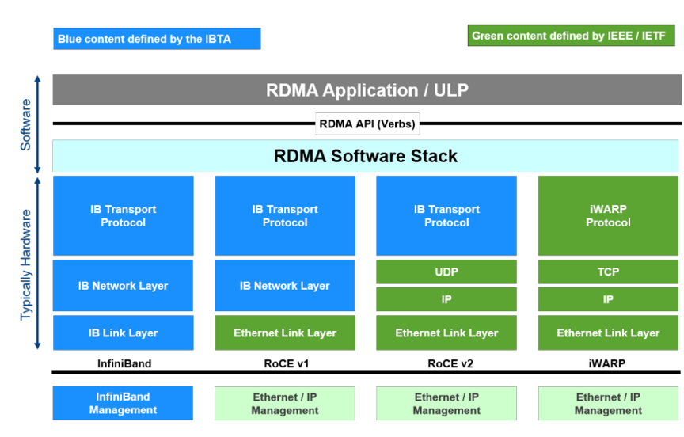
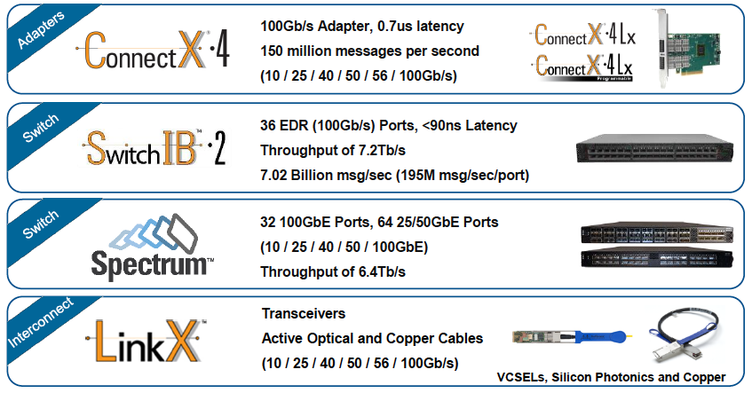
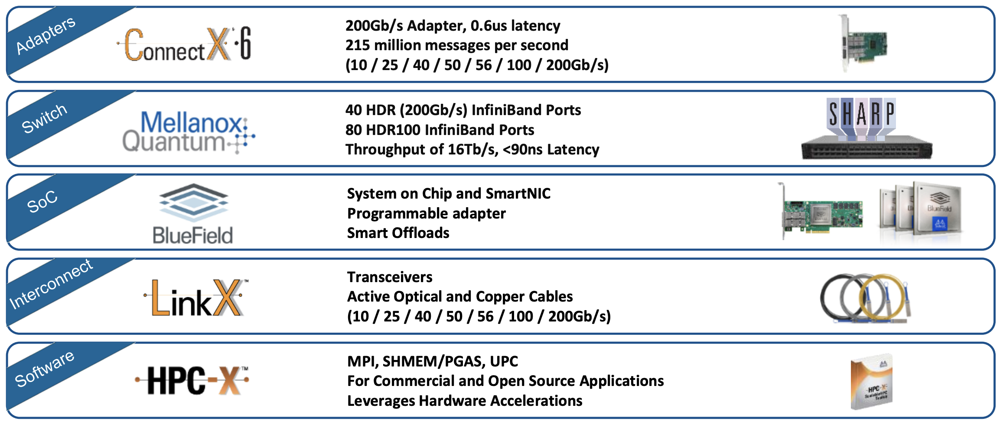
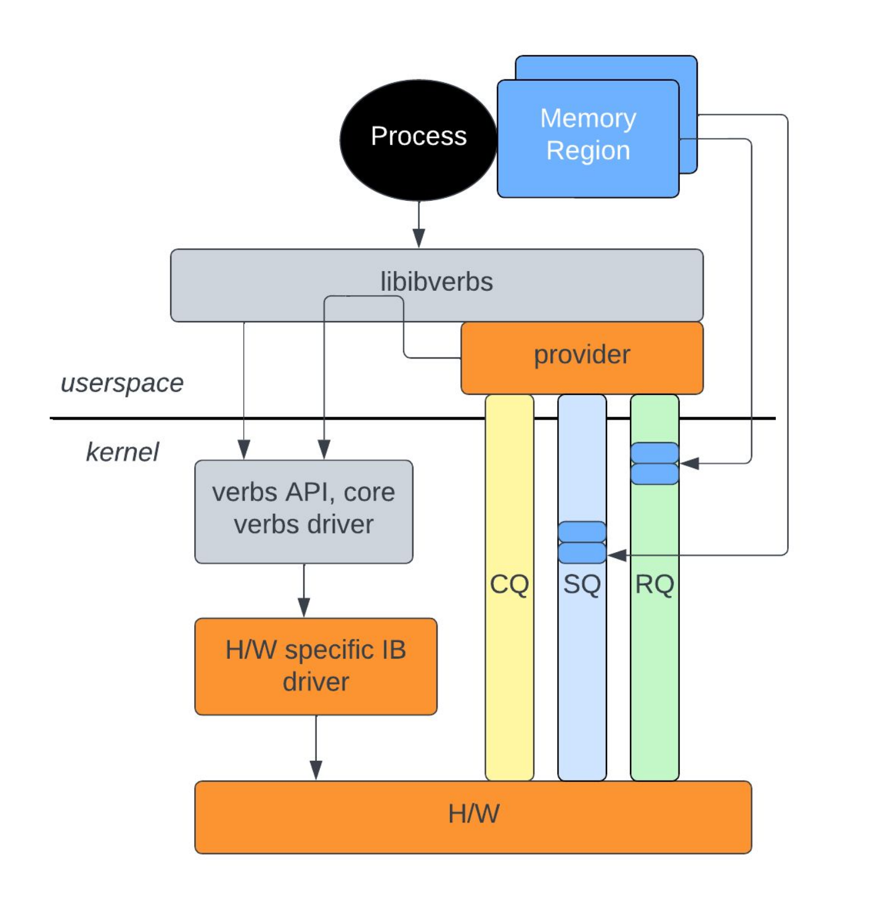
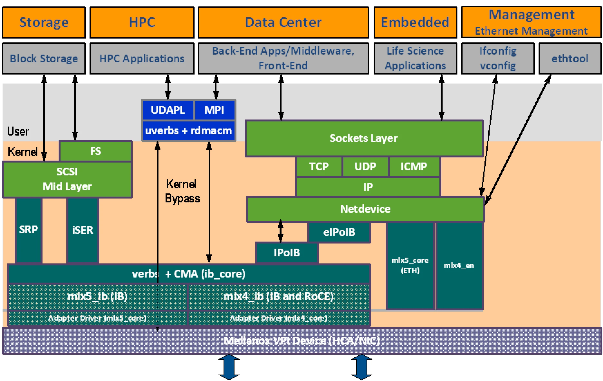
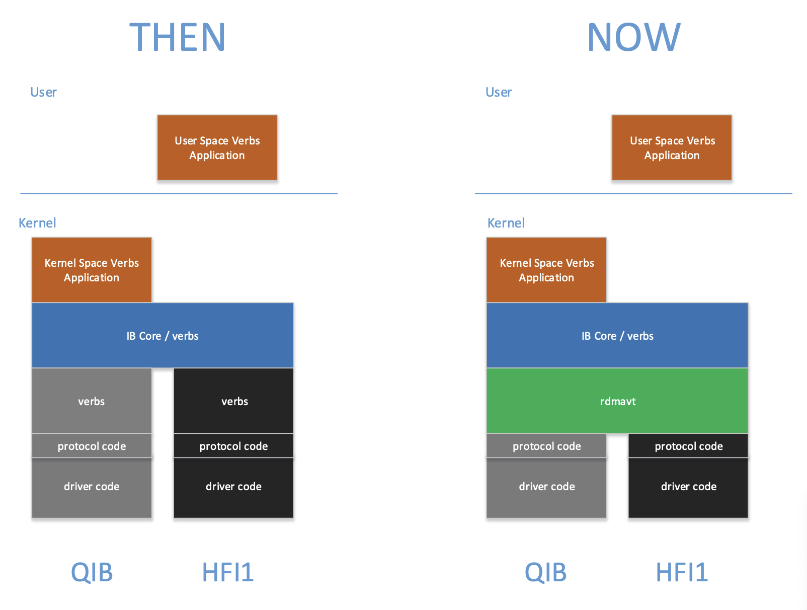

---
tags:
  - draft
---

# RDMA

!!! quote

    - [0. 《RDMA 杂谈》专栏索引 - 知乎](https://zhuanlan.zhihu.com/p/164908617)：写得很好的 RDMA 入门文章。有些遗憾的是发现得太晚了，找到时这篇文档也已经写了很多了。

## RDMA 概述

### RDMA 技术

RDMA 仅仅是一种机制，考虑其具体实现，就涉及到多种技术。现有的 RDMA 技术包括 RoCE（RDMA over Converged Ethernet）、InfiniBand、iWARP 等。

<figure markdown="span">
    { width=80% align=center}
    <figcaption>
    RDMA 技术架构比较
    <br /><small>
    [浅析 RoCE 网络技术 - 腾讯云](https://cloud.tencent.com/developer/article/1771431)
</small></figcaption></figure>

- **InfiniBand**：专为 RDMA 设计的网络技术，从硬件级别保证可靠传输。**需要专门的网络适配器、交换机。**
- **RoCE 和 iWARP**：都是基于以太网的 RDMA 技术，RoCE 使用 UDP 协议，iWARP 使用 TCP 协议。
    - **Soft RoCE**：可以以 Soft RoCE 的方式（使用 [`rxe` 驱动](https://github.com/SoftRoCE/librxe-dev)）运行在普通以太网上，但在带宽和延迟上都和普通以太网没什么差别（见 [Comparing Ethernet and soft Roce over 1 gigabit ethernet using osu benchmark - IJCSIT](https://www.ijcsit.com/docs/Volume%205/vol5issue01/ijcsit2014050168.pdf)）。
    - **聚合以太网（Converged Ethernet）**：真正的 RoCE 就和它全名描述的一样，需要交换机和网络适配器支持聚合以太网。这是由 IEEE DCB 工作组提出的一组增强标准（比如 802.Qbb 流控、802.Qaz 传输选择、802.Qau 拥塞控制等）组成的，有两大目的：
        1. 将存储、通信、计算等流量（如 iSCSI、FCoE、RDMA）**整合**到一套共享的以太网基础设施上，这就是“聚合”的意思。
        2. 支持**不丢包**传输，从而支持对传输可靠性要求极高的服务（比如 RDMA）。
- 其他专有技术：如 Intel 的 Omni-Path。

## InfiniBand 概述

!!! quote

    - [RDMA - Debian Wiki](https://wiki.debian.org/RDMA)
    - [OFED for Linux – OpenFabrics Alliance](https://www.openfabrics.org/ofed-for-linux/)
    - [InfiniBand In-Network Computing Technology and Roadmap - Mellanox](https://mug.mvapich.cse.ohio-state.edu/static/media/mug/presentations/19/shainer-mug-19.pdf)

下面两张图是 InfiniBand 技术栈。可以看到 InfiniBand 是一套系统的解决方案，包含网络适配器、交换机、SoC、线缆和软件生态。

<figure markdown="span">
    { width=50% style="float: left"}
    { width=50%}
</figure>
<center><figcaption>
    InfiniBand 技术路线
    <br />左 2015 年，右 2019 年
<br /><small>
    [Mellanox Touts Arrival of Intelligent Interconnect - HPC Wire](https://www.hpcwire.com/2015/11/16/mellanox-touts-arrival-of-intelligent-interconnect/)<br />
    [InfiniBand In-Network Computing Technology and Roadmap - MVAPICH](https://mug.mvapich.cse.ohio-state.edu/static/media/mug/presentations/19/shainer-mug-19.pdf)
</small></figcaption></center>

- **提供商**：NVIDIA Mellanox 仅此一家。
- **内核支持情况**：
    - **子系统**：Linux 内核将 InfiniBand 作为一个驱动子系统提供支持，见 [InfiniBand and Remote DMA (RDMA) Interfaces — The Linux Kernel documentation](https://docs.kernel.org/driver-api/infiniband.html)。
    - **用户空间**：只有内核接口是不够的，还需要用户空间的库和工具。内核团队维护了一套用户空间库和工具，见 [:simple-github: linux-rdma/rdma-core: RDMA core userspace libraries and daemons](https://github.com/linux-rdma/rdma-core)。

        它提供了两个重要的库（包含 C/C++ 和 Python 绑定），大多数 RDMA 应用都基于它们开发：

        - `librdmacm`：使用 IP 寻址建立连接，比 `libibverbs` 抽象程度更高，对于写过 socket 程序的人来说更容易上手。
        - `libibverbs`：提供其他控制和数据通路操作，实现 InfiniBand Trade Association（IBTA）定义的抽象接口。

        <figure markdown="span">
            { width=50% align=center}
            <figcaption>
            RDMA 栈
            <br /><small>
            [RDMA Tutorial - Netdev](https://netdevconf.info/0x16/slides/40/RDMA%20Tutorial.pdf)
        </small></figcaption></figure>

    !!! info

        这也就是说 Linux 不安装厂商的驱动也可以使用 InfiniBand。比如 NVIDIA 停止了 ConnectX-3 在 Debian 10 之后的版本的支持，但用内核中的 rdma-core 等仍然可以使用。通过 rdma-core，我们在 Debian 12 中成功使用了 ConnectX-3 卡。

- **产商支持**：
    - **[OpenFabrics](https://www.openfabrics.org/ofa-overview/)**：OFA 联盟负责开发、测试、许可、支持和分发 RDMA/先进网络软件，目标是促进先进网络架构的发展与普及。成员包括 Mellanox、HUAWEI、Intel、IBM、Red Hat、Microsoft 等厂商和 SNIA 等标准组织。OpenFabrics 曾经是 OpenIB Alliance，但后来扩展支持了 iWARP、RoCE 等。
    - **[OpenFabrics Enterprise Distribution（OFED）](https://www.openfabrics.org/ofed-for-linux/)**：产商们从 linux-rdma 拉取源代码，针对自己的产品进行优化、修改、打补丁等。非常重要的是它提供了**内核旁路（kernel bypass）**功能，一些应用程序可以直接访问硬件资源，极大提高性能。此外，适配器和线缆等的**固件更新**也需要产商的工具。

    !!! question

        我们在测试 MPI 应用时发现，btop 可以观测到 OpenMPI 的流量，但是却观测不到 IntelMPI 的流量。我们猜测这可能是因为 IntelMPI 利用了 OFED 的内核旁路功能。这需要进一步验证。

    !!! warning

        MLNX_OFED 已经停止支持，将转移到 DOCA-OFED。

## InfiniBand 硬件

本节结合我们有的硬件简单讲讲，认识一下 InfiniBand 硬件。

InfiniBand 标准中定义的硬件组成部分有：

- **Host Channel Adapter（HCA）**：可以理解为网络适配器。
- **Target Channel Adapter（TCA）**：可以理解为嵌入式系统的网络适配器。
- **Switch**：实现了 InfiniBand 链路层流控的交换机，能够不丢包传输。
- **Router**：用于大型网络。IB 管理架构以子网为单位，通过路由器分隔子网能够减少管理流量在整个网络中的传输。
- **Cable and Connector**：

### Host Channel Adapter

网络适配器

NVIDIA Mellanox 制造的网络适配器系列名称为 ConnectX。这些网络适配器一般支持 InfiniBand 或 RoCE 模式，可灵活配置。

| **Feature**        | **ConnectX-3**         | **ConnectX-4**                   | **ConnectX-5**                   | **ConnectX-6**                       | **ConnectX-7**                       |
| :----------------- | :--------------------- | :------------------------------- | :------------------------------- | :----------------------------------- | :----------------------------------- |
| Speed | 56Gb/s | 100Gb/s | 100Gb/s | 200Gb/s | 400Gb/s |
| Connector |  |  | QSFP28 | QSFP56 | OSFP, QSFP112 |
| PCIe               | x8 Gen3                | x8, x16 Gen3                     | Gen3/4 x16 | Gen3/4 x16          | Gen4/5 x16                |
| IB RDMA / RoCE     | IB RDMA, RoCE*         | IB RDMA, RoCE                    | IB RDMA, RoCE                    | IB RDMA, RoCE                        |IB RDMA, RoCE|
| SR-IOV             | Supported              | Supported                        | Supported                        | Supported                            |Supported|

<small>这张表来自 [Mellanox Adapters - Comparison Table](https://enterprise-support.nvidia.com/s/article/mellanox-adapters---comparison-table) 以及 [Networking-datasheet-InfiniBand-Adapter-Cards---web--1549706.pdf (widen.net)](https://nvdam.widen.net/s/cprk9mhfzq/networking-datasheet-infiniband-adapter-cards---web--1549706)。</small>

NVIDIA 是 InfiniBand 技术的唯一供应商，目前其他厂家最多只能制造 IB 线缆。而 RoCE 技术则有众多 ICT 厂商支持，如 Cisco、华为、Juniper 等。

### 线缆

InfiniBand 线缆端子上有 EEPROM 芯片，可以存储线缆的信息，如长度、型号、序列号等。

### 交换机

## InfiniBand 协议栈

!!! quote

    - Presentation:
        - [(2013)InfiniBand Architecture Overview - SNIA](https://www.snia.org/sites/default/files/files2/files2/SDC2013/presentations/Hardware/DavidDeming_Infiniband_Architectural_Overview.pdf)
        - [(2008)InfiniBand Technology Overview - SNIA](https://www.snia.org/sites/default/education/tutorials/2008/spring/networking/Goldenberg-D_InfiniBand_Technology_Overview.pdf)
    - White Paper:
        - [(2003)Introduction to InfiniBand™ - NVIDIA](https://network.nvidia.com/pdf/whitepapers/IB_Intro_WP_190.pdf)
        - [(2010)Introduction to InfiniBand™ for End Users - NVIDIA](https://network.nvidia.com/pdf/whitepapers/Intro_to_IB_for_End_Users.pdf)
    - Specification: [(2007)InfiniBand Architecture Release 1.2.1 - ENEA](https://www.afs.enea.it/asantoro/V1r1_2_1.Release_12062007.pdf)

让我们忽略负责路由的网络层及更低层次，从 Transport Layer 开始。在传输层中，InfiniBand 双端建立消息队列（Queue Pair）进行通信。定义以下 Transport Functions：SEND、RDMA Write、RDMA Read、ATOMIC、Memory Binding。这些操作在不同服务等级（Transport Service Level）中的可用性不同。

SM：子网管理器。The InfiniBand Subnet Manager (SM) is a centralized entity running in the switch. The SM discovers and configures all the InfiniBand fabric devices to enable traffic flow between those devices. 每个 IB 网络中都需要一个 SM，否则 ibstat 一直会处于 Initializing 的状态。在 Switchless IB Network 中，其中的一台机器应当启动 OpenSM（在 LInux Kernel 中，一般发行版都会带）。用 sudo 启动 opensm，或者用 systemctl 启动 opensmd.service 即可。

The installation of OpenSM includes:
sbin/
   opensm - the SM/SA executable
   osmtest - a test program for the SM/SA
lib/
   libosmcomp.{a,so} - component library with generic services and containers
   libopensm.{a,so} - opensm services for logs and mad buffer pool
   libosmvendor.{a,so} - interface to the user mad service of the driver
include/
   iba/ib_types.h - IBA types header file
   complib/ - component library includes
   vendor/  - vendor library includes
   opensm/  - public opensm library includes

## InfiniBand 内核子系统 `linux/drivers/infiniband`

阅读 [:simple-github: linux/drivers/infiniband](https://github.com/torvalds/linux/blob/master/drivers/infiniband)。

### 硬件驱动 `hw`

你可以在 `hw` 下看到这里不仅有 InfiniBand 驱动，还有 RoCE 和 iWARP 等驱动。代码注释、内核模块的 Description 中会说明这是哪个厂商的驱动。下面举一些常见的例子：

- InfiniBand
    - `mlx4`: Mellanox ConnectX HCA InfiniBand driver
    - `mlx5`: Mellanox 5th generation network adapters (ConnectX series) IB driver
    - `mthca`: Mellanox InfiniBand HCA low-level driver
- RoCE
    - `erdma`：来自阿里巴巴
    - `hns`：来自华为海思
    - `irdma`: [Linux* RDMA Driver for the E800 Series and X722 Intel(R) Ethernet Controllers](https://downloadmirror.intel.com/738730/README_irdma.txt)
- iWARP
    - `cxgb3`

此外你可能在远古文档中看见过 `amso`、`ipath` 等驱动。它们已经因为停止维护而被移出内核源码树。

`mthca` 用于远古的 InfiniHost 系列产品。[MLNX_OFED 文档](https://docs.nvidia.com/networking/display/ofedv502180/introduction) 详细解释了 `mlx4` 和 `mlx5` 这两个驱动。下图展示了这些驱动模块工作的位置。

<figure markdown="1">

<figcaption>Mellanox ConnectX 驱动<br />
<small>
<a href="https://docs.nvidia.com/networking/display/ofedv502180/introduction">Mellanox OFED User Manual</a>
</small>
</figcaption></figure>

- CX-3 和 CX-3 Pro 对应 `mlx4`，其后的产品对应 `mlx5`。
- CX-3 既可以工作在 InfiniBand 模式，也可以工作在 Ethernet 模式。因此 `mlx4` 分为几个模块：
    - `mlx4_core`
    - `mlx4_ib`
    - `mlx4_en`，位于 `drivers/net/ethernet/mellanox/mlx4`。
- 其后的产品也可以工作在 InfiniBand 和 Ethernet 模式，但以太网功能被合并到 `core` 中，因此不需要 `mlx5_en`（虽然这个驱动确实存在于 `drivers/net/ethernet/mellanox/mlx5` 中）：
    - `mlx5_core`
    - `mlx5_ib`

MLNX_OFED 文档中还有驱动的参数等，可以参考。

### 软件驱动 `sw`

- `rxe`：软件实现的 RoCE。
- `siw`：Soft iWARP，软件实现的 iWARP。
- `rdmavt`：RDMA Verbs Transport Library。用于统一硬件驱动的一层，示意图如下：

    <figure markdown="1">
        
        <figcaption>
        RDMA Verbs Transport Library
        <br /><small>
        [Creating a Common Software Verbs Implementation - OpenFabrics Alliance](https://www.openfabrics.org/images/eventpresos/2016presentations/203SoftwareVerbs.pdf)
    </small></figcaption></figure>

    举一个具体的作用：`rdmavt` 代表驱动调用 `ib_register_device()` 注册设备。

    详细解释见 [Creating a Common Software Verbs Implementation - OpenFabrics Alliance](https://www.openfabrics.org/images/eventpresos/2016presentations/203SoftwareVerbs.pdf)。

### 上层协议 `ulp`

在前文 [InfiniBand 协议栈](#infiniband-协议栈) 中，我们已经介绍了 Upper Layer Protocols 用于将 InfiniBand 连接到常用的接口。在 `ulp` 中，我们可以看到这些协议的具体实现。其中值得探究的有：

- `ipoib`

NFS over RDMA 虽然也是一个 ULP，但它似乎实现在 IPoIB 上，因此不出现在这里。

### 核心模块 `core`

!!! quote

    - [InfiniBand and Remote DMA (RDMA) Interfaces — The Linux Kernel documentation](https://docs.kernel.org/driver-api/infiniband.html)

TODO

## InfiniBand 用户空间库

阅读 [:simple-github: linux-rdma/rdma-core](https://github.com/linux-rdma/rdma-core) 的简介。

### Linux InfiniBand 软件结构

!!! quote

    - [InfiniBand - The Linux Kernel](https://docs.kernel.org/infiniband/index.html)
    - [InfiniBand Software on Linux - Oracle](https://docs.oracle.com/cd/E19932-01/820-3523-10/ea_chpt3_software_overview.html)
    - [Developing a Linux Kernel module using RDMA for GPUDirect - NVIDIA](<https://docs.nvidia.com/cuda/archive/11.3.0/pdf/GPUDirect_RDMA.pdf>)

Linux 内核中的 InifiniBand 可以分为三个层次：

- HCA Driver
- Core InfiniBand Modules
- Upper Level Protocols

### RDMA Verb

### InfiniBand Verb

### IPoIB

!!! quote

    - [Transmission of IP over InfiniBand (IPoIB) - RFC 4391](https://datatracker.ietf.org/doc/html/rfc4391)
    - [IP over InfiniBand (IPoIB) Architecture - RFC 4392](https://datatracker.ietf.org/doc/html/rfc4392)
    - [IP over InfiniBand - The Linux Kernel](https://docs.kernel.org/infiniband/ipoib.html)

Linux 内核提供 `ib_ipoib` 驱动。

### NFS over RDMA

## InfiniBand 运维

### OpenSM

IB 管理交换机能够作为 Subnet Manager（SM）来管理 IB 网络。SM 负责发现和配置所有 InfiniBand 设备。

使用非网管 IB 交换机时，IB 网络中缺少 Subnet Manager（SM），此时所有 HCA 状态为 Initializing。可以在其中的一台主机上安装开源的 OpenSM：

```shell
sudo apt install opensm
sudo systemctl enable --now opensm
```

### MLNX_OFED

- MLNX_OFED is an NVIDIA tested and packaged version of OFED that supports two interconnect types using the same RDMA (remote DMA) and kernel bypass APIs called OFED verbs – InfiniBand and Ethernet.

```text
# 不在 sbin 的
ibv_devices # 查看本机 IB 设备
ibv_devinfo -d <device>
# 查询
ibstat
ibstatus
ibaddr
ibnodes
ibhosts
ibrouters
ibswitches
iblinkinfo
ibnetdiscover
# 查询当前 IB 子网管理的位置
sminfo
# 测试
ibping # 注意，需要在另一台机器上使用 ibping -S 作为 server，否则是 ping 不通的。
ibping -c <count> -L <lid>
ibroute
ibtracert
# 下面的好像都没啥用
ibcacheedit
ibccconfig
ibccquery
ibfindnodesusing
ibidsverify
ibportstate
ibqueryerrors
ibsysstat
```

### perftest

`perftest` 包含了一些 RDMA 测试。它依赖于 IP 地址，需要先配置好 IPoIB。

```shell
ib_send_lat     latency test with send transactions
ib_send_bw      bandwidth test with send transactions
ib_write_lat    latency test with RDMA write transactions
ib_write_bw     bandwidth test with RDMA write transactions
ib_read_lat     latency test with RDMA read transactions
ib_read_bw      bandwidth test with RDMA read transactions
ib_atomic_lat   latency test with atomic transactions
ib_atomic_bw    bandwidth test with atomic transactions
```

### mstflint

!!! quote

    - [:simple-github: Mellanox/mstflint: Mstflint - an open source version of MFT (Mellanox Firmware Tools)](https://github.com/Mellanox/mstflint)

`mstflint` 是 Mellanox Firmware Flash Interface 的缩写，用于管理 Mellanox 网卡的固件。诸如切换 RoCE 与 InfiniBand 模式、更新固件等比较底层的操作都可以通过这个工具完成。

下面以将端口模式从 ETH(2) 切换到 IB(1) 为例演示命令用法：

```shell
$ mstconfig query
$ sudo mstconfig -d 4b:00.0 set LINK_TYPE_P1=1

Device #1:
----------

Device type:        ConnectX5
Name:               MCX555A-ECA_Ax_Bx
Description:        ConnectX-5 VPI adapter card; EDR IB (100Gb/s) and 100GbE; single-port QSFP28; PCIe3.0 x16; tall bracket; ROHS R6
Device:             4b:00.0

Configurations:                                     Next Boot       New
        LINK_TYPE_P1                                ETH(2)               IB(1)

 Apply new Configuration? (y/n) [n] : y
Applying... Done!
-I- Please reboot machine to load new configurations.
$ mstfwreset -d 4b:00.0 -l3 -y reset
```

其他命令见 mstflint 发布自带的手册。

??? info "老版本命令留档"

    MLNX_OFED 包含了 mstflint，但一般版本较老，与新版 mstflint 命令不兼容。这里仅作为留档记录一下。

    新版本相比老版本的变化：

    - 不需要执行 `mst start`，服务自动启动。
    - 命令名称发生变化，比如 `mlxconfig` 变为 `mstconfig`。

    ```shell
    # 查看所有设备
    mst status
    # 线缆
    mst cable add # 扫描线缆，线缆一般不会自动被添加
    mlxcables -d e3:00.0_cable_0 -q
    # 链路
    mlxlink
    # 配置
    mlxconfig -d <device> query # 查询详细信息
    Device #1:
    ----------
    Device type:    ConnectX5
    Name:           MCX555A-ECA_Ax_Bx
    Description:    ConnectX-5 VPI adapter card; EDR IB (100Gb/s) and 100GbE; single-port QSFP28; PCIe3.0 x16; tall bracket; ROHS R6
    Device:         31:00.0
    Configurations:                                      Next Boot
            MEMIC_BAR_SIZE                              0
            MEMIC_SIZE_LIMIT                            _256KB(1)
            HOST_CHAINING_MODE                          DISABLED(0)
            HOST_CHAINING_CACHE_DISABLE                 False(0)
            HOST_CHAINING_DESCRIPTORS                   Array[0..7]
            HOST_CHAINING_TOTAL_BUFFER_SIZE             Array[0..7]
            FLEX_PARSER_PROFILE_ENABLE                  0
            FLEX_IPV4_OVER_VXLAN_PORT                   0
            ROCE_NEXT_PROTOCOL                          254
            ESWITCH_HAIRPIN_DESCRIPTORS                 Array[0..7]
            ESWITCH_HAIRPIN_TOT_BUFFER_SIZE             Array[0..7]
            PF_BAR2_SIZE                                0
    ```

### HCA 卡

使用 `ibstat` 命令可以查看 HCA 卡的状态。只要能在这里看到 HCA 卡，就说明驱动已经加载。

端口的状态有以下几种：

| State | Physical State | 说明 |
| --- | --- | --- |
| Down | Disabled | 未连接线缆 |
| Polling | Polling | 如果持续处于该状态说明 IB 子网没有 SM |
| Active | LinkUp | 连接正常 |

### DHCP for IPoIB

我们使用 dnsmasq 作为 DHCP 服务器。在 dnsmasq 官方示例中有这样一段：

```text title="dnsmasq.conf"
# Always give the InfiniBand interface with hardware address
# 80:00:00:48:fe:80:00:00:00:00:00:00:f4:52:14:03:00:28:05:81 the
# ip address 192.168.0.61. The client id is derived from the prefix
# ff:00:00:00:00:00:02:00:00:02:c9:00 and the last 8 pairs of
# hex digits of the hardware address.
# dhcp-host=id:ff:00:00:00:00:00:02:00:00:02:c9:00:f4:52:14:03:00:28:05:81,192.168.0.61
```

可能是因为 InfiniBand 迭代，现在已经不适用了。我们在 NVIDIA 的某份文档（忘掉是哪份了）中看到了这样的写法：

```text
id:20 + 硬件地址后 8 对十六进制数字
```

这是可行的。

### Benchmark

[`perftest`](https://github.com/linux-rdma/perftest) 软件包由 `linux-rdma` 维护，用于测试 InfiniBand 性能，可用于 RoCE。

```bash
# 客户端
ib_write_lat --ib-dev=mlx5_0 --ib-port=1 MAX01-ib -a -R
# 服务端
ib_write_lat --ib-dev=mlx5_0 --ib-port=1 -R -a
```

### 其他

一个用于看 IB 卡实时流量的脚本：

```bash
#!/bin/bash

# Author: Chen Jinlong
# Usage: ib_monitor.sh [interval]

declare -A old_recv_bytes;
declare -A old_recv_packets;
declare -A old_xmit_bytes;
declare -A old_xmit_packets;

interval=$1
if [ -z $interval ]; then
    interval=1
fi

for ib_dev in $(ls /sys/class/infiniband/); do
    counter_dir="/sys/class/infiniband/$ib_dev/ports/1/counters"
    old_recv_bytes[$ib_dev]=$(cat $counter_dir/port_rcv_data)
    old_recv_packets[$ib_dev]=$(cat $counter_dir/port_rcv_packets)
    old_xmit_bytes[$ib_dev]=$(cat $counter_dir/port_xmit_data)
    old_xmit_packets[$ib_dev]=$(cat $counter_dir/port_xmit_packets)
done

while true; do
    printf "%-10s %12s %12s %12s %12s\n" Device recv_MBps recv_kpps xmit_MBps xmit_kpps
    for ib_dev in $(ls /sys/class/infiniband/); do
        counter_dir="/sys/class/infiniband/$ib_dev/ports/1/counters"
        new_recv_bytes=$(cat $counter_dir/port_rcv_data)
        new_recv_packets=$(cat $counter_dir/port_rcv_packets)
        new_xmit_bytes=$(cat $counter_dir/port_xmit_data)
        new_xmit_packets=$(cat $counter_dir/port_xmit_packets)

        recv_MBps=$(echo "scale=2; ( $new_recv_bytes - ${old_recv_bytes[$ib_dev]} ) / 256.0 / 1024.0 / $interval" | bc)
        recv_kpps=$(echo "scale=2; ( $new_recv_packets - ${old_recv_packets[$ib_dev]} ) / 1000.0 / $interval" | bc)
        xmit_MBps=$(echo "scale=2; ( $new_xmit_bytes - ${old_xmit_bytes[$ib_dev]} ) / 256.0 / 1024.0 / $interval" | bc)
        xmit_kpps=$(echo "scale=2; ( $new_xmit_packets - ${old_xmit_packets[$ib_dev]} ) / 1000.0 / $interval" | bc)

        printf "%-10s %12s %12s %12s %12s\n" $ib_dev $recv_MBps $recv_kpps $xmit_MBps $xmit_kpps

        old_recv_bytes[$ib_dev]=$new_recv_bytes
        old_recv_packets[$ib_dev]=$new_recv_packets
        old_xmit_bytes[$ib_dev]=$new_xmit_bytes
        old_xmit_packets[$ib_dev]=$new_xmit_packets
    done
    printf "\n"

    sleep $interval
done
```
