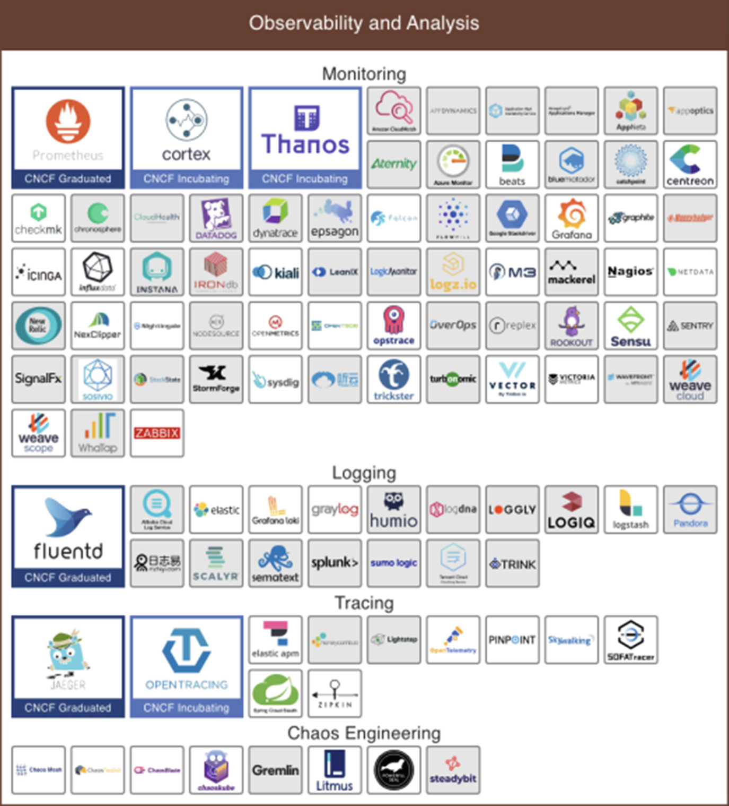
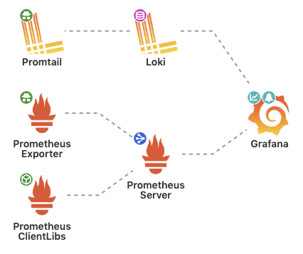

---
tags:
  - 完善
---

# 可观测性

本文介绍可观测性的基本概念，解释我们为什么要做可观测性系统（需求），要做什么样的可观测性系统（技术选型）。至于怎么做，见本模块的其他文章。

## 运维监控体系的发展历史

!!! quote

    - [下一代监控运维体系概述 - 腾讯云](https://cloud.tencent.com/developer/article/1798093)

> 记得在 17 年前，Win XP 上，运行的第一个 pascal 代码是计算几何面积，在没有复杂的业务逻辑中，点击工具的编译，就能把我们需要的所有信息都打印在命令行界面中。我称之为**第一代的监控体系**，一个简单的编译器和一个简单的命令行界面。3 年后，开始用 Delphin 编写软件的时候，相对复杂的各个组件和逻辑代码，简单的编译已经不能告诉你程序到底出了什么问题，后来我们有了打断点调试，逐行代码检查，甚至会 print () 一下输出结果。我称之为**第二代的监控体系**。
>
> 事实上，前两代的监控体系并不能称之为监控，因为信息输出到屏幕后，刷新之后就会马上丢失，所以我们并不知道程序在运行时行为和信息，因为那时候也并不需要，连接断开了，就让用户重新连接；程序报错了，就让用户重新打开。到了**第三代监控体系**，中国互联网时代已经开始进入分布式系统时代，工程师们开始依赖日志信息去发掘服务报错的蛛丝马迹，在第三代监控体系初期，大部分工程师都习惯登录服务器去看系统日志和业务日志，分析系统报错的根本原因。到了后期，随着部署的服务器节点数量变多，**逐一登录排查成为运维的瓶颈，后来就有了统一日志管理**。将不同节点的日志收集到日志管理服务器上，方便工程师们排查问题。再后来，业界上基于这个时代的监控体系下，衍生出了不同的监控产品，比如当时非常有名的 sumo logic，**将日志统一管理后提供了各种数据清洗和 BI 的能力**，这个概念也奠定了下一代监控体系的基础。
>
> 从前面可以看到，监控体系的改变其实是随着需求以及数据量层级的增长而发生变化的。上一个时代是大数据时代，所有就有了以日志管理 + 基础 BI 能力为基础的监控体系。当下的时代是后大数据时代，也是大数据爆炸时代，我们需要处理的数据远高于上一个时代。AWS 的监控系统每分钟需要处理 PB 级别的指标数据，在这么庞大的数据量里，监控系统如何能将有用的目标信息快速给到工程师，是下一代监控体系的核心目标。
>
> 围绕核心目标，我们需要思考以下几个问题：
>
> 1. 从指标里我们可以得到什么？
> 1. 自定义指标如何呈现？
> 1. 当指标数据很大的时候，如何排除干扰信息？
> 1. 当监控的维度很多的时候，如何快速定位目标信息？
> 1. 如何做到自动化监控？
> 1. 日志其实是用来做什么的？
> 1. 结合这套监控体系，如何开展运维工作，将被动运维变成主动运维？
>
> 在现在这个时代，仍有大量的工程师在使用日志的方式去运维服务，但已经有部分工程师已经开始慢慢从日志发现过渡到指标监控来做线上运维了。因为指标监控从采集效率上以及数据精度上都比日志的方式要高效以及精确，指标对于日志而言，在采集的过程中就已经把非结构数据转换成结构数据了，在整个数据源采集上报、清洗聚合、存储和可视化的过程中，都比日志的方式高效精确的多。所以线上信息的实时性也得以大幅度的提高。

可以看出，监控体系发展到如今，早已与数据科学领域的技术深度结合，具备了进行**挖掘、分析、预测的自动化运维**的能力。随着**分布式、云原生、微服务**应用的普及，**可观测性（observability）**这一概念在运维领域也逐渐火热。目前，大多数技术文档将可观测性定义为**针对复杂系统及其产生的海量数据构建的一种能力，用于帮助我们理解系统的行为**。

## 可观测性概述

!!! quote

    - [可观测性工程 - O'Reilly](https://zh.singlelogin.re/book/26742434/d8d8bc/%E5%8F%AF%E8%A7%82%E6%B5%8B%E6%80%A7%E5%B7%A5%E7%A8%8B.html)
    - [From Kálmán to Kubernetes: A History of Observability in IT - BoardCom](https://academy.broadcom.com/blog/aiops/from-kalman-to-kubernetes-a-history-of-observability-in-it)

我们的小集群自从更改为无盘系统架构后，也算是在不断向“分布式系统”演进了。目前我们对可观测性的需求并不是很高，但也可以借鉴工业界的做法，优化监控体系，提高运维效率。

在可观测性领域，**日志（Logs）**、**指标（Metrics）** 和 **追踪（Traces）** 被称为三大支柱，它们共同帮助开发和运维团队对系统进行全面的监控和诊断。每个支柱提供不同的视角，互为补充，帮助团队及时发现、分析和解决问题。

| **关键方面** | **定义** | **作用** | **特点** | **优点** | **缺点** |
|--------------|----------|----------|----------|----------|----------|
| **日志（Logs）** | 记录特定事件的文本信息 | 调试和错误排查 | 结构化或非结构化文本，详细的上下文 | 提供细粒度的历史记录 | 数据量庞大，难以用于实时分析 |
| **指标（Metrics）** | 系统性能的定量测量 | 实时监控和趋势分析 | 数值化，时间序列数据 | 易于监控、触发警报 | 缺乏具体上下文，较为抽象 |
| **追踪（Traces）** | 请求在分布式系统中的路径记录 | 性能调优、跨服务可见性 | 记录请求生命周期，跨多个服务 | 提供端到端的全局视角 | 实现复杂，数据量大 |

## 数据库概述

!!! quote

    - [架构师之路，从「存储选型」起步 - 掘金](https://juejin.cn/post/7109647301370445832)
    - [数据库存储选型经验总结 - 阿里云开发者社区](https://developer.aliyun.com/article/870365)
    - [数据库分类详解：多样化的类型与应用场景 - 数字经济观察网](https://www.szw.org.cn/20230922/63447.html)

可观测性的每个支柱都可以有一套独立的系统，这些**系统的核心是数据库，也是大数据和分析领域的核心话题**。在课内，我们最多只接触过 MySQL 这样的传统关系型数据库。而随着互联网、物联网等场景发展，有**很多业务需求不是任何单一的数据库能解决的了**。下面对各类数据库的特点做简单概括，以开拓视野：

- 按是否关系型分类：

    | **分类** | **特点** | **常见产品** |
    |----------|----------|--------------|
    | **关系型数据库** | - 数据以表格形式存储，有固定模式<br>- 使用主键、外键建立关系<br>- 支持事务处理，符合 ACID 特性<br>- 支持复杂查询和数据分析 | - Oracle<br>- MySQL<br>- PostgreSQL<br>- Microsoft SQL Server |
    | **非关系型数据库** | - 不使用固定模式，数据以键值对、文档、列族等形式存储<br>- 支持水平扩展和分布式计算<br>- 高性能、低延迟 | - Redis<br>- MongoDB<br>- Cassandra<br>- Neo4j |

- 按按特定场景分类：

    | **数据库类型** | **特点** | **常见产品** |
    |----------------|----------|--------------|
    | **键值数据库** | 数据以键值对形式存储，支持高性能读写 | Redis, Memcached, Riak |
    | **列式数据库** | 数据按列存储，适合大规模数据处理 | HBase, ClickHouse, Cassandra |
    | **文档数据库** | 数据以文档（如 JSON、XML）存储，灵活的模型 | MongoDB, Couchbase |
    | **图形数据库** | 处理图结构数据，适用于社交网络、知识图谱等 | Neo4j, Amazon Neptune |
    | **时序数据库** | 专用于时间序列数据，支持高效写入和查询 | InfluxDB, TimescaleDB |
    | **向量数据库** | 处理高维向量数据，适用于 AI 和推荐系统 | Milvus, Faiss |
    | **空间数据库** | 处理地理空间数据，支持地理查询 | PostGIS, Oracle Spatial |
    | **搜索引擎数据库** | 专为全文搜索设计，支持复杂查询 | Elasticsearch, Apache Lucene, Apache Solr |
    | **多模数据库** | 支持多种数据模型，提供灵活的数据处理 | ArangoDB, OrientDB |

接下来我们分析两个例子，从原理出发，了解这些数据库的特点和应用场景。

!!! example "搜索引擎数据库 Elasticsearch 与日志分析"

    观看 [:simple-bilibili: Elastic Search是什么？Lucene是什么？架构是怎么样的？- 小白 debug](https://www.bilibili.com/video/BV1yb421J7oX)，了解 Elasticsearch 的原理和架构。修读过《高级数据结构与算法分析》的同学应该很容易理解其中**倒排索引**的概念。

    Elasticsearch 将数据组织为文档，这些文档是基于 JSON 的信息单元，用于表示实体。文档根据其特征被归类到索引中。

    举一个具体的例子，这是一条存储在 Elasticsearch 中的日志数据。系统中各个组件每时每刻都在产生这样的海量的日志：

    ```json
    {
        "type":"liberty_message",
        "host":"9e1eceec70c1",
        "ibm_userDir":"\/opt\/ol\/wlp\/usr\/",
        "ibm_serverName":"defaultServer",
        "message":"BADAP0004W: BadApp Angry for test",
        "ibm_threadId":"0000009f",
        "ibm_datetime":"2020-05-04T12:33:26.064+0000",
        "ibm_messageId":"BADAP0004W",
        "module":"com.ibm.ws.lumberjack.badness.Angry",
        "loglevel":"WARNING",
    }
    ```

    运维人员如何审计这些日志？最基础的操作就是**过滤**。比如，审计用户的 SSH 登陆行为，就可以通过筛选 `sshd` 模块的日志，并查询 `message` 字段是否包含 `Invalid user` 来实现。

    你可能会觉得：这不就是关系型数据库中的一行数据嘛？使用 MySQL 不就能解决了？上面的数据太简单了，JSON 还可以嵌套，从各种地方收集的日志也具有不同的 schema。如果要在关系型数据库中存储这些数据，就需要设计很多表。**不仅设计复杂，效率也低。**而 Elasticsearch 能直接以文档的形式存储这些数据，并建立索引，方便快速查询。

    因为搜索引擎数据库**高效处理不同格式和类型的数据、提供灵活的搜索和检索功能**的特点，在可观测性领域，Elasticsearch 被广泛应用于**日志分析**等场景。

!!! example "时序数据库 InfluxDB 与指标监控"

    时序数据库的需求来源于指标监控场景。监控系统需要**实时收集、存储、查询和分析大量的时间序列数据**，比如 CPU 使用率、内存使用率、网络流量等。这些数据通常以**时间戳和值的形式存储，而且数据量巨大**。指标监控需要一个具备下列特点的数据库：

    - 极高的写吞吐量
    - 数据需要高度压缩
    - 大范围扫描记录
    - 原生支持聚合等操作

    上面这些是 MySQL 不擅长的。InfluxDB 针对时序数据的特点对存储引擎做了一系列优化，比如降低了事务的要求、从 LSM 演进成 TSM 作为底层数据的存储。这样的改变使得 InfluxDB 的查询性能比 MySQL 快 2.5~45 倍，数据压缩超过 4.5 倍（见 [Compare InfluxDB vs MySQL](https://www.influxdata.com/comparison/influxdb-vs-mysql/)）。

    关于 InfluxDB 原理，可以观看 InfluxData 的 CTO Paul Dix 在 2017 年做的分享 [:simple-bilibili: 【InfluxDB】InfluxDB 存储引擎技术内幕](https://www.bilibili.com/video/BV1jY41147AT)。

## 可观测性系统设计

### 需求分析

在对可观测性有了一些基本的了解后，我们就可以开始评估自己的需求，设计一套系统了。上述的三大支柱中，我们暂时不会用到 trace（后续对 mirror 这样的服务内部进行遥测时可能会使用），所以**目前仅考虑两个方面：日志分析和指标监控**。

设计观测需求时，应当考虑真正感兴趣的因素，而不是有什么就观测什么，**没有人会整天坐在监控大屏前浏览指标和日志**。我们设计的需求应当能够由观测系统主动响应来满足。

我们需要考虑的因素有：

- **用例**：你能够定义精确的场景，说明系统是如何使用的吗？例如：作为系统的用户，我想要运行一个报告，告诉我过去 24 小时 Windows 服务器上的登陆失败次数。
- **驱动因素**：是什么“驱动”你启动这一项目？是因为有趣、必要性还是政府法规或者其他目的？如果你能够回答这个问题，就能为驱动因素指定一个优先级，这有助于你清晰地了解为此分配的时间和资源。
- **解决的问题**：部署一个可观测性系统能帮助你解决其他问题吗？例如，由于你收集的信息类型，可观测性系统能够帮助你进行服务器和网络监控。

| 需求                                                         | 需要观测的数据                                  |
| ------------------------------------------------------------ | ----------------------------------------------- |
| 我想知道进行的操作是否影响了系统运行，可能是哪些操作造成的   | 审计日志（root 权限执行的操作）                 |
| 我想知道系统的状态是否发生了改变，是什么造成的               | 内核日志，硬件日志，系统指标                    |
| 我想知道系统中是否有异常的程序，它造成持续的高占用，或不断产生错误 | 进程的资源利用率                                |
| 我想知道哪些是恶意 IP                                        | IP 地址的请求量、响应情况、消耗带宽、地理位置   |
| 我想知道哪些镜像的使用率最高                                 | 文件访问次数，按镜像聚合                        |
| 我想知道镜像的同步情况                                       | MirrorDotNet 同步任务队列、任务运行时间是否异常 |
| 我想知道是否有人在尝试发起攻击                               | 持续失败的 SSH 请求，端口扫描                   |

在初步研讨后，我们得出了以下需求，并梳理了相关数据源：

| 系统 | 需求 | 数据源及其采集方式 |
|------|------|--------|
| 指标监控 | - 监控系统资源利用率和运行状况<br />- 为 HPC 性能调优提供参考 | - 节点：metric exporter<br />- 基础设施：SNMP 和 RedFish |
| 日志分析 | - 监控系统各组件异常事件<br />- 观测无盘系统的服务稳定性<br />- 内外部事件监控和响应<br />（节点 down、断电断网或波动等）<br />- 入侵防御、行为分析（来自 mirror） | - 系统日志<br />- 各类服务和应用：日志文件和 systemd-journal<br />- 基础设施：syslog 和 SNMP Trap |

### 技术选型与案例调研

在构建系统时，会面临技术选型上的难题：东西太多了。下面的图片来自 [Cloud Native Landscape](https://landscape.cncf.io/)，显示了可观测性领域有多少优秀的产品可供选择。

<figure markdown="span">
    { width=60% }
<figcaption>Cloud Native Landscape</figcaption>
</figure>

我们没有什么实际经验，因此可以先做一些案例调研，了解业界主流方向，然后再根据自己的需求和技术栈来选择合适的方案。我们会参考的包括 HPC 领域论文和互联网大厂的技术博客，以及来自开源社区的实践经验。

??? info "案例调研"

    下面是我们看过一些案例，有兴趣了解的同学可以看看：

    - 2019 [High Performance Computing Monitoring. (Conference) | OSTI.GOV](https://www.osti.gov/servlets/purl/1644780)：美国桑迪亚（Sandia）国家实验室做了一套开源的 HPC 监控系统 [:simple-github: OVIS/LDMS](https://github.com/ovis-hpc/ldms)。他们的设计了节点的指标采集、管理节点上的两层数据聚合，最后使用 Splunk 进行数据分析。
    - 2021 [Enhancing observability for High Performance Computing infrastructure with Grafana](https://grafana.com/events/grafanacon/2021/hpc-grafana/)：美国超算应用国家中心（NCSA）使用 Grafana 对 HPC 系统进行可观测性增强，比如进行 Job 数据的可视化监控等。他们使用 Telegraf 采集指标数据，存储到 InfluxDB。他们计划将 Elasticsearch 作为 Grafana Log 看板后端。
    - 2023 [HPC Monitoring & Visualization: Understanding usage of HPC systems - PEARC'23](https://dl.acm.org/doi/10.1145/3569951.3597554)：美国太平洋西北国家实验室展示了他们基于 Prometheus 和 Grafana 的 HPC 监控系统。
    - 2024 [SOMA: Observability, Monitoring, and In Situ Analytics in Exascale Applications](https://doi.org/10.1002/cpe.8141)：基于微服务架构的 HPC 可观测性系统。文章作者来自俄勒冈大学、NVIDIA、布鲁克海文国家实验室、罗格斯大学。俄勒冈大学开发了知名的 HPC 性能分析工具 [TAU](https://www.cs.uoregon.edu/research/tau/home.php)。
    - Bilibili 技术团队的公众号文章：
        - [持续降本：B 站日志平台 3.0 演进之路](https://mp.weixin.qq.com/s?__biz=Mzg3Njc0NTgwMg==&mid=2247495096&idx=1&sn=b7df3d9adebb1171715b8507aba55420)
        - [B 站基于 Clickhouse 的下一代日志体系建设实践](https://mp.weixin.qq.com/s?__biz=Mzg3Njc0NTgwMg==&mid=2247490544&idx=1&sn=2a6a72ac932911988968ef5c83d2e0be)
        - [从 ES 到 ClickHouse：B 站海量日志分析场景迁移的实践与思考](https://www.bilibili.com/video/BV1tB4y1p7j7)
        - billions 3.0 日志平台主要使用 iceberg + clickhouse 的混合存储。

总而言之我们的技术选型如图所示，下文将详细介绍每个部分的技术栈。

<figure markdown="span">

<figcaption>可观测性系统设计</figcaption>
</figure>

#### 成熟方案：PLG 和 ELK

目前业界主流的可观测性系统有：

- PLG Stack: Promtail/Prometheus, Loki, Grafana
- ELK Stack: Elasticsearch, Logstash, Kibana

简单了解一下这些可观测性系统，就会发现它们的架构基本一致，都是由**数据收集、数据存储、数据查询、数据展示**四个部分组成，只是在实现上有所取舍。PLG 的核心是 Grafana，是一个分析和可视化平台，更适合指标监控；ELK 的核心是 Elasticsearch，是一个全文本搜索引擎，更适合日志分析。

<div class="grid cards" markdown>



</div>

??? info "PLG Stack vs. ELK Stack"

    关于两者更详细的对比，可以参考这篇 2023 年的学士学位论文： [A Comparative Analysis of Log Management Solutions: ELK Stack Versus PLG Stack](https://www.diva-portal.org/smash/get/diva2:1771279/FULLTEXT01.pdf)

    > The study found that **PLG is more resource-efficient in terms of CPU and memory** compared to ELK, and requires less disk space to store logs. ELK, however, performs better in terms of query request time. ELK has a more user-friendly interface and requires minimal configuration, while **PLG requires more configuration but provides more control** for experienced users.

    这篇论文附录中展示了 ELK 和 PLG 的一套完整配置，可以作为参考。

最终我们没有完全采用 PLG 或 ELK 方案。他们在自己擅长的方面确实做的很好，但仅仅如此。就笔者个人的使用体验，Kibana 对指标数据的展示远远不如 Grafana，而 Loki 的日志查询比 Elasticsearch 死板太多。[:simple-reddit: Is ELK trustable also for metrics and alerting? : r/devops](https://www.reddit.com/r/devops/comments/ami7m9/is_elk_trustable_also_for_metrics_and_alerting/) 有不少相关探讨，大多认为同时采取 elk + prometheus 是好的选择，而单独使用其中一个在某些场景下可能会有不足。

#### 数据采集层：OpenTelemetry

!!! quote

    - [:simple-github: OpenTelemetry 简介](https://github.com/open-telemetry/docs-cn/blob/main/OT.md)

!!! info "OpenTelemetry 的历史"

    - OpenTracing 制定了一套平台无关、厂商无关的协议标准，使得开发人员能够方便的添加或更换底层 APM 的实现。2016 年 11 月 CNCF.io 接受 OpenTracing，同时这也是 CNCF 的第三个项目，前两个是鼎鼎大名的 Kubernetes 和 Prometheus，由此可见开源世界对 APM 的重视，对统一标准的重视和渴望。
    - OpenCensus 由谷歌推出，最初目标并不是抢 OpenTracing 的饭碗，而是为了把 Go 语言的 Metrics 采集、链路跟踪与 Go 语言自带的 profile 工具打通，统一用户的使用方式。随着项目的进展，野心也膨胀了，这个时候开始幻想为什么不把其它各种语言的相关采集都统一呢？OpenCensus 的场景进一步扩大了，不仅做了 Metrics 基础指标监控，还做了 OpenTracing 的老本行：分布式跟踪。此外，微软也加入了 OpenCensus。
    - OpenTracing 和 OpenCensus 的功能特性各有优缺点，社区活跃度半斤八两。一边是开源社区的力量，一边是谷歌、微软。**这两个项目随后合并，诞生了 OpenTelemetry。**

OpenTelemetry 是一个**可观测性框架和工具**，涵盖了可观测性的三大支柱。下面左图展示了传统的可观测性体系，三大支柱各自独立，需要自己实现数据收集、存储、查询和展示。右图展示了 OpenTelemetry 的架构。

<div class="grid cards" markdown>


</div>
<center>
<figcaption>传统与 OpenTelemetry 架构对比<br/>
    <small><a href="https://opentelemetry.io/docs/specs/otel/logs/">
    OpenTelemetry Logging - OpenTelemetry
    </a></small>
</figcaption>
</center>

OpenTelemetry 的终极目标：实现 Metrics、Tracing、Logging 的融合及大一统，作为可观测性的数据采集终极解决方案。

- 基于 Metrics 告警发现异常
- 通过 Tracing 定位到具体的系统和方法
- 根据模块的日志最终定位到错误详情和根源
- 调整 Metrics 等设置，更精确的告警/发现问题

为了实现融合，OpenTelemetry 提出了**上下文（Context）**的概念。Context 为 Metrics、Logging、Tracing 提供统一的上下文，三者均可以访问到这些信息，同时 Context 可以随着请求链路的深入，不断往下传播。

**OpenTelemetry 的自身定位很明确：数据采集和标准规范的统一，对于数据如何去使用、存储、展示、告警，官方是不涉及的。**

OpenTelemetry 正在逐步成为可观测性领域的标准规范。并且，OpenTelemetry 的实现大多采用 Go，与我们的技术栈相符。**综合以上原因，我们最终选择了 OpenTelemetry 作为数据采集层的标准，并将其应用到我们自己编写的各类工具中。**

!!! info "案例调研"

    越来越多的公司迁移到 OpenTelemetry，以下是一些参考：

    - [Why and How eBay Pivoted to OpenTelemetry - ebay](https://innovation.ebayinc.com/tech/engineering/why-and-how-ebay-pivoted-to-opentelemetry/)：ebya 于 2022 年将 K8s 上的 MetricBeat 迁移到 OpenTelemetry，同时积极贡献到 OpenTelemetry 社区。他们认为 OpenTelemetry 的可伸缩性和性能都有优势：

        > We are busy working on doing the same for Filebeat at this point and early performance benchmarks are very promising.
        >
        > We will continue to learn from running agents at scale and keep pivoting as needed. We will continue to work with the OpenTelemetry community as it continues to pave the way for standardization within the Observability ecosystem. Now that we’re using OpenTelemetry, we can provide our developers with an industry-approved open standard to send telemetry into Sherlock.io. As the community grows to offer support for newer features like profiling, we will adopt them into the platform to benefit our developer community.

    - [:simple-bilibili: 可观测性技术生态和 OpenTelemetry 原理及实践 - 腾讯云](https://www.bilibili.com/video/BV18K4y1M7bL)：腾讯于 2021 年做的技术报告。此时腾讯 OpenTelemetry OTeam 已经在内部基于 OpenTelemetry 建立起了完善的业务和平台监测体系“天机阁 2.0”，为内部业务提供了全链路可观测性支持。
    - [:simple-bilibili: B 站基于 Clickhouse 的下一代日志体系建设实践](https://www.bilibili.com/read/cv18609680)：2022 年 B 站日志系统从 Elasticsearch 迁移到 OpenTelemetry + ClickHouse。

        > 日志作为一种应用产生的实时数据，随着业务应用规模发展而紧跟着扩大。日志系统必须在具备高吞吐量的同时，也要具备较高的实时性要求。Elasticsearch 由于分词等特性，在写吞吐量上有着明显的瓶颈，分词耗 CPU 且难以解决热点问题。如果资源冗余不足，就容易导致稳定性下降，日志摄入发生延迟，日志的延迟会对排障产生极大负面影响。
        >
        > Kibana 虽然好用，但也不是没有缺点的，整体代码复杂，二次开发困难。且每次升级 ES 必须升级到对应的 Kibana 版本也增加了用户迁移的成本。还有一点就是 Kibana Query 虽然语法较为简单，但对于初次接触的研发还是有一定的学习成本的。
        >
        > 在采集和传输上，我们制定了一套内部的日志格式规范，使用 JSON 作为传输格式，并提供了 Java 和 Golang 的 SDK。这套传输格式本身在序列化/反序列化上性能一般，且私有协议难以避免兼容性和可维护性问题。
        >
        > 针对上述的一系列问题，我们设计了 Bilibili 日志服务 2.0 的体系，主要的进化为使用 ClickHouse 作为存储，实现了自研的日志可视化分析平台，并使用 OpenTelemetry 作为统一日志上报协议。

#### 数据存储层：Prometheus 和 ClickHouse

我们已经知道 OpenTelemetry 只负责数据生产和收集。至于存储、使用和分析，我们需要继续做选择。

- 指标数据：Prometheus 和 InfluxDB 两个 TSDB 作为候选者。Prometheus 由于以下原因胜出：
    - [Prometheus“致力于成为 OpenTelemetry Metrics 的默认存储”](https://prometheus.io/blog/2024/03/14/commitment-to-opentelemetry/)。在即将到来的 Prometheus 3.0，OTEL 将得到原生支持。
    - 它不仅仅是数据库，还是一套监控系统，自带了分析功能，为下一层提供便利。
- 日志数据：Elasticsearch 和 ClickHouse 是两种不同类型的数据库，生态也各有优略。目前都部署一套试试看。

#### 查询和分析层：Grafana

我们选择 Grafana。它足够灵活，支持多种数据源，而且有丰富的插件和模板，可以满足我们的需求，不论是 metric、log 还是 trace。

此外，大数据挖掘领域应该少不了 AI 的身影。MindsDB 是一个开源虚拟数据库，可实现将实时数据连接到人工智能系统的管道自动化。使用 AI 进行数据分析有待进一步研究。

#### 其他

我们也调查过其他产品，但最终没有选择的原因：

- Fluentd: 日志收集工具，支持多种数据源和输出。[使用 Golang 写一个取代 fluentd 的日志处理器](https://blog.laisky.com/p/go-fluentd/) 这篇博客对它做了一些评论：

    > 我曾经写过一篇介绍 fluentd 的文章：[fluentd 安装、配置、使用介绍](https://blog.laisky.com/p/fluentd/)。在此文中，我介绍了使用 fluentd 作为日志处理工具的用法，在工作中，我也使用了多年的 fluentd。而且 fluentd 还加入了 CNCF，发展潜力可观。
    >
    > 不过在目前的公司中，因为较为特殊的需求，使用 fluentd 遇到了一些问题。首先是插件质量良莠不齐，而因为没有熟悉 ruby 的人，所以调试起来相当头疼。其次是 ruby 存在 GIL，性能被限制在单核上，而 process 扩展的可用场景有限。最后就是实际需求过于多样，fluentd 的很多插件没法满足需求，或是需要大量使用 rewrite 控制解析流，配置文件相当晦涩难懂。综合这些原因，正好最近没什么事，以及也想看看 golang 的能力，所以干脆决定用 golang 自己写一个。

## 写在最后：我们才刚刚开始

[:simple-stackoverflow: Can OpenTelemetry Collector replace Filebeat and Metricbeat](https://stackoverflow.com/questions/76362881/can-opentelemetry-collector-replace-filebeat-and-metricbeat)

> My final thought on opentelemetry to have 1 fits-all-solution: No, it is currently not possible and you probably do not need it. OTEL sdks is still partially in not very mature state, your microservices are also different and requiring different integrations and having different deployment procedures. **What I can propose here is to try this and that, fail, write down your observations, fail again and again to have more mature understanding of what you more or less need. So, be able to instrument your systems with different tools and keep your hand on pulse of the whole Observability news - it's road only started ;)**

笔者十分认同上面这段话。我们的可观测性系统设计只是一个初步的尝试，我们还需要不断地实践、失败、总结，才能找到最适合我们的解决方案。
