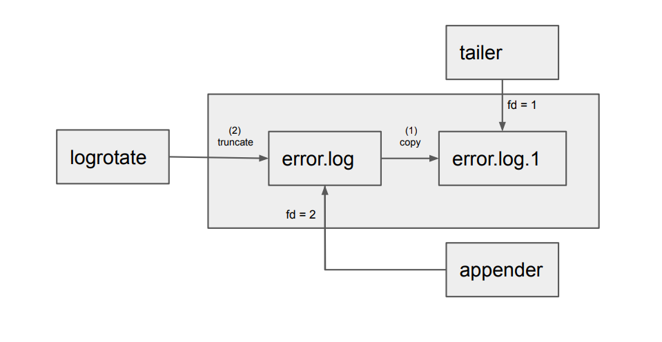
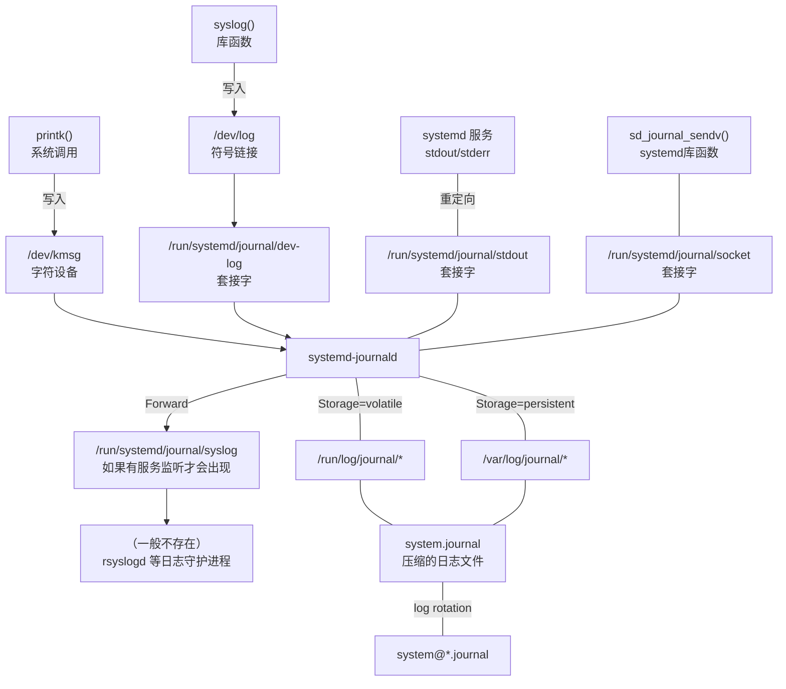

---
tags:
  - 完善
---

# 日志收集

本文涉及日志格式、OpenTelemetry 日志采集与处理、ClickHouse 日志存储等内容。

在阅读本文前，请先阅读 [OpenTelemetry](opentelemetry.md)。

## 日志合规

[浙江大学网络与信息安全管理办法（2017 年）](https://itc.zju.edu.cn/2017/0930/c50213a2508335/page.htm)

> 第五条 信息技术中心负责学校网络与信息系统的日常管理和维护，保障网络与信息系统的正常运行；**保存网络运行日志，配合调查取证**；负责入网单位和个人办理入网登记手续，签署相应的安全责任书。
>
> 第二十三条 各单位对于主办的信息系统，每季度至少进行 1 次安全检查，填写检查台账（详见附件）。检查内容包括：
>
> - （七）检查系统日志留存情况，**留存相关日志不少于六个月**。

[中华人民共和国国务院令（第 292 号）互联网信息服务管理办法](https://www.gov.cn/gongbao/content/2000/content_60531.htm)

> 第十四条 从事新闻、出版以及电子公告等服务项目的互联网信息服务提供者，应当记录提供的信息内容及其发布时间、互联网地址或者域名；互联网接入服务提供者应当记录上网用户的上网时间、用户帐号、互联网地址或者域名、主叫电话号码等信息。互联网信息服务提供者和互联网接入服务提供者的**记录备份应当保存 60 日**，并在国家有关机关依法查询时，予以提供。

[中华人民共和国公安部令（第 82 号）互联网安全保护技术措施规定](https://www.gov.cn/gongbao/content/2006/content_421771.htm)

> 第十三条 互联网服务提供者和联网使用单位依照本规定落实的记录留存技术措施，应当具有至少**保存六十天记录备份**的功能。

## 日志通用知识和技能

如 [Unified Logging Layer: Turning Data into Action - Fluentd](https://www.fluentd.org/blog/unified-logging-layer) 所说：

> In the last 10 years, **the primary consumer of log data shifted from humans to machines.**
>
> Software engineers still read logs, especially when their software behaves in an unexpected manner. However, in terms of "bytes processed", humans account for a tiny fraction of the total consumption. Machines, not humans, are crunching log data day and night to generate reports and run statistical calculations to help us make decisions. The insights derived from log data used to be post hoc, pull and episodic. Today, it is ad hoc, push and statistical.
>
> Undoubtedly, Moore's Law and the advances in distributed systems design have made large-scale log processing and data mining accessible. However, many organizations, even with abundant financial and human capital, fail to turn their rapidly growing log data into actionable insights. Why can't they get value from their log data if all the pieces are available and affordable?
>
> **That's because legacy logging infrastructure was NOT designed to be "machine-first", and so much effort is wasted trying to make various backend systems understand log data.**

传统的日志基础设施并不是为“机器优先”设计的，大量的工作都花在了让后端系统理解日志数据上。本章介绍几种常见的日志格式，并分析如何使用 OpenTelemetry Collector 进行日志处理。

### 正则表达式

日志消息十分依赖正则表达式进行解析。OpenTelemetry Collector 的正则表达式基于 Golang 风格。

!!! tip

    - 把日志喂给 AI，让它帮你写正则表达式。
    - 使用 [regex101](https://regex101.com/?flavor=golang) 进行编写和调试。
    - 使用 [regex.rip](https://regex.rip/) 测试正则表达式是否脆弱、易受攻击。

### Log Rotation

!!! quote

    - [Log Rotation - Grafana Loki documentation](https://grafana.com/docs/loki/latest/send-data/promtail/logrotation/)：清晰地讲解了日志轮转的原理。

在讲解日志格式和处理前，先了解一个通用的日志操作：日志轮转（Log Rotation）。

基于文件的日志系统会随着时间的推移不断增大，单个文件的大小会变得无法接受。为了解决这个问题，可以定期将日志文件重命名并创建新的日志文件。

日志轮转主要有两种方式：Copy and Truncate 和 Rename and Create。过程中有三个角色：appender 生成日志、rotator 轮转日志、tailer 读取日志。

!!! info

    tailer 这个名称来自于 `tail` 命令，程序员们经常使用 `tail -f` 命令来查看日志文件的末尾。

<figure markdown="span">
{ width=50% style="float: left;" }
{ width=50% style="float: right;" }
</figure>

!!! info

    小知识：Linux 文件句柄在文件移动和删除时仍然有效，且保持打开状态（同一个文件系统中）。

可以看到，在两种方式下，旧日志的文件句柄都是保持的，因此不用担心轮转的日志末尾丢失。

??? info "logrotate 工具"

    在传统的 Linux 系统运维中，日志轮转一般使用 [`logrotate`](https://github.com/logrotate/logrotate) 工具实现。比如下面是镜像站曾经的日志轮转配置：

    ```text
    /var/log/nginx/*.log {
            daily
            missingok
            rotate 14
            compress
            delaycompress
            notifempty
            create 0640 www-data adm
            sharedscripts
            prerotate
                    if [ -d /etc/logrotate.d/httpd-prerotate ]; then \
                            run-parts /etc/logrotate.d/httpd-prerotate; \
                    fi \
            endscript
            postrotate
                    invoke-rc.d nginx rotate >/dev/null 2>&1
            endscript
    }
    ```

现在，我们使用 OpenTelemetry Collector 的 FileLogReceiver 来读取日志。FileLogReceiver 支持日志轮转操作。

??? info "tailer 简析：以 fileconsumer 为例"

    OpenTelemetry 的 FileLogReceiver 使用 `pkg/stanza/fileconsumer` 实现日志文件的读取。[:simple-github: pkg/stanza/fileconsumer/design.md](https://github.com/open-telemetry/opentelemetry-collector-contrib/blob/main/pkg/stanza/fileconsumer/design.md) 描述了其工作原理。

    一些概念：

    - **指纹**：文件的前 `N` 个字节，用于标识文件，默认为 `1000` 即约 1KB。指纹相同的文件视为同一文件。
        - 长度未达到限制时采用前缀比较。
        - 文件增长时更新指纹。
        - 能够处理 Copy and Truncate 的 rotate 操作。尽力在读取新文件前读到旧文件的末尾（这意味着如果文件日志没有时间戳信息，可能会乱序）。
    - **Reader**：文件句柄、指纹、偏移量、路径等。
        - 文件句柄关闭时 Reader 不会立即消失，在固定次数的轮询中仍然保持，用于监测文件删除或拷贝、获取文件曾经的路径等。
        - 可以将其持久化保存，下一次启动时恢复读取状态。

    > 虽然笔者感觉文件指纹的实现有一些草率且效率不高（和 FileBeats 的 inode 比起来），但似乎不会出什么大问题。

    `fileconsumer` 按一定时间间隔扫描文件系统。每次轮询的步骤：

    1. **匹配**：扫描匹配的文件列表。
    2. **列队**：如果文件数量超过最大并发数，则文件列表分成两部分。本次轮询间隔内处理前一部分。后一部分进入队列，下一次轮询直接从队列中拿文件，直到队列为空。
    3. **打开文件**：此时文件可能被移动或删除。
    4. **计算指纹**
    5. **排除（关闭文件）**：本批次的指纹交叉比对，重复文件被排除。
    6. **创建 Reader**：交叉比对已有 Reader 的指纹，拷贝上次迭代的 Reader，否则初始化。
    7. **检查 Lost file**：如果指纹能匹配到前一轮，但不能匹配到本轮，被认为是 Lost file。可能由于文件删除、移动或 rotate。
    8. **读取文件**：
        - **读取 Lost file**：
            - 如果文件被删除，操作失败。
            - 如果被移动，有可能继续读取剩余部分。
        - 所有文件并发读取。
    9. **关闭文件**。
    10. **归档 Reader**。
    11. 超过 3 个周期的 Reader 被移除。
    12. 如果配置了持久化，保存 Reader 状态。

## 日志格式分析与处理

### [RFC 3164 - The BSD Syslog Protocol](https://tools.ietf.org/html/rfc3164)

- 发布于 2001 年。目前几乎所有硬件设施都支持 RFC 3164。
- 规定目标为 UDP 端口 514 的数据包为 syslog 消息。
- 消息由三个部分组成：
    - PRI：`<FACILITY*8 + SEVERITY>`：`FACILITY` 是消息来源，`SEVERITY` 是消息严重程度。
    - HEADER：`TIMESTAMP HOSTNAME`：时间戳和主机名。
        - `TIMESTAMP` 紧接在 `>` 后，格式为 `Mmm dd hh:mm:ss`，例子：`Aug  8 17:44:32`。
    - MSG：`TAG CONTENT`。`TAG` 是有关进程的标识符，可以是程序名或者进程 ID。
- 没有规定日志内容格式（指 `CONTENT` 的内容），只约定传输消息的协议。

!!! example "TP-Link 日志"

    以 TL-R473G 为例，勾选发送系统日志之后，可以在服务器上收到日志消息（由于消息 `CONTENT` 部分包含中文，显示为乱码）：

    ```text
    User Datagram Protocol, Src Port: 44144, Dst Port: 514
    Syslog message: USER.NOTICE: Aug 08 18:22:15 TL-R473G 625: 2024-08-08 18:22:15 <5> :  DHCP������Ϊlan�ڿͻ�MAC B6-10-DE-B4-DF-7D ������IP��ַ192.168.1.4
        0000 1... = Facility: USER - random user-level messages (1)
        .... .101 = Level: NOTICE - normal but significant condition (5)
        Message: Aug 08 18:22:15 TL-R473G 625: 2024-08-08 18:22:15 <5> :  DHCP������Ϊlan�ڿͻ�MAC B6-10-DE-B4-DF-7D ������IP��ַ192.168.1.4
            Syslog timestamp (RFC3164): Aug 08 18:22:15
            Syslog hostname: TL-R473G
            Syslog process id: 625
            Syslog message id: : 2024-08-08 18:22:15 <5> :  DHCP��������lan������MAC B6-10-DE-B4-DF-7D ������IP����192.168.1.4
    ```

    可以看到消息使用了 RFC 3164 的格式。

!!! example "华为日志"

    华为设备的网络日志配置一般在 **信息中心（info-center）** 模块下。默认使用 UDP，可以配置 TCP SSL。

    ```text
    User Datagram Protocol, Src Port: 60936, Dst Port: 514
    Syslog message: LOCAL7.NOTICE: Aug  8 2024 11:44:37 Router %%01SHELL/5/CMDRECORD(l)[1]:Record command information. (Task=vt0, Ip=***.***.***.***, User=******, Command="return", Result=Success)
        1011 1... = Facility: LOCAL7 - reserved for local use (23)
        .... .101 = Level: NOTICE - normal but significant condition (5)
        Message: Aug  8 2024 11:44:37 Router %%01SHELL/5/CMDRECORD(l)[1]:Record command information. (Task=vt0, Ip=***.***.***.***, User=******, Command="return", Result=Success)
    ```

    可以看到这也是 RFC 3164 的格式。

!!! example "浪潮服务器日志"

    上面两个例子都是 UDP，这次我们来试试 TCP。

    浪潮 M6 服务器 BMC 可以选择 TCP 方式发送日志消息（不使用 TLS）。使用 TCP 方式意味着必须有一个服务端允许建立 TCP 连接，否则消息无法发送。我们可以在 Windows 上安装 [MaxBelkov/visualsyslog](https://github.com/MaxBelkov/visualsyslog)（一个轻量级的 syslog 工具，支持 TCP 和 UDP）来接收日志消息。

    通过 Wireshark 抓包，可以看到如下过程：

    ```text
    Src    Dest   Pro Info
    Client Server TCP 59382  >  514 [SYN]
    Server Client TCP 514  >  59382 [SYN, ACK]
    Client Server TCP 59382  >  514 [ACK]
    Client Server RSH Client -> Server data
    ```

    消息被 Wireshark 识别为 RSH，但实际上是 syslog 消息，可以从解析的数据看到消息内容：

    ```text
    <190>Aug  8 17:44:32 221823342 221823342:  Syslog Destination 0 Test Sent Successfully!
    ```

    这也是 RFC 3164 的格式。

!!! tip "坑人的产商"

    华子，说的就是你。

    华为的 syslog 消息中，TIMESTAMP 并不严格遵循 RFC 的格式。默认为 `Aug  8 2024 11:44:37`，多了一个年份。这样的消息在一些日志分析工具中会被识别为错误格式，导致无法解析。

    我们在配置 OTel Collector Receiver 时碰到了这样的问题，见 [:simple-github: syslog receiver Error expecting a Stamp timestamp [col 5] · Issue #33344 · open-telemetry/opentelemetry-collector-contrib](https://github.com/open-telemetry/opentelemetry-collector-contrib/issues/33344)。

    > After reading RFC 3164, I found that the issue occurs because HUAWEI does not follow the TIMESTAMP field format as defined in the RFC. According to RFC 3164, the TIMESTAMP field should be in the format `Mmm dd hh:mm:ss`, but HUAWEI adds the year (`YYYY`) between `Mmm` and `dd`, which causes the FSM (Finite State Machine) in `go-syslog` to fail.
    >
    > HUAWEI defines multiple timestamp formats: `mm dd yyyy hh:mm:ss` is referred to as the "date" type and is set as the default. However, they also provide a "short-date" type that adheres to RFC 3164. After configuring it to use the "short-date" format, the error was resolved.

OTel Collector 提供 [Syslog Receiver](https://github.com/open-telemetry/opentelemetry-collector-contrib/blob/main/receiver/syslogreceiver/README.md) 解析 syslog 消息：

```yaml
syslog:
  udp:
    listen_address: otel-collector:514
    add_attributes: true
    one_log_per_packet: true
  protocol: rfc3164
  # we configure all infrastructure to use the same timezone UTC +8
  location: Asia/Shanghai
```

!!! tip "配置时间"

    为方便运维，我们约定，软硬件设备统一使用 `time.zju.edu.cn` 作为 NTP 服务器，时区配置为东八区。部分硬件设备在上报日志时可能会使用 UTC 时间，需要注意配置。例如，华为信息中心发送日志时需要制定 `local-time` 参数，否则发送 UTC 时间。

该 Receiver 解析的消息格式如下所示。原始消息内容保存在 Body，提取出 `PRI`、`TIMESTAMP` 等 RFC 中定义的字段作为 Attributes。`net` 开头的字段是通过 `add_attributes: true` 指定添加的。

```text
ObservedTimestamp: 2024-10-04 15:46:26.809948211 +0000 UTC
Timestamp: 2024-10-04 15:46:14 +0000 UTC
SeverityText: notice
SeverityNumber: Info2(10)
Body: Str(<189>Oct  4 23:46:14 Huawei %%01SHELL/5/CMDRECORD(l)[324]:Record command information. (Task=vt0, Ip=192.168.1.178, User=admin, Command="log off (ssh user)", Result=Success) )
Attributes:
     -> net.host.port: Str(514)
     -> net.peer.name: Str(192.168.1.1)
     -> appname: Str(%%01SHELL/5/CMDRECORD(l))
     -> net.transport: Str(IP.UDP)
     -> net.host.name: Str(c91dcf42473a)
     -> net.peer.port: Str(49377)
     -> proc_id: Str(324)
     -> hostname: Str(Huawei)
     -> net.host.ip: Str(172.21.0.2)
     -> message: Str(324]:Record command information. (Task=vt0, Ip=192.168.1.178, User=admin, Command="log off (ssh user)", Result=Success) )
     -> priority: Int(189)
     -> net.peer.ip: Str(192.168.1.1)
     -> facility: Int(23)
```

可以使用 Operator 继续解析消息内容。比如[华为日志格式](https://support.huawei.com/enterprise/zh/doc/EDOC1100381902/a91516b6)中，`TAG` 部分字段如下：

| 字段 | 字段含义 | 说明 |
| ---- | -------- | ---- |
| %%         | 华为公司的标识 | 标识该 Log 信息是由华为公司的产品输出的。                      |
| dd         | 版本号         | 标识该 Log 信息格式的版本。                                    |
| ModuleName | 模块名         | 向信息中心输出信息的模块名称。                               |
| Serverity  | 日志的级别     | Log 信息的级别。                                              |
| Brief      | 简要描述       | Log 信息的简要解释。                                          |
| (l)        | 信息的类别     | 信息的类型有：l：Log 信息。S：安全日志信息。D：诊断日志信息。 |

我们可以继续从中提取出模块名、日志级别和简要描述：

```yaml
operators:
  - type: router
    routes:
      - output: huawei_add_resource
        # before escape: %%\d+[^\/]+\/\d+\/.+\(.+\)
        expr: 'attributes.appname matches "%%\\d+[^\\/]+\\/\\d+\\/.+\\(.+\\)"'
    default: noop
  - id: huawei_add_resource
    type: add
    field: resource.device.manufacturer
    value: Huawei
    output: huawei_regex_parser
  - id: huawei_regex_parser
    type: regex_parser
    parse_from: attributes.appname
    parse_to: attributes.huawei
    regex: '%%(?P<version>\d+)(?P<module_name>[^\/]+)\/(?P<serverity>\d+)\/(?P<brief>.+)\((?P<type>.+)\)'
  - id: noop
    type: noop
```

提取结果如下：

```text
-> huawei: Map({"brief":"USER_OFFLINERESULT","module_name":"CM","serverity":"5","type":"s","version":"01"})
```

!!! tip "华子真挺坑的"

    华为不同设备不同系统版本日志结构可能不一样，需要根据实际情况调整解析规则。

### [RFC 5424 - The Syslog Protocol](https://tools.ietf.org/html/rfc5424)

!!! tip "本节可以跳过"

    我们还没接触过使用 RFC 5424 的设备。

- 发布于 2009 年。在 RFC 3164 的基础上定义结构化消息格式，为整体架构分层。各层之间独立：
    - `content` 层：内容。
    - `application`：生成、翻译、路由、存储。
    - `transport`：传输，比如现在可以使用 UDP 之外的协议，建议使用 TLS 为基础的协议。
- 结构化消息使用 ABNF（扩展的 BNF，一种语法表示方法）定义，几个重要的部分如下，其他请参考 RFC 文档。

    ```text
    SYSLOG-MSG      = HEADER SP STRUCTURED-DATA [SP MSG]
    HEADER          = PRI VERSION SP TIMESTAMP SP HOSTNAME SP APP-NAME SP PROCID SP MSGID
    MSG             = MSG-ANY / MSG-UTF8
    ```

    可以看到，`SYSLOG-MSG` 展开后为 `PRI VERSION TIMESTAMP HOSTNAME APP-NAME PROCID MSGID [STRUCTURED-DATA] [MSG]`，整体上与 RFC 3164 的消息格式类似，只是多了结构化数据的部分。

- 支持截断分段传输。
- [RFC 5426 - Transmission of Syslog Messages over UDP](https://datatracker.ietf.org/doc/html/rfc5426) 主要是说了分段传输的问题（比如 MTU），没什么好看的。
- [RFC 5425 - Transport Layer Security (TLS) Transport Mapping for Syslog](https://datatracker.ietf.org/doc/html/rfc5425) 定义了 syslog over TLS 的传输方式，端口为 6514。

### Linux 日志系统

!!! quote

    - [Understand logging in Linux - StackExchange](https://unix.stackexchange.com/questions/205883/understand-logging-in-linux/294206#294206)：概述了从过去的 BSD 风格到现在的 systemd 日志系统。

在 Linux 系统中，**内核与普通应用的日志系统是分开的**。内核日志由 klogd 守护进程收集，普通应用日志由 syslogd 守护进程收集。在现代 Linux 发行版中，klogd 和 syslogd 都已经被 systemd-journald 取代。

#### 极限情况：netconsole

!!! quote

    - [kernel.org/doc/Documentation/networking/netconsole.txt](https://www.kernel.org/doc/Documentation/networking/netconsole.txt)

当磁盘无法写入日志且无法进行串口调试时，可以使用 netconsole 内核模块将日志通过网络发送到另一台机器。然而，它的使用限制也不少，比如不会等待网络接口 up。大多数交换机启用生成树功能，网口 up 时都会有一段等待时间，且 DHCP 响应也没有那么快，很容易错过系统启动时密集的信息。

#### BSD 风格：klogd 与 syslog(2)

!!! quote

    - The Linux Programming Interface: 37.5 Logging Messages and Errors Using syslog

klogd 是内核日志守护进程，收集内核使用 `printk()` 输出的日志消息。这些消息可能通过 `/proc/kmsg` 文件或 syslog(2) 系统调用收集。

syslog 由两个部分组成：syslogd 守护进程和 syslog(3) 库函数。

- syslogd：接收、过滤和处理、发送日志消息（BSD 风格）
    - 接收日志消息：`/dev/log`、UDP 514 端口
    - 日志消息的属性：
        - `facility`：来源
        - `level`：严重程度
    - 配置文件：`/etc/syslog.conf`
- syslog(3) 库函数：构造消息发送到 `/dev/log`，看看 GNU 的例子：

    ```c title="Syslog Example (The GNU C Library)"
    #include <syslog.h>

    setlogmask (LOG_UPTO (LOG_NOTICE));

    openlog ("exampleprog", LOG_CONS | LOG_PID | LOG_NDELAY, LOG_LOCAL1);

    syslog (LOG_NOTICE, "Program started by User %d", getuid ());
    syslog (LOG_INFO, "A tree falls in a forest");

    closelog ();
    ```

- logger(1) 命令：用于向 syslog 发送消息

    ```shell
    logger -p user.notice "Hello, world!"
    ```

#### 大一统：systemd-journal

!!! quote

    - [systemd-journald.service(8) - FreeDesktop](https://www.freedesktop.org/software/systemd/man/latest/systemd-journald.service.html)
    - [systemd.journal-fields - freedesktop.org](https://www.freedesktop.org/software/systemd/man/latest/systemd.journal-fields.html)：字段列表。
    - [Is systemd-journald a syslog implementation?](https://unix.stackexchange.com/questions/332274/is-systemd-journald-a-syslog-implementation)：解释了 systemd-journald 与 syslogd 的关系
    - [Why Syslogs from a program is watched from the journal command? - StackOverflow](https://stackoverflow.com/questions/73551012/why-syslogs-from-a-program-is-watched-from-the-journal-command)：分析了消息经过 systemd-journald 的流程

现在大部分发行版都已经使用 systemd-journald 作为日志守护进程，它接管了 syslogd 的大部分功能，并提供了更多的特性。比如：

- `sd_journal_send()`：库函数
- `/run/systemd/journal/socket`：基于 systemd native journal protocol 的套接字，它通过链接取代了 `/dev/log`。
- `StandardOutput/StandardError=journal`：默认，启动服务时将 stdout/stderr 重定向到 journal
- [Native Journal Protocol - systemd](https://systemd.io/JOURNAL_NATIVE_PROTOCOL/)：journal 的原生协议
- `/etc/systemd/journald.conf`：配置文件

在搭载 systemd 的发行版上，systemd-journald 就是日志守护进程。日志消息可以使用 `journalctl` 查看，其中包含了内核日志。日志消息的流向如下：



systemd-journald 的默认行为是将日志持久化存储在 `/var/log/journal` 目录下。一般机器一个月可以产生 2GB 的日志。在无盘系统和日志集中化的集群中，一般选择将日志存储配置到内存中：

```text title="/etc/systemd/journald.conf.d/diskless.conf"
[Journal]
Storage=volatile
```

!!! warning

    systemd-journald 的大一统也意味着，如果它挂掉，使用日志的程序都会收到 `EPIPE` 错误，可能导致系统崩溃。

journal 的字段分为两类，举例如下：

- 用户字段（User Journal Field）：从客户端发送。

    ```text
    MESSAGE UNIT SYSLOG_IDENTIFIER SYSLOG_PID SYSLOG_TIMESTAMP
    ```

- 可信字段（Trusted Journal Field）：以 `_` 开头，由 systemd 生成，不允许用户发送。

    ```text
    _MACHINE_ID _HOSTNAME _TRANSPORT _UID _GID _CAP_EFFECTIVE
    ```

    其中，`_TRANSPORT` 表示消息是通过什么方式发送的：

    ```text
    audit driver syslog journal stdout kernel
    ```

#### OpenTelemetry 收集 Journal 日志

OpenTelemetry 提供 [Journald Receiver](https://github.com/open-telemetry/opentelemetry-collector-contrib/tree/main/receiver/journaldreceiver)，从指定位置（`/run/log/journal`）以文件方式采集 journal。Journald Receiver 依赖 stanza 中的 [`journald_input` Operator](https://github.com/open-telemetry/opentelemetry-collector-contrib/blob/main/pkg/stanza/docs/operators/journald_input.md)。

Journald Receiver 将 `__REALTIME_TIMESTAMP` 解析为时间戳，其他字段解析到 `body`。

??? example

    ```json
    {
        "MESSAGE": "uid 1000 is trying to obtain org.freedesktop.packagekit.system-sources-refresh auth (only_trusted:0)",
        "PRIORITY": "6",
        "SYSLOG_FACILITY": "4",
        "SYSLOG_IDENTIFIER": "PackageKit",
        "SYSLOG_TIMESTAMP": "Oct  4 11:22:56 ",
        "_BOOT_ID": "0907452f07224388b86d177c9bcba765",
        "_CAP_EFFECTIVE": "1ffffffffff",
        "_CMDLINE": "/usr/libexec/packagekitd",
        "_COMM": "packagekitd",
        "_EXE": "/usr/libexec/packagekitd",
        "_GID": "0",
        "_HOSTNAME": "bowling-pc",
        "_MACHINE_ID": "39242ca0196f43d9a28b324ea19f63b0",
        "_PID": "23670",
        "_RUNTIME_SCOPE": "system",
        "_SELINUX_CONTEXT": "unconfined\n",
        "_SOURCE_REALTIME_TIMESTAMP": "1728012176868714",
        "_SYSTEMD_CGROUP": "/system.slice/packagekit.service",
        "_SYSTEMD_INVOCATION_ID": "67439263558c436c94d6c87449f7fe9c",
        "_SYSTEMD_SLICE": "system.slice",
        "_SYSTEMD_UNIT": "packagekit.service",
        "_TRANSPORT": "syslog",
        "_UID": "0",
        "__CURSOR": "s=05e12a7b0f87409384f87fd68c304adb;i=c29c;b=0907452f07224388b86d177c9bcba765;m=151a3935;t=6239e2ff84597;x=b0b45b19b90a570f",
        "__MONOTONIC_TIMESTAMP": "354040117",
        "__SEQNUM": "49820",
        "__SEQNUM_ID": "05e12a7b0f87409384f87fd68c304adb"
    }
    ```

!!! todo "跟踪 Issue 解决情况"

    [:simple-github: journald - Consider parsing more known fields from logs · Issue #7298 · open-telemetry/opentelemetry-collector-contrib](https://github.com/open-telemetry/opentelemetry-collector-contrib/issues/7298) 从 2022 年初开始追踪这个问题，现在仍在等待 Log 的语义约定进一步明确。

    该 Issue 解决后，就无需自定义 Operator 了。

目前我们用自定义 Operator 将 Body 中除 `MESSAGE` 外的字段移动到 Attributes，并识别已有明确语义的字段。在解析时需要注意并不是所有字段都在任何情况下存在。kernel 日志就没有 `SYSTEMD_UNIT`、`_CMDLINE` 等字段。

??? example

    ```text
    {
        "_TRANSPORT": "kernel",
        "_HOSTNAME": "bowling-pc",
        "MESSAGE": "usbcore: registered new device driver apple-mfi-fastcharge",
        "SYSLOG_IDENTIFIER": "kernel",
        "_MACHINE_ID": "39242ca0196f43d9a28b324ea19f63b0",
        "__REALTIME_TIMESTAMP": "1728053826689649",
        "_BOOT_ID": "0bc0ee799eb84fc3b44aab1fca1eb25d",
        "__CURSOR": "s=57e0884c55414fdaa457d6c3a187f3e0;i=2198;b=0bc0ee799eb84fc3b44aab1fca1eb25d;m=3b05b3;t=623a7e27e1a71;x=5b4af5d3f49495e2",
        "_SOURCE_MONOTONIC_TIMESTAMP": "3867428",
        "__SEQNUM": "8600",
        "PRIORITY": "6",
        "_RUNTIME_SCOPE": "system",
        "__SEQNUM_ID": "57e0884c55414fdaa457d6c3a187f3e0",
        "__MONOTONIC_TIMESTAMP": "3868083",
        "SYSLOG_FACILITY": "0"
        }
    ```

??? note "Operator 配置"

    ```yaml
    operators:
    - type: move
    from: body
    to: attributes.journal
    - type: move
    from: attributes.journal.MESSAGE
    to: body
    - type: move
    from: attributes.journal.SYSLOG_IDENTIFIER
    to: resource.service.name
    if: 'type(attributes.journal.SYSLOG_IDENTIFIER) != "nil"'
    - type: move
    from: attributes.journal._PID
    to: resource.process.pid
    if: 'type(attributes.journal._PID) != "nil"'
    - type: move
    from: attributes.journal._COMM
    to: resource.process.executable.name
    if: 'type(attributes.journal._COMM) != "nil"'
    - type: move
    from: attributes.journal._EXE
    to: resource.process.executable.path
    if: 'type(attributes.journal._EXE) != "nil"'
    - type: move
    from: attributes.journal._CMDLINE
    to: resource.process.command_line
    if: 'type(attributes.journal._CMDLINE) != "nil"'
    - type: move
    from: attributes.journal._UID
    to: resource.process.owner
    if: 'type(attributes.journal._UID) != "nil"'
    # 下面的字段所有情况都有
    - type: move
    from: attributes.journal._HOSTNAME
    to: resource.host.name
    - type: severity_parser
    parse_from: attributes.journal.PRIORITY
    preset: none
    mapping:
    # OTel severity number: systemd priority # syslog severity
        fatal: 0 # emerg
        error3: 1 # alert
        error2: 2 # crit
        error: 3
        warn: 4
        info2: 5 # notice
        info: 6
        debug: 7
    ```

### 应用日志适配

#### sssd

sssd 是典型的把日志放在 `/var/log` 目录下的服务，而且不会自己创文件夹。无盘系统下挂载 `/var/log` 到 tmpfs 后，sssd 每次启动都会报错，而且还是广播，非常烦人：

```text
Broadcast message from systemd-journald@ZJUSCT-HPC101-LOGIN (Fri 2024-08-09 22:32:29 CST):
sssd[18443]: Could not open file [/var/log/sssd/sssd.log]. Error: [2][No such file or directory]
Broadcast message from systemd-journald@ZJUSCT-HPC101-LOGIN (Fri 2024-08-09 22:32:29 CST):
sssd_nss[18452]: Could not open file [/var/log/sssd/sssd_nss.log]. Error: [2][No such file or directory]
Broadcast message from systemd-journald@ZJUSCT-HPC101-LOGIN (Fri 2024-08-09 22:32:29 CST):
sssd_pam[18460]: Could not open file [/var/log/sssd/sssd_pam.log]. Error: [2][No such file or directory]
```

根据 [:simple-github: Hardcoded DEBUG_LOGGER=--logger=files is sssd service scripts #7078](https://github.com/SSSD/sssd/issues/7078) 的解释，重要的日志始终是通过 `sd_journal_send()` 或 `vsyslog()` 发送的，存储到文件中的是普通信息，这是为了减轻对 journal 的压力（在大集群中比较重要）。

一个解决办法是修改出现问题的三个服务，添加下面配置：

```shell
systemctl edit sssd
systemctl edit sssd_nss
systemctl edit sssd_pam
```

```text
[Service]
Environment=DEBUG_LOGGER=--logger=journald
```

这样调试信息也会发送到 journal，不会因为本地日志文件不存在而报错，利于统一收集日志信息。

#### munge

munge 也是这样的程序，会将自己的日志写入 `/var/log/munge/munged.log`，并且对文件权限极其敏感。[:simple-github: Make munge log to syslog · Issue #943 · openhpc/ohpc](https://github.com/openhpc/ohpc/issues/943) 解决了这一问题。可以看到，很多 HPC 集群都选择将日志发送到统一的服务器：

> By default munge writes logs by itself to /var/long/munge/munged.log. This prevents those logs from being forwarded to the log server (e.g. the OpenHPC SMS/admin machine), and in case those logs for one reason or another grows rapidly (e.g. dun/munge#26 ) it can be a problem for diskless nodes (or compute nodes with small partitions where /var/log reside).

修改 munge 配置文件添加启动参数 `--syslog` 即可。

#### exim4

exim4 是一个邮件服务器，它的日志默认写入 `/var/log/exim4/mainlog`，无法写入日志将导致服务失败。可以通过修改 `/etc/exim4/exim4.conf` 文件中的 `log_file_path` 参数来更改日志文件路径。

```text
log_file_path = syslog
```

#### Nginx

!!! quote

    - [nginx access_log 日志 - 晓的技术博客](https://lanjingling.github.io/2016/03/14/nginx-access-log/)
    - [Configuring Logging - NGINX Documentation](https://docs.nginx.com/nginx/admin-guide/monitoring/logging/)
    - [Module ngx_http_log_module](http://nginx.org/en/docs/http/ngx_http_log_module.html)

Nginx 日志分为访问日志和错误日志。

访问日志可通过 `log_format` 命令自定义格式，我们将其定义为下面的 JSON 格式，以便 OpenTelemetry Collector 解析。

??? note "Nginx 访问日志配置"

    ```text title="/etc/nginx/nginx.conf"
    # http://nginx.org/en/docs/varindex.html
    log_format otel_json escape=json '{'
    # https://opentelemetry.io/docs/specs/semconv/attributes-registry/http/
    '"http": {'
        '"request": {'
        '"header": {'
            '"x-forwarded-for": "$http_x_forwarded_for", '
            '"user-agent": "$http_user_agent", '
            '"host": "$http_host", '
            '"referer": "$http_referer", '
            '"content-length": "$content_length", '
            '"content-type": "$content_type"'
        '}, '
        '"method": "$request_method", '
        '"size": "$request_length"'
        '}, '
        '"response": {'
        '"body": {'
            '"size": "$bytes_sent"'
        '}, '
        '"status_code": "$status"'
        '}'
    '}, '
    # https://opentelemetry.io/docs/specs/semconv/attributes-registry/url/
    '"url": {'
        '"domain": "$host", '
        #'"original": "$scheme://$host$request_uri", '
        '"scheme": "$scheme", '
        '"path": "$uri", '
        '"query": "$args"'
    '}, '
    # https://opentelemetry.io/docs/specs/semconv/attributes-registry/client/
    '"client": {'
        '"address": "$remote_addr", '
        '"port": "$remote_port"'
    '}, '
    # https://opentelemetry.io/docs/specs/semconv/attributes-registry/server/
    '"server": {'
        '"address": "$server_addr", '
        '"port": "$server_port"'
    '}, '
    # https://opentelemetry.io/docs/specs/semconv/attributes-registry/process/
    '"resource": {'
        '"process": {'
        '"pid": "$pid"'
        '}'
    '}, '
    # other attributes
    '"timestamp": "$msec", '
    '"body": "$request", '
    '"nginx": {'
        '"connection_requests": "$connection_requests", '
        '"request_id": "$request_id", '
        '"request_time": "$request_time", '
        '"upstream": "$upstream_addr", '
        '"upstream_connect_time": "$upstream_connect_time", '
        '"upstream_header_time": "$upstream_header_time", '
        '"upstream_response_time": "$upstream_response_time", '
        '"upstream_response_length": "$upstream_response_length", '
        '"upstream_cache_status": "$upstream_cache_status", '
        '"ssl_protocol": "$ssl_protocol", '
        '"ssl_cipher": "$ssl_cipher", '
        #'"server_protocol": "$server_protocol", '
        '"pipe": "$pipe", '
        '"bad_req": "$bad_req", '
        '"bad_ip": "$badip_ip", '
        #'"geoip_country_code": "$geoip_country_code"'
    '}'
    '}';
    ```

错误日志格式并不清晰，[logging - NGINX error log format documentation - Stack Overflow](https://stackoverflow.com/questions/16711573/nginx-error-log-format-documentation) 作了一些解释。我们使用下面的正则表达式来解析错误日志：

??? note "Nginx 错误日志解析"

    ```text title="otelcol.yaml"
    operators:
        - type: regex_parser
        regex: '(?P<timestamp>\d{4}/\d{2}/\d{2} \d{2}:\d{2}:\d{2}) \[(?P<severity>\w+)\] (?P<pid>\d+)#(?P<tid>\d+): (?:\*(?P<cid>\d+) )?(?P<message>[^,]+)(?:, (?P<kv>.+))?'
        timestamp:
            layout: "%Y/%m/%d %H:%M:%S"
            parse_from: attributes["timestamp"]
        severity:
            parse_from: attributes["severity"]
            # nginx error level: debug, info, notice, warn, error, crit, alert, or emerg
            overwrite_text: true
            mapping:
            FATAL: emerg
            ERROR3: alert
            ERROR2: crit
            ERROR: error
            WARN: warn
            INFO2: notice
            INFO: info
            DEBUG: debug
        - type: remove
        field: attributes["timestamp"]
        - type: remove
        field: attributes["severity"]
        - type: move
        from: attributes["message"]
        to: body
        - type: move
        from: attributes["pid"]
        to: resource["process.pid"]
        - type: move
        from: attributes["tid"]
        to: resource["thread.id"]
        - type: move
        from: attributes["cid"]
        to: resource["correlation.id"]
        if: 'type(attributes["cid"]) != "nil"'
        # kv
        - type: key_value_parser
        parse_from: attributes["kv"]
        parse_to: attributes["nginx"]
        delimiter: ':'
        pair_delimiter: ','
        # kv is always a string even if it is empty, so do not use
        # type(attributes["kv"]) != "nil"
        if: 'attributes["kv"] != ""'
        - type: remove
        field: attributes["kv"]
    ```

??? example "Nginx 错误日志样例"

    ```text
    2024/10/06 00:16:21 [error] 1285318#1285318: *3020238683 limiting requests, excess: 0.356 by zone "badreqlimit", client: 221.11.39.67, server: mirror.zju.edu.cn, request: "GET /debian-cd/11.6.0/s390x/iso-dvd/debian-11.6.0-s390x-DVD-1.iso HTTP/1.1", host: "mirrors.zju.edu.cn"
    2024/10/06 00:42:49 [error] 1285316#1285316: *3020285623 open() "/data/storage/direct/favicon.ico" failed (2: No such file or directory), client: 45.251.240.168, server: mirror.zju.edu.cn, request: "GET /favicon.ico HTTP/1.0", host: "mirrors.zju.edu.cn"
    2024/10/06 00:42:02 [warn] 1285318#1285318: *3020284230 upstream server temporarily disabled while connecting to upstream, client: 2001:250:4:100::2, server: mirror.zju.edu.cn, request: "GET /api/mirrorz.json HTTP/1.1", upstream: "http://[::1]:6003/mirrorz.json", host: "mirrors.zju.edu.cn"
    2024/10/06 00:42:02 [error] 1285318#1285318: *3020284230 connect() failed (111: Connection refused) while connecting to upstream, client: 2001:250:4:100::2, server: mirror.zju.edu.cn, request: "GET /api/mirrorz.json HTTP/1.1", upstream: "http://[::1]:6003/mirrorz.json", host: "mirrors.zju.edu.cn"
    2024/10/06 00:29:03 [alert] 1285318#1285318: *3020261617 could not allocate new session in SSL session shared cache "MozSSL" while SSL handshaking, client: 2409:8934:9e08:62d3::1, server: [::]:443
    2024/10/06 00:07:16 [crit] 1285318#1285318: *3020215598 SSL_do_handshake() failed (SSL: error:141CF06C:SSL routines:tls_parse_ctos_key_share:bad key share) while SSL handshaking, client: 49.7.224.233, server: 0.0.0.0:443
    ```

#### Docker

!!! quote

    - [Introducing the new container log parser for OpenTelemetry Collector - OpenTelemetry](https://opentelemetry.io/blog/2024/otel-collector-container-log-parser/)
    - [JSON File logging driver - Docker Docs](https://docs.docker.com/engine/logging/drivers/json-file/)

Docker 容器可以指定 Log Driver，默认为 `json-file`，存储于 `/var/lib/docker/containers/<container-id>/<container-id>-json.log`。默认情况下每行内容仅有 `log`、`stream`、`time` 三个字段，可以通过配置 `log-opts` 来添加额外字段。需要添加的额外字段考虑和 `dockerstatsreceiver` 的默认启用字段对齐，以便将 Log 和 Metric 关联起来。

- `container.hostname`
- `container.id`
- `container.image.name`
- `container.name`
- `container.runtime`

```json title="/etc/docker/daemon.json"
{
  "log-opts": {
    "tag": "container.name={{.Name}} container.id={{.ID}} container.image.name={{.ImageName}} container.runtime={{.DaemonName}}"
    }
}
```

!!! warning "注意修改 `daemon.json` 后，`log-opts` 仅对新创建的容器生效，已经创建的容器需要重建。"

修改后的日志格式如下：

```json
{
  "log": "[2024-10-14 12:58:52.07328] [33867] [info] Worker 33867 started\n",
  "stream": "stderr",
  "attrs": {
    "tag": "container.name=lanraragi container.id=3a6d0edc99f29a114a93dfe31a71cb4322cbb7a9b4dd9655dc8aecef2b8248e4 container.image.name=docker.io/difegue/lanraragi container.runtime=docker"
  },
  "time": "2024-10-14T12:58:52.073349989Z"
}
```

使用 `filelogreceiver` 搭配 `container` operator 可以完成容器日志的收集。

```yaml
filelog/docker:
  include: /var/lib/docker/containers/*/*-json.log
  start_at: beginning
  operators:
    - type: container
      format: docker
      add_metadata_from_filepath: false
    - type: key_value_parser
      parse_from: attributes.attrs.tag
      parse_to: resource
      if: 'type(attributes.attrs) != "nil"'
    - type: remove
      field: attributes.attrs
      if: 'type(attributes.attrs) != "nil"'
```
