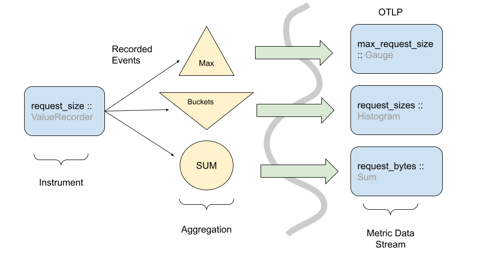
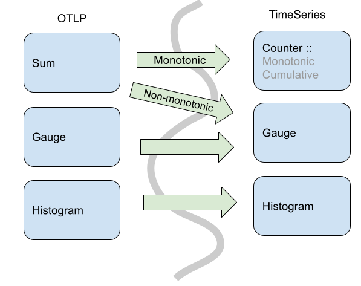
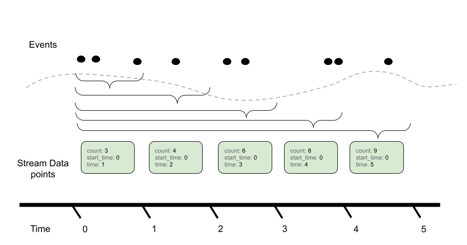
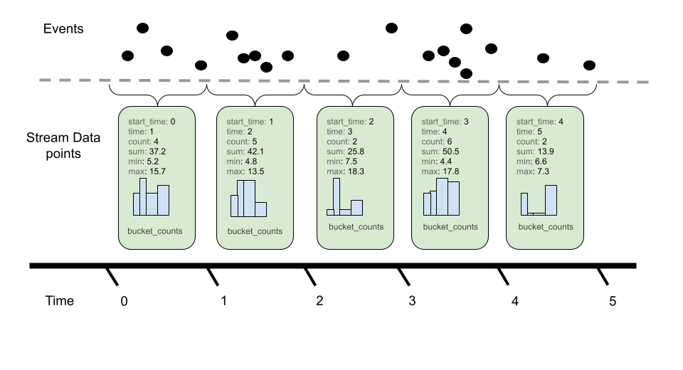
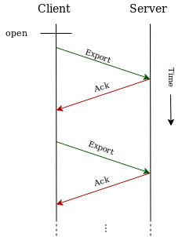
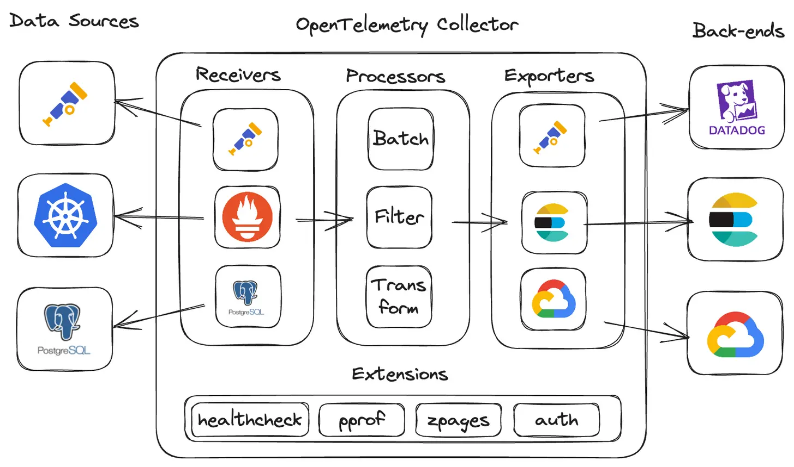
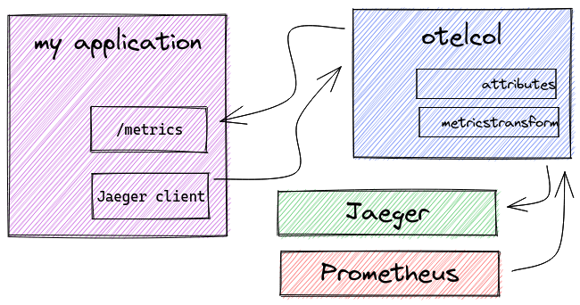
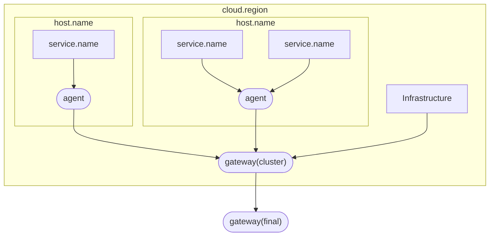

---
tags:
  - 完善
---

# 数据采集：OpenTelemetry

!!! tip "OpenTelemetry 的缩写为 OTel。"

OpenTelemetry 简介见 [可观测性#OpenTelemetry](index.md#数据采集层opentelemetry)。

OpenTelemetry 的主要部分如下：

- OTel 规范：涉及 OpenTelemetry 的所有部分。
- OTel 协议（OpenTelemetry Protocol，OTLP）：描述遥测数据在数据源、中间节点和后端之间的编码和传输方式。
- 语义约定（Semantic Conventions）：定义各类遥测数据的属性名、类型、意义和有效值。
- API：如何生成遥测数据。
- SDK：在特定语言中实现 API，导出遥测数据。
- 收集器（OpenTelemetry Collector，otelcol）：接收、处理和导出遥测数据。

!!! note "关于 API 和 SDK 的区分"

    API 包括抽象类，用于库开发者。SDK 具体实现了 API，用于应用开发者。

    OTel 设计如此，是为了让应用开发者能够替换不同 SDK 实现。OpenTelemetry SDK 是官方的实现，但其他人也可以按 API 实现自己的 SDK。

## OTel 规范：[基本概念](https://opentelemetry.io/docs/specs/otel/common/)

要点如下：

- 属性（Attributes）是 KV 对，V 要么是原始类型（字符串、整数、浮点数等），要么是数组（类型相同）。
    - 值得注意的是，Log 数据模型在标准之外进行了扩充，允许了值为 `any`，这是为了支持外部日志格式。

        > Arbitrary deep nesting of values for arrays and maps is allowed (essentially allows to represent an equivalent of a JSON object).

        除了 `LogRecord` 的 `Attributes`，其他地方都应当遵守标准的属性定义。

- 属性名由 [OTel 语义约定](https://opentelemetry.io/docs/specs/semconv/general/attribute-naming/) 约定：
    - 应当是小写的。
    - 使用命名空间避免名字冲突，使用 `.` 分隔命名空间。

!!! note

    这意味着 OpenTelemetry 的属性是扁平的，不支持嵌套。比如，一个键为 `foo.bar` 的属性应当是：

    ```json
    {
        "foo.bar": "value"
    }
    ```

    而不是

    ```json
    {
        "foo": {
            "bar": "value"
        }
    }
    ```

    扁平的属性结构在实践时有几个好处：

    - 便于数据库检索：比如在 ClickHouse 中存储为 `map(LowCardinality(String), String)`，如果嵌套，则需要对子字符串再次进行解析，无法简单地看到属性整体。
    - 便于 OTel 处理：比如要检查一个属性是否存在的 stanza 表达式为 `type(attributes["foo.bar"]) != 'nil'`。如果嵌套，需要先检查 `attributes.foo` 是否存在，再检查 `attributes.foo.bar` 是否存在，否则报错指针异常。

- 资源（Resource）是一组**不变**（immutable）的属性，用于描述产生数据的实体。

    > A Resource is an immutable representation of the entity producing telemetry as Attributes.
    >
    > -- [:simple-github: opentelemetry-specification/specification/resource/sdk.md at v1.37.0 · open-telemetry/opentelemetry-specification](https://github.com/open-telemetry/opentelemetry-specification/blob/v1.37.0/specification/resource/sdk.md)

    目前 OpenTelemetry 定义的资源中，我们关心的如下：

    - 服务 `service`：一般指一个特定的应用程序，**大部分需要在收集时手动添加**。
        - `service.name`：服务名。
        - `service.version`：服务版本。
    - 计算单元：
        - [容器 `container`](https://opentelemetry.io/docs/specs/semconv/resource/container/)：在 metric 中由 `docker_status` receiver 自动添加，在 log 中需要手动解析。
        - [进程 `process`](https://opentelemetry.io/docs/specs/semconv/resource/process/)

## [OTel 语义约定](https://opentelemetry.io/docs/specs/semconv/)

语义约定规范了各类数据的**属性名、类型、意义和有效值**，为不同系统之间的数据交换建立起一套标准。OpenTelemetry 内部各组件都遵守这些语义约定，外部系统也很容易将自己的数据映射到这些约定上。此外，越来越多的系统开始提供语义约定的直接支持。

!!! example

    网络相关的属性名称定义在 [`semconv/attributes-registry/network`](https://opentelemetry.io/docs/specs/semconv/attributes-registry/network/) 下。其中对端 IP 的定义如下：

    | 属性名 | 类型 | 描述 | 示例 |
    |--------|------|------|------|
    | `network.peer.address` | string | Peer address of the network connection - IP address or Unix domain socket name. | `10.1.2.80`; `/tmp/my.sock` |

## [OTel 规范](https://opentelemetry.io/docs/specs/otel/)：日志和指标的数据模型

OpenTelemetry 数据模型定义了**三大支柱的数据模型和包含的语义约定**（只有 Metric 和 Log 有明确的 Data Specification，Trace 在 API Specification 中有数据类型规范）。规范中有很大篇幅讲解设计的原因和背景，这里不再赘述，感兴趣的同学可以查看原文。这里简单举其中一些字段作为例子。

### [Log](https://opentelemetry.io/docs/specs/otel/logs/data-model/)

| Field Name           | Type                  | Description                                  |
| -------------------- | --------------------- | -------------------------------------------- |
| Timestamp            | uint64                | Time when the event occurred.                |
| ObservedTimestamp    | uint64                | Time when the event was observed.            |
| SeverityText         | string                | The severity text (also known as log level). |
| SeverityNumber       | number                | Numerical value of the severity.             |
| Body                 | any                   | The body of the log record.                  |
| Resource             | Resource              | Describes the source of the log.             |
| InstrumentationScope | Instrumentation Scope | Describes the scope that emitted the log.    |
| Attributes           | map<string, any>      | Additional information about the event.      |

如果对字段的语义有困惑，可以去查文档和 GitHub 上的讨论。

!!! example

    ```text
    ObservedTimestamp: 2024-10-04 15:46:26.809948211 +0000 UTC
    Timestamp: 2024-10-04 15:46:14 +0000 UTC
    SeverityText: notice
    SeverityNumber: Info2(10)
    Body: Str(<189>Oct  4 23:46:14 Huawei %%01SHELL/5/CMDRECORD[l](324):Record command information. (Task=vt0, Ip=192.168.1.178, User=admin, Command="log off (ssh user)", Result=Success) )
    Attributes:
        -> net.host.port: Str(514)
        -> net.peer.name: Str(192.168.1.1)
        -> appname: Str(%%01SHELL/5/CMDRECORD(l))
    ```

OpenTelemetry 的日志尚处于早期阶段，很多语义约定还没有规范化。附录 [Appendix A. Example Mappings](https://opentelemetry.io/docs/specs/otel/logs/data-model-appendix/) 展示了一些常见日志格式的映射。可以看到，日志中结构化的部分应当尽可能提取到 Body 之外的地方作为元数据（比如 Resource 和 Attributes），Body 只剩下文本信息。[Distinction between structured `Body` and `Attributes` · Issue #1613 · open-telemetry/opentelemetry-specification](https://github.com/open-telemetry/opentelemetry-specification/issues/1613#issuecomment-953187375) 对 `Body` 字段的使用做的详细的讨论，最终给出了如下的建议：

- OTel 规范仍会保持 `Body` 类型为 `any`，以兼容各种日志格式，满足无损转换的要求。
- 现有的所有日志库产生的日志消息体（message）都是字符串，因此限制日志 API 仅接受 `Body` 为字符串，结构化数据应当进入 `Attributes`。

### [Metrics](https://opentelemetry.io/docs/specs/otel/metrics/data-model/)

Metrics 本质上来自事件。OTLP 分层设计了三个模型：Events => Data Stream => Timeseries。高层次模型涉及度量 API 和离散输入值，低层次模型定义时间序列和离散输出值。

<div class="grid cards" markdown>



</div>

时间序列：

- 元数据属性
    - 指标名称
    - 属性（维度）
    - 点的值类型（整数、浮点数等）
    - 测量单位
- **主要数据**是有序的（时间戳，值）点，类型可以是：
    - 计数器（单调，累积）
    - 仪表
    - 直方图
    - 指数直方图

指标监测系统常见三种保留语义的变换：Temporal reaggregation（降频）、Spatial reaggregatio（降维，去除指标中不必要的属性）、Delta-to-Cumulative（增量和累积之间的转换）。OTel 的所有 Data Stream 都有内置的聚合函数支持这些变换。

Metric 点类型：

<div class="grid cards" markdown>

- Delta Sum

    ---
​    

- Cumulative Sum

    ---
    

- Gauge

    ---
    

- Delta Histogram

    ---
    

</div>

## OTel 协议（OTLP）

!!! quote

    - [OTLP Specification - OpenTelemetry](https://opentelemetry.io/docs/specs/otlp/)。

OTLP 描述了遥测数据在数据源、中间节点和后端之间的编码和传输方式。

- OTLP 协议是请求 - 响应式的。目前定义了一种请求和一种响应：`Export`。
- 必须支持的压缩方式有 `gzip` 和 `none`。
- OTLP 目前定义了在 gRPC、HTTP/1.1 和 HTTP/2 上的实现。

<figure markdown="span">

<figcaption>OTLP 协议</figcaption>
</figure>

### [ProtoBuf](https://protobuf.dev/)

Protocol Buffers 由 Google 提出，是一套语言中立、平台无关的**序列化**机制。使用 ProtoBuf Schema 很容易描述数据结构如何序列化为二进制流，以及如何从二进制流反序列化为数据结构。

### [gRPC](https://grpc.io/)

- 端口 `4317`。
- 建立 gRPC 连接后，客户端使用 `Export<signal>ServiceRequest` 发送数据。
- 服务端分三种情况响应：
    - 完全成功：回复 `Export<signal>ServiceResponse` 消息，不设置 `partial_success` 字段。
    - 部分成功：回复 `Export<signal>ServiceResponse` 消息，设置 `partial_success`、其他描述拒绝的部分和原因的字段。该情况下客户端不允许重试。
    - 失败：这些代码由 gRPC 规范定义（状态码和错误处理），OTLP 只是说明了这些代码在 OTLP 中的含义。
        - 可重试：服务端返回代码 `UNAVAILABLE`，并使用 `RetryInfo` 描述重试的间隔。
        - 不可重试：服务端返回代码 `INVALID_ARGUMENT`，并使用 `BadRequest` 描述错误。

### [HTTP/1.1](https://datatracker.ietf.org/doc/html/rfc2616) 和 [HTTP/2](https://datatracker.ietf.org/doc/html/rfc9113)

- 载荷编码为二进制或 JSON 格式。
- 客户端使用 `POST` 请求发送数据，路径为 `v1/<signal>` 等。
- 服务端分三种情况响应：
    - 完全成功：返回 `200 OK`。
    - 部分成功：返回 `200 OK`，并在响应体中描述拒绝的部分和原因。
    - 失败：返回 `4xx` 或 `5xx` 状态码，具体含义由 OTLP 定义。

## OTel Collector (otelcol)

!!! quote

    - [Collector - OpenTelemetry](https://opentelemetry.io/docs/collector/)

### Collector 简介

Collector 以无关厂商的方式接收、处理和导出遥测数据。

Collector 由 Receiver、Processor 和 Exporter 组成，整体架构如下：

<figure markdown="span">

<figcaption>OpenTelemetry Collector 架构</figcaption>
</figure>

- Receiver 和 Exporter 灵活支持 Pull 或 Push 模式。
- Processor 可以对数据进行转换、过滤、聚合等操作。
- Connector 可以对流水线进行聚合、路由等操作。

目前，我们主要以 Normalizer 模式部署，起到在数据源和后端之间的数据清洗和转换作用。

<figure markdown="span">

<figcaption>Normalizer 模式</figcaption>
</figure>

Collector 的插件分为 core 和 contrib 两类，分别在不同 GitHub 仓库。Collector 每次发布都会打包插件，制作成不同的 distribution 版本。一般选择 contrib 版本，因为 syslog、journald 等重要插件都在 contrib 仓库中。

Collector 默认提供自身的可观测性：`8888` 端口暴露了 Prometheus metric 接口，日志输出到 `stderr`。Collector 通过 systemd 管理，日志也可以通过 journald 收集。

!!! tip

    使用 [otelbin.io](https://www.otelbin.io/) 可以可视化 Collector 配置。

### Collector 部署

根据我们的[需求](index.md#需求分析)，选择 agent + gateway 部署模式。所有节点均部署 systemd 维护的 otelcol 作为 agent，管理节点上部署 otelcol Docker 作为 gateway。



[:simple-youtube: OpenTelemetry Collector Deployment Patterns](https://www.youtube.com/watch?v=WhRrwSHDBFs) 还描述了基本、扇出（Fanout）、规范化（Normalizer）、负载均衡、多集群、多租户等部署模式。

Collector 可以使用 OpAMP 协议管理，OpenTelemetry 也提供了简单的 [:simple-github: OpAMP Go 实现](https://github.com/open-telemetry/opamp-go)。因为该协议目前处于 Beta 阶段，所以我们暂时没有使用。**等到协议应用成熟，我们应当使用 OpAMP 作为中心化的配置管理工具，下发配置文件和监测 Collector 运行状态。**

部署为 Agent + Gateway 模式时，数据处理的位置有多种选择。ClickHouse 官方的建议是：在 gateway 和 ClickHouse 中做转换和处理，尽量减少 agent 实例上的工作。

!!! tip "通常，我们只在 agent 上执行过滤、时间戳设置和添加属性操作。"

    > We recommend users avoid doing excessive event processing using operators or transform processors. These can incur considerable memory and CPU overhead, especially JSON parsing. It is possible to do all processing in ClickHouse at insert time with materialized views and columns with some exceptions - specifically, context-aware enrichment e.g. adding of k8s metadata. For more details see "Extracting structure with SQL".
    >
    > If processing is done using the OTel collector, we recommend doing transformations at gateway instances and minimizing any work done at agent instances. This will ensure the resources required by agents at the edge, running on servers, are as minimal as possible. Typically, we see users only performing filtering (to minimize unnecessary network usage), timestamp setting (via operators), and enrichment, which requires context in agents. For example, if gateway instances reside in a different Kubernetes cluster, k8s enrichment will need to occur in the agent.

我们有跨网站传输遥测数据的需求（从 mirror 到 cluster），配置了以下安全措施：

- 使用 TLS 证书进行 HTTPS 通信。
- 使用 bearer token 进行认证。

### Collector 性能分析与调试

作为数据集散的枢纽，Collector 的性能至关重要。OpenTelemetry 很关心这一点，对每次 Git 提交都会自动运行基准测试，结果见 [benchmarks/loadtests](https://open-telemetry.github.io/opentelemetry-collector-contrib/benchmarks/loadtests/)。

Collector 自身提供 pprof 插件，可以进行性能分析。可以查看 `http://localhost:1778/debug/pprof/` 了解基本情况。希望深入了解 Go pprof 的同学可以参考下面的资料：

- [:simple-youtube: Profiling Go Code with pprof](https://www.youtube.com/playlist?list=PL8Q5PSrFkjsyWjcuAXfBgtS9KtqNn3m9o)
- [:simple-github: Production-Go-Examples](https://github.com/Soypete/Production-Go-Examples)
- [Profiling Go programs with pprof - Julia Evans](https://jvns.ca/blog/2017/09/24/profiling-go-with-pprof/)

此外还有 zpages 插件，提供诊断信息。可以查看 `http://localhost:55680/debug/servicez` 了解基本情况。希望深入了解 zpages 的同学可以参考下面的资料：

- [:simple-medium: ZPages in OpenTelemetry](https://medium.com/opentelemetry/zpages-in-opentelemetry-2b080a81eb47)

关于 Collector 和其他产品的比较，可以自己写基于 Docker 的基准测试。[可观测性#案例调研](index.md#技术选型与案例调研) 中也有一些参考资料。我们进行了 Filebeat 和 OTel Collector 的比较，仅开启 json 解析器对文件日志进行解析时：

- Filebeat 处理日志时 CPU 占用较高，闲时 CPU 占用率低，内存占用稳定偏高。
- OTel Collector 处理日志时 CPU 占用较低，闲时 CPU 占用相对较高，内存占用稳定偏低。

### 子组件：pkg/ottl

[`pkg/ottl`](https://github.com/open-telemetry/opentelemetry-collector-contrib/tree/main/pkg/ottl) 实现了 OTel Transformation Language（OTTL），用于处理和转换遥测数据。**Transform Processor 的配置基于该种语言**，实现的功能比 `pkg/stanza` 更强大。

!!! example

    下面我们以一个具体的情境为例介绍 OTTL。假设你需要对下面的 Log 进行处理：

    ```json
    {
        "body": {
            "MESSAGE": "Something happened.",
            "_PID": 12345,
            "_TRANSPORT": "kernel",
            "foo": "bar",
            "baz": "qux"
        }
    }
    ```

    要求将 `body` 替换为 `MESSAGE`，特定键值对移动到 `resource`，其余键值对移动到 `attributes` 中，并添加前缀 `journald.*`（在前文我们知道这代表 OTel 属性的命名空间）：

    ```json
    {
        "body": "Something happened.",
        "attributes": {
            "journald._TRANSPORT": "kernel",
            "journald.foo": "bar",
            "journald.baz": "qux"
        },
        "resource": {
            "process.pid": 12345
        }
    }
    ```

    大致思路是：

    - 在 Receiver 处：
        - 使用 `move` Operator 将 `body` 移动到 `attributes.journald`。
        - 使用 `move` Operator 将 `MESSAGE` 等有明确目的的字段移动到相应位置。
    - 在 Processor 处：
        - 使用 `flatten` Function 将 `attributes["*"]` 的键名称放入命名空间 `attributes["journald.*"]`（其实就是利用 `flatten` 添加前缀的功能，并没有展平嵌套）。

- 在 [OTel 规范：基本概念](#otel-规范基本概念) 中，我们提到不同遥测数据的字段定义（数据类型）可能不同。OTTL 定义不同遥测数据的上下文（Context），限制如何访问遥测数据的各个字段。

    - [Log 上下文](https://github.com/open-telemetry/opentelemetry-collector-contrib/blob/main/pkg/ottl/contexts/ottllog/README.md)：

        pdata 是 Collector Pipeline Data，即 Collector 内部流水线中的数据表示格式。Log Context 针对 pdata.LogRecord 定义。阅读文档我们了解到相关字段如下：

        | 字段名 | 类型 |
        | ------ | ---- |
        | `resource` | `pcommon.Resource` |
        | `resource.attributes` | `pcommon.Map`
        | `resource.attribute[""] | `string`、`bool`、`pcommon.Map`、... |
        | `attributes` | `pcommon.Map` |
        | `attributes[""]` | `string`、`bool`、`pcommon.Map`、... |
        | `body` | any |
        | `body[]` | `string`、`bool`、`pcommon.Map`、... |
        | `body[""]` | `string`、`bool`、`pcommon.Map`、... |

- OTTL Functions 能够操纵 pdata 数据。主要有两类函数：
    - Editors：修改遥测数据。如 `append`、`delete_key`、`flatten` 等。
    - Converters：仅用于转换，返回一个值，不修改输入数据。如 `IsInt`、`Day` 等。

    !!! example "`flatten` 函数"

        ```text
        flaten(target, Optional[prefix], Optional[depth])
        ```

        函数作用于 `pcommon.Map`。

于是我们可以写出在 Processor 中需要使用的 OTTL 语句：

```text
logs:
  flatten(attributes, "journald")
```

### 子组件：pkg/stanza

[`pkg/stanza`](https://github.com/open-telemetry/opentelemetry-collector-contrib/tree/main/pkg/stanza) 是用于处理传统日志的模块，**很多日志 Receiver 都基于它构建**，我们也常常需要使用其中的 operator。一些基本概念简单介绍如下：

- entry 表示在流水线中移动的一个日志。filed 指 entry 中的值。
- operator 创建、修改或删除 entry。有四种 operator：input、parser、transform、output。operator 组织为 operator sequences。
- Adapter 帮助 stanza operator 集成到 OTel collector receiver。它负责 OTel `plog.Logs` 和 stanza `entry.Entry` 之间的转换。

!!! example

    这是一个有很多 filed 的 entry：

    ```json
    {
    "body": {
        "message": "Something happened.",
        "details": {
        "count": 100,
        "reason": "event"
        }
    },
    "timestamp": "2020-01-31T00:00:00-00:00",
    "severity": 30,
    "severity_text": "INFO"
    }
    ```

    这是几个 operator 组成的 sequence：

    ```yaml
    operators:
    - type: json_parser
    - type: remove
      field: attributes.foo
    - type: add
      key: attributes.bar
      value: baz
    ```
