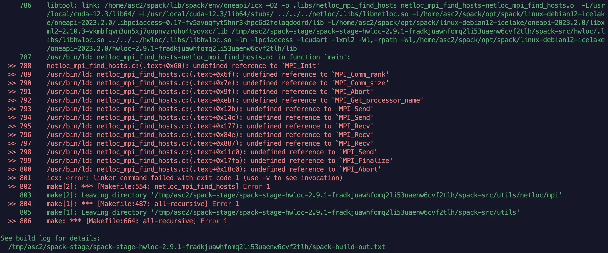

---
tags:
  - 完善
---

# 包管理器：Spack

## Spack 快速上手

!!! quote

    - [Basic Usage — Spack documentation](https://spack.readthedocs.io/en/latest/basic_usage.html)

Spack 是 HPC 中最流行的包管理器。它帮助你自动完成拉取源码、 `configure` 和 `make install` 等构建流程，并负责维护环境变量如 `PATH` 、 `LD_LIBRARY_PATH` 等。

### 加载集群上的 Spack

!!! tip "区分集群级别（site level）和用户级别（user level）的 Spack 实例"

集群上目前在 `/pxe/opt/spack` 目录下安装了 Spack（下称**集群 Spack**），提供了常用的编译工具如 `nvhpc`, `oneapi`, `aocc` 等。集群 Spack 已经写入了各个 Shell 系统级别的配置文件（如 `/etc/profile.d`），会在登陆 Shell 中**自动加载**。

**但是集群 Spack 的目录仅有管理员可修改，普通用户只能使用而无法安装软件包。**如果你希望安装集群上没有提供的软件包，请在家目录下自行安装 Spack 实例（下称**用户 Spack**），并将上游指向集群 Spack，见 [串联 Spack 实例](#串联-spack-实例)。

### 查看软件包

使用 `spack find` 可以查看已安装的包：

```bash
$ spack find
-- linux-debian12-icelake / gcc@12.2.0 --------------------------
gcc-runtime@12.2.0  glibc@2.36  gmake@4.3  libiconv@1.17  libxml2@2.10.3
pkgconf@1.8.1  xz@5.4.6  zlib-ng@2.1.6
==> 8 installed packages
```

!!! note "概念：[spec](https://spack.readthedocs.io/en/latest/spec_syntax.html)"

    > A spec is like a name, but it has a version, compiler, architecture, and build options associated with it. In spack, you can have many installations of the same package with different specs.

    spec 是 Spack 中按特定选项构建的一个软件包，包含软件包名、版本、编译器、选项等信息。比如 `gcc@12.2.0` 就是一个 spec。对于一个软件包，我们可以用不同的编译选项选项构建多个 Spec。

    使用 `spack find -dvf` 可以查看 spec 的详细信息：

    ```bash
    $ spack find -dfv
    -- linux-debian12-icelake / gcc@12.2.0 --------------------------
    cuda@11.8.0%gcc ~allow-unsupported-compilers+dev build_system=generic
        gcc-runtime@12.2.0%gcc  build_system=generic
        glibc@2.36%gcc  build_system=autotools
        libxml2@2.10.3%gcc +pic~python+shared build_system=autotools
            gmake@4.3%gcc ~guile build_system=generic patches=599f134
            libiconv@1.17%gcc  build_system=autotools libs=shared,static
            pkgconf@1.8.1%gcc  build_system=autotools
            xz@5.4.6%gcc ~pic build_system=autotools libs=shared,static
            zlib-ng@2.1.6%gcc +compat+new_strategies+opt+pic+shared build_system=autotools
    ```

    Spec 的常用符号含义如下：

    |       Symbol       |        Example        |                                        Description                                        |
    | ------------------ | --------------------- | ----------------------------------------------------------------------------------------- |
    | `@`                | `@1.2:1.4`            | 指定版本                                                                                  |
    | `%`                | `%gcc@4.7`            | 直接依赖（通常为编译器）                                                                  |
    | `^`                | `^gcc@4.7`            | 间接依赖                                                                                  |
    | `+`、`-` 或 `~`    | `+mpi`                | 布尔类型选项<br/> `~` 与 `-` 等价，用于某些情况下阻止 shell 解析                          |
    | `++`、`--` 或 `~~` | `++mpi`               | 布尔类型选项，在依赖之间传递                                                              |
    | `name=<value>`     | `build_system=cmake`  | 指定选项的值                                                                              |
    | `name==<value>`    | `build_system==cmake` | 指定选项的值，在依赖之间传递                                                              |
    | `<flag>=<flags>`   | `cflags=-O3`          | 特殊的编译器选项，如：`cflags`, `cxxflags`, `fflags`, `cppflags`, `ldflags`, and `ldlibs` |

    有几个特殊的有名选项：`platform` 内核名（`darwin` 等）、`os` 发行版名、`target` 微架构名。

    对于本地安装的 spec，还可以通过 `/` 哈希值来指定：

    ```bash
    $ spack location --install-dir cuda
    ==> Error: cuda matches multiple packages.
    Matching packages:
        ngtuhol cuda@11.8.0%gcc@12.2.0 arch=linux-debian12-icelake
        bthqeln cuda@12.4.0%gcc@12.2.0 arch=linux-debian12-icelake
    Use a more specific spec (e.g., prepend '/' to the hash).
    $ spack location --install-dir cuda/ngtuhol
    /opt/spack/opt/spack/linux-debian12-icelake/gcc-12.2.0/cuda-11.8.0-ngtuholoe4xatxmphodttdett3rmhjrr
    ```

    一些复杂的 Spec 可以使用引号括起作为一个参数传递，否则 Spack 会识别错误。例如 `spack diff <spec> <spec>`：

    ```bash
    $ spack diff intel-oneapi-compilers arch=linux-debian12-icelake intel-oneapi-compilers arch=linux-debian12-zen3
    ==> Error: You must provide two specs to diff.
    $ spack diff 'intel-oneapi-compilers arch=linux-debian12-icelake' 'intel-oneapi-compilers arch=linux-debian12-zen3'

    --- intel-oneapi-compilers@2025.0.4/jwh4nndynkcqhogdltdrxjkiilvulwyg
    +++ intel-oneapi-compilers@2025.0.4/zc7x2awdl3jriiydjaozmaizjhcsp2u5
    @@ hash @@
    - intel-oneapi-compilers jwh4nndynkcqhogdltdrxjkiilvulwyg
    + intel-oneapi-compilers zc7x2awdl3jriiydjaozmaizjhcsp2u5
    @@ node_target @@
    - intel-oneapi-compilers icelake
    + intel-oneapi-compilers zen3
    ```

### 使用软件包

Spack 中的软件包有三种使用方式：

- **`spack load`**：使用单个软件包。比如

    ```bash
    spack load gcc@11.2.0
    ```

- **Module**：Spack 提供对 Environment Modules 和 Lmod 的支持，可以设置在构建 Spec 后自动生成 modulefile，这样就可以通过 `module` 命令加载 Spack 安装的软件包。

    ```bash
    spack module lmod refresh
    module load gcc@11.2.0
    ```

- **Environment**：与 Conda 环境类似，就是一组可以构建的 Spec。与 modules 相比，它更加稳定、可复现，且可以作为一个整体 load。

    ```bash
    spack env activate -p myenv
    ```

可以使用下面任意一条命令查看当前加载的软件包：

```bash
spack find --loaded
spack list --loaded
```

### 安装自己的 spack 实例

!!! quote

    - 官方安装文档：[Getting Started - Spack](https://spack.readthedocs.io/en/latest/getting_started.html#installation)

<!-- !!! tip

    在 CI/CD 中，Spack 的配置见 [:simple-gitlab: `jenkins.clusters.zjusct.io/debian/modules/02-spack-git.sh`](https://git.zju.edu.cn/zjusct/ops/jenkins.clusters.zjusct.io/-/blob/main/debian/modules/02-spack-git.sh) -->

使用 Spack，只需要从 GitHub 仓库 pull 或者下载 Release 中的稳定版，就可以直接运行。**GitHub Release 中打包的软件包往往不是最新的**，推荐按官方文档使用 `git clone` 直接拉取仓库。在家目录下运行以下命令即可安装 Spack。

```shell
git clone -c feature.manyFiles=true --depth=2 https://github.com/spack/spack.git
```

下载后 Spack 并没有被加入环境变量中，你需要进一步增加 shell 支持。向你的 shell 配置文件中添加以下内容：

```shell
# For bash/zsh/sh
# bash: ~/.bashrc
# zsh: ~/.zshrc
source spack/share/spack/setup-env.sh

# For tcsh/csh
# tcsh: ~/.tcshrc
# csh: ~/.cshrc
source spack/share/spack/setup-env.csh

# For fish
# fish: ~/.config/fish/config.fish
source spack/share/spack/setup-env.fish
```

### 串联 Spack 实例

!!! tip "修改不同级别的配置"

    - 部分 Spack 命令可以使用 `--scope=` 选项指定配置级别，如 `--scope=site`、`--scope=user`。**默认为用户级别**。
    - **用户 spack** 的配置文件位于 `~/.spack` 目录下

**用户 spack** 安装完成后，可以将**集群 spack** 指定为上游 Spack 实例，从而复用**集群 spack** 已安装的软件包，节省安装时间。

=== "使用命令添加配置"

    ```shell
    spack config add upstreams:zjusct-spack:install_tree:/pxe/opt/spack/opt/spack
    ```

=== "手动修改配置文件"

    该配置文件默认没有创建，请在创建后写入以下内容：

    ```yaml title="~/.spack/upstreams.yaml"
    upstreams:
      zjusct-spack:
        install_tree: /pxe/opt/spack/opt/spack
    ```

这样，运行 `spack find` 命令就可以看到集群上的 Spack 安装的软件包了。与此同时，你也可以更改 Spack 的软件包配置，这些更改将会放在你手工安装的 Spack 目录下。

### 安装软件包

使用 `spack install <spec>` 安装软件包。因为 spec 语法易错，所以在安装前建议使用 `spack spec -I <spec>` 确认软件依赖和选项是否正确。例如：

```bash
$ spack spec -I openblas
 -   openblas@0.3.29%gcc@12.2.0~bignuma~consistent_fpcsr+dynamic_dispatch+fortran~ilp64+locking+pic+shared build_system=makefile symbol_suffix=none threads=none arch=linux-debian12-icelake
[+]      ^gcc-runtime@12.2.0%gcc@12.2.0 build_system=generic arch=linux-debian12-icelake
[e]      ^glibc@2.36%gcc@12.2.0 build_system=autotools arch=linux-debian12-icelake
[e]      ^gmake@4.3%gcc@12.2.0~guile build_system=generic patches=599f134 arch=linux-debian12-icelake
$ spack install openblas
```

Spec 前的 `e`（external）表示非 Spack 管理的外部依赖，比如系统包管理器安装的包。`+` 表示 Spack 管理的依赖，`-` 表示 Spack 将要安装的包。

!!! note "概念：使具体化（concretize）"

    Spack 安装软件包需要经过 concretize 和 install 两个步骤。concretize 是指确定软件包的依赖关系，生成 spec 树，然后根据 spec 树安装软件包。

    `spack spec` 执行的就是 concretize 操作。

    更多信息建议阅读：[CSCS Spack Course 2024](https://spack.github.io/spack-cscs2024/)。

使用 `spack list` 可以查询在线仓库中的软件包，使用 `spack info` 可以查看软件包的详细信息。

!!! note "概念：虚包（Virtual Packages）"

    比如 OpenMPI、IntelMPI、MPICH，它们是 MPI 的不同实现。因此它们都提供一个虚包 mpi，其他程序只会依赖于 mpi 这个包，而不会依赖于某个具体实现。
    使用 `spack info --all` 可以查看提供的虚包，这里以 ATLAS 为例，可以看到：

    ```yaml
    Virtual Packages:
        atlas provides blas, lapack, lapack@3.6.1
    ```

    也就是说， `atlas` 会自动取代 `blas/lapack` 等的位置，提供它们的服务。

### 其它常用命令

- 比较 spec 差异：`spack diff`
- 查找安装位置：`spack location --install-dir <spec>`
- 移动到安装位置：`spack cd -i <spec>`

### 创建和使用 Spack 环境（该部分需要完善）

!!! quote

    - [Environments Tutorial — Spack Tutorial documentation](https://spack-tutorial.readthedocs.io/en/latest/tutorial_environments.html)
    - [Environments (spack.yaml, spack.lock) — Spack documentation](https://spack.readthedocs.io/en/latest/environments.html)

创建环境的基础步骤、查找外部依赖、编译器等：

```bash
spack env list
spack env create myenv
spack env activate -p myenv
spack env status
spack external find
spack compiler find
```

在 Spack Environment 中，add spec、concretize 和 install 三个步骤分离开来，每一个阶段弄好再执行下一个阶段。这样确实能减少直接安装后发现配置不对又要重新弄的麻烦。

- add/remove 环境中的 spec（此时不会安装也不会检查 spec 是否有错）：

```bash
spack add <some packages>
spack remove <some packages>
```

- concretize 环境中的 spec（构建依赖树）：

```bash
spack concretize
spack find -c
```

- 安装环境中的 spec（安装所有 spec）：

```bash
spack install
```

### 处理头文件和依赖

!!! quote

    - [Drop *_INCLUDE_PATH in prefix_inspections:include by haampie · Pull Request #21699 · spack/spack](https://github.com/spack/spack/pull/21699)
    - [Customize environment modifications — Spack documentation](https://spack.readthedocs.io/en/latest/module_file_support.html#customize-environment-modifications)
    - [Environment Variables (The C Preprocessor) - GCC Documentation](https://gcc.gnu.org/onlinedocs/cpp/Environment-Variables.html)
    - [LD_LIBRARY_PATH – or: How to get yourself into trouble!](https://www.hpc.dtu.dk/?page_id=1180)

Spack 只会维护下面的环境变量：

```text
PATH
MANPATH
ACLOCAL_PATH
PKG_CONFIG_PATH
CMAKE_PREFIX_PATH
DYLD_FALLBACK_LIBRARY_PATH on macOS
```

如果加载的包是编译器（如 `nvhpc`、`intel-oneapi-compilers` 等），还会修改编译器变量和动态链接库路径：

```text
CC CXX FC F77
LD_LIBRARY_PATH
```

其他情况下一般不会修改头文件和动态链接库搜索路径：

```text
CPATH
C_INCLUDE_PATH
CPLUS_INCLUDE_PATH
LD_LIBRARY_PATH
```

> 在相关文档和 Pull Request 中可以了解原因：
>
> Spack 社区认为环境变量不够透明，作为一种管理选项的方式也十分危险（造成过某些编译器 bug），更加鼓励用户显式使用编译器选项如 `-I$(spack location -i <spec>)/include`。
>
> 现代构建工具（如 CMake、pkg-config）已经能够很好地处理头文件搜索路径，移除后用户仍可以通过配置文件手动添加这些路径。
>
> Spack 将维护环境变量的自主选择交给用户和系统管理员，可以通过 `modules.yaml` 指定修改环境变量。

如果我们需要包含或引用 Spack 管理的包，有以下几种方式：

- 使用 `spack location -i <spec>`：

    先 `spack cd -i <spec>` 进入安装目录，使用 `fdfind | fzf` 等工具搜索头文件的相对路径，然后添加到编译选项中。例如：

    ```bash
    C_INCLUDE_PATH=$(spack location -i <spec>)/include make
    ```

- 使用 [pkg-config](https://www.freedesktop.org/wiki/Software/pkg-config/)：

    `pkg-config` 是一个管理库文件和头文件路径的工具。它会搜索 `PKG_CONFIG_PATH` 中的 `.pc` 文件，按指定要求返回编译选项。

    Spack 部分包加载时会修改 `PKG_CONFIG_PATH`，可以使用 `pkg-config` 来获取头文件和库文件的路径。例如：

    ```bash
    c++ example.cpp $(pkg-config --cflags --libs gtk+-3.0 webkit2gtk-4.0) -o example
    ```

    `pkg-config` 支持 `--static`、`--shared` 等选项，可以指定链接静态库或动态库。

- 使用 CMake：

    Spack 部分包加载时会修改 `CMAKE_PREFIX_PATH`，可以使用 `find_package` 来查找头文件和库文件。例如：

    ```cmake
    find_package(OpenMP)
    ```

### 常用软件包

```text
# 开源编译和构建系统
llvm gcc
# NVIDIA
cuda
nvidia-nsight-systems
nvhpc # 包含上面两者
# intel: intel-oneapi-*
intel-oneapi-compilers
intel-oneapi-mkl
intel-oneapi-mpi
intel-oneapi-vtune
intel-oneapi-tbb
# amd
aocc+license-agreed
# MPI
mpich mvapich2 openmpi
```

## Spack 配置与管理

### 添加系统已有的包

- 配置编译器 `spack compiler`
    - `list` `add=find` `info`
    - `spack config edit compilers` 可以进一步指定编译选项、设置环境变量。

- `spack external find` 自动扫描系统中已有的包 [Automatically Find External Packages](https://spack.readthedocs.io/en/latest/packages_yaml.html#cmd-spack-external-find)
- `spack config edit packages` ，以 CUDA 为例：

```yaml
packages:
  all:
    variants: +cuda cuda_arch=80
  cuda:
    externals:
    - spec: "cuda@12.3%gcc@12.2.0 arch=linux-debian12-x86_64"
      prefix: /usr/local/cuda-12.3
      extra_attributes:
        environment:
          prepend_path:
            LD_LIBRAY_PATH: /usr/local/cuda-12.3/lib64
```

- Spack 建议如果系统中有这些包就写进去： `openssl`  `git` 。这些包确实很多系统都有附带，直接使用可以节省一些编译时间。当然很多时候我们用 Spack 就是不想自己解决依赖，希望一行命令解决所有事情，全都让 Spack 自己装一套也行。

!!! warning "有些包必须使用发行版提供的版本"

    比如 OpenSSL，如果版本不一致，可能会导致 SSH 连接失败。这将直接导致 MPI 程序无法运行。

    

    对于 OpenSSL 这种基础包，每个系统应当固定版本，不要让 Spack 自行编译，很可能发生版本不一致问题。

### 与 Lmod 集成

- 配置自动为所有安装的包生成 modulefile：

    ```bash
    spack config --scope=site add modules:default:enable:[lmod]
    ```

- 在 `/etc/lmod/.modulespath` 中添加 Spack 的 modulefile 路径：

    ```bash
    echo "/opt/apps/spack/share/spack/lmod" >> /etc/lmod/.modulespath
    ```

## Spack 软件包维护

!!! quote

    - [Packaging Guide: defining a package — Spack documentation](https://spack.readthedocs.io/en/latest/packaging_guide_creation.html)

Spack 打包系统整体比较复杂，这里我们仅介绍基本概念，侧重于构建相关，使读者有能力修改现有的软件包。

在 Spack 中，每个 Package 就是一个类，形成继承关系：


Package 类的代码有这么几类：

- 元数据：

    ```python
    homepaage = "..."
    version("2.4.0", sha256="...")
    variant("feature", default=True, description="...")
    ```

- 补丁：

    ```python
    patch("patchfile.patch", when="@1.2: +feature")
    def patch(self):
        ...  # 自定义补丁
    ```

- 依赖关系：

    ```python
    depends_on("libelf@0.8 +parser +pic",
        when="@1.2: +feature",
        type=("build", "link", "run", "test"),
        patches=["patchfile.patch",
            patch("https://github.com/spack/spack/pull/1234.patch",
                when="@1.2: +feature")]
        )
    provides()
    conflicts()
    requires()
    setup_dependent_pacakge()
    ```

    默认为 `type=("build","link")`。不同的依赖关系将在包的不同阶段起作用，主要是影响 `PATH` 和编译、链接器选项。

    这些指令可以用 `with` 语句来批量管理：

    ```python
    with default_args(type=("build","run"), when("...")):
        depends_on("...")
        conflicts("...")
    ```

- 标准接口：

    主要是供依赖使用。

    ```python
    def libs(self): # 库名
    def command(self): # 可执行文件
    def headers(self): # 头文件目录
    def home(self): # 安装位置
    ```

- 构建、安装步骤：

    根据不同的构建系统，实现不同的函数。

    ```python
    # before build
    def setup_build_environment(self, env):
        env.set("CXX", "g++")
    @run_before("cmake") 

    # build
    def cmake_args(self): # CMakePackage
        self.spec["dependecy"].prefix
    def configure_args(self): # AutotoolsPackage
        args = []
        if self.spec.satisfies("+feature"):
            args.append("--enable-feature")
            args.append(f"--with-libxml2={self.spec['libxml2'].prefix}")
        return args
    def build_targets(self): # MakefilePackage
    def install_targets(self): # MakefilePackage
    
    # after build
    def install_missing_files(self):
        install_tree("extra_files", self.prefix.bin)
    @run_after("install", when="...")
    ```

- 环境管理：

    可以管控不同阶段、依赖关系上的环境变量：

    ```python
    setup_build_environment(env, spec)
    setup_dependent_build_environment(env, dependent_spec)
    setup_run_environment(env)
    setup_dependent_run_environment(env, dependent_spec)
    ```

Spack 安装软件包的大致过程：

- Fetch
- Extract to stage directory
- Fork build environment

    Spack 会清空可能影响构建的环境变量，构建过程与主进程互不干扰。

- Execute (build system specific)
    - configure
    - build
    - install

!!! tips "调试构建环境"

    有时需要手动复现 Spack 构建过程中的命令，可以使用下面的命令恢复环境：

    ```bash
    # 失败时不清除 prefix（一般用于 install 阶段的调试）
    spack install --keep-prefix --verbose <package>
    # 失败时包的位置就是 stage
    spack locate <package>
    spack cd <pacakge>
    spack build-env <package> -- /bin/sh
    ```

    其他有用的命令：

    ```bash
    # 成功安装后保留 stage
    spack install --keep-stage <spec>
    # 清理 stage
    spack clean --stage
    ```

## 常见问题

### 放弃过于老旧的包

构建过程的很多错误往往是因为代码太老、不符合新的语法规范、功能弃用。如果有可能，不要再使用该包，选择新的可替代的包，不然可能需要花很大精力调整编译选项。比如 ATLAS，其稳定的包已经是 2016 年的了，编译时爆出了很多弃用的函数、不能识别目前的 CPU 等等问题，因此还是放弃该包比较好。


对于 BLAS，其实官网提供了 Vendor-Specific 的列表，可以找到：intel-oneapi-mkl 就是 Intel 平台上的优化实现，用它即可。

### 自行添加编译、链接选项

这些问题常常是由于编写安装脚本的人没有考虑完善导致的，没有指定链接某些库，导致编译过程中断。如果对 `ld` 等链接工具熟悉，就能够自行添加相应的选项完成编译。下面记录几个例子：

```bash
spack install hwloc@2.9.1%oneapi ^intel-oneapi-mpi%oneapi
```

使用 `intel-oneapi-mpi` 依赖安装 `hwloc` ，提示缺少 MPI 相关符号，很显然是没链接 MPI 库。



- 首先检查 786 行的编译命令，其实这里并没有指定链接 MPI 库，因此应当添加 `-lmpi` 选项。更改为：

```bash
spack install hwloc@2.9.1%oneapi ldflags="-lmpi" ^intel-oneapi-mpi%oneapi
```

- 这个问题折腾了我一个多小时，才慢慢找到上面这个问题。一开始我认为可能是路径缺失，因此尝试以各种方式为 `ld` 添加搜索路径，但最后发现它根本没指定链接。
- 如果是路径问题， `ld` 的报错应该是找不到某个库，而不是未定义符号，比如：

```text
/usr/bin/ld: cannot find -lzlib
```

### Error: All fetchers failed for

网络问题。有些包需要从 GitHub 等地拉取资源。加上代理解决。
