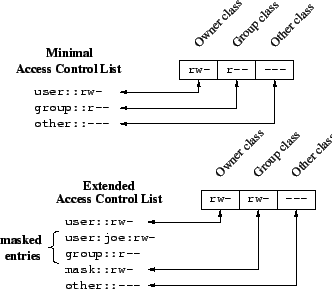

---
tags:
  - 完善
---

# 文件权限

!!! todo

    - [ ] POSIX 文件权限

## ACL 原理

POSIX 基本文件权限无法满足更细粒度的权限控制需求，可以使用 ACL（Access Control List）来实现更细粒度的权限控制。

### ACL 历史和支持情况

??? info "几种 ACL"

    - Classic Unix permissions：经典权限。
    - POSIX ACL：只存在草稿

        > Unfortunately, it eventually turned out that standardizing all these diverse areas was too ambitious a goal. In January 1998, sponsorship for 1003.1e and 1003.2c was withdrawn. While some parts of the documents produced by the working group until then were already of high quality, the overall works were not ready for publication as standards. It was decided that draft 17, the last version of the documents the working group had produced, should be made available to the public.

    - NFSv4 ACL：最新，有明确规范，功能最强大的 ACL
        - NFSv4 ACL 与 POSIX ACL 不兼容。
        - NFSv4.1 ACL 是 POSIX ACL 和 Windows NT ACL 的超集。
        - Ext3、Ext4 和 ZFS 都支持 NFSv4 ACL。
        - Mac OS X、FreeBSD 都支持 NFSv4 ACL。
        - Linux 暂未原生支持 NFSv4 ACL。
        - 与 POSIX ACL 相比，对网络服务的支持更好，比如用户/组可以使用 `user@domain` 格式，而不仅仅是 UID/GID。

- POSIX ACL 是目前 Linux 和各类文件系统普遍支持的 ACL 类型。`setfacl`、`getfacl` 等实用工具用于操作 POSIX ACL。
- NFSv4 ACL 具有诸多优势，但在可以预见的未来都不会被 Linux 主线内核合并，在 OpenZFS 也处于 work in progress 阶段。`nfs4_setfacl`、`nfs4_getfacl` 等工具用于操作 NFSv4 ACL。

    这在 ACL 上产生了非常尴尬的情况：NFSv4 服务端和客户端已经被 Linux Kernel 广泛支持，也就意味着客户端和服务端必须采用 NFSv4 ACL 进行沟通。然而，Linux Kernel 仍然没有原生支持 NFSv4 ACL，于是就必须在 NFS 服务端将 NFSv4 ACL 转换为 POSIX ACL。这部分代码可以在 [fs/nfsd/nfs4acl.c](https://github.com/torvalds/linux/blob/master/fs/nfsd/nfs4acl.c) 中找到。

    ```text
                 NFSv4 ACL         convert            POSIX ACL
    v4 Client <-----------> Linux Kernel NFS Server <-----------> Filesystem
    ```

??? info "关于 Linux、OpenZFS 对 NFSv4 ACL 的支持情况"

    目前，OpenZFS 和 Linux Kernel 仍旧未提供对 NFSv4 ACL 的 Server 原生支持。`richacl` 已经被 Fedora 包含，但 Debian 仍未包含。

    OpenZFS 迟迟未实现 NFSv4 ACL 的原因是 Linux Kernel 对 NFSv4 ACL 的支持不足；Linux Kernel 未实现 NFSv4 ACL 的原因或许是 Linux VFS 维护者认为 POSIX ACL 已经足够，合并 NFSv4 ACL 对 Linux 没有好处。

    - [(2023)NFSv4 ACLs on OpenZFS for Linux - TopicBox](https://openzfs.topicbox.com/groups/developer/T1a52d42d5cd336e8)：OpenZFS 对 NFSv4 ACL 的支持进展。
    - [ACLs - Linux NFS](https://wiki.linux-nfs.org/wiki/index.php/ACLs)：讨论了 ACL 与 NFS 实现问题和支持情况。
    - [(2022)Linux's refusal to adopt RichACLs/NFSv4 ACLs forever perplexes me - Hacker News](https://news.ycombinator.com/item?id=33768428)：关于 Linux Kernel 对 NFSv4 ACL 的讨论。

    Samba Wiki：

    > Linux is the only one of the major Unix flavors that does not have any native NFS4 ACL support upstream in the kernel yet. There was a proposed implementation called RichACLs. RichACLs are essentially like NFS4 ACLs with the additional feature of file masks. Even though the RichACL implementation was in a good shape in 2015 already, it never was brought upstream into the kernel because some Linux VFS maintainers believe that POSIX draft ACLs are sufficient and NFS4 ACLs don't fit well to Linux. This is a pity for all of the the Linux community actually.

    一位开发者的评论：

    > My (unofficial) understanding of the linux kernel developers policy is
    > that they will not accept any commits for functionality that is not used
    > by an in-kernel module or component. As zfs is not and presumably never
    > will be an official in-kernel component, any changes specifically to
    > improve or enhance it will not be accepted upstream. For example, once
    > zfs nfsv4 acl support is complete, it would be nice to be able to export
    > them via NFS. However, the current linux NFS server does not support
    > exporting actual nfsv4 ACLs, only mangling POSIX file system ACLs.
    > Adding support to it for nfsv4 filesystem ACLs would not be accepted if
    > it were only for the benefit of zfs. However, there is a possible
    > workaround, at least for that. The NFS server supports re-exporting an
    > NFS client mount. If somebody contributed a change allowing nfsv4 ACLs
    > present on a client NFS mount to be re-exported via the NFS server, that
    > would likely be accepted, and could be made generic enough to magically
    > just work with zfs as well :).

    Linux NFS 页面：

    > None of the filesystems which the linux server exports support NFSv4 ACLs. However, many of them do support POSIX ACLs. So we map NFSv4 ACLs to POSIX ACLs and store POSIX ACLs in the filesystem. The mapping is imperfect. It accepts most NFSv4 ACLs.
    >
    > The code to perform this mapping on the server side is in the kernel, in fs/nfsd/nfs4acl.c.
    >
    > Work is under way to include NFSv4 ACLs in the underlying filesystem, which would solve all of the above problems at the expense of increased filesystem complexity. As of this writing, patches for production use are not yet available.
    >
    > - The latest progress of Native NFSv4 ACLs on Linux Richacls, and latest Fedora has included richacl package.
    > - man-pages in package richacl richacl(7) richaclex(7) getrichacl(1) setrichacl(1)

    2019 年内核 Mailing List 中：

    > > Is there some reason why there hasn't been a greater effort to add NFSv4
    > > ACL support to the mainstream linux filesystems?  I have to support a
    > > hybrid linux/windows environment and not having these ACLs on ext4 is a
    > > daily headache for me.
    >
    > The patches for implementing that have been rejected over and over
    > again, and nobody is working on them anymore.

经过研究和测试，我们最终采用 POSIX ACL。启用 ACL 的存储池挂载为 NFSv3，以便在客户端上也能直接使用 `acl` 而不是 `nfs4-acl-tools`，统一服务端和客户端的 ACL 使用体验。

!!! info

    TrueNAS 等专注存储的发行版已经完善支持了 NFSv4 ACL，后续我们可能考虑将存储池移动到 TrueNAS 上，升级到 NFSv4 ACL。

### ACL 格式

??? quote

    - [(2002)POSIX Access Control Lists on Linux - USENIX](https://www.usenix.org/legacy/publications/library/proceedings/usenix03/tech/freenix03/full_papers/gruenbacher/gruenbacher_html/main.html)：Ext2/3 的贡献者写的，详细介绍了 POSIX ACL 的概念、使用、原理和性能分析，并且对比讲解了不同系统中采用不同设计的考虑。这篇文章的后半部分还探讨了 NFS、Samba 与 ACL。
    - [New Solaris ACL Model - Oracel Help Center](https://docs.oracle.com/cd/E23824_01/html/821-1448/gbacb.html)：描述了 NFSv4 下的 ACL 模型。

ACL 由 ACEs（Access Control Entries）组成。当基本文件权限被更改时，ACL 会被更新。具体更新方式因实现而异。

#### POSIX ACE

POSIX ACL 具有 6 种 ACE：

| Entry type | Text form |
| --- | --- |
| Owner | `user::rwx` |
| Named user | `user:name:rwx` |
| Owning group | `group::rwx` |
| Named group | `group:name:rwx` |
| Mask | `mask::rwx` |
| Others | `other::rwx` |

只有 Owner、Owning Group、Others 的称为 Minimal ACL，直接映射到经典权限。含有其他的称为 Extended ACL，映射规则如下图：

<figure markdown="span">

<figcaption>ACL Mapping</figcaption>
</figure>

使用 Extended ACL 后，`ls` 显示的 group 权限表示可授予的权限上界，称为 Masking of Permissions，如上图所示。下面是一个例子：

!!! example

    ```text
    user:joe:r-x
    mask::rw-
    ```

    `joe` 用户对文件的权限为 `r-x`，但由于 `mask` 为 `rw-`，所以实际权限为 `r-`。

`owner` 和 `other` 权限不受 `mask` 影响。

#### POSIX ACL

POSIX ACL 分为两种：

- Access ACL：控制文件的访问权限。
- Default ACL：控制新建文件/目录的继承权限。

只有目录才有 Default ACL，对文件来说没有意义。在目录内新建目录时，继承父目录的 Access ACL 和 Default ACL；新建文件时，继承 Default ACL 作为自己的 Access ACL。

如果有 Default ACL，则新建文件/文件夹不受 `umask` 影响。

#### NFSv4 ACL

```text
A:d:user@nfsdomain.org:rxtnc
```

- ACE Type：`A` 表示 Allow，`D` 表示 Deny。
- ACE Flags：用于控制继承，仅用于目录。在文件上设置没有意义。

    | Flag | Name | Description |
    | --- | --- | --- |
    | `d` | directory-inherit | 子目录继承 |
    | `f` | file-inherit | 文件继承 |
    | `i` | inherit-only | 仅继承 |
    | `n` | no-propagate | 不传播 |

- ACE Principal：
    - 用户名字：`user@nfsdomain.org`
    - 用户组：需要在 Flags 加上 `g`。
    - 特殊：`OWNER@`、`GROUP@`、`EVERYONE@`
- ACE Permissions：

    | Permission | Function |
    | --- | --- |
    | `r` | read-data (files) / list-directory (directories) |
    | `w` | write-data (files) / create-file (directories) |
    | `a` | append-data (files) / create-subdirectory (directories) |
    | `x` | execute (files) / change-directory (directories) |
    | `d` | delete the file/directory |
    | `D` | delete-child : remove a file or subdirectory from the given directory (directories only) |
    | `t` | read the attributes of the file/directory |
    | `T` | write the attribute of the file/directory |
    | `n` | read the named attributes of the file/directory |
    | `N` | write the named attributes of the file/directory |
    | `c` | read the file/directory ACL |
    | `C` | write the file/directory ACL |
    | `o` | change ownership of the file/directory |

    POSIX 兼容：

    | Permission | Function |
    | --- | --- |
    | `R` | `rntcy` |
    | `W` | `watTNcCy` + `D`（文件夹） |
    | `X` | `xtcy` |

## ACL 实践

### 我们的 ACL 策略

目前，只有公共存储池（`river` 等区域）使用了 ACL。我们的 ACL 策略如下：

- `/river`
    - 存储池根目录和第一层子目录：归属 `root`，基础权限 `755`，无 ACL。
    - 第二层开始：由管理员创建，归属于某个用户及项目组，基础权限 `770`，ACL 按需设置（当基本用户/用户组无法满足权限管理需求时）。
- `/lake`：暂无计划配置。
- `/ocean`：暂无计划配置。
- `/home`：暂无计划配置。

### ACL 工具

!!! quote

    - [HOWTO: Use POSIX ACL - Ohio Supercomputer Center](https://www.osc.edu/resources/getting_started/howto/howto_manage_access_control_list_acls/howto_use_posix_acl)
    - [HOWTO: Use NFSv4 ACL - Ohio Supercomputer Center](https://www.osc.edu/book/export/html/4523)

Debian 默认未安装 ACL。目前 APT 源中有两种 ACL 工具：

- `acl`: Commands for Manipulating **POSIX** Access Control Lists
- `nfs4-acl-tools`：**Client** tools for manipulating NFSv4 ACLs directly

#### `acl`

接下来介绍使用 `setfacl` 和 `getfacl` 命令设置和查看 ACL。

`acl` 包识别的 ACL 格式如下（摘自 man page）：

```text
ACL ENTRIES
    The setfacl utility recognizes the following ACL entry formats (blanks inserted for clarity):

    [d[efault]:] [u[ser]:]uid [:perms]
           Permissions of a named user. Permissions of the file owner if uid is empty.

    [d[efault]:] g[roup]:gid [:perms]
           Permissions of a named group. Permissions of the owning group if gid is empty.

    [d[efault]:] m[ask][:] [:perms]
           Effective rights mask

    [d[efault]:] o[ther][:] [:perms]
           Permissions of others.
```

注意设置 ACL 时必须使用 ID 而不能使用用户名/组名，虽然显示时是直接显示用户名/组名。

获取用户/组 ID 的命令：

```bash
id -u username
id -g username
getent group groupname | cut -d: -f3
```

可以使用 `bash` 的变量替换语法方便地设置 ACL：

```bash
setfacl -m u:$(id -u username):rwx file
```

`getfacl` 命令显示文件或目录的 ACL。使用方法如下：

```bash
getfacl [OPTION] file
```

常用选项包括：

| Flag                | Description                                                  |
| :------------------ | :----------------------------------------------------------- |
| `-a`/`--access`         | 只显示文件的访问控制列表                                     |
| `-d`/`--default`       | 显示默认访问控制列表（仅主要访问控制），它决定了在此目录中创建的任何文件/目录的默认权限 |
| `-R`/`--recursive`      | 显示子目录的 ACL                                             |
| `-p`/`--absolute-names` | 不要删除路径名中的前导 `/`                                   |

??? example

    ```bash
    $ getfacl foo.txt
    # file: foo.txt
    # owner: user
    # group: PZSXXXX
    user::rw-
    group::r--
    other::r--
    ```

`setfacl` 命令允许你设置文件或目录的 ACL。使用方法如下：

```bash
setfacl [OPTION] COMMAND file
```

`setfacl` 使用几种 `COMMAND` 来修改文件或目录的 ACL：

| Command               | Function                                                     |
| :-------------------- | :----------------------------------------------------------- |
| `-m`/`--modify=acl`       | 修改文件的当前 ACL。<br/>`setfacl -m u/g:uid/gid:r/w/x file` |
| `-M`/`--modify-file=file` | 从文件中读取 ACL 条目以修改。<br/>`setfacl -M file_with_acl_permissions file_to_modify` |
| `-x`/`--remove=acl`       | 从文件中删除 ACL 条目。<br/>`setfacl -x u/g:uid/gid:r/w/x file` |
| `-X`/`--remove-file=file` | 从文件中读取 ACL 条目以删除。<br/>`setfacl -X file_with_acl_permissions file_to_modify` |
| `-b`/`--remove-all`       | 删除所有扩展 ACL 权限                                        |

`setfacl` 的常用选项如下：

| Option         | Function                                      |
| :------------- | :-------------------------------------------- |
| `-R`/`--recursive` | 递归遍历子目录                                 |
| `-d`/`--default`   | 将修改应用到默认 ACL                          |
| `--test`         | 测试 ACL 修改（ACL 不会被修改）               |

!!! example

    ```bash
    # 设置用户权限
    setfacl -m u:uid:-wx foo.txt
    # 设置组权限
    setfacl -m g:gid:rw- foo.txt
    # 删除用户权限
    setfacl -x user:uid foo.txt
    # 授予用户递归读取权限，注意大写 'X' 仅授予目录执行权限
    setfacl -R -m u:uid:r-X shared-dir
    # 设置默认 ACL，新建文件继承
    setfacl -d -m u:uid:r-X shared-dir
    ```

#### `nfs4-acl-tools`

```bash
nfs4_setfacl [OPTIONS] COMMAND file
nfs4_getfacl [OPTIONS] file
```

| Command | Description |
| --- | --- |
| `-a acl_spec [index]` | add ACL entries in acl_spec at index (DEFAULT: 1) |
| `-x acl_spec \| index` | remove ACL entries or entry-at-index from ACL |
| `-A file [index]` | read ACL entries to add from file |
| `-X file` | read ACL entries to remove from file |
| `-s acl_spec` | set ACL to acl_spec (replaces existing ACL) |
| `-S file` | read ACL entries to set from file |
| `-m from_ace to_ace` | modify in-place: replace 'from_ace' with 'to_ace' |

| Option | Description |
| --- | --- |
| `-R` | recursive |
| `-L` | logical, follow symbolic links |
| `-P` | physical, skip symbolic links |

### 文件系统的 ACL 配置

!!! quote

    - [Setting ACLs on ZFS Files - Oracel Help Center](https://docs.oracle.com/cd/E23823_01/html/819-5461/gbace.html)
    - [zfsprops.7 - OpenZFS](https://openzfs.github.io/openzfs-docs/man/master/7/zfsprops.7.html)

#### OpenZFS

OpenZFS 文档中，`acltype` 参数描述如下：

- `nfsv4`: default on FreeBSD, indicates that NFSv4-style ZFS ACLs should be used. These ACLs can be managed with the getfacl(1) and setfacl(1). The nfsv4 ZFS ACL type is not yet supported on Linux.
- `posix`: indicates POSIX ACLs should be used. POSIX ACLs are specific to Linux and are not functional on other platforms. POSIX ACLs are stored as an extended attribute and therefore will not overwrite any existing NFSv4 ACLs which may be set.

使用 `mount` 可以查看是否开启了 ACL。ZFS 默认未开启 ACL：

```text
type zfs (rw,relatime,xattr,noacl,casesensitive)
```

设置 ZFS 属性以开启 ACL：

```bash
zfs set acltype=posixacl tank
```

可以看到 `mount` 发生变化：

```text
type zfs (rw,relatime,xattr,posixacl,casesensitive)
```

可以配置的相关属性，请查看 zfsprops 页面：

- `aclinherit=discard|noallow|restricted|passthrough|passthrough-x`
    - 控制 ACL 继承行为。默认 `restricted` 删去 `wirte_acl` 和 `write_owner` 权限。
- `aclmode=discard|groupmask|passthrough|restricted`
    - 控制 `chmod` 时 ACL 的行为。默认 `discard` 丢弃所有扩展 ACL。
- `acltype=off|nfsv4|posix`

#### Linux NFS

`exports` man page 说明 ACL 默认支持：

> Current NFSv3 clients use the `ACCESS` RPC to perform all access decisions on the server. Note that the `no_acl` option only has effect on kernels specially patched to support it, and when exporting filesystems with ACL support. The default is to export with ACL support (i.e. by default, no_acl is off).

ZFS 的 `sharenfs` 直接使用 `export` 说明的属性，也默认支持。

[No acl on nfs mount in linux? - ServerFault](https://serverfault.com/questions/539568/no-acl-on-nfs-mount-in-linux) 对 NFS 的 ACL 行为作了一些讨论。经过实测，表现是这样的：

=== "NFSv3"

    - 环境：
        - 服务端 `zfs-2.2.4-pve1`，启用 POSIX ACL
        - 客户端挂载 NFSv3
    - 服务端和客户端表现一致，`setfacl` 和 `getfacl` 都能正常使用，`ls` 也能正确显示 `+` 号。

=== "NFSv4"

    - 环境：
        - 服务端 `zfs-2.2.4-pve1`，启用 POSIX ACL
        - 客户端挂载 NFSv4
    - 服务器使用 `setfacl` 设置的 POSIX ACL 在客户端上表现正确
    - 客户端使用 `ls` 看不到 `+` 号，使用 `getfacl` 也看不到 ACL
    - 客户端使用 `nfs4_getfacl` 可以看到 ACL
    - 客户端无法使用 `setfacl` 设置 ACL
    - 客户端可以使用 `nfs4_setfacl` 设置 ACL，但是因为 LDAP 域名映射暂未配置，只能使用 UID/GID。可以使用 `getent passwd <user>` 查看 LDAP 中的 UID/GID。相关的配置可以参考 https://community.netapp.com/t5/ONTAP-Discussions/NFSv4-ACLs-on-RHEL/m-p/19844

    Log 如下：

    ```bash
    $ ls -lah
    total 3.0K
    drwxr-xr-x 2 root root 3 Jul 25 17:29 .
    drwxrwxrwx 3 root root 6 Jul 25 17:21 ..
    -rw-rwxr-- 1 root root 6 Jul 25 17:30 bowling_can_write
    $ getfacl bowling_can_write
    # file: bowling_can_write
    # owner: root
    # group: root
    user::rw-
    group::rwx
    other::r--
    $ nfs4_getfacl bowling_can_write
    # file: bowling_can_write
    D::OWNER@:x
    A::OWNER@:rwatTcCy
    A::1003:rwaxtcy
    A::GROUP@:rtcy
    A::EVERYONE@:rtcy
    ```

### ACL 实现

POSIX ACL:

- 操作系统层面：对于大部分 UNIX-like 系统，ACL 作为 Extended Attribute 存储在文件系统中。在系统调用层面上，EA 可以看作与文件对象相关联的键值对。EA 不仅用于实现 ACL。
- 文件系统层面：
    - Ext2/3：使用 `i_file_acl` 字段，指向一个 EA block。
    - XFS：小的 EA 直接存储在 inode，大的存储在 B+ 树中。

NFS:

- v2 时，访问控制是在客户端缓存做的，产生了一些问题。
- 从 v3 开始定义了 `ACCESS` RPC 调用，向服务器请求文件的权限，但没有规定如何传输 ACL。不同厂家实现的 NFSv3 在 ACL 上有所不同。
- v4 完善了 ACL。

在 Linux 系统 export 出的 NFS 中，并没有实现真正的 NFSv4 ACL，还是需要做到 POSIX ACL 的映射。
