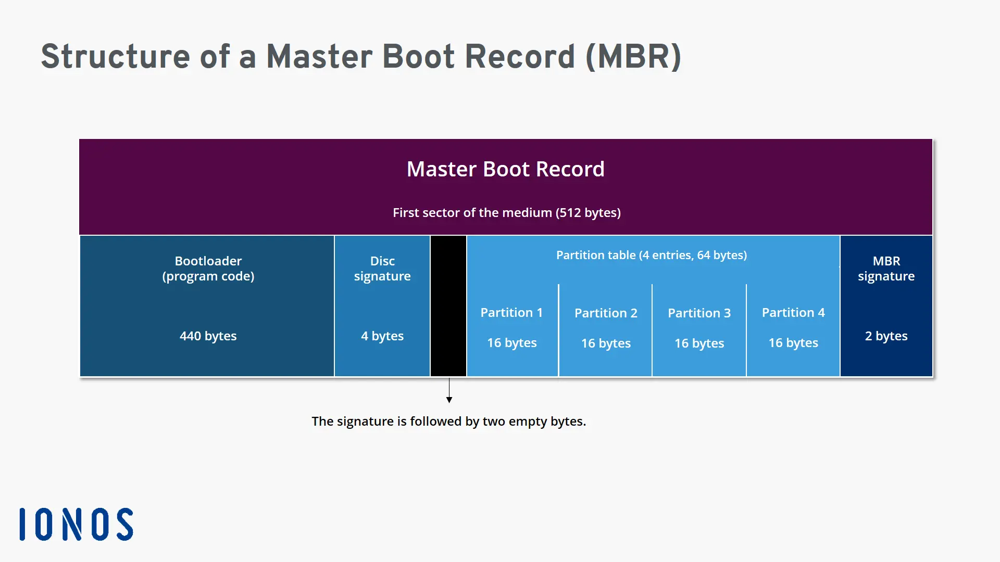
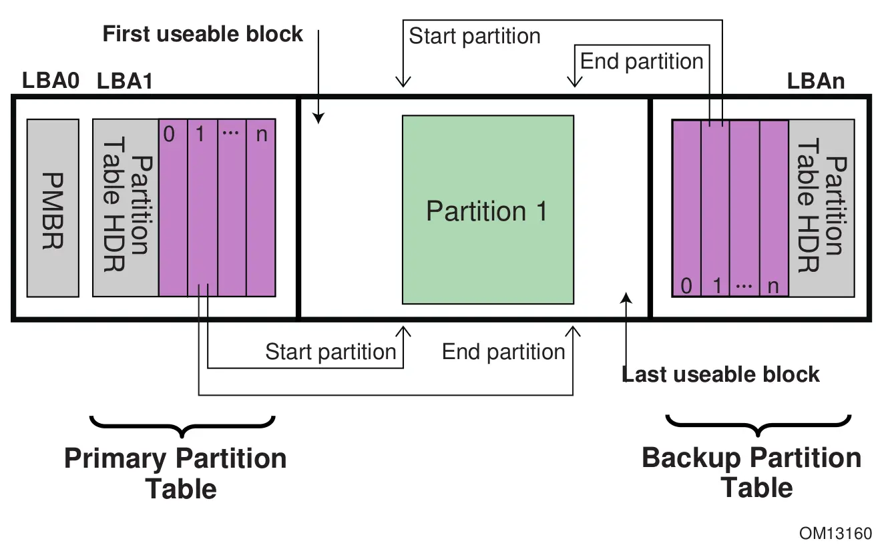
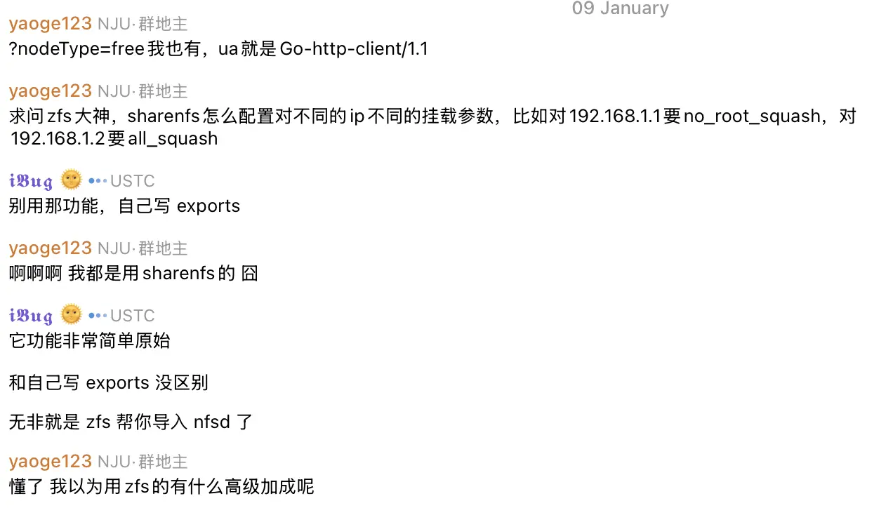

---
tags:
  - 不完善
---

# 文件系统

!!! abstract

    计算机系统中，除去计算，最重要的部分莫过于存储。本文介绍运维中常用的存储相关的知识和技能。对其背后的原理不会深入讨论，可以参考相关文献。

## 磁盘原理

本节解释文件系统下层的一些概念，包括分区、逻辑卷等。

### 磁盘结构

从 1986 年开始，磁盘的几何结构开始经历从 CHS（Cylinder-Head-Sector）到 LBA（Logical Block Addressing）的转变。曾几何时，磁盘的几何结构是由 CHS 三元组（柱面、磁头、扇区）描述的。但随着磁盘技术的发展，具体的物理结构逐渐被隐藏，转而采用逻辑上连续的 Block 来寻址。

### 分区表

磁盘可以分区，以便建立更多区域分别管理。对于操作系统来说，分区是逻辑上独立的设备。

磁盘上存储分区表以记录分区信息。操作系统在读取磁盘时先读取分区表，然后根据分区表的信息读取各个分区。分区表有两种格式：MBR 和 GPT。

#### MBR

!!! quote

    - [Master boot record - Wikipedia](https://en.wikipedia.org/wiki/Master_boot_record)

**主引导记录（Master Boot Record，MBR）**包含磁盘分区信息，以及一段用于引导操作系统的代码。因此，在谈论分区表或引导程序时都可能提及 MBR。

MBR 出现较早。它由磁盘上第一个扇区的 512 字节组成。这样的限制导致 MBR 仅能管理 2TB 以下的磁盘，只支持 4 个分区。MBR 逐渐被 GPT 取代。

<figure markdown="span">
    <center>
    
    </center>
    <figcaption>MBR 分区表结构<br /><small>
    [MBR (Master Boot Record) explained - IONOS CA](https://www.ionos.ca/digitalguide/server/configuration/what-is-mbr/)
    </small>
    </figcaption>
</figure>

#### GPT

!!! quote

    - [GUID Partition Table - Wikipedia](https://en.wikipedia.org/wiki/GUID_Partition_Table)

**GUID 分区表（GUID Partition Table，GPT）**是 UEFI 标准的一部分。GPT 采用 64 位的 LBA（Logical Block Addressing）来寻址，因此支持更大的磁盘。GPT 兼容 MBR：

- LBA 0 为 MBR
- 接下来是 GPT 头
- 磁盘末尾是备份的 GPT 头

GPT 分区表的每个表项为 128 字节，标准规定至少 16,384 字节用于表项数组，即至少支持 128 个分区。在扇区大小为 512 字节的情况下，GPT 分区表占用至少 32 个扇区，故第一个可用的 LBA 为 34。

<figure markdown="span">
    <center>
    
    </center>
    <figcaption>GPT 分区表结构<br /><small>
    [GUID Partition Table information - Thomas-Krenn-Wiki-en](https://www.thomas-krenn.com/en/wiki/GUID_Partition_Table_information)
    </small>
    </figcaption>
</figure>

GPT 表项包含如下内容：

- 两种 GUID：分区类型 GUID 和唯一分区 GUID。分区类型 GUID 用于标识分区类型，唯一分区 GUID 用于标识分区。
- 分区的起始和结束 LBA。
- 分区属性：如只读、隐藏等。有些属性通用，有些属性对特定文件系统、操作系统有效。
- 分区名称。

要使用 UEFI，GPT 磁盘中至少需要一个 EFI 系统分区（EFI System Partition，ESP）。UEFI 可以识别它并读取器中的 FAT 文件系统，在其中寻找引导文件。

!!! note

    与 Legacy + MBR 启动方式下每个系统需要具有一个独立的 /boot 分区不同，在 UEFI + GPT 启动方式下，一个磁盘上所有系统共享 ESP。

### 逻辑卷

!!! quote

    - [Enterprise Linux 實戰講座 Logical Volume Manager (一) - 鸟哥的首页](https://linux.vbird.org/somepaper/20050321-LVM-1.pdf)

目前我们没有使用该功能，略。

## 磁盘实践

### [`fdisk`](https://git.kernel.org/pub/scm/utils/util-linux/util-linux.git/about/)

`fdisk` 是 `util-linux` 的一部分，用于磁盘分区。该命令后接一个磁盘设备文件进入交互模式：

```shell
$ sudo fdisk /dev/sda
Changes will remain in memory only, until you decide to write them.
Be careful before using the write command.

Command (m for help):
```

在交互模式下按照指引进行操作。操作会在内存中保存，直到使用 `w` 写入。

## 文件系统原理

### ZFS

!!! quote

    - [ZFS 分層架構設計 - Farseerfc 的小窩](https://farseerfc.me/zfs-layered-architecture-design.html)：关于 ZFS 原理的全面的索引，给出了非常多的参考资料和视频链接。
    - [Oracle ZFS](https://docs.oracle.com/en/operating-systems/solaris/oracle-solaris/11.4/manage-zfs/index.html)
    - [OpenZFS](https://openzfs.github.io/openzfs-docs/Getting%20Started/index.html)

- **使用情况**：目前我们主要在**存储池**使用 ZFS。ZFS 适用于磁盘阵列和大容量存储，提供了强大的数据保护能力和高级管理功能。
- **历史**：ZFS 由 Sun 公司开发，随着 OpenSolaris 开源。当 Oracle 收购 Sun 后，ZFS 转为闭源。ZFS 的开源分支从 OpenSolaris 派生而来，现由 OpenZFS 维护。
- **发展情况**：ZFS 现有两种实现，一种是 OpenZFS（大多数人使用的），一种是向 Oracle 公司购买存储服务，这两种实现的大部分用法一致，但有一些细微不同（比如属性设置）。Oracle 维护的 ZFS 文档很适合入门，OpenZFS 的文档阅读难度较高。可以按照 Oracle 的文档来学习，但遇到不用的用法时应当查 OpenZFS 文档。

自行阅读相关文档，了解 zpool、dataset、scrub 和 snapshot 的概念。

- 查询

```bash
zpool list/status
zfs list

```

- 创建和删除

```bash
zpool create <zpool name> <raid type> <disks...>
zfs create -o mountpoint=/data ocean/data
```

The recommended way is to choose something from /dev/disk/by-id/ Some of these may include a UUID and others, the device serial number and (for partitions) the partition number.

### 压缩和去重

TODO

### 快照

!!! quote

    - [Overview of ZFS Snapshots - Oracle](https://docs.oracle.com/cd/E19253-01/819-5461/gbciq/index.html)

ZFS 中的快照是文件系统的**只读副本**。

要创建快照，使用 `zfs snapshot` 命令，参数为 `ZFS 数据集名@快照名`。使用 `-r` 选项可以递归创建快照。

```bash
zfs snapshot ocean/data@snap1
zfs snapshot -r ocean/data@snap2
```

列出快照和回滚操作：

```bash
zfs list -t snapshot
zfs rollback ocean/data@snap1
```

可以通过 ZFS 数据集下的 `.zfs/snapshot` 目录访问快照：

```bash
$ ls /ocean/data/.zfs/snapshot
snap1 snap2
```

!!! example

    目前集群的家目录设置了每日快照。如果误删文件，可以到 `storage` 上进入 `/home/.zfs/snapshot` 目录找回。

#### ZFS 与 NFS

!!! info "关于 `sharenfs`"

    

    镜像站联盟群里的讨论说不建议使用 `sharenfs`，功能比 `exports` 弱。

通常 ZFS 用如下命令设置 NFS 服务：

```bash
zfs get -r sharenfs
zfs set xattr=sa dnodesize=auto ocean/data
zfs set sharenfs="rw=172.25.0.0/16,no_root_squash,no_all_squash,nohide" ocean/data
showmount -e 127.0.0.1
```

- 第二行设置 ZFS 参数 `xattr=sa` 和 `dnodesize=auto`。前者将扩展属性存储在 inode 而不是隐藏的子文件夹中，避免多次 I/O 操作；后者根据文件系统中的元数据或扩展属性多少自动调整 dnode 大小，也能够减少 I/O 操作。设置这两个属性可以提高 ZFS 的 NFS 性能表现。
- 第三行设置 NFS 参数 `no_root_squash`、`no_all_squash` 确保用户权限正确。

在新系统上初次设置 ZFS 的 `sharenfs` 时可能遇到错误：

```text
cannot share 'ocean: system error': NFS share creation failed
```

大概率是缺少 NFS server 工具。参考 [Unintuitive error message setting sharenfs=on · Issue #4534 · openzfs/zfs](https://github.com/openzfs/zfs/issues/4534)。

!!! bug "一些已知的问题"

    当客户端为 NFSv3 时，服务端需要设置 `nohide`，否则子 dataset 不会显示。v4 不需要显式设置，不知道是 feature 还是 bug。

### NFS

!!! quote

    - [NFS best practice and implementation guide - NetAPP](https://www.netapp.com/media/10720-tr-4067.pdf)

#### NFS 发展情况

!!! quote

    - [Advances in NFS – NFSv4.1 and pNFS - SNIA](https://www.snia.org/sites/default/files/ESF/Part2-Advances%20in%20NFS%20%E2%80%93%20NFSv4.1%20and%20pNFS%5B1%5D.pdf)：介绍了 NFSv4、v4.1、v4.2 的新特性。
    - (2017)[Linux Support of NFS v4.1 and v4.2 - Linux Foundation](https://events.static.linuxfound.org/sites/events/files/slides/AllMar18_0.pdf)：介绍了 Linux 对 NFSv4.1 和 v4.2 的支持情况。

| 版本 | 时间 | RFC |
| --- | --- | --- |
| NFSv2 | 1983 | [RFC 1094 - NFS: Network File System Protocol Specification](https://datatracker.ietf.org/doc/rfc1094/) |
| NFSv3 | 1995 | [RFC 1813 - NFS Version 3 Protocol Specification](https://datatracker.ietf.org/doc/rfc1813/) |
| NFSv4 | 2003 | [RFC 3530 - Network File System (NFS) version 4 Protocol](https://datatracker.ietf.org/doc/rfc3530/) |
| NFSv4.1 | 2010 | [RFC 5661 - Network File System (NFS) Version 4 Minor Version 1 Protocol](https://datatracker.ietf.org/doc/rfc5661/) |
| NFSv4.2 | 2016 | [RFC 7862 - Network File System (NFS) Version 4 Minor Version 2 Protocol](https://datatracker.ietf.org/doc/rfc7862/) |

NFSv4 相比 NFSv3 有显著的不同，NFSv4.1 与 NFSv4 又有显著的不同。如 NFSv4.1 摘要中所述，两者被认为是各自独立的协议：

> NFS version 4 minor version 1 has no dependencies on NFS version 4 minor version 0, and it is considered a separate protocol.

也正是因为上述原因，NFSv4.1 是一份完整的规范，而不是 NFSv4 的补充。阅读 NFSv4.1 时不需要阅读 NFSv4。而 NFSv4.2 则是 NFSv4.1 的补充，阅读时需要参考 NFSv4.1。

!!! tip "最新的标准总是会被迅速实现和普及，如果想学习标准也最好从最新版本开始。"

对于 Linux，[linux-nfs](https://linux-nfs.org/wiki/index.php/Main_Page) 负责 NFS 的开发和维护。NFSv4.2 已经在 Linux 得到支持。

#### NFSv4

!!! quote

    - [(2015)RFC 7530 Network File System (NFS) Version 4 Protocol - IETF Datatracker](https://datatracker.ietf.org/doc/rfc7530/)
    - [(2023)NFSv3 and NFSv4: What's the difference? - NetAPP](https://community.netapp.com/t5/Tech-ONTAP-Blogs/NFSv3-and-NFSv4-What-s-the-difference/ba-p/441316)

NFS v4 的 RFC 在 2003 年发布了一版（RFC 3530），在 2015 年又发布了一版（RFC 7530），这两版的实现还有一些不同，可能需要注意。比如：`nfs4_setfacl` 就仍然采用 RFC 3530。

#### Windows Server 上的 NFS

!!! quote

    - [Network File System overview - Learn Microsoft](https://learn.microsoft.com/en-us/windows-server/storage/nfs/nfs-overview#windows-and-windows-server-versions)

Windows Server 目前仅能作为 NFS v4.1 服务器，客户端只支持到 NFS v3。

#### NFSv4 over RDMA

[NFS over IPoIB / NFS over RDMA - CMU](https://www.cs.cmu.edu/~wtantisi/files/nfs-pdl08-poster.pdf) 对 NFS over RDMA 做了很好的对比研究。目前，我们在使用 NFS over RDMA 时遇到了一些问题，还没有解决：

- 我们的集群从 NFS Root 启动，通过 NFSv4 over Ethernet 挂载了根文件系统。
- 启动后，试图使用 NFSv4 over RDMA 从相同服务器上挂载其他文件系统，但发现流量并没有走 RDMA，全走以太网了。

下面是我们的一些尝试和猜测：

- 可能是 NFSv4 Session 机制的原因。目前没有弄清楚具体机制，但 NFSv4 Session 是能提供多路复用的，应该会更快才对。
- 使用 NFSv3 可以挂载 RDMA。但是我们看到 NFSv3 走的是 IPoIB，RDMA 表现会比 IPoIB 好一些。而且 NFSv4 带来了很多重要改变，我们更偏向于使用 NFSv4。

我们需要对 Linux NFS 的实现细节有更深入的了解，尝试解决通过多个路径从同一个 NFS 服务器挂载文件系统的问题。

此外，或许可以考虑 FlexBoot，直接在启动时将根文件系统挂载到 IB 上。但是 FlexBoot 毕竟是 NVIDIA 闭源标准，必须有 IB 卡才能使用。因此我们放弃了考虑该种办法。

<https://www.kernel.org/doc/Documentation/filesystems/nfs/nfs-rdma.txt>

#### NFS 问题记录

- [What are .nfsXXXX files and how do I delete them? - NetApp Knowledge Base](https://kb.netapp.com/on-prem/ontap/da/NAS/NAS-KBs/What_are_nfsXXXX_files_and_how_do_I_delete_them)

报错例：

```bash
$ rm -rf oscar-corpus
rm: cannot remove 'oscar-corpus/oscar/train/.nfs000000000000395800000018': Device or resource busy
```

原因：Files with a naming convention like `.nfsXXXX` are created by NFS clients when **a file that is currently opened on a client is deleted by that client**. The client renames the file to `.nfsXXXX` which discourages other clients/processes from utilizing the file. **The client that does the rename should delete the file once it's been closed by the client process.** This delete might not occur if the client is dsiconnected, rebooted,  or the process that would issue the delete is terminated.

- NFS 丢失文件扩展属性

报错例：

```bash
$ ping baidu.com
ping: socktype: SOCK_RAW
ping: socket: Operation not permitted
ping: => missing cap_net_raw+p capability or setuid?
$ sudo getcap /usr/bin/ping

```

原因：

- NFS 4.2 开始支持 xattr（参考 [NFSv4.2 Extended attributes](https://www.netapp.com/pdf.html?item=/media/84595-tr-4962.pdf&v=20234241312)）。
- Linux 5.9 起已经实现了 NFS Server 的 xattr 支持（参考 [User Xattr Support Finally Landing For NFS In Linux 5.9 - Phoronix](https://www.phoronix.com/news/Linux-5.9-NFS-Server-User-Xattr)）。

### OverlayFS

!!! quote

    - [OverlayFS](https://docs.kernel.org/filesystems/overlayfs.html)

- 上下层同名目录合并
- 上层文件覆盖下层
- 上层可写
- 下层只读，写时复制到上层

OverlayFS 运行时，不应当对下层文件系统进行操作，否则会导致不可预知的结果。因此，在当前 OverlayNFSRoot 的集群上，如果需要对根文件系统进行操作，应当先关闭所有启动到 OverlayFS 的节点。

## 文件系统实践

### [`fsck`](https://github.com/util-linux/util-linux/blob/master/disk-utils/fsck.cv)

`fsck` 是 `util-linux` 的一部分，用于检查和修复文件系统。
