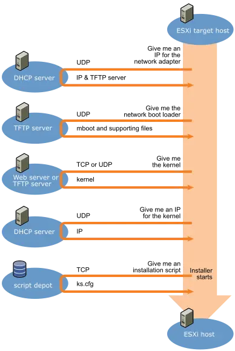
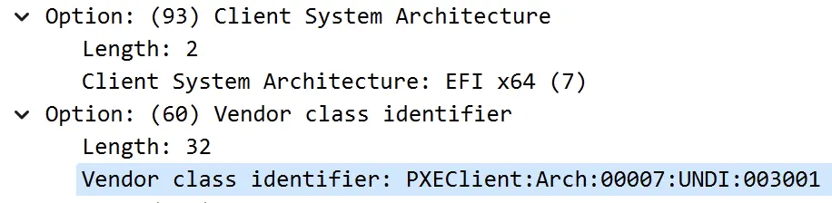

---
tags:
  - 不完善
---

# 引导方式：PXE

Preboot eXecution Environment

!!! abstract

    本文讲解以下内容：

    - PXE 如何从 UEFI 中启动，加载 NBP 进入引导过程
    - 如何配置 DHCP 服务器等 PXE 环境
    - 介绍我们基于 iPXE 构建的 AutoPXE 项目。

!!! quote

    - [GitHub: PXE](https://github.com/tianocore/tianocore.github.io/wiki/PXE)
    - [Preboot eXecution Environment (PXE) Specification Version 2.1](https://dimitrije.website/files/pxespec.pdf)
    - [RFC4578: Dynamic Host Configuration Protocol (DHCP) Options for the Intel Preboot eXecution Environment (PXE)](https://tools.ietf.org/html/rfc4578)

## PXE 原理

简单来说，PXE 标准规定了网络启动的一系列协议和流程，确保客户端能够从网络启动并获取到正确的软件镜像和配置参数。

- 客户端需要支持 PXE，大体上有硬件中的固件和启动镜像两种方式：
    - 现代网卡上都有 PXE 固件，比如：Intel 网卡的 Intel Boot Agent、PVE 虚拟机中的 iPXE、InfiniBand 的 FlexBoot 等。
    - iPXE、pxelinux 等都提供了 PXE 启动镜像。可以在本地从常规 BIOS 或 UEFI 启动到这些镜像，然后再启动 PXE 环境。
- 网络中需要有 DHCP 服务器和 TFTP 服务器，分别提供 IP 地址和启动镜像。DHCP 服务器需要支持 PXE 扩展，比如提供 PXEClient 和 client-arch 两个字段。

### Option ROM

!!! quote

    - [Preboot eXecution Environment (PXE) Specification Version 2.1](https://dimitrije.website/files/pxespec.pdf) 第四章
    - [UEFI 开发探索 36 – UEFI Option ROM](https://blog.csdn.net/luobing4365/article/details/102597109)
    - [UEFI PXE Boot Performance Analysis - Intel](https://www.intel.com/content/dam/develop/external/us/en/documents/intel-uefi-pxe-boot-performance-analysis-820238.pdf)

如果在 BIOS 中关闭网卡的 Option ROM，你会发现 PXE 从启动列表中消失。PXE Spec 第四章介绍了 Option ROM 和 Initial Program Load（IPL）的概念和历史：

- **Option ROM**：
    - 我们知道 BIOS 存储在主板的 ROM 中，PCIe 等外围设备也有自己的 ROM，称为 Option ROM。使用 Option ROM，厂商可以扩展 BIOS 的功能，比如添加新设备支持、提供新的启动方式等。
    - BIOS 在 POST 期间扫描系统扩展总线上的 Option ROM，将其复制到 Shadow RAM 中，然后执行初始化代码。
- **IPL（Initial Program Load）**：
    - IPL 是 BIOS 启动过程中的设备加载机制。
    - IPL 表（IPL Table）会列出所有可能的启动设备，优先级由用户在 BIOS 设置中定义。
    - Option ROM 扫描过程中识别的设备可以扩展 IPL 表，添加特殊的启动功能（例如 PXE 网络启动）。

### PXE 启动过程

PXE 的流程大致如下：

<figure markdown="span">
{ width=70% align=center }
<figcaption>PXE 流程总览
<br />
<a href="https://docs.vmware.com/en/VMware-vSphere/6.5/com.vmware.vsphere.install.doc/GUID-44535B01-38CF-4E6D-862A-95EF5ACA3F03.html" target="_blank">Overview of PXE Boot Installation Process - VMware Docs</a>
</figcaption>
</figure>

- PXE 客户端发送 DHCP Discover 请求，从 DHCP Offer 中获得 TFTP 服务器的地址和文件名。
- PXE 客户端从 TFTP 服务器加载对应的 boot loader（在 PXE 这边称为网络启动程序 NBP，Network Boot Program）。我们使用的 boot loader 是 iPXE。
- boot loader 使用 TFTP 或 HTTP 等方式拿取操作系统内核等文件，然后启动操作系统。
- 操作系统启动时，可能又会请求一次 DHCP，以获取 IP 地址和其他配置。

## 配置 DHCP 服务器

!!! quote

    - [https://www.iana.org/assignments/bootp-dhcp-parameters/bootp-dhcp-parameters.xhtml](https://www.iana.org/assignments/bootp-dhcp-parameters/bootp-dhcp-parameters.xhtml)
    - [https://support.huawei.com/enterprise/en/doc/EDOC1100213116/766bc0e9/example-for-configuring-a-dhcp-server-to-assign-pxe-startup-parameters-to-a-client](https://support.huawei.com/enterprise/en/doc/EDOC1100213116/766bc0e9/example-for-configuring-a-dhcp-server-to-assign-pxe-startup-parameters-to-a-client)
    - [https://github.com/WillChamness/Dnsmasq-PXE](https://github.com/WillChamness/Dnsmasq-PXE)

### 实验

Legacy 和 UEFI 启动需要不同的 pxelinux 文件，因此需要根据 DHCP Discover 中的字段识别客户端是哪种启动方式。

让我们抓包分析一下不同模式启动时 PXE 发送的 DHCP Discover 附带的字段：



| PXE 设备 | DHCP 60 Vendor Specific (ascii) | DHCP 93 client-arch (number) |
| --- | --- | --- |
| PVE 上的 iPXE Legacy | PXEClient | 00 00 |
| PVE 上的 UEFI PXE | PXEClient:Arch:00007:UNDI:003001 | 00 07 |
| Intel 网卡上的 Boot Agent |  |  |

!!! warning "RFC 4578 对 DHCP Option 93 的定义有错，请查看 [StackExchange: What is the PXE Client System Architecture Type "BC EFI (7)" from RFC 4578?](https://serverfault.com/questions/349693/what-is-the-pxe-client-system-architecture-type-bc-efi-7-from-rfc-4578?newreg=e030cbb6e1054ba1bfcc82bf1230d738)"

    There’s a conflict between the architecture types defined in RFC4578 DHCP PXE Options and the IANA registered Processor Architecture Types: the latter notes that x64 UEFI is type 00:07 which seems to be the value used in practice (ref. [syslinux](https://www.syslinux.org/archives/2014-October/022684.html)).

    There's an [Errata ID 4624](https://www.rfc-editor.org/errata_search.php?rfc=4578) filed on the RFC. It states that 7 should be EFI x86-64 and 9 should be EFI BC.

    Therefore, the IANA registry (which is more extensive and should be the authoritative source for this information post RFC publication as it is maintained and updated where the RFC is not) is correct and the original RFC is wrong.

虽然 Intel 的 PXE 规范中描述 DHCP Option 60 应当为 `PXEClient:Arch:xxxxx:UNDI:yyyzzz` 的格式，但我们看到 iPXE 没有遵守，故不能依赖 Option 60 来区分。在实践中，我们发现 Option 93 `client-arch` 字段更加可靠，因此选用它来区分 Legacy 和 UEFI 启动。

### OpenWRT 上的 dnsmasq

!!! quote

    - [OpenWRT Wiki: DHCP and DNS examples](https://openwrt.org/docs/guide-user/base-system/dhcp_configuration)
    - [OpenWRT Forum: Configuring DHCP server options selectively based on vendor class?](https://forum.openwrt.org/t/configuring-dhcp-server-options-selectively-based-on-vendor-class/23402/7)

不同 DHCP 服务器配置方式不同，现在我们使用的是 OpenWRT 上的 dnsmasq，它使用 OpenWRT UCI 配置文件 `/etc/config/dhcp` ，和一般 Linux 发行版上的 `dnsmasq.conf` 语法不一样。下面是匹配规则在 `dnsmasq.conf` 和 OpenWRT UCI 的对比：

!!! tip "什么是 networkid"

    *dnsmasq* offers to group DHCP options and their values by a tag, internally named `networkid`, which is an alphanumeric identifier, and sending options only to hosts which have been tagged with that `networkid`.

```text title="dnsmasq.conf 格式"
# 这边没有 serveraddress 是因为这个示例文件的 tftp 和 dhcp 在同一台服务器，默认发送本机
dhcp-match=set:efi64,option:client-arch,7
dhcp-boot=tag:efi64,efi64/syslinux.efi
```

```text title="OpenWRT UCI 格式"
config match`
        option networkid 'efi64'
        option match '93,0007'
config boot
        option networkid 'efi64'
        option filename 'efi64/syslinux.efi'
        option servername 'Root'
        option serveraddress '172.25.2.10'
```

它们描述的是同一件事情：

1. 如果遇到 DHCP Discover 中的 client-arch（93）为 7，那么打上 `efi64` 的 tag（设置 networkid 为 efi64）。
1. 为带有 `efi64` tag（属于 efi64 这个 networkid）的客户端发送指定的 boot 信息（就是 saddr、sname 和 filename）。

于是我们可以在 OpenWRT 上配置如下：

```text title="/etc/config/dhcp"
config match
        option networkid 'bios'
        option match '93,0000'

config boot
        option networkid 'bios'
        option filename 'bios/pxelinux.0'
        option serveraddress '172.25.2.10'
        option servername 'Root'

config match
        option networkid 'efi64'
        option match '93,0007'

config boot
        option networkid 'efi64'
        option filename 'efi64/syslinux.efi'
        option servername 'Root'
        option serveraddress '172.25.2.10'
```

## iPXE

曾经我们使用 [pxelinux](https://wiki.syslinux.org/wiki/index.php?title=PXELINUX) 作为网络启动程序，但它太过老旧，且 [UEFI 启动时有传输速度指数级下降的问题](https://www.reddit.com/r/sysadmin/comments/lwjjpt/pxe_tftp_efi_transfer_rates_super_slow_please_help/)。因此我们转向了 [iPXE](https://ipxe.org/)。

iPXE 语法见 [scripting - iPXE](https://ipxe.org/scripting)。

## AutoPXE

基于 iPXE Script，我们构建了 [:simple-github: mrhaoxx/AutoPXE](https://github.com/mrhaoxx/AutoPXE/tree/main)用于自动为各个服务器提供启动配置。AutoPXE 能够：

- 自动在 `/pxe/rootfs` 下寻找构建好的根文件系统，识别发行版和内核版本等。
- 为指定的 MAC 地址提供对应的启动配置。

### AutoPXE 实现

- 利用 Embedded script，我们在构建 iPXE 时加入下面的脚本，让客户端根据 MAC 地址向服务器请求对应的配置文件：

    ```text title="embed.ipxe"
    #!ipxe

    prompt --key 0x02 --timeout 3000 Press Ctrl-B for the iPXE command line... && shell ||

    dhcp
    chain autopxe-${mac:hexraw}
    ```

- 服务端根据客户端请求的文件名，自动即时生成对应的配置文件：

    ```go title="pxe/auto.go"
    func (s *Server) Handle(ctx *tftp.Ctx) tftp.Ret {
        if strings.HasPrefix(ctx.Path, "autopxe-") {
            script := ipxe.IPXEScript{}
            script.Append("#!ipxe\n")

            oss := ScanRootfs(s.RootfsPath)
            menu := ipxe.Menu{
                Title:   "AutoPXE Boot Main Menu " + ctx.MacAddress + " " + ctx.IP + " ${hostname}",
                Id:      "start",
                Timeout: "10000",
            }
        script.Append(`:shell

    echo Type 'exit' to get the back to the menu
    shell
    goto start
    ...
    `)
    ```

### AutoPXE 使用

AutoPXE 打包为 Docker 镜像，有两个目录需要挂载到对应位置：

- 根文件系统
- 配置文件 `/config.yaml`

AutoPXE 使用下面的格式标识每个发行版和配置组合：

```text
<发行版>/<版本>/<内核版本>/<启动选项>
```

比如 `debian/stable/latest/overlayfs` 表示：Debian 的 stable 版本，最新的内核版本，使用 overlayfs 启动。

配置文件 `config.yaml` 简单示例如下：

```yaml title="config.yaml"
version: 1

DefaultDistro: debian/stable/latest/overlayfs

RootfsPath: /pxe/rootfs/

Env:
  nfs-server: 172.25.2.11


CmdlineTemplates:
  overlayfs: root=/dev/nfs nfsroot=${nfs-server}:${rootfs-path} ip=dhcp rootovl
  nfsrw: root=/dev/nfs nfsroot=${nfs-server}:${rootfs-path} ip=dhcp rw

HostDefaults:
  bc2411b01ade: debian/bookworm/latest/overlayfs
```

- `DefaultDistro`：默认启动的发行版和配置组合。
- `RootfsPath`：根文件系统的路径。
- `Env`：`ipxe` 中的变量，目前只有 `nfs-server`。
- `CmdlineTemplates`：内核启动选项模板。
- `HostDefaults`：默认的 MAC 地址和配置组合。
