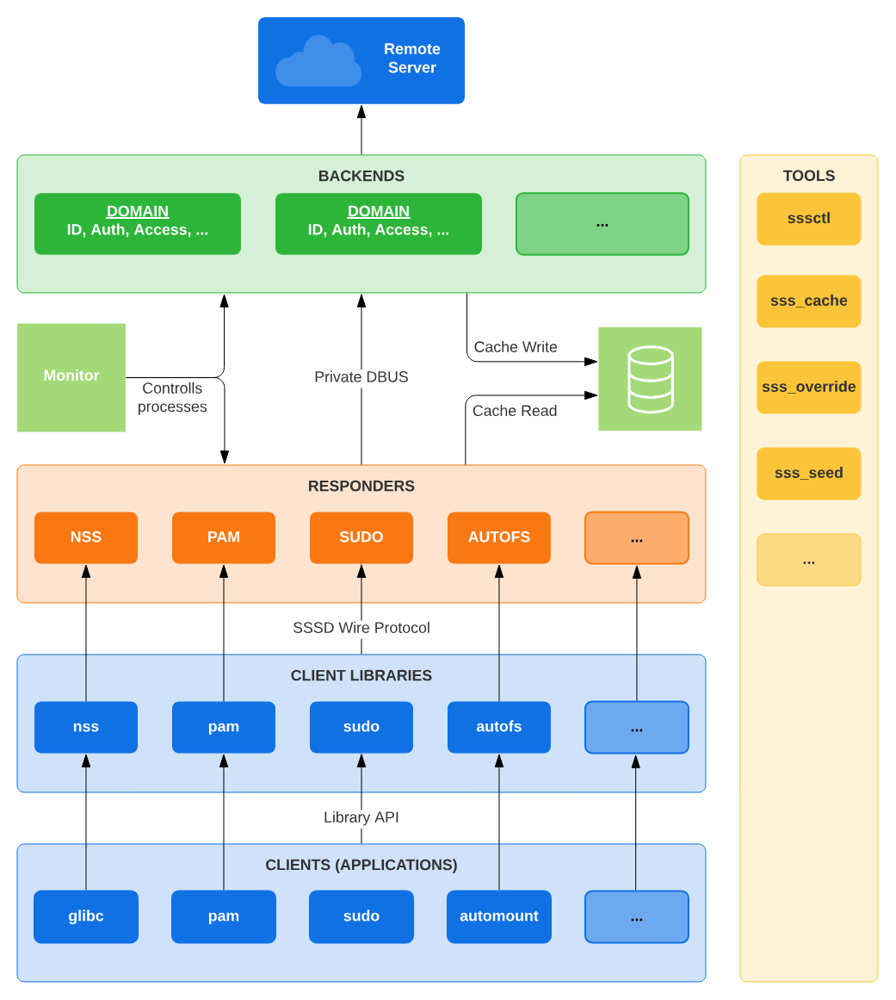

---
tags:
  - help
---

# 身份认证与授权：NSS、PAM 和 SSSD

!!! todo

    - [ ] 补充 PAM、NSS 的介绍。

## Linux 身份认证与授权原理

!!! quote

    - [How PAM NSS SSD work together on Linux OS - Cloudera Community9](https://community.cloudera.com/t5/Community-Articles/How-PAM-NSS-SSD-work-together-on-Linux-OS/ta-p/247879)
    - [ldap - Understand PAM and NSS - Server Fault](https://serverfault.com/questions/538383/understand-pam-and-nss)

首先我们要明确一些基本概念。如果不熟悉这些概念，在阅读文档时可能会感到困惑。

- **认证（Authentication）**：验证用户的身份。通常是通过用户名和密码来验证用户的身份。
- **授权（Authorization）**：确定用户是否有权限访问某个资源。通常是通过用户组、角色等来确定用户的权限。

集群目前使用 LDAP 数据库存储用户信息。LDAP 作为数据库，本身并不提供认证和授权服务。为了实现认证和授权，我们需要使用一些工具和服务：

- **NSS（Name Service Switch，名称解析服务）**：管理系统去哪里**查找用户信息**，比如是在本地查找还是在 LDAP 查找。
- **PAM（Pluggable Authentication Modules，可插拔认证模块）**：管理系统**如何认证用户**。PAM 在登录、SSH、FTP、`su` 等服务的认证过程中起作用。

当然，上面两个模块可以直接与 LDAP 通信（使用 `pam_ldap` 和 `nss_ldap`），但事情变得越来越复杂。于是产生了一个新的模块，作为 NSS 和 PAM 的后端：

- **SSSD（System Security Services Daemon，系统安全服务守护程序）**：提供了一个简单的接口，用于连接到不同的身份源（比如 LDAP），并提供**本地缓存**，以提高性能。

于是这套系统的整体架构如下图所示：

<figure markdown="span">
    <center>
    { width=60% }
    </center>
    <figcaption>
    SSSD 架构<br><small>[SSSD Architecture - sssd.io](https://sssd.io/docs/architecture.html)</small>
    </figcaption>
</figure>

> 参考链接中的关键要点：
>
> 1. PAM、NSS 和 SSSD 存在于本地 Linux 操作系统中作为客户端。
> 2. 任何对操作系统进行身份验证或授权的调用最终都会调用 PAM/NSS，最终到达 SSSD，并最终到达 LDAP。
> 3. SSSD 可以与 LDAP、KDC 集成。
> 4. 这三层对操作系统应用程序完全透明。
> 5. SSSD  在操作系统上本地维护一个缓存。
> 6. SSSD 会同时在外部源和本地查找用户 -> 密码、用户名 -> uid、uid -> 用户名、组名 -> gid 和 gid -> 组名等映射信息。
> 7. `getent passwd` 和 `getent groups` 命令会显示其获取信息的来源。

## [SSSD](https://sssd.io/)

### SSSD 简介

!!! quote

    - [SSSD Architecture - sssd.io](https://sssd.io/docs/architecture.html)

SSSD 分为后端（Backend）和前端（Responder）两部分。

- 后端负责与身份源（比如 LDAP）通信。
    - 配置文件中的每个 `[domain/$name]` 都对应一个后端，运行在单独的 `sssd_be` 进程中。
- 前端负责处理来自 NSS 和 PAM 等的请求。
    - 每个前端运行在单独的进程中，如 `sssd_nss`、`sssd_pam` 等。

此外还有：

- 客户端库（Client Libraries），如 `libsss_sudo` 用于与 `sudo` 集成。
- 监视器（Monitor），运行为进程 `sssd`，负责监控前后端。
- 工具（Tools），如 `sssctl` 用于管理 SSSD，`sss_cache` 用于清理缓存。

### SSSD 配置与维护

!!! quote

    - [How to set up SSSD with LDAP - Ubuntu](https://ubuntu.com/server/docs/how-to-set-up-sssd-with-ldap)

在 Debian 上，需要安装下列软件包：

- [`sssd`](https://packages.debian.org/stable/sssd)：元包，依赖于 `sssd-common`、`sssd-ldap`，并进一步依赖于 `libnss-sss`、`libpam-sss`，从而提供完整的前后端支持。
- [`sssd-tools`](https://packages.debian.org/stable/sssd-tools)：包含 `sssctl` 和 `sss_cache` 等工具。
- [`libsss-sudo`](https://packages.debian.org/stable/libsss-sudo)：提供与 `sudo` 集成的客户端库。

SSSD 配置文件位于 `/etc/sssd/sssd.conf`，可查阅 `man` 手册了解详细配置。示例如下：

```text
[sssd]
domains = LDAP
services = nss, pam, sudo
config_file_version = 2

[nss]
filter_groups = root
filter_users = root

[pam]

[domain/LDAP]

id_provider = ldap
ldap_uri = ldaps://...
```

目前脚本在 [star-home/deploy-ldap](https://gitlab.star-home.top:4430/star/deploy-ldap/)。

## [NSS](https://www.linuxfromscratch.org/blfs/view/git/postlfs/nss.html)

!!! quote

    - [nsswitch.conf(5) - Linux manual page](https://man7.org/linux/man-pages/man5/nsswitch.conf.5.html)
