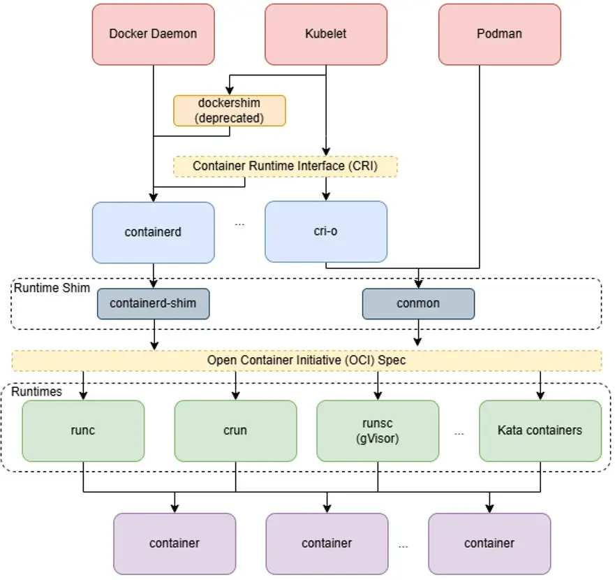
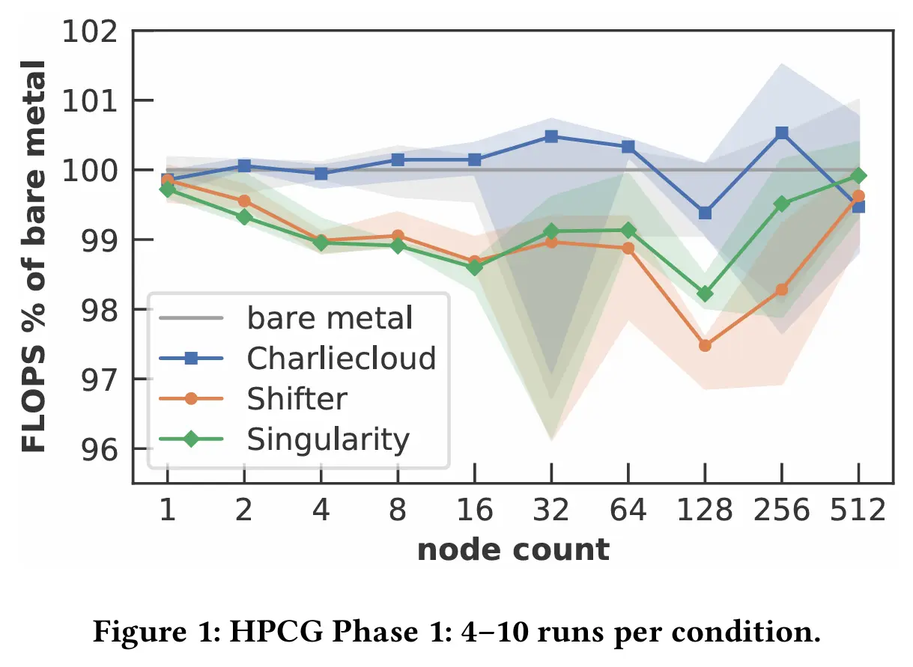
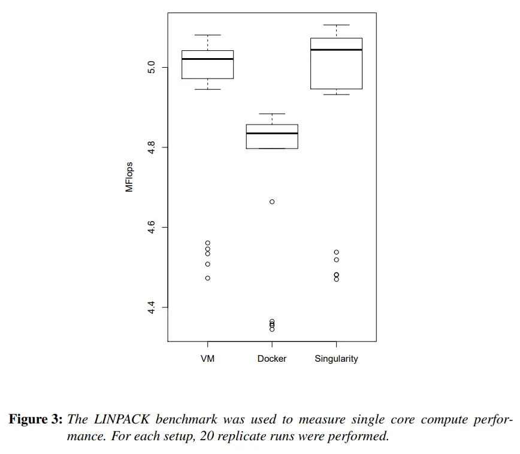
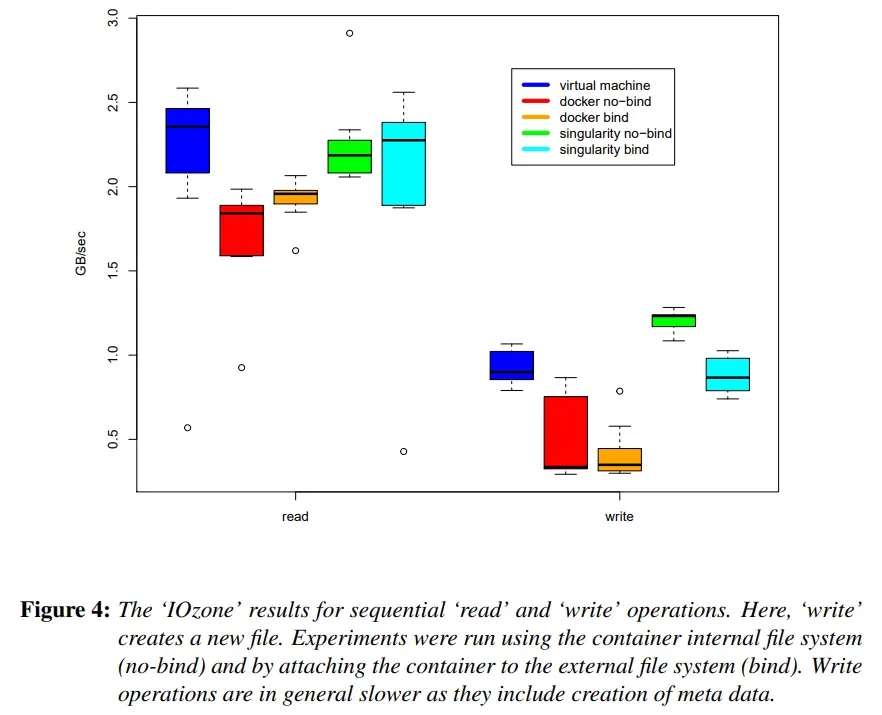
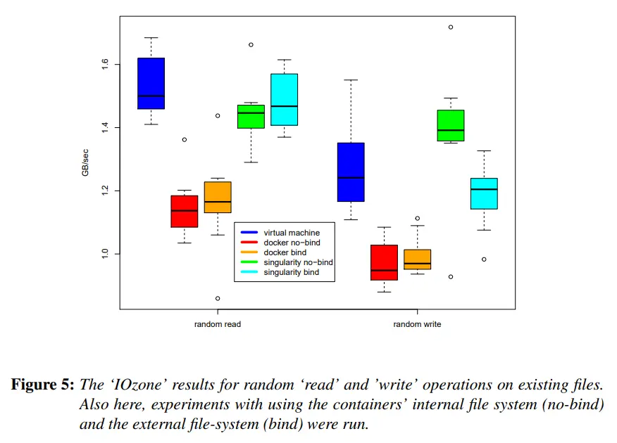
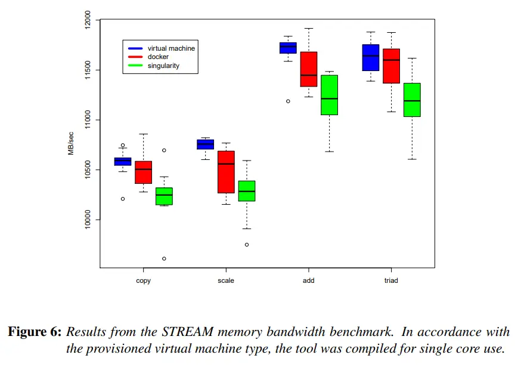
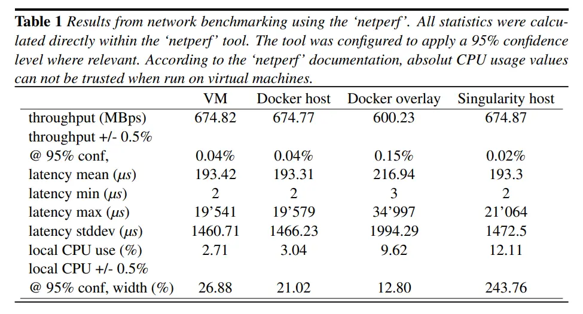

---
tags:
  - 不完善
---

# 容器

!!! todo

    - [ ] 容器实践需要更加细致的指导。
    - [ ] Podman 非特权挂载文件系统问题。

总的来说，容器方案的选择如下：

| 方案 | 描述 |
| --- | --- |
| Docker | 主流 |
| Podman | Docker 的 rootless 替代品 |
| Singularity | Docker 在 HPC 中的替代品，一般认为 Singularity 运行 MPI 等 HPC 应用性能比 Docker/Podman 好 |
| Apptainer | Singularity 的后继者，就目前使用来说和 Singularity 几乎没啥不同 |

Docker 和 Podman 都遵守 OCI（Open Container Image）格式，而 Singularity 和 Apptainer 能够将 OCI 格式转换为自己的 SIF 格式。

> TLDR; develop locally with docker; run docker images on HPC systems using podman/singularity; if performance is a concern, use singularity.

## 容器技术概述

!!! info

    - [:simple-medium: The Containerization Tech Stack](https://medium.com/@noah_h/the-containerization-tech-stack-3ac4390d47bf)

<figure markdown="span">
    <center>
    
    </center>
    <figcaption>
    容器技术栈
    <br /><small>
    [The Containerization Tech Stack](https://medium.com/@noah_h/the-containerization-tech-stack-3ac4390d47bf)
    </small>
    </figcaption>
</figure>

- 运行时：借助 cgroup 和 namespace 等内核技术实现容器。
- OCI：定义了容器**运行时和镜像**的标准。

### Docker

!!! quote

    - [Docker Docs](https://docs.docker.com/)

Docker 官方文档极其详尽且全面，此处不再赘述。检查你自己是否具备以下知识（不需要你记忆，只需要知道有这个东西并会查官方文档即可）并有过相关经验。如果没有，请寻找相关资料学习并实践。

- 什么是镜像和容器？
- [Docker 构建](https://docs.docker.com/build/)
    - 会写 [`Dockerfile`](https://docs.docker.com/reference/dockerfile/)
- [Docker 运行](https://docs.docker.com/reference/cli/docker/)
    - 会使用 `docker run` 命令运行容器、使用 `docker exec` 命令进入容器
    - 会使用 `docker ps`、`docker logs`、`docker inspect` 等命令查看容器状态
- [Docker Compose](https://docs.docker.com/compose/)
    - 会使用 [`docker compose`](https://docs.docker.com/compose/) 命令
    - 会写 [`compose.yml`](https://docs.docker.com/reference/compose-file/) 文件

作为运维，你还需要了解：

- [Docker 网络](https://docs.docker.com/engine/network/)
- [Docker 存储](https://docs.docker.com/engine/storage/)

一些常见问题记录如下：

!!! note "Docker Compose 运行自定义命令"

    - [Docker-Compose Entrypoint/Command - Stack Overflow](https://stackoverflow.com/questions/54160315/docker-compose-entrypoint-command)

    Docker 容器只会执行一条命令，该命令退出后容器也会退出。执行的命令由如下方式决定：

    - 如果容器未定义 entrypoint，那么执行 command。
    - 如果容器定义了 entrypoint，那么执行 entrypoint，将 command 作为 entrypoint 的参数。

    为容器提供 entrypoint 和 command 的方式如下：

    | 运行方式 | 定义 entrypoint | 定义 command |
    | --- | --- | --- |
    | `docker run` | `--entrypoint <entrypoint>` 选项 | 镜像名后的参数 |
    | Dockerfile | `ENTRYPOINT` 指令 | `CMD` 指令 |
    | Compose 文件 | `entrypoint:` | `command:` |

    !!! example

        使用下面的 Dockerfile 构建容器：

        ```dockerfile
        ENTRYPOINT ["echo"]
        ```

        使用下面的 compose.yml 文件运行容器：

        ```yaml
        services:
          test:
            build: .
        ```

        使用下面的命令运行容器，command 将被作为参数：

        ```bash
        $ docker compose run test hello world
        hello world
        ```

        而使用下面的命令可以进入 Shell：

        ```bash
        $ docker compose run --entrypoint bash test
        ```

### Podman

Docker 命令大部分兼容。常用命令助记：

```bash
# 拉取
podman search {name}
podman pull docker://{name}:{tag}
podman images
# 运行
podman run --name {container_name} -d -p {host_port}:{container_port} {name}:{tag}
# 查询
podman ps -a
podman inspect {contanier_name}
podman top {container_name/id}
podman logs <container_name/id>
# 保存
sudo podman container checkpoint <container_id>
sudo podman container restore <container_id>
# 删除
podman stop <container_id>
podman rm <container_id>
```

从 Docker 迁移到 Podman，特别是使用 `podman-compose` 时，有不少兼容性问题。目前我们所知的有：

- Docker compose 文件中不需要再指定 UID/GID，否则可能造成 Podman 内的文件系统权限问题。

## Rootless 容器

集群不会对普通用户开放 Root 权限，以维持系统安全和环境稳定。本文档提供一些 rootless 工具的建议，它们的性能一般不会与 root 版本有差异。

### Rootless 容器原理

#### 内核命名空间

#### 性能

[SC19 Poster](https://sc19.supercomputing.org/proceedings/tech_poster/poster_files/rpost227s2-file3.pdf) 给出了 HPCG 的结果：

<figure markdown="span">
    <center>
    { width=60% align=center }
    </center>
</figure>

[NVIDIA 官方](https://developer.nvidia.com/blog/docker-compatibility-singularity-hpc/)给出了 Singularity 在 GPU 上的表现：

<figure markdown="span">
    <center>
    { align=center }
    </center>
</figure>

[Umeå University](http://www.diva-portal.org/smash/get/diva2:1277794/FULLTEXT01.pdf) 给出了 Docker 和 Singularity 的比较：

<div class="grid cards" markdown>

- Linpack

    ---

    

- 顺序读写

    ---

    

- 随机读写

    ---

    

- 内存

    ---

    

- 网络

    ---

    

</div>

集群 A100 40G 上测试的结果（2023.02)：

- bare-metal 1.118e+04 Gflops
- docker 1.218e+04 Gflops
- singularity 1.223e+04 Gflops

#### 安全

Rootless 容器被广泛认为是安全的，因为它们不需要 root 权限，从而避免了逃逸提权的问题。

在 Arch Wiki 上有一个过时的安全提示，相关的讨论始于 2013 年：

> Rootless Podman relies on the unprivileged user namespace usage (`CONFIG_USER_NS_UNPRIVILEGED`) which has some serious security implications. Unprivileged user namespace usage (`CONFIG_USER_NS_UNPRIVILEGED`) is enabled by default in linux, linux-lts and linux-zen, which greatly increases the attack surface for local privilege escalation (see AppArmor's Wiki and FS#36969).

如今，各个发行版都有相应安全措施，可以认为 rootless 容器是安全的。比如，Debian 自 11 开始默认启用 AppArmor。AppArmor 通过默认配置文件限制非特权进程创建的用户命名空间内的任务，并具有较低的权限。如果不存在默认配置文件，AppArmor 将回退到拒绝未受限的非特权进程访问用户命名空间。详见 [:simple-gitlab: AppArmor / apparmor](https://gitlab.com/apparmor/apparmor/-/wikis/unprivileged_userns_restriction)。

[`--privileged` — Podman documentation](https://docs.podman.io/en/v4.6.1/markdown/options/privileged.html) 对当前 rootless 容器的安全性进行了说明：

> A privileged container turns off the security features that isolate the container from the host. Dropped Capabilities, limited devices, read-only mount points, Apparmor/SELinux separation, and Seccomp filters are all disabled.
>
> Rootless containers cannot have more privileges than the account that launched them.

## 专为 HPC 优化的容器：Apptainer/Singularity

常用命令助记：

```bash
apptainer --debug run docker://alpine
apptainer pull docker://nvcr.io/nvidia/hpc-benchmarks:24.03
# 交互式
apptainer shell --nv ./hpc-benchmarks_24.03.sif
# 不带交互
apptainer run --nv ./hpc-benchmarks_24.03.sif /workspace/hpcg.sh --dat /workspace/hpcg-linux-x86_64/sample-dat
apptainer run --nv ./hpc-benchmarks_24.03.sif nsys profile --trace=cuda,openmp,nvtx,cublas --sample=system-wide /workspace/hpcg.sh --dat ~/hpcg/hpcg-nsys.dat
```

- `--nv` 或 `--nvccli`：CUDA 支持。带上该选项后，在容器中可以使用 `nvidia-smi` 看到系统中的 GPU 设备。
- `--bind /source:/target`：挂载目录。
    - Apptainer 自动挂载这些目录：`/home/$USER`, `/tmp`, `$PWD`。

## K8S

初次部署 K8S 时，请逐篇阅读 [Container Runtimes | Kubernetes](https://kubernetes.io/docs/setup/)，按照流程配置。

下文按照 kubeadm、kubelet 的顺序进行配置。

### 基础设置

开启 IP 转发，关闭 swap：

```bash
cat <<EOF | sudo tee /etc/sysctl.d/k8s.conf
net.ipv4.ip_forward = 1
EOF
sudo sysctl --system
sudo swapoff -a
```

### 容器运行时：containerd

!!! quote

    - [Container Runtimes | Kubernetes](https://kubernetes.io/docs/setup/production-environment/container-runtimes/)
    - [containerd/docs/getting-started.md at main · containerd/containerd](https://github.com/containerd/containerd/blob/main/docs/getting-started.md)

K8S 需要一个容器运行时，默认使用 containerd。如果已安装 Docker，则 containerd 已安装。

```toml
# disabled_plugins = ["cri"]

# K8S
[plugins."io.containerd.grpc.v1.cri"]
  sandbox_image = "registry.k8s.io/pause:3.10"
[plugins."io.containerd.grpc.v1.cri".containerd.runtimes.runc]
  [plugins."io.containerd.grpc.v1.cri".containerd.runtimes.runc.options]
    SystemdCgroup = true
```

- containerd 和 Docker 类似，由 daemon 拉取镜像，因此需要修改 systemd unit 文件配置代理。

??? error "sock rpc error"

    执行 `kubeadm init` 时，如果遇到

    ```text
    failed to create new CRI runtime service: validate service connection: validate CRI v1 runtime API for endpoint "unix:///var/run/containerd/containerd.sock": rpc error: code = Unimplemented desc = unknown service runtime.v1.RuntimeService[preflight] If you know what you are doing, you can make a check non-fatal with `--ignore-preflight-errors=...`
    ```

    这类错误，一般是 containerd 没有配置好。按照 [Container Runtimes | Kubernetes](https://kubernetes.io/docs/setup/production-environment/container-runtimes/#containerd-systemd) 配置，直到 `cri` 插件正常：

    ```bash
    $ ctr plugin ls | grep cri
    TYPE                   ID   PLATFORM    STATUS
    io.containerd.grpc.v1  cri  linux/amd64 ok
    ```

### kubelet
