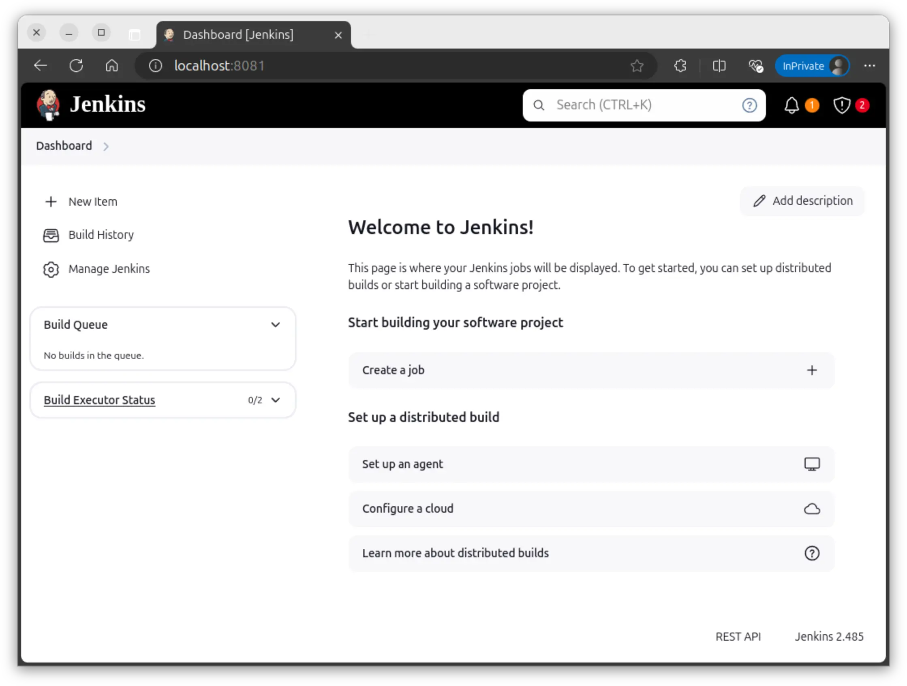
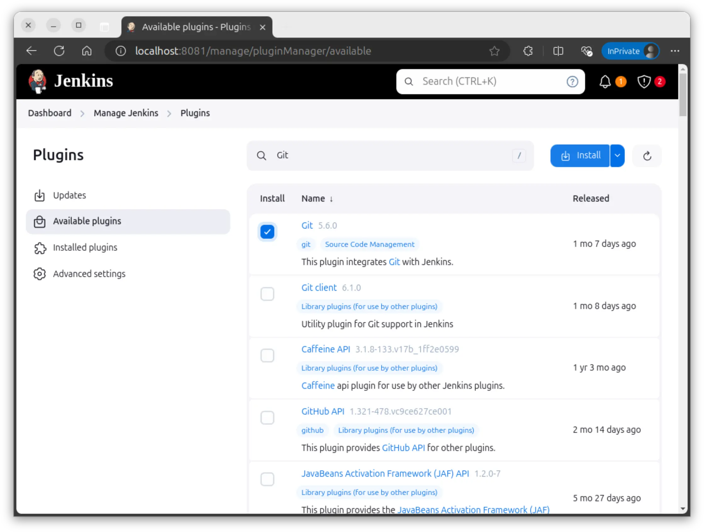
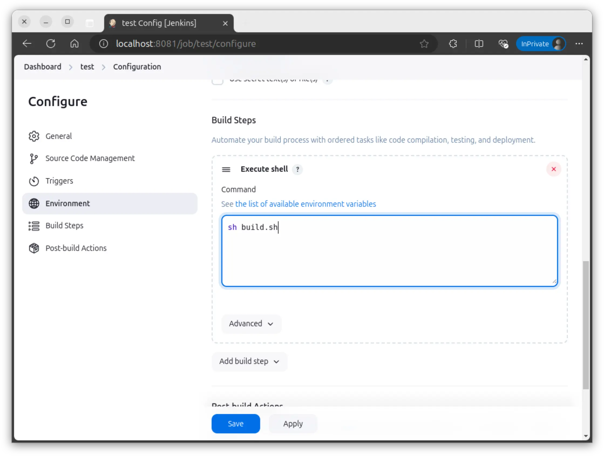

---
tags:
  - stable
---

# CI/CD 平台：Jenkins

## 基本概念

!!! quote

    - [What is CI/CD? - GitLab](https://about.gitlab.com/topics/ci-cd/)

- **持续集成（Continuous Integration, CI）**：
    - 尽快将代码更改集成到主干分支，在提交与合并时自动运行构建和测试。
    - 能够在开发过程中更快更简单地发现和解决问题。
- **持续交付（Continuous Delivery, CD）**：持续交付是一种软件工程方法，旨在改进软件的发布流程，使得软件的发布可以更加频繁、更加可靠。
    - 代码经过 CI 的测试和构建后，CD 负责将代码及其依赖打包为可随时部署的软件包，并可能在生产环境中测试和部署。

CI/CD 强调自动化，使用流水线，大幅节省人力资源，极大提高效率。

Jenkins 是一个开源的自动化服务器，用于自动化各种任务，包括构建、测试和部署软件。Jenkins 支持各种插件，可以扩展其功能。

Debian 的质量管理（Quality Assurance, QA）团队使用 Jenkins 在 [`jenkins.debian.net`](https://jenkins.debian.net/) 上进行持续集成，相关配置文件见 [:simple-gitlab: qa/jenkins.debian.net](https://salsa.debian.org/qa/jenkins.debian.net)。

目前我们正在积极推进使用 CI/CD 平台构建无盘系统，这将使得系统管理更加清晰、稳定。

## Jenkins 入门

!!! tip "Jenkins 官方的入门教程不适合我们"

    Jenkins 的入门教程 [Creating your first Pipeline - Jenkins](https://www.jenkins.io/doc/pipeline/tour/hello-world/) 事实上很不友好，一开始就使用复杂的 Multibranch Pipeline 任务。多分支构建离我们太遥远，而且 Branch Source 插件很难配。我们应当从最简单最原始的 Freestyle 任务开始。

### Docker 安装

使用下面的 Docker compose 文件启动 Jenkins。该 compose 文件跳过了 Jenkins 的初始化向导，直接启动 Jenkins 服务。

```yaml title="compose.yml"
services:
  jenkins:
    image: jenkins/jenkins
    environment:
      - JAVA_OPTS="-Djenkins.install.runSetupWizard=false"
    ports:
      - "8080:8080"
```

然后访问 `http://localhost:8080`。



Jenkins 的功能依靠各种插件支持。点击左侧 Manage Jenkins - Plugins - Available plugins，搜索并安装 Git 插件，这样 Jenkins 就能够从 Git 仓库拉取代码。



!!! tip

    如果你的网络环境不好，可以在 Plugins - Advanced Settings 中将 Update Site 改为 `http://mirrors.tuna.tsinghua.edu.cn/jenkins/updates/update-center.json`。

### Freestyle 任务

接下来我们要让 Jenkins 从 Git 仓库拉取代码并执行构建。

首先，在 GitHub 或 GitLab 等地方创建一个公开仓库（为了方便稍后拉取仓库时不用配置 SSH 密钥）。在仓库里添加一个简单的脚本，比如：

```bash title="build.sh"
echo "Hello, Jenkins!"
```

回到 Jenkins 首页，点击 Create a job，创建一个 Freestyle project。这是 Jenkins 中最简单的任务类型，已经能够满足我们的需求。

创建成功后来到任务的 Configure 界面。在这里我们配置任务的各种属性，比如源码管理、构建触发器、构建步骤等。

- **拉取源码**：在 Source Code Management 中选择 Git，填写仓库地址。
- **触发器**：在 Triggers 中可以配置定时构建、向 SCM 轮询等。你可以按照页面上的提示配置，这里就不做演示。
- **构建步骤**：在 Build Steps 中添加构建步骤，选择类型为 Execute shell，填写构建脚本的内容，比如 `sh build.sh`。

    

- **保存**：点击 Save 保存任务配置。

点击左侧的 Build Now 立即执行构建，Jenkins 就会先拉取代码，然后执行构建步骤。

Jenkins 会为每次构建生成一个构建号，你可以点击构建号查看构建的详情，在其中的 Console Output 中查看构建的输出，在 Changes 中查看本次构建的变更（一般由 Git 提交记录生成）。

### GitLab 触发构建

接下来我们希望当 GitLab 仓库有新的提交时，Jenkins 能自动构建。这就需要使用 [GitLab Plugin](https://plugins.jenkins.io/gitlab-plugin/) 插件。它在 Triggers 中新增了 GitLab Webhook，你会看见多出了这样的选项：

> Build when a change is pushed to GitLab. GitLab webhook URL: <https://jenkins.clusters.zjusct.io/project/chroot-debian-sid>
>
> - Push Evnets
> - Merge Request Events
> - ...

将 Webhook URL 复制到 GitLab 仓库的集成 - Jenkins 设置中，按 GitLab 的提示配置用户名密码等即可。此后，如果你向 GitLab 仓库推送代码，GitLab 就会向 Jenkins 发送 Webhook 请求，触发 Jenkins 构建。

### 推送构建结果到 GitLab

请阅读 GitLab Plugin 文档。这里给出大致的步骤：

- 在 GitLab 中创建 Access Token。可以是 Personal Access Token，也可以是 Project Access Token。该 Token 需要为项目的 Maintainer，并至少具有 `api` 权限。
- 在 Jenkins 中添加 GitLab API Token 凭据。
- 在 Jenkins System 中设置 GitLab Connection，填写 GitLab 服务器地址，选择对应的 GitLab API Token 凭据。
- 在 Jenkins 任务的 General 中选择一个 GitLab Connection，在 Post-build Actions 中选择发布到 GitLab。
- 执行构建，查看构建结果是否成功发布到 GitLab。

## Jenkins 配置与维护

    - [Initial Settings - Jenkins](https://www.jenkins.io/doc/book/installing/initial-settings/)

通过上面的练习，你已经掌握了 Jenkins 的基本操作。现在我们进一步学习 Jenkins 的配置管理，将 Jenkins 配置保存为代码，从而实现配置的版本控制和自动化。

### 构建镜像以添加插件

阅读 [:simple-github: jenkinsci/docker: Docker official jenkins repo](https://github.com/jenkinsci/docker/?tab=readme-ov-file#setting-update-centers)，了解如何设置 Update center 和安装自己的插件。你也可以阅读一个实际的例子 [:simple-github: emnify/jenkins-casc-docker](https://github.com/emnify/jenkins-casc-docker)。

### Jenkins CasC

!!! quote

    - [Configuration as Code - Jenkins plugin](https://plugins.jenkins.io/configuration-as-code/)

Jenkins CasC 插件允许用户将 Jenkins 配置保存为 YAML 文件。这样可以更好地管理 Jenkins 配置，也方便备份和恢复。它能管理 Jenkins 自身和插件的配置。

阅读 [:simple-github: emnify/jenkins-casc-docker](https://github.com/emnify/jenkins-casc-docker)，这个项目十分简洁地展示了如何使用 Jenkins CasC 插件。

实际部署时可以进一步进行精简，删去如 `material-theme` 等已经无法在新版 Jenkins 使用的插件。此外项目中没有介绍本地账户的配置，这很简单：

```yaml
jenkins:
  securityRealm:
    local:
      allowsSignup: false
      users:
        - id: "admin"
          password: "admin"
```

### Jenkins Job Builder

!!! quote

    - [Jenkins Job Builder — Jenkins Job Builder documentation](https://jenkins-job-builder.readthedocs.io/en/latest/index.html)

我们已经将 Jenkins 配置保存为代码，接下来我们将 Jenkins 任务也保存为代码。Jenkins Job Builder 是一个用于管理 Jenkins 任务的工具，它使用 YAML 文件来描述 Jenkins 任务。

下面的例子展示了前文 Jenkins 入门中我们创建的简单项目。你可以借助 [Job Definitions — Jenkins Job Builder documentation](https://jenkins-job-builder.readthedocs.io/en/latest/definition.html) 文档尝试理解下面的配置：

```yaml
- job:
    name: "test"
    scm:
      - git:
          url: "your-git-repo-url"
          branches:
            - origin/main
    triggers:
      - gitlab
    builders:
      - shell: "sh build.sh"
```

了解了任务的配置后，就可以阅读 [Configuration File — Jenkins Job Builder documentation](https://jenkins-job-builder.readthedocs.io/en/latest/execution.html#running) 了解怎么配置运行 Jenkins Job Builder。我们需要写一个配置文件，告诉 Jenkins Job Builder 需要配置任务的 Jenkins 服务器地址、用户名密码等信息。然后就可以使用 `jenkins-jobs` 命令将任务配置应用到 Jenkins 服务器上。

### 匿名访问与安全

!!! quote

    - [Be aware of anonymous user read access in Jenkins - Aubergine](https://www.auberginesolutions.com/blog/be-aware-of-anonymous-user-read-access-in-jenkins)
    - [anonymous access to jenkins workspaces - Stack Overflow](https://stackoverflow.com/questions/13085160/anonymous-access-to-jenkins-workspaces)

使用 Matrix Authorization Strategy 插件，可以更细粒度地控制用户权限。下载插件后，在安全设置中可以添加匿名用户并设置其权限。为了让匿名用户能够查看基本的任务构建状态，需要赋予 Overall、Job 和 View 的 Read 权限。

需要注意的是应当关闭 Job/Workspace 的匿名访问权限，否则匿名用户可以查看工作区的文件。其中很可能包含敏感信息。
