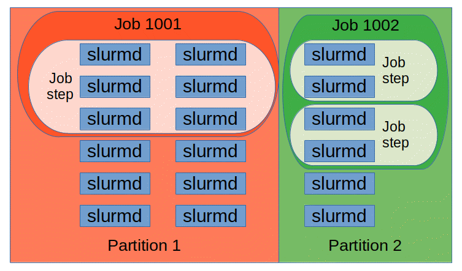

---
tags:
  - 不完善
---

# 任务调度：Slurm

!!! bug "较新版本 Slurm 与 MPI 有兼容性问题尚未解决"

    请查看 [Remove/revise Slurm launch integration - GitHub Issue](https://github.com/open-mpi/ompi/issues/12471)。

    预计问题在 Slurm 24.11 和 OpenMPI 6 中解决。目前，我们将集群中的 Slurm 版本固定在 22.05.11。

## Slurm 原理

!!! quote

    - [Slurm batch queueing system - dtu.dk](https://wiki.fysik.dtu.dk/Niflheim_system/SLURM/)

### 基本架构

<figure markdown="span">
    <center>
    { width=80% align=center }
    </center>
    <figcaption>
    Slurm 架构
    <br /><small>
    [Slurm](https://slurm.schedmd.com/quickstart.html)
    </small>
    </figcaption>
</figure>

- 控制节点上运行 `slurmctld` 守护进程，负责接收用户提交的任务，分配资源，监控任务运行状态等。
- 计算节点上运行 `slurmd` 守护进程，负责接收控制节点分配的任务，执行任务，将任务结果返回给控制节点。

<figure markdown="span">
    <center>
    { width=80% align=center }
    </center>
    <figcaption>
    Slurm 实体
    <br /><small>
    [Slurm](https://slurm.schedmd.com/quickstart.html)
    </small>
    </figcaption>
</figure>

Slurm 中包含以下实体：

- 节点（node）
- 分区（partition）：由节点组成。分区可以视为任务队列。
- 任务（job）：由一个或多个步骤（step）组成。

Slurm 要求集群上有一致的用户名和用户组。

### 其他

Slurm 还提供一个 PAM，能够限制无任务用户登录节点。

## Slurm 配置

!!! note "配置文件通过 NFS 挂载"

    Munge 密钥和 Slurm 配置文件等需要同步到集群每个节点。因此我们在根服务器创建 `/slurm` 目录，设置为只读共享到集群中所有节点。

    因为配置文件放置在 NFS，所以需要修改 Munge 和 Slurm 等服务的 `.service` 文件，将 `EnvironmentFile` 指向新的地方，并在能够从 NFS 加载配置文件后再启动服务。以 `slurmd` 为例，关键是添加 `remote-fs.target` 的依赖，以及使用 `ConditionPathExists` 条件：

    ```text title="/lib/systemd/system/slurmd.services" hl_lines="3 5 8"
    [Unit]
    Description=Slurm node daemon
    After=munge.service network-online.target remote-fs.target
    Wants=network-online.target
    ConditionPathExists=/slurm/etc/default/slurmd

    [Service]
    EnvironmentFile=-/slurm/etc/default/slurmd
    ```

    ```text title="/slurm/etc/default/slurmd"
    # Additional options that are passed to the slurmd daemon
    SLURMD_OPTIONS="-vvvvvv"
    SLURM_CONF="/slurm/etc/slurm/slurm.conf"
    ```

    需要注意的是，Slurm 相关命令也从环境变量 `SLURM_CONF` 中读取配置文件路径，因此需要在 `/etc/environment` 中添加：

    ```text title="/etc/environment"
    SLURM_CONF="/slurm/etc/slurm/slurm.conf"
    ```

### 安装 Munge

!!! quote

    - [Installation Guide - Spack](https://github.com/dun/munge/wiki/Installation-Guide)

Munge 是一个加密服务，用于集群中相同 UID 和 GID 进程间的认证。

集群在 SSSD 上为 Munge 服务创建了一个非特权的用户账户 `munge`。应当在完成 SSSD 配置，正确运行后再安装 Munge。

Munge 对权限极为敏感，应按安装指导检查各目录权限：

- `/slurm/etc/munge`：0700
- `/var/log/munge`：0700

这些目录的拥有者为运行守护进程的用户，即 `munge`。

```bash
apt install munge
```

安装完成后，运行 Munge 命令均应使用 `munge` 用户，即 `sudo -u munge /usr/sbin/munged`。

### 配置 Munge

在主节点生成密钥，并共享到目录中供其他节点使用：

```bash
# 在 /slurm 下创建和 /etc 一样的目录结构
mkdir -p /slurm/etc/default
# 密钥生成到 /etc/munge/munge.key
sudo -u munge /usr/sbin/mungekey --verbose
# 移动密钥
mv /etc/munge /slurm/etc
# 移动默认配置文件
mv /etc/default/munge /slurm/etc/default/munge
# 修改 munge 将 key-file 指向 /slurm/etc/munge/munge.key
# 即：OPTIONS="--key-file=/slurm/etc/munge/munge.key --num-threads=2"
vim /slurm/etc/default/munge
# 配置权限
chown -R munge:munge /slurm/etc/munge
# 修改 munge.service 中的 EnvironmentFile 为 /slurm/etc/default/munge
# 并添加 NFS 依赖和检测
vim /lib/systemd/system/munge.service
# 启用服务
sudo systemctl enable munge.service
# 运行服务
sudo systemctl start munge.service
```

从节点：

```bash
# 修改 munge.service 中的 EnvironmentFile 为 /slurm/etc/default/munge
# 并添加 NFS 依赖和检测
vim /lib/systemd/system/munge.service
# 启用服务
sudo systemctl enable munge.service
# 运行服务
sudo systemctl start munge.service
```

### 测试 Munge

在任一节点上使用 `munge -n` 生成一段加密字符串，然后在其他节点上使用 `unmunge` 解密。

```bash
munge -n | ssh node2 unmunge
```

### 安装 Slurm

!!! quote

    - [Quick Start Administrator Guide](https://slurm.schedmd.com/quickstart_admin.html)

```bash
# 主节点
apt install slurmctld
# 从节点
apt install slurmd
```

安装完成后应当会自动生成 systemd unit 文件，**完成 `slurm.conf` 的配置后**在不同节点上启动相应的服务：

- 主节点：`sudo systemctl enable slurmctld.service`
- 从节点：`sudo systemctl enable slurmd.service`

### 配置 Slurm

!!! quote

    - [Slurm Configuration Tool - Slurm](https://slurm.schedmd.com/configurator.html)
    - [slurm.conf - Slurm](https://slurm.schedmd.com/slurm.conf.html)

常用的配置项记录如下：

```text title="slurm.conf"
# 通用
ReturnToService=2 # 一旦节点恢复即设置为可用，不需要管理员手动设置

# 节点
NodeName
NodeHostname
NodeAddr
```

#### 插件

- `task/affinity`：用于任务绑核
- cgroup 相关
    - `proctrack/cgroup`：使用 Linux cgroup 控制任务进程树
    - `task/cgroup`：使用 Linux cgroup 控制任务能使用的资源（唯一能干这事的插件）
    - `jobacct_gather/cgroup`：使用 Linux cgroup 收集任务的资源使用情况

#### cgroup

!!! quote

    [cgroup - Slurm](https://slurm.schedmd.com/cgroups.html)

`cgroup.conf` 总是应当放置在 `slurm.conf` 的同级目录下。

## Slurm 维护

```shell

```

## Slurm 常见问题

### `Zero Bytes were transmitted or received`

一般是 `munge` 服务未启动或配置错误导致的。检查 `munge` 服务是否正常运行，以及能否通过解密测试。

## Slurm 开发

!!! quote

    - [Slurm Programmer's Guide - Slurm](https://slurm.schedmd.com/programmer_guide.html)
    - [SchedMD/slurm - GitHub](https://github.com/SchedMD/slurm)

Slurm 作为我们常用的任务调度系统，有必要深入了解其工作原理甚至浏览源码，以便于更好地理解集群管理和并行任务调度系统。
