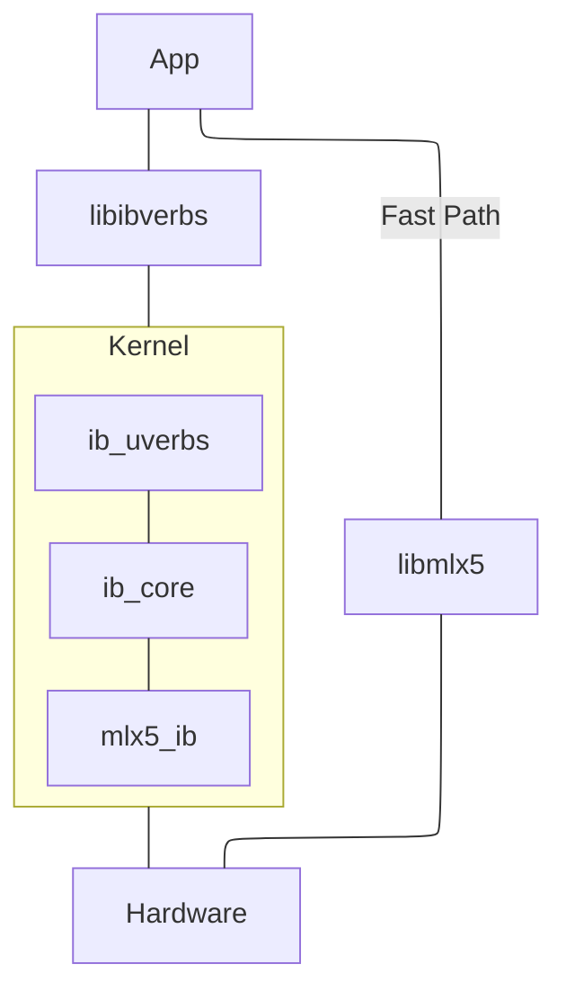

# rdma-core 与 linux/drivers/infiniband

rdma-core 是用户空间库，它与 Linux Kernel 中的 InfiniBand 子系统紧密相连，所以这两个的源码我们应当放在一起看。

## 整体结构

### rdma-core

rdma-core 整体可以分为 API、Utils 和 Provider 三个部分：

- API：以 `lib` 开头的文件夹，如 `libibverbs`，定义统一的接口供用户程序使用。

    ```c title="libibverbs/verbs.h"
    static inline int ibv_post_send(struct ibv_qp *qp, struct ibv_send_wr *wr,
            struct ibv_send_wr **bad_wr)
    {
        return qp->context->ops.post_send(qp, wr, bad_wr);
    }
    ```

    值得注意的是，这里的很多 API 都通过 static 和 inline 控制可见性。

- Provider：供各厂商实现具体的逻辑。在这里，函数表被指向具体的逻辑。

    ```c title="providers/mlx5/mlx5.c"
    static const struct verbs_context_ops mlx5_ctx_common_ops = {
        .create_qp = mlx5_create_qp,
        //...

    }
    ```

- Utils：一些实用工具，如 `infiniband-diags`

这样的结构我们已经见到很多了，UCX、libfabric 都与此类似。

rdma-core 使用 CMake 构建，一些要点：

- `libibverbs/libibverbs.map.in` 等文件定义了库的可见符号，通过 CMake 中的自定义函数 `rdma_set_library_map` 添加编译器选项实现：

    ```text
    -Wl,--version-script,${VERSION_SCRIPT}
    ```

    Version Script 用于明确告诉链接器要从生成的对象中导出哪些符号，以及将版本名称与接口关联起来，从而允许进行不兼容的更改而不会破坏 ABI。详见 [LD Version Scripts (GNU Gnulib)](https://www.gnu.org/software/gnulib/manual/html_node/LD-Version-Scripts.html)。


### linux/drivers/infiniband

分为三层：

- Upper Layer Protocol
- sw
- hw

### 用户态与内核态的交互

首先我们要理解运行在用户态的 rdma-core 是如何与内核态交互的。在《Linux Device Drivers》中我们了解到，设备驱动除了支持 `write()` 和 `read()` 操作，还会使用 `ioctl()` 执行复杂的控制逻辑。rdma-core 也基于这两种方式与设备驱动交互。

以 libibverbs 中的 `ibv_create_qp()` 为例，mlx5 驱动的调用链如下：

```text
ibv_create_qp() (libibverbs/verbs.c)

get_ops()->create_qp() = mlx5_ctx_common_ops.create_qp()  (providers/mlx5/mlx5.c)

mlx5_create_qp() (providers/mlx5/verbs.c)

create_qp() (providers/mlx5/verbs.c)

ibv_cmd_create_qp_ex() (libibverbs/cmd_qp.c)

ibv_icmd_create_qp() (libibverbs/cmd_qp.c)
```

在 `ibv_icmd_*()` 中，一般会优先尝试 ioctl，如果不行再 fallback 到 write：

```c title="libibverbs/cmd_qp.c"
static int ibv_icmd_create_qp(struct ibv_context *context,
                struct verbs_qp *vqp,
                struct ibv_qp *qp_in,
                struct ibv_qp_init_attr_ex *attr_ex,
                struct ibv_command_buffer *link) {
    switch (execute_ioctl_fallback(context, create_qp, cmdb, &ret)) {
        case TRY_WRITE: {
        ret = execute_write_bufs(
            context, IB_USER_VERBS_CMD_CREATE_QP, req, resp);
        }
    }
}
```

上面的 `execute_*` 都是头文件中定义的宏，它们执行一些数据结构和类型的转换（比如 container_of、assert 等），然后执行下面的具体调用：

- 首先尝试 ioctl

    ```c title="libibverbs/cmd_fallback.c"
    enum write_fallback _execute_ioctl_fallback(struct ibv_context *ctx,
                    unsigned int cmd_bit,
                    struct ibv_command_buffer *cmdb,
                    int *ret) {
        *ret = execute_ioctl(ctx, cmdb);
        if (*ret == ENOTTY) {
            /* ENOTTY means the ioctl framework is entirely absent */
            bitmap_fill(priv->unsupported_ioctls, VERBS_OPS_NUM);
            return _check_legacy(cmdb, ret);
        }
    }
    ```

    ```c title="libibverbs/cmd_ioctl.c"
    int execute_ioctl(struct ibv_context *context, struct ibv_command_buffer *cmd) {
        if (ioctl(context->cmd_fd, RDMA_VERBS_IOCTL, &cmd->hdr))
            return errno;
    }
    ```

- 否则尝试 write

    ```c title="libibverbs/cmd_fallback.c"
    int _execute_cmd_write(struct ibv_context *ctx, unsigned int write_method,
                    void *vreq, size_t core_req_size,
                    size_t req_size, void *resp, size_t core_resp_size,
                    size_t resp_size) {
        if (write(ctx->cmd_fd, vreq, req_size) != req_size)
            return errno;
    }
    ```

## libibverbs

### 实现简述

- 转交 Provider 层的：

    一般在 `libibverbs/verbs.h` 中直接定义为 `static inline`：

    ```text
    ibv_wr_*
    ...
    ```

- 通过 `ibv_cmd_*` 转交内核态的：

    ```text
    ibv_alloc_pd -> mlx5_alloc_pd -> ibv_cmd_alloc_pd
    ibv_reg_mr -> mlx5_reg_mr -> ibv_cmd_reg_mr
    ibv_post_send -> mlx5_post_send -> ibv_cmd_post_send
    ...
    ```

- `device.c` 中的：

    ```c
    struct _ibv_device_ops {
        struct ibv_context *    (*_dummy1)(struct ibv_device *device, int cmd_fd);
        void            (*_dummy2)(struct ibv_context *context);
    };
    struct ibv_device{
        struct _ibv_device_ops _ops;
        enum ibv_node_type    node_type;
        enum ibv_transport_type    transport_type;
        /* Name of underlying kernel IB device, eg "mthca0" */
        char            name[IBV_SYSFS_NAME_MAX];
        /* Name of uverbs device, eg "uverbs0" */
        char            dev_name[IBV_SYSFS_NAME_MAX];
        /* Path to infiniband_verbs class device in sysfs */
        char            dev_path[IBV_SYSFS_PATH_MAX];
        /* Path to infiniband class device in sysfs */
        char            ibdev_path[IBV_SYSFS_PATH_MAX];
    }
    ```

    - `struct ibv_device **ibv_get_device_list(int *num_devices);`：
        - 通过 Netlink 或 sysfs（如 `/sys/class/infiniband_verbs/uverbs0/ibdev`）查找设备，获得 `sysfs_list`
        - `load_drivers()` 加载所有 Provider 动态链接库 `lib*-rdmav**.so`（`load_drivers()`），存放到全局链表 `driver_list`，类型为 `ibv_driver`
        - 对列表 `sysfs_list` 中每个设备，尝试 `driver_list` 中的所有驱动，如果成功就添加到全局链表 `device_list`，类型为 `ibv_device`

            ```text
            try_all_drivers(&sysfs_list, device_list, &num_devices);
            vdev = try_drivers(sysfs_dev); list_add(device_list, &vdev->entry);
            dev = try_driver(driver->ops, sysfs_dev);
            ```

            由驱动完成 `verbs_device` 和 `ibv_device` 的初始化：

            ```c
            vdev = ops->alloc_device(sysfs_dev);
            vdev->ops = ops;
            dev = &vdev->device;
            strcpy(dev->name,       sysfs_dev->ibdev_name);
            vdev->sysfs = sysfs_dev;
            ```

        - 将全局链表 `device_list` 的元素指针拷贝返回、递增元素的引用计数（`ibverbs_device_hold`）

    - `void ibv_free_device_list(struct ibv_device **list);`：递减元素引用计数（`ibverbs_device_put`）
    - `struct ibv_context *ibv_open_device(struct ibv_device *device);`：
        - 获取父结构 `verbs_device`,通过 `ops` 使用相应 Driver 的能力
        - 拿到 Driver 的 `cmd_fd`，调用设备特定的 `alloc_context` 函数
        - 通过下面的通用接口设置 `verbs_context` 的 `ops`：

            ```c
            void verbs_set_ops(struct verbs_context *vctx,
                const struct verbs_context_ops *ops);
            ```

    - 过于简单无需介绍的：

        ```text
        ibv_get_device_name
        ibv_get_device_guid
        ```

- `verbs.c` 中的：

    - `struct ibv_mr *ibv_reg_mr(struct ibv_pd *pd, void *addr, size_t length, int access);`

        这是一个很关键的函数，涉及 IOVA 的转换。

    - `

### MR 注册

### `ibv_post_send` 的可见性

有趣的是，`ibv_post_send` 不是导出符号。

我们知道这是处于数据路径上、不用陷入内核态的 Verbs。我认为这里不将其设为导出符号的原因是：将其直接 Forward 到 Provider 层，如下图所示：



但是如果追踪下去会发现很奇怪，`mlx5_post_send` 同样不是导出函数，再下一层的 `_mlx5_post_send` 已经是 `inline` 函数了。


## libmad

### MAD

## librdmacm

### 地址绑定

假设你调用 `rdma_bind_addr()` 时遇到了 ENODEV（No such device (19)）的问题，接下来一步步分析问题出现的位置。

`rdma_bind_addr()` 根据 `af_ib_support` 分支为两个路径，出问题的路径在 IB 上：

```text
rdma_bind_addr() → rdma_bind_addr2() → ucma_query_addr() → ucma_get_device()
```

```c
static int ucma_get_device(struct cma_id_private *id_priv, __be64 guid,
               uint32_t idx)
{
    struct cma_device *cma_dev;
    int ret;

    pthread_mutex_lock(&mut);
    cma_dev = ucma_get_cma_device(guid, idx);
    if (!cma_dev) {
        pthread_mutex_unlock(&mut);
        return ERR(ENODEV);  // 这里返回 ENODEV
    }
    // ...
}
```

其中 `ucma_get_cma_device()` 返回空有两种情况：

```c
static struct cma_device *ucma_get_cma_device(__be64 guid, uint32_t idx)
{
    struct cma_device *cma_dev;

    // 第一次查找：在现有设备列表中查找
    list_for_each(&cma_dev_list, cma_dev, entry)
        if (!cma_dev->is_device_dead && match(cma_dev, guid, idx))
            goto match;

    // 如果第一次查找失败，同步设备列表
    if (sync_devices_list())
        return NULL;  // 同步失败，返回 NULL

    // 第二次查找：在更新后的设备列表中查找
    list_for_each(&cma_dev_list, cma_dev, entry)
        if (!cma_dev->is_device_dead && match(cma_dev, guid, idx))
            goto match;
    
    cma_dev = NULL;  // 两次查找都失败，设置为 NULL

match:
    if (cma_dev)
        cma_dev->refcnt++;
    return cma_dev;
}
```

- `sync_devices_list()` 函数可能失败的原因：

    ```c
    static int sync_devices_list(void)
    {
        struct ibv_device **new_list;
        int i, j, numb_dev;

        new_list = ibv_get_device_list(&numb_dev);
        if (!new_list)
            return ERR(ENODEV);  // 获取设备列表失败

        if (!numb_dev) {
            ibv_free_device_list(new_list);
            return ERR(ENODEV);  // 系统中没有 RDMA 设备
        }
        // ...
    }
    ```

- `match()` 函数找不到匹配的设备：

    ```c
    static bool match(struct cma_device *cma_dev, __be64 guid, uint32_t idx)
    {
        if ((idx == UCMA_INVALID_IB_INDEX) ||
            (cma_dev->ibv_idx == UCMA_INVALID_IB_INDEX))
            return cma_dev->guid == guid;

        return cma_dev->ibv_idx == idx && cma_dev->guid == guid;
    }
    ```

    匹配失败的原因：

    - 请求的 guid 与系统中任何设备的 GUID 都不匹配
    - 请求的 idx 与系统中任何设备的索引都不匹配
    - GUID 和索引都不匹配

若要了解具体是哪个地方出错，可以：

- 重新编译 rdma-core 启用调试信息，使用 GDB 调试
- 模仿上面的代码写个例程，把信息打出来看看

暂时停止在这里，以后有空再探究。

## uverbs 层：drivers/infiniband/core

## 硬件驱动层：drivers/infiniband/hw
