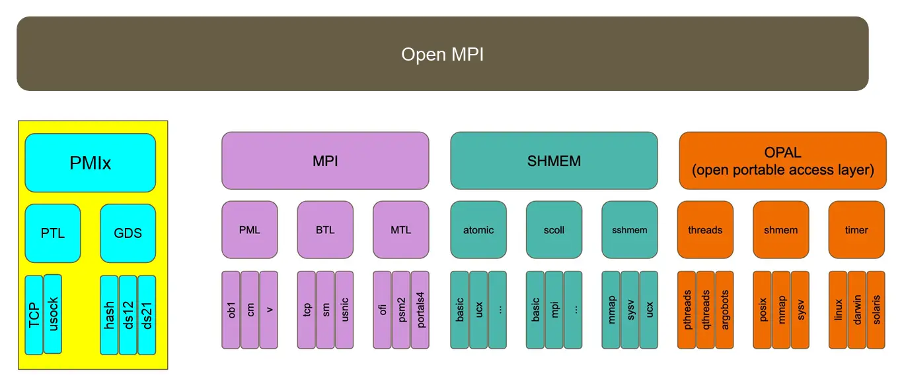
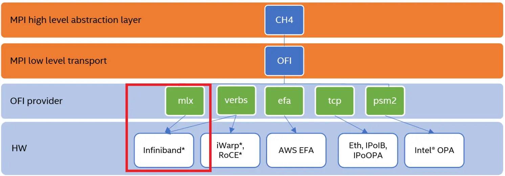
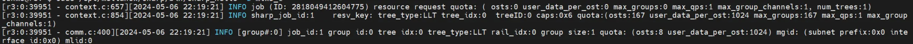
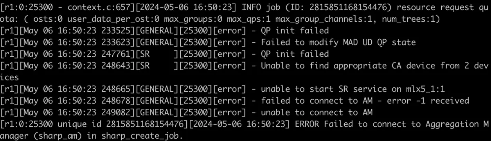

---
tags:
  - 不完善
---

# MPI

!!! abstract

    本文档前半部分将介绍与具体实现无关的 MPI 知识，后半部分将介绍 OpenMPI、MPICHv2、oneAPI、HPC-X 等具体实现的架构和特点。最后涉略一些 MPI 高级话题。

    - 了解 MPI 实现、通信算法之间的差异，有依据有策略地进行调优。
    - 了解不同 MPI 实现的依赖链和工作方式，以便在遇到错误时快速诊断和修复。

## MPI 实现

### OpenMPI

!!! quote

    - [Open MPI: Videos: General information](https://www.open-mpi.org/video/?category=general)：该系列视频介绍了 Open MPI 的整体结构，对各模块如 PMI、UCX 等作了简单介绍。
    - [Open MPI Developer's Workshop (2006)](https://www-lb.open-mpi.org/papers/workshop-2006/)

#### OpenMPI 架构

OpenMPI 采用 MCA（Modular Component Architecture）的模块化方式搭建，架构如下：



- **PMIx（Process Management Interface）**：用于与 `slurm` 这样的资源管理器（Resource Manager，RM）沟通。因为 PMI 的存在，我们能够直接使用 `srun` 运行 OpenMPI 程序，取得与 `mpirun` 等效的效果。

    MPI 与资源管理器可以通过三种方式交互：

    - Slurm 启动 MPI 并行程序，并通过 PMI API（Process Management Interface）调用执行初始化。
    - Slurm 分配资源，然后由 `mpirun` 基于 Slurm 的基础设施启动并行程序。`srun` 就是这种方式。
    - Slurm 分配资源，然后由 `mpirun` 通过 SSH 等其他机制启动并行程序。这种方式下，Slurm 无法进行资源管控和追踪。

    可以阅读 [Slurm: PMIx - Exascale Process Management Interface](https://slurm.schedmd.com/SLUG15/PMIx.pdf) 了解更多。

- [网络支持模块](https://docs.open-mpi.org/en/v5.0.x/release-notes/networks.html)：OpenMPI 支持 BTL、MTL、UCX 等网络模块。
    - [UCX](https://github.com/openucx/ucx)：如果 InfiniBand 设备可用，OpenMPI 将选用 `UCX` 模块。
    - [OpenFabric](https://github.com/ofiwg/libfabric)：Intel 设备一般选择采用 `libfabric`。
    - OpenMPI 同样为 CUDA GDR（GPUDirect RDMA）等可选模块提供了支持，在编译 `./configure` 时提供 CUDA 位置即可。关于 OpenMPI 的编译与构建，请查阅参考资料中 EasyBuild 的讲座。

#### OpenMPI 使用

- 查看信息：`ompi_info --all`
- `mpirun` `mpiexec` `orterun` 是同一个命令。

OpenMPI 使用 Slot 作为资源分配单位，有多少个 Slot 就可以运行多少个进程。

- 默认：处理器核数。
- 使用超线程核心数：用 `--use-hwthread-cpus` 开启，常见为 2 倍处理器核数。可以在 `lscpu` 中的 `Thread(s) per core` 查看。
- 资源管理器调度：从资源管理器获取 Slot 数。
- 需要注意：Slot 数和硬件没有关系，可能比硬件核数多，也可能比硬件核数少。

### MVAPICH2

!!! quote

    - [The MVAPICH2 Project Latest Status and Future Plans](https://www.mpich.org/static/docs/slides/2021-sc-bof/MVAPICH2.pdf)：在 SC 21 进行的一次报告，介绍了 MVAPICH2 的最新进展和未来计划。

#### MVAPICH2 Benchmark

!!! quote

    - [Benchmarks - MVAPICH](https://mvapich.cse.ohio-state.edu/benchmarks/)

### oneAPI

!!! quote

    - [Intel MPI Library](https://www.intel.com/content/www/us/en/developer/tools/oneapi/mpi-library.html#gs.pinwor)
    - [Get Started](https://www.intel.com/content/www/us/en/develop/documentation/get-started-with-mpi-for-linux/top.html)
    - [Developer Guides](https://www.intel.com/content/www/us/en/develop/documentation/mpi-developer-guide-linux/top.html)
    - [Developer References](https://www.intel.com/content/www/us/en/develop/documentation/mpi-developer-reference-linux/top.html)
    - [How to set up IntelMPI over RoCEv2 - HPC-Works - Confluence](https://hpcadvisorycouncil.atlassian.net/wiki/spaces/HPCWORKS/pages/156237831/How+to+set+up+IntelMPI+over+RoCEv2)

#### oneAPI 使用

1. 加载环境

    ```shell
    source /opt/intel/oneapi/setvars.sh
    ```

2. 创建 `hostfile`，每行一个节点名：

    ```text
    clusternode1
    clusternode2
    ```

3. 构建、编译
4. 运行

    ```shell
    mpirun -n <# of processes> -ppn <# of processes per node> -f <# position of hostfile> ./myprog
    ```

对 Intel MPI 来说，`mpirun` 是 `mpiexec.hydra` 的包装。其选项有全局选项和局部选项之分，一般以 `g` 开头的参数是全局选项，下文不对全局和局部选项分别介绍。

可以编写文件保存选项，使用 `-configfile` 指定配置文件，`#` 注释。`./mpiexec.conf` 会自动加载。

- 环境变量
    - `-genv <ENVVAR> <val>` 指定运行时环境变量，常用的有：`OMP_`
    - `-genvall, -genvnone` 控制是否传递环境变量
- profiling:
    - `-trace` `-aps` `-mps`
- 设备：
    - `iface`
- 运行参数：
    - `-n, -np` 进程数
    - `-env` 环境变量
    - `-path` 可执行文件

#### oneAPI Benchmarks

!!! quote

    - [Intel MPI Benchmarks User Guide](https://www.intel.com/content/www/us/en/develop/documentation/imb-user-guide/top.html)
    - [:simple-github: intel/mpi-benchmarks](https://github.com/intel/mpi-benchmarks)

Intel® MPI Benchmarks 包含以下**组件**：

- [IMB-MPI1](https://www.intel.com/content/www/us/en/develop/documentation/imb-user-guide/top/mpi-1-benchmarks.html) – 用于 MPI-1 功能的基准测试。
- 用于 [MPI-2](https://www.intel.com/content/www/us/en/develop/documentation/imb-user-guide/top/mpi-2-benchmarks.html) 功能的组件：
    - IMB-EXT – 单边通信基准测试。
    - IMB-IO – 输入/输出基准测试。
- 用于 [MPI-3](https://www.intel.com/content/www/us/en/develop/documentation/imb-user-guide/top/mpi-3-benchmarks.html) 功能的组件：
    - IMB-NBC – **非阻塞集合（non-blocking collective，NBC）** 操作的基准测试。
    - IMB-RMA – 单边通信基准测试。这些基准测试测量 MPI-3 标准中引入的**远程内存访问（Remote Memory Access，RMA）** 功能。
    - IMB-MT – 在每个 rank 内运行的**多线程** 的 MPI-1 功能基准测试。

使用方法见：

- [Intel(R) MPI Benchmarks User Guide](https://www.intel.com/content/www/us/en/docs/mpi-library/user-guide-benchmarks/2021-8/overview.html)
- [Command-line Control](https://www.intel.com/content/www/us/en/docs/mpi-library/user-guide-benchmarks/2021-8/command-line-control.html)

一个简单的例子

```bash
mpirun -ppn 1 -f hostfile IMB-MPI1 > MPI1.log
```

要获取更多调试信息，请在运行前设置 `I_MPI_DEBUG`（可以设置为 `0` 到 `5`）。

```bash
I_MPI_DEBUG=1 mpirun -ppn 1 -f hostfile IMB-MPI1 > MPI1.log
```

下面的命令行在基准测试列表 `IMB-MPI1` 中只执行 `PingPong` 基准测试。

```bash
mpirun -ppn 1 -f hostfile IMB-MPI1 PingPong
```

#### oneAPI 运行参数

!!! quote

    - [Intel® MPI Library 2019 Over Libfabric*](https://www.intel.com/content/www/us/en/developer/articles/technical/mpi-library-2019-over-libfabric.html)
    - [Improve Performance and Stability with Intel® MPI Library on InfiniBand*](https://www.intel.com/content/www/us/en/developer/articles/technical/improve-performance-and-stability-with-intel-mpi-library-on-infiniband.html)



启用 Infiniband 只需选择 `libfabric` 提供者为 `mlx`。默认的 `libfabric` 提供者是 `mlx`。可以使用以下命令进行检查：

```bash
$ I_MPI_DEBUG=1 mpirun -n 1 IMB-MPI1 barrier | grep 'libfabric provider'
[0] MPI startup(): libfabric provider: mlx
```

如果不是，请显式设置环境变量：

```bash
export FI_PROVIDER=mlx
```

或

```bash
export I_MPI_OFI_PROVIDER=mlx
```

**注意：** `I_MPI_OFI_PROVIDER` 优先于 `FI_PROVIDER`。

!!! example "基准测试"

```bash
mpirun -ppn 48 -f hostfile IMB-RMA All_get_all -msglog 16:23 -npmin 32 -time 50 -iter_policy dynamic
```

```text
Device        recv_MBps    recv_kpps    xmit_MBps    xmit_kpps
mlx4_0          4495.28      2278.12      4287.79      2186.83

Device        recv_MBps    recv_kpps    xmit_MBps    xmit_kpps
mlx4_0          4514.77      2292.04      4355.75      2204.24

Device        recv_MBps    recv_kpps    xmit_MBps    xmit_kpps
mlx4_0          4678.16      2360.21      4487.70      2250.06

Device        recv_MBps    recv_kpps    xmit_MBps    xmit_kpps
mlx4_0          4585.16      2294.27      4359.95      2241.65

Device        recv_MBps    recv_kpps    xmit_MBps    xmit_kpps
mlx4_0          4521.93      2314.73      4397.54      2197.37

Device        recv_MBps    recv_kpps    xmit_MBps    xmit_kpps
mlx4_0          4571.10      2291.09      4350.33      2215.72

Device        recv_MBps    recv_kpps    xmit_MBps    xmit_kpps
mlx4_0          4572.34      2336.06      4433.98      2243.59
```

#### oneAPI 调试

```bash
mpirun -n 4 -gtool "gdb-oneapi:0-3=attach" ./wrf_hydro.exe
# Using 'z' command you can switch active processes.
# e.g.
# 0-3: (gdb) z 1-3
# 1-3: (gdb) b 53
# 1-3: Breakpoint 2 at 0x4009f3: file test.c, line 53.
# 1-3: (gdb) z
# 0-3: (gdb) r
# 0-3: Continuing.
```

### [HPC-X](https://developer.nvidia.com/networking/hpc-x)

!!! quote

    - [Get Started with HPC-X - HPC-Works - Confluence](https://hpcadvisorycouncil.atlassian.net/wiki/spaces/HPCWORKS/pages/1344503811/Get+Started+with+HPC-X)
    - [HPC-X 2.0 Boosts Performance of Grid Benchmark - HPC-Works - Confluence](https://hpcadvisorycouncil.atlassian.net/wiki/spaces/HPCWORKS/pages/11370500/HPC-X+2.0+Boosts+Performance+of+Grid+Benchmark#HPC-X2.0BoostsPerformanceofGridBenchmark-MPIApplicationProfiling)

#### HPC-X 使用

!!! quote

    - [HPC-X Environments - NVIDIA](https://docs.nvidia.com/networking/display/hpcxv2200/installing+and+loading+hpc-x#src-1937722573_InstallingandLoadingHPCX-HPC-XEnvironments)
    - [MPI 并行程序编译及运行 — 中国科大超级计算中心用户使用手册：2024-05-18 版 文档](https://scc.ustc.edu.cn/zlsc/user_doc/html/mpi-application/mpi-application.html)：有很多 mpi 参数可以参考，包括 ucx hcoll sharp 参数

从 2.1 版本开始，HPC-X 工具包提供了一组环境（Environments）：

- 支持 CUDA® 的 HPC-X - `hpcx`

    默认选项，针对单线程模式进行了最佳性能优化，支持 GPU 和非 GPU 设置。

- 支持多线程的 HPC-X - `hpcx-mt`

    用于多线程 MPI 程序。

- 用于分析的 HPC-X - `hpcx-prof`

    启用编译了 Profile 信息的 UCX。

- 用于调试的 HPC-X - hpcx-debug

    启用以调试模式编译的 UCX/HCOLL/SHARP。

- HPC-X 堆栈 - hpcx-stack

    包含除了 OMPI 之外的所有库。

相关配置检查：检查支持的传输方式，RDMA 应该支持 rc, dc, ud 方式，使用 `UCX_TLS=rc, ud, sm, self` 设置使用的传输方式

```bash
$ ucx_info -d | grep Transport
      Transport: self
      Transport: tcp
      Transport: tcp
      Transport: tcp
      Transport: sysv
      Transport: posix
      Transport: dc_mlx5
      Transport: rc_verbs
      Transport: rc_mlx5
      Transport: ud_verbs
      Transport: ud_mlx5
      Transport: cma
```

## MPI 标准

MPI 标准存档于 [MPI Forum](https://www.mpi-forum.org/docs/)。本篇笔记基于 [MPI-3.0](https://www.mpi-forum.org/docs/mpi-3.0/mpi30-report.pdf) 标准，选择它的原因有：

- MPI-3.0 发布于 2012 年。到目前，常用的 MPI 实现如 Intel MPI、Nvidia HPC-X、MPICH 均于 2021 年左右完成了对 MPI-3.0 的完善的支持。
- MPI-3.0 标准是对 MPI 的重大更新，添加了集合通信的非阻塞版本等内容。
- MPI-3.0 标准比前两版完善，提供了不少示例代码作为参考，适合学习。

??? tip "如何查看当前环境支持的 MPI 版本"

    -   使用 `mpirun --version` 可以查看当前环境的版本，再去查阅对应版本文档找到支持的标准版本。

## MPI 高级话题

### 通信算法调优

MPI 实现一般都会为集合通信提供不同的算法，以适应不同的通信模式。这些算法在特定场景下可能会有不同的性能表现，因此需要根据实际情况进行调优。

一篇经典的例子是：[GitHub: OpenMPI Bcast and Allreduce much slower than Intel-MPI (unrelated to EFA)](https://github.com/aws/aws-parallelcluster/issues/1436)。这位作者在 AWS 集群上测试了 OpenMPI 和 IntelMPI 各种算法的性能，给出了详细的测试结果。


可以看出性能差距还是比较明显的，因此算法调优是非常重要的。

=== "OpenMPI"

    - 列出可用的集合通信算法：

    ```bash
    ompi_info --param coll tuned --level 9
    MCA coll tuned: parameter "coll_tuned_allreduce_algorithm" (current
                              value: "ignore", data source: default, level: 5
                              tuner/detail, type: int)
                              Which allreduce algorithm is used. Can be locked
                              down to any of: 0 ignore, 1 basic linear, 2
                              nonoverlapping (tuned reduce + tuned bcast), 3
                              recursive doubling, 4 ring, 5 segmented ring. Only
                              relevant if coll_tuned_use_dynamic_rules is true.
                              Valid values: 0:"ignore", 1:"basic_linear",
                              2:"nonoverlapping", 3:"recursive_doubling",
                              4:"ring", 5:"segmented_ring", 6:"rabenseifner"
    ```

    - 通过 MCA 参数设置算法，以 recursive doubling 为例：

    ```bash
    --mca coll_tuned_use_dynamic_rules 1 \
    --mca coll_tuned_allreduce_algorithm 3 \
    --mca coll_tuned_allreduce_algorithm_segmentsize 4096 \
    --mca coll_tuned_allreduce_algorithm_tree_fanout 4
    ```

    - 设置 Bcast 算法：

    ```bash
    orterun \
    --mca coll_tuned_use_dynamic_rules 1 \
    --mca coll_tuned_bcast_algorithm $algo \
    ```

=== "Intel MPI"

### SHArP

!!! quote

    - [SHArP: Scalable Hierarchical Agglomerative Reduction Protocol](https://network.nvidia.com/pdf/solutions/hpc/paperieee_copyright.pdf)：原始论文
    - [SHARP: IN-NETWORK SCALABLE STREAMING HIERARCHICAL AGGREGATION AND REDUCTION PROTOCOL](https://mug.mvapich.cse.ohio-state.edu/static/media/mug/presentations/20/bureddy-mug-20.pdf)：NV 的一次讲座。

#### 硬件准备工作

IB 相关的硬件主要也无非是三块：CX 网卡、网线、IB 交换机。但是要注意的一点是，即使网卡、网线、交换机有着看上去一模一样的网卡接口，但是 CX 网卡和 IB 交换机对网线的速率是存在要求的！！具体而言：

- IB 交换机**可以向下兼容**网线，但**无法向上兼容**。例如，100 Gb 的交换机无法接入 200 Gb 的网线，但 200 Gb 的交换机可以接入 100 Gb 的网线。
- CX 网卡和网线必须**完全对应**！例如，1×100 Gb 的 CX-5 和 1×100 Gb 的 CX-6 都只能连 100 Gb 的网线。

    连线之后，可以通过 `ibstat` 命令查看。如果 Physical state 显示 polling（Rate 显示通常也是 10 或者 25），则需要怀疑是不是网线和网卡不对应了。

    ```bash hl_lines="11"
    $ ibstat
    CA 'mlx5_0'
        CA type: MT4115
        Number of ports: 1
        Firmware version: 16.27.1000
        Hardware version: 0
        Node GUID: 0x0002c90300a0b1c0
        System image GUID: 0x0002c90300a0b1c3
        Port 1:
            State: Active
            Physical state: Polling
    ```

    另外有一个玄学的情况是，我们实验时 2×100 Gb 网卡要求的是 200 Gb 的网线，100 Gb 网线则不可用。不清楚这个对应关系是怎样的。

此外，**双口网卡优先插 1 口后插 2 口**，不然有时也识别不到。

#### CX 网卡切换 Infiniband/Ethernet 形式

大致流程：

1. 通过 `ibstat` 看到网卡的 CA Type；

    ```bash
    $ ibstat
    CA 'mlx5_0'
        CA type: MT4115
    ```

2. 通过 `mst start` 激活 mst 驱动，并且通过 CA Type 数值在 `/dev/mst/` 中找到网卡；

    ```bash
    $ sudo mst start
    ...
    $ ls /dev/mst/
    mt4115_pciconf0
    ```

3. 通过 `mlxconfig` 找到设置网卡 `LINK_TYPE` 寄存器。注意对多网口网卡需要设置网口编号；而 `LINK_TYPE` 中 `1` 代表 IB，`2` 代表以太网。

    ```bash
    sudo mlxconfig -d /dev/mst/mt4115_pciconf0 set LINK_TYPE_P1=2
    ```

4. 重启使得配置生效。

#### 使用 SHARP 的准备工作

!!! quote

    - [NVIDIA Scalable Hierarchical Aggregation and Reduction Protocol (SHARP) Rev 3.6.0 - NVIDIA Docs](https://docs.nvidia.com/networking/display/sharpv360)

- 一台 IB 交换机。
- 若干 CX-6 及以上的网卡。$N$ 个计算节点需要有 $N+1$ 张网卡（一个用于聚合管理者 AM）。我们暂时没验证过 BF 的可用性和配置流程。
- 对应的网线。

注意：交换机和网卡的固件最低版本**必须**满足 NVIDIA 文档中的要求。例如对 SHARP v3.6.0，固件要求如参考链接文档中所示。网卡间固件版本在满足要求的前提下可以有小差距，无需完全对齐。

#### 升级固件的方法

- **IB 交换机**：从官网（[https://network.nvidia.com/support/firmware/firmware-downloads/](https://network.nvidia.com/support/firmware/firmware-downloads/)）下载固件（`.zip` 或者 `.tgz` 格式，里面有一个 `.bin` 文件），通过 `sudo mst ib add` 扫描 IB 网络上的所有设备（此时 `/dev/mst` 下会出现 `SW_MTXXXXX_Quantum` 开头的设备），之后通过 `flint burn` 指令将固件更新到交换机上。

    ```bash
    sudo flint -d /dev/mst/SW_MT54000_Quantum_Mellanox_Technologies_lid-0x0002 -i ./fw-Quantum-rel-27_2012_4036-MQM8790-HS2X_Ax.bin burn
    ```

- **Mellanox 官方网卡**（`psid` 以 `MT_` 开头）：通过官方的 `mlnxofedinstall` 更新固件。注意仅适用于**官方卡**，不包括第三方卡（第三方卡用这种方法更新会报错）

    ```bash
    sudo ./mlnxofedinstall --fw-update-only --force-fw-update
    ```

- 第三方网卡（`psid` 不以 `MT_` 开头）：通过网卡供应方官网下载固件，通过 `flint burn` 更新网卡固件。

    ```bash
    sudo flint -d /dev/mst/mt4123_pciconf0 -i ./fw-ConnectX6-rel-20_40_1000-P06154-B21_Ax-UEFI-14.33.10-FlexBoot-3.7.300.signed.bin burn
    ```

#### IPoIB 配置

!!! quote

    - [IP over InfiniBand (IPoIB) - NVIDIA Docs](https://docs.nvidia.com/networking/display/mlnxofedv24010331/ip+over+infiniband+(ipoib))

如果需要使用一些 IP 相关功能（e.g., PyTorch DDP 需要配置 IP）的话，务必启用 IPoIB。

启用方法有两种，选一即可：

- 重装 OFED，在安装过程中加入 IP 相关配置，这样机器启动的时候会自动启用 IPoIB 的相关驱动（哪怕实际配不起来，例如这里的 `ib0` 并不对）

    ```text
    # Static settings; all values provided by this file
    IPADDR_ib0=10.1.0.1
    NETMASK_ib0=255.255.0.0
    NETWORK_ib0=10.1.0.0
    BROADCAST_ib0=10.1.255.255
    ONBOOT_ib0=1
    ```

- 服务器启动后，通过 `modprobe ib_ipoib` 挂载 IPoIB 驱动。

配置成功后，应当在 `/sys/class/net` 中看到对应的网卡，如 `ibpXXs0` （单口）或者 `ibpXXs0f0` （双口）等。通过 `ifconfig` 配置 IP 即可。例如：

```bash
sudo ifconfig ibp30s0f0 10.1.0.6/24
```

之后，通过 `ifconfig` 应当可以看到网卡配置 IP 且为 running 状态，也可以通过 `ibping` 和 `ping` 等命令 `ping` 通网络中的其他网卡。

#### 运行 SHARP

##### 开启 AM

SHARP 网络包括若干个计算节点和一个聚合管理者（AM），其中 AM 不可以作为计算节点。为了运行 SHARP，

- 服务器启动时可能默认开启了 SubnetManager 服务，计算节点需要手动关掉这一服务：

    ```bash
    sudo systemctl stop opensmd
    ```

- AM 开启 AM 服务：

    ```bash
    sudo /opt/mellanox/sharp/sbin/sharp_daemons_setup.sh -s -d sharp_am
    sudo service sharp_am start
    ```

- AM 服务需要搭载在 SubnetManager 上面，因此需要重启 SubnetManager：

    ```bash
    sudo systemctl start opensmd
    ```

##### 检查配置状态

之后可以通过 `ibdiagnet` 服务确认 SHARP 的配置状态：

```bash
sudo ibdiagnet --sharp
```

`ibdiagnet` 主要的注意点有两个：网络中应当只有一个 SM（即 1 个 Master SM，没有 Standby SM）、应该尽量没有任何 Warnings 和 Errors。

一些可能的故障：

- Warnings 和 Errors 都是 N/A：运行 ibdiagnet 的时候没加 sudo，或者网卡物理上没连接到交换机，或者 ibstat 显示网卡 Physical State 在 Initializing 的状态（这一个 case 后面“重启交换机的注意点”讨论）；
- Port Counters 出现 "vl15_dropped" increased during the run 的 Error：网卡或交换机固件过旧 / 不匹配导致 SHARP 没有成功运行起来；
- Speed/Width Checks 出现 Error：网内网卡速度不一致。这个问题不致命，运行 SHARP 时会以最慢的网卡为准。

##### 运行 hello_sharp 测试

当运行一些基于 SHARP 的应用（如 NCCL 等）时，一个成功的 hello_sharp 测试可以和成功的 ibdiagnet 结果可以排除 SHARP 本身产生的问题，从而帮你缩小问题范围到上层应用。因此，应当经常泡一泡 ibdiagnet 和 hello_sharp：

```bash
sudo /opt/mellanox/sharp/bin/sharp_hello -d mlx5_1
```

正确的输出：



常见的报错：



原因：

- 如果 ibdiagnet 中出现链路速度外的 Error，请先修复其中的 Error/Warnings
- 如果 ibdiagnet 中没有 Error/Warning，那么就单纯是 SHARP 抽风了。此时重启交换机即可。

##### 重启交换机的注意点

重启交换机的方法：Managed Switch 可以进交换机 reboot，Unmanaged Switch 拔电上电重启。

重启交换机后，最好对每个节点都运行 ibstat 查看链路连接状况。正常情况下，交换机启动后一段时间所有的网卡都会处于 LinkUp 的状态。

但也要时候，网卡的 Physical State 会长期处于 Initializing 的状态。此时大概率是由于 IB 网络中缺少 SubnetManager 所致。此时建议将 AM 节点的 AM 服务和 opensmd 服务重新启动，通常可以解决这一问题。
